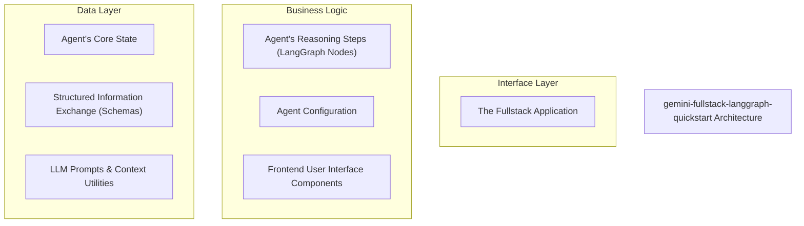
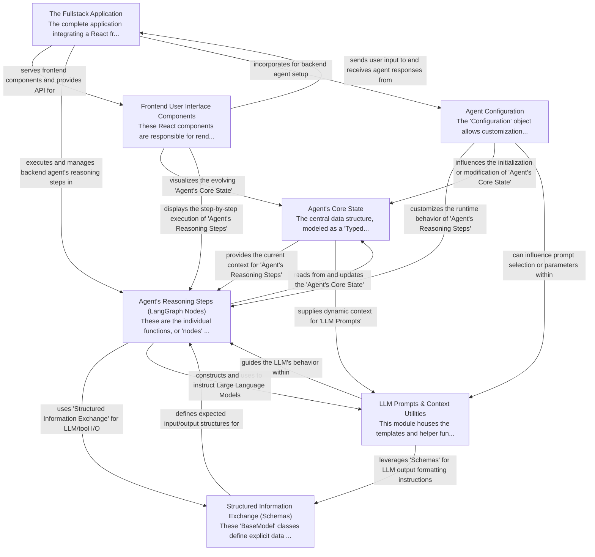

# gemini-fullstack-langgraph-quickstart Tutorial

Welcome to the comprehensive tutorial for gemini-fullstack-langgraph-quickstart. This tutorial is automatically generated from the codebase to help you understand the core concepts and implementation patterns.

## Project Overview

This project is a fullstack application that orchestrates an AI agent using LangGraph, integrating a React frontend with a Python backend. It provides an interactive chat interface where users can engage with the AI, which performs multi-step reasoning, research, and structured data processing. The application seamlessly serves the frontend assets and exposes API endpoints for real-time communication and visualization of the agent's complex reasoning process.

## System Architecture

## Component Relationships

## Table of Contents

1. [Chapter 1: Agent's Core State](chapter_01.md) - Comprehensive documentation for Agent's Core State following structured methodology...
2. [Chapter 2: Agent's Reasoning Steps (LangGraph Nodes)](chapter_02.md) - Comprehensive documentation for Agent's Reasoning Steps (LangGraph Nodes) following structured metho...
3. [Chapter 3: Structured Information Exchange (Schemas)](chapter_03.md) - Comprehensive documentation for Structured Information Exchange (Schemas) following structured metho...
4. [Chapter 4: LLM Prompts & Context Utilities](chapter_04.md) - Comprehensive documentation for LLM Prompts & Context Utilities following structured methodology...
5. [Chapter 5: Agent Configuration](chapter_05.md) - Comprehensive documentation for Agent Configuration following structured methodology...
6. [Chapter 6: The Fullstack Application](chapter_06.md) - Comprehensive documentation for The Fullstack Application following structured methodology...
7. [Chapter 7: Frontend User Interface Components](chapter_07.md) - Comprehensive documentation for Frontend User Interface Components following structured methodology...

## How to Use This Tutorial

1. **Start with Chapter 1** to understand the foundational concepts
2. **Follow the sequence** - each chapter builds upon previous concepts
3. **Practice with code examples** - every chapter includes practical examples
4. **Refer to diagrams** - use architecture diagrams for visual understanding
5. **Cross-reference concepts** - chapters link to related topics

## Tutorial Features

- **Progressive Learning**: Concepts are introduced in logical order
- **Code Examples**: Every chapter includes practical, executable code
- **Visual Diagrams**: Mermaid diagrams illustrate complex relationships
- **Cross-References**: Easy navigation between related concepts
- **Beginner-Friendly**: Written for newcomers to the codebase

## Contributing

This tutorial is auto-generated from the codebase. To improve it:
1. Update the source code documentation
2. Add more detailed comments to key functions
3. Regenerate the tutorial using the documentation system

---

*Generated using AI-powered codebase analysis*
