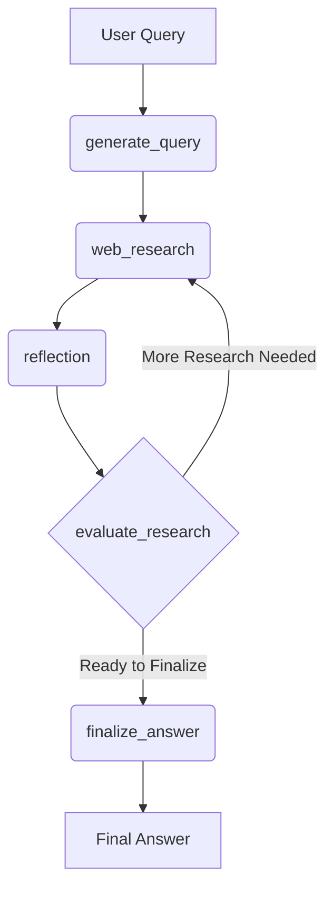

# Chapter 5: Agent's Workflow Graph

In the previous chapter, we explored how **[Agent's Instructions (Prompts)](chapter_04.md)** serve as the guiding principles for our Large Language Model (LLM), dictating its behavior and responses at various stages. While prompts provide the *what* and *how* for individual LLM interactions, they don't inherently define the *sequence* or *logic* of these interactions across a complex task. This is where the Agent's Workflow Graph becomes indispensable, acting as the orchestrator that brings these instructions to life in a structured, dynamic manner.

---

### Problem & Motivation

Building an intelligent AI assistant often goes beyond simple, one-shot LLM calls. Imagine a user asking a nuanced question like, "Tell me about the latest advancements in quantum computing, and include sources." To answer this effectively, the assistant can't just throw the query at an LLM once. It needs to:
1.  **Understand** the request and formulate targeted search queries.
2.  **Execute** web searches.
3.  **Process** the results, perhaps summarizing them.
4.  **Reflect** on the summary to identify knowledge gaps or areas needing deeper research.
5.  **Iterate** on research if gaps exist.
6.  **Synthesize** all gathered information into a coherent, cited answer.

Without a defined workflow, managing this sequence—especially the conditional looping for iterative research—becomes a tangled mess of `if/else` statements and function calls. This leads to brittle, hard-to-maintain code that struggles with complex, multi-step reasoning. The "Agent's Workflow Graph" addresses this by providing a declarative, robust framework for orchestrating these sophisticated, dynamic tasks.

---

### Core Concept Explanation

The **Agent's Workflow Graph** is the "brain" of our AI assistant, a sophisticated state machine that defines the precise sequence and conditional logic of operations the agent performs. It's implemented using **LangGraph**, a powerful library that extends LangChain's concept of chains with cyclic graphs, enabling more complex, iterative, and agentic behaviors. Each discrete operation, such as generating a search query or performing web research, is represented as a 'node' in this graph.

These nodes are simply Python functions that take the agent's current state as input and return an updated state, or a decision about the next step. The connections between these nodes are called 'edges,' which can be either direct (unconditional transitions) or conditional, allowing the graph to dynamically adapt its path based on the outcome of a node. This architecture allows our agent to engage in sophisticated reasoning, iterative refinement, and dynamic task execution, moving far beyond simple request-response patterns. The central data structure, the `OverallState`, acts as the agent's memory, continually updated as it navigates through the graph.

---

### Practical Usage Examples

Let's look at how individual functions within `backend/src/agent/graph.py` act as nodes in our LangGraph workflow. Each function contributes a specific step to the agent's reasoning process.

#### Node 1: `generate_query` - Initializing Research

The first step in our complex task often involves translating the user's natural language request into a precise search query.

```python
# From backend/src/agent/graph.py
def generate_query(state: OverallState, config: RunnableConfig) -> QueryGenerationState:
    """LangGraph node that generates a search queries based on the User's question.
    # ... more code ...
    return {"query_list": result.query}
```
This node takes the `OverallState` (which includes the initial user question) and, using an LLM, generates a list of optimized search queries. It then updates the state with these queries, preparing for web research.

#### Node 2: `web_research` - Gathering Information

Once we have queries, the agent needs to fetch information from external sources.

```python
# From backend/src/agent/graph.py
def web_research(state: WebSearchState, config: RunnableConfig) -> OverallState:
    """LangGraph node that performs web research using the native Google Search API tool.
    # ... more code ...
    }
```
This node uses the generated queries to perform actual web searches. It interacts with the Google Search API tool, collects results, and adds them to the `OverallState`, enriching the agent's understanding.

#### Node 3: `reflection` - Identifying Knowledge Gaps

After initial research, it's crucial for the agent to critically evaluate what it has learned and identify if more information is needed.

```python
# From backend/src/agent/graph.py
def reflection(state: OverallState, config: RunnableConfig) -> ReflectionState:
    """LangGraph node that identifies knowledge gaps and generates potential follow-up queries.
    # ... more code ...
    }
```
Here, the LLM analyzes the current research summary within the `OverallState`. It's tasked with identifying any gaps or ambiguities and suggesting new follow-up queries, updating the state with `follow_up_query` and `reflection`.

#### Node 4: `evaluate_research` - Conditional Looping

This node is a prime example of conditional logic in LangGraph. It decides whether to continue researching or finalize the answer.

```python
# From backend/src/agent/graph.py
def evaluate_research(
    state: ReflectionState,
    config: RunnableConfig,
```
The `evaluate_research` function (a conceptual switch in the graph) examines the `ReflectionState`. If `follow_up_query` is present and research limits haven't been exceeded, it directs the graph back to `web_research`. Otherwise, it signals to move towards finalizing the answer.

#### Node 5: `finalize_answer` - Synthesizing the Response

Finally, after all necessary research and reflection, the agent compiles its findings.

```python
# From backend/src/agent/graph.py
def finalize_answer(state: OverallState, config: RunnableConfig):
    """LangGraph node that finalizes the research summary.
    # ... more code ...
```
This node takes the accumulated `OverallState`, deduplicates and formats sources, combines them with the running summary, and crafts a well-structured, cited research report as the final output.

---

### Internal Implementation Walkthrough

The "Agent's Workflow Graph" is constructed using the `StateGraph` class from `langgraph.graph`. This allows us to define nodes (our functions like `generate_query`, `web_research`, etc.) and edges (transitions between these nodes). The `OverallState` ([Agent State Management](chapter_03.md)) is the single source of truth, passed between all nodes, ensuring context is maintained.

Here's a simplified conceptual flow of how the graph might operate for a user query:



1.  **Initialization**: The user's initial query is received and used to kickstart the graph, typically entering the `generate_query` node.
2.  **Query Generation (`generate_query`)**: The LLM, guided by specific prompts ([Agent's Instructions (Prompts)](chapter_04.md)), transforms the user's broad request into focused search terms. The `OverallState` is updated with these queries.
3.  **Web Research (`web_research`)**: Using the generated queries, the agent performs web searches. The results are then parsed and added to the `OverallState`, expanding the agent's knowledge base.
4.  **Reflection (`reflection`)**: The LLM reviews the current `OverallState` (especially the collected research). It identifies gaps, inaccuracies, or areas requiring deeper investigation, potentially proposing `follow_up_query`. This output is added to the `OverallState` as `reflection` and `follow_up_query`.
5.  **Evaluation (`evaluate_research`)**: This is a conditional node (a "router" in LangGraph terms). It checks the `reflection` and `follow_up_query` in the `OverallState`.
    *   If a `follow_up_query` exists and the research depth limit hasn't been reached, the graph loops back to `web_research` to conduct more targeted searches.
    *   If no further research is deemed necessary or the research limit is hit, the graph transitions to `finalize_answer`.
6.  **Finalization (`finalize_answer`)**: The agent consolidates all gathered information, deduplicates sources, formats the content, and constructs the final, comprehensive answer using the data in the `OverallState`.

This entire process is defined programmatically in `backend/src/agent/graph.py`, where nodes are added to the `StateGraph` and transitions (edges) are defined, including the conditional logic for the `evaluate_research` node.

---

### System Integration

The Agent's Workflow Graph is central to the entire AI assistant, serving as the orchestrator that brings all other components together:

*   **[Agent State Management](chapter_03.md)**: The `OverallState` is the lifeblood of the graph. Every node receives, processes, and updates this state, ensuring that the agent's memory and context are continuously maintained throughout its multi-step reasoning process.
*   **[Structured Communication Schemas](chapter_02.md)**: Many nodes within the graph, especially those involving LLM interactions (e.g., `generate_query`, `reflection`), leverage these schemas to ensure that LLM outputs are well-formed and easily parseable (e.g., returning JSON for `QueryGenerationState` or `ReflectionState`). This structured output facilitates seamless transitions and data extraction between nodes.
*   **[Agent's Instructions (Prompts)](chapter_04.md)**: Each LLM-powered node in the graph (e.g., `generate_query`, `reflection`, `finalize_answer`) is deeply integrated with specific prompts. These prompts guide the LLM's behavior within that particular node, ensuring it performs its designated task effectively and aligns with the overall goal.
*   **[Backend API Server](chapter_06.md)**: The graph itself is initiated and run by the backend API server. When a user sends a query, the server triggers an execution of this graph, managing its state and streaming intermediate updates or the final answer back to the user interface.

---

### Best Practices & Tips

*   **Modularize Nodes**: Keep your graph nodes (functions) small, focused, and responsible for a single logical step. This improves readability, reusability, and makes debugging easier.
*   **Clear State Definition**: Design your `OverallState` carefully, ensuring it contains all necessary information for every node. A well-defined state prevents information loss and simplifies data flow.
*   **Use Conditional Edges Wisely**: Leverage LangGraph's conditional edges for dynamic behavior. Avoid hardcoding complex `if/else` logic within nodes if it can be expressed as a graph transition.
*   **Handle Errors Gracefully**: Implement error handling within individual nodes. Consider adding mechanisms for retries or fallback paths in your graph for robustness.
*   **Visualize Your Graph**: For complex graphs, visualizing the workflow (as shown with Mermaid) is crucial for understanding its logic and identifying potential issues. LangGraph also provides built-in visualization tools.
*   **Test Nodes Independently**: Since nodes are just functions, you can test them in isolation before integrating them into the full graph.

---

### Chapter Conclusion

The Agent's Workflow Graph, powered by LangGraph, is the architectural backbone of our AI assistant. It transforms a collection of individual tools and LLM prompts into a cohesive, intelligent agent capable of complex, multi-step reasoning. By defining clear nodes, transitions, and state management, we've built a robust and extensible system that can dynamically adapt to user queries, perform iterative tasks like research and reflection, and ultimately deliver informed, well-structured responses. Understanding this graph is key to grasping how our AI assistant "thinks" and operates.

Having established the intelligent agent's workflow, our next step is to expose its capabilities to the outside world. In the upcoming chapter, we will delve into the **[Backend API Server](chapter_06.md)**, exploring how it acts as the interface between our sophisticated LangGraph agent and the user interface.