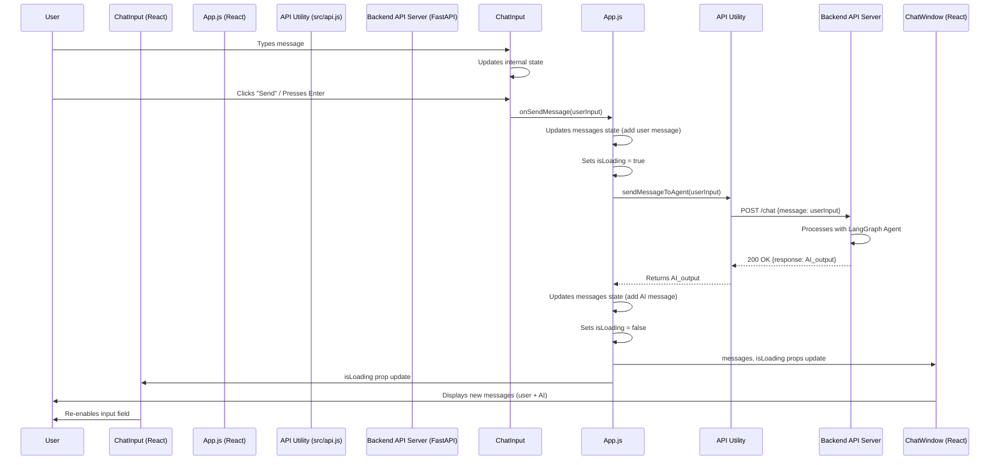

# Chapter 7: User Interface (Frontend)

Having established a robust and intelligent AI agent powered by LangGraph, exposed through a [Backend API Server](chapter_06.md), the final piece of our full-stack application is the *User Interface (Frontend)*. This layer is the direct interaction point for our users, translating the complex operations of the backend into an intuitive and responsive experience. It consumes the API endpoints provided by the backend, presenting information and gathering user input in a human-friendly format.

---

### Problem & Motivation

The powerful capabilities of our AI agent, meticulously crafted with LangGraph and exposed via FastAPI, remain inaccessible without a user-facing component. Imagine having a brilliant AI assistant that can perform web research, understand complex queries, and manage dynamic workflows, but no way for a human to communicate with it directly. This is the problem the *User Interface (Frontend)* solves.

Its importance in the `gemini-fullstack-langgraph-quickstart` project cannot be overstated. It transforms a backend service into a complete, interactive application. Without a frontend, the AI assistant exists in a vacuum; with it, users can engage in natural language conversations, request information, and witness the agent's intelligence in action.

**Concrete Use Case:** A user wants to ask the AI assistant: "What are the latest developments in AI for sustainable agriculture?" The frontend provides a text input field for this query, a "Send" button, and then displays the AI's research and summarized response in a readable chat-like format, potentially showing interim steps like "Searching the web..." or "Synthesizing information...".

---

### Core Concept Explanation

The *User Interface (Frontend)*, in our context, refers to the client-side application built with React. React is a JavaScript library for building user interfaces, known for its component-based architecture and efficient rendering. It allows us to construct complex UIs from small, isolated, and reusable pieces of code called *components*.

At its heart, a frontend application manages user interaction and data presentation. When a user types a message, the frontend captures this input, packages it, and sends it to our [Backend API Server](chapter_06.md). Upon receiving a response from the backend, the frontend then updates its visual state to display the AI's message, maintaining a dynamic conversation flow. This continuous loop of input, processing (by the backend), and output (by the frontend) forms the core of an interactive AI assistant.

Key concepts driving our React frontend include:
*   **Components**: Independent, reusable pieces of UI (e.g., `ChatInput`, `ChatMessage`).
*   **State**: Data that a component manages and that can change over time, triggering re-renders (e.g., the list of messages in a chat).
*   **Props**: Data passed from a parent component to a child component, making components reusable and configurable.
*   **Event Handling**: Responding to user actions like button clicks or text input.
*   **API Calls**: Using JavaScript's `fetch` API or libraries like `axios` to communicate with the backend.

---

### Practical Usage Examples

Let's walk through how a user would interact with our frontend, focusing on the key actions of sending a message and displaying responses.

First, imagine our `App.js` component, which serves as the main container for our chat interface. It would manage the overall state, including the conversation history.

```jsx
// src/App.js
import React, { useState } from 'react';
import ChatWindow from './components/ChatWindow';
import ChatInput from './components/ChatInput';
import { sendMessageToAgent } from './api'; // API utility

function App() {
  const [messages, setMessages] = useState([]); // Stores chat history
  const [isLoading, setIsLoading] = useState(false);

  const handleSendMessage = async (userInput) => {
    if (!userInput.trim()) return;

    const newUserMessage = { sender: 'user', text: userInput };
    setMessages((prevMessages) => [...prevMessages, newUserMessage]);
    setIsLoading(true);

    try {
      const agentResponse = await sendMessageToAgent(userInput);
      const newAgentMessage = { sender: 'agent', text: agentResponse.response };
      setMessages((prevMessages) => [...prevMessages, newAgentMessage]);
    } catch (error) {
      console.error("Error sending message:", error);
      setMessages((prevMessages) => [...prevMessages, { sender: 'system', text: 'Error: Could not get a response.' }]);
    } finally {
      setIsLoading(false);
    }
  };

  return (
    <div className="App">
      <header><h1>AI Assistant</h1></header>
      <ChatWindow messages={messages} isLoading={isLoading} />
      <ChatInput onSendMessage={handleSendMessage} isLoading={isLoading} />
    </div>
  );
}

export default App;
```
This `App.js` acts as the orchestrator. It holds the chat `messages` state and defines the `handleSendMessage` function, which is responsible for communicating with the backend API.

Next, the `ChatInput` component provides the text field where the user types their query:

```jsx
// src/components/ChatInput.js
import React, { useState } from 'react';

function ChatInput({ onSendMessage, isLoading }) {
  const [input, setInput] = useState('');

  const handleSubmit = (e) => {
    e.preventDefault();
    if (input.trim() && !isLoading) {
      onSendMessage(input);
      setInput(''); // Clear input after sending
    }
  };

  return (
    <form onSubmit={handleSubmit} className="chat-input-form">
      <input
        type="text"
        value={input}
        onChange={(e) => setInput(e.target.value)}
        placeholder="Ask the AI assistant..."
        disabled={isLoading}
      />
      <button type="submit" disabled={isLoading}>
        {isLoading ? 'Sending...' : 'Send'}
      </button>
    </form>
  );
}

export default ChatInput;
```
This `ChatInput` component takes `onSendMessage` and `isLoading` as props. When the user submits the form, it calls `onSendMessage` with the current input value, then clears the input field.

Finally, the `ChatWindow` component displays the conversation history:

```jsx
// src/components/ChatWindow.js
import React, { useRef, useEffect } from 'react';

function ChatWindow({ messages, isLoading }) {
  const messagesEndRef = useRef(null);

  const scrollToBottom = () => {
    messagesEndRef.current?.scrollIntoView({ behavior: "smooth" });
  };

  useEffect(() => {
    scrollToBottom(); // Scroll to latest message on update
  }, [messages]);

  return (
    <div className="chat-window">
      {messages.map((msg, index) => (
        <div key={index} className={`message ${msg.sender}`}>
          <strong>{msg.sender === 'user' ? 'You' : 'AI'}:</strong> {msg.text}
        </div>
      ))}
      {isLoading && <div className="message agent loading">AI is typing...</div>}
      <div ref={messagesEndRef} /> {/* For auto-scrolling */}
    </div>
  );
}

export default ChatWindow;
```
The `ChatWindow` maps through the `messages` array, rendering each one. It also includes a simple loading indicator and auto-scrolling behavior for a better user experience. The `sendMessageToAgent` utility would encapsulate the actual `fetch` call to the backend:

```javascript
// src/api.js
const API_BASE_URL = 'http://localhost:8000'; // Replace with your backend URL

export const sendMessageToAgent = async (message) => {
  const response = await fetch(`${API_BASE_URL}/chat`, {
    method: 'POST',
    headers: {
      'Content-Type': 'application/json',
    },
    body: JSON.stringify({ message: message }),
  });

  if (!response.ok) {
    const errorData = await response.json();
    throw new Error(errorData.detail || 'Failed to send message');
  }

  return response.json();
};
```
This `api.js` file demonstrates the direct HTTP POST request to the `/chat` endpoint of our [Backend API Server](chapter_06.md). It handles network requests and basic error checking.

---

### Internal Implementation Walkthrough

The internal implementation of the frontend revolves around React's component lifecycle and state management, orchestrated to interact with the backend API.

1.  **Application Initialization**: The `index.js` file (not shown, typical React setup) renders the root `App` component into the DOM.
2.  **Initial Render**: `App` component renders `ChatWindow` (empty initially) and `ChatInput`.
3.  **User Input**:
    *   The user types in the `ChatInput` component.
    *   The `onChange` event handler updates the `input` state within `ChatInput`.
4.  **Message Submission**:
    *   The user clicks "Send" or presses Enter, triggering `handleSubmit` in `ChatInput`.
    *   `handleSubmit` calls `onSendMessage` prop, which is `handleSendMessage` in `App.js`.
    *   `App.js` immediately adds the user's message to its `messages` state and sets `isLoading` to `true`.
5.  **API Call**:
    *   `handleSendMessage` calls `sendMessageToAgent` (from `api.js`).
    *   `sendMessageToAgent` makes an asynchronous `POST` request to `http://localhost:8000/chat` (our [Backend API Server](chapter_06.md)) with the user's message.
6.  **Backend Processing & Response**:
    *   The backend receives the request, processes it through the LangGraph agent, and sends back a response containing the AI's answer.
7.  **Frontend Response Handling**:
    *   `sendMessageToAgent` receives the backend's response.
    *   `handleSendMessage` in `App.js` updates the `messages` state with the AI's response and sets `isLoading` back to `false`.
8.  **UI Update**:
    *   Changes in `App.js`'s `messages` state trigger re-renders of `ChatWindow` and `ChatInput`.
    *   `ChatWindow` displays the new messages.
    *   `ChatInput` re-enables its input field and button.

This sequence is best visualized:



---

### System Integration

The User Interface (Frontend) is the final layer in our full-stack architecture, serving as the bridge between the human user and the intelligent backend. Its primary integration point is the [Backend API Server](chapter_06.md).

*   **Request Flow**: User actions in the frontend (e.g., sending a message) trigger HTTP requests to specific endpoints exposed by the [Backend API Server](chapter_06.md). For instance, the `sendMessageToAgent` function directly targets the `/chat` endpoint.
*   **Data Flow**: The frontend sends user queries to the backend as structured JSON payloads. It then receives structured JSON responses from the backend, which include the AI agent's generated text, and potentially other metadata. This structured communication is crucial and relies on the [Structured Communication Schemas](chapter_02.md) defined earlier in the project. The frontend is responsible for parsing these responses and rendering them appropriately.
*   **Decoupling**: The frontend and backend are largely decoupled. They communicate exclusively via HTTP requests, meaning they can be developed, deployed, and scaled independently. This modularity is a core tenet of full-stack development.

The frontend doesn't directly interact with the LangGraph [Agent's Workflow Graph](chapter_05.md) or the [Agent State Management](chapter_03.md); it only interacts with the API that wraps these complex components. This abstraction simplifies frontend development, allowing it to focus purely on presentation and user interaction.

---

### Best Practices & Tips

1.  **Robust Error Handling**: Always include `try-catch` blocks around API calls. Display user-friendly error messages if the backend is unreachable or returns an error. This prevents a broken experience and gives the user feedback.
2.  **Loading States**: Implement clear visual feedback (like "AI is typing..." or spinner animations) when waiting for an API response. This improves the user experience by indicating that the application is busy, rather than frozen.
3.  **Input Validation**: Although the backend should perform robust validation, basic frontend validation (e.g., ensuring a message isn't empty) can provide immediate feedback and reduce unnecessary network requests.
4.  **Component Reusability**: Design React components to be as generic and reusable as possible. For example, a `ChatMessage` component could display any message, regardless of sender, by taking `sender` and `text` as props.
5.  **Accessibility**: Ensure your UI is accessible to all users. Use semantic HTML, provide adequate contrast, and consider keyboard navigation.
6.  **Environment Variables**: For API base URLs (`API_BASE_URL`), use environment variables (e.g., `.env` file with `REACT_APP_API_BASE_URL`). This makes it easy to configure different endpoints for development, staging, and production.
7.  **Consider State Management Libraries for Complexity**: For very complex applications, consider state management libraries like Redux or Zustand. For a quickstart like this, React's built-in `useState` and `useContext` are often sufficient.
8.  **Security (CORS)**: If your frontend and backend are on different domains/ports, you'll encounter Cross-Origin Resource Sharing (CORS) issues. Ensure your [Backend API Server](chapter_06.md) is configured to allow requests from your frontend's origin.

---

### Chapter Conclusion

The User Interface (Frontend) is the culmination point of our `gemini-fullstack-langgraph-quickstart` project. It provides the crucial interactive layer that brings our intelligent AI agent to life for end-users. Through a React-based application, we've enabled seamless communication with the [Backend API Server](chapter_06.md), allowing users to submit queries and receive dynamic, informed responses.

This chapter has demonstrated how to construct a functional frontend, manage its state, interact with the backend API, and display conversational flow. We've explored the core concepts of React, walked through a typical message lifecycle, and highlighted best practices for building a robust and user-friendly interface.

With the frontend now complete, our full-stack AI assistant application is fully realized. From the structured communication schemas and sophisticated agent workflow graph to the robust backend API and intuitive user interface, every component works in harmony to deliver a powerful and interactive AI experience.