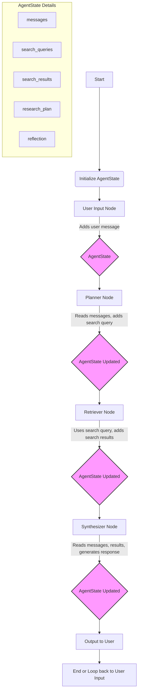

# Chapter 1: Agent's Memory (Overall State)

This is the inaugural chapter of our tutorial, setting the foundation for understanding how our AI research agent maintains context and continuity throughout its operations.

---

### Problem & Motivation

Imagine trying to have a complex conversation with someone who instantly forgets everything you've said after each sentence. It would be frustrating, inefficient, and ultimately impossible to achieve any meaningful goal. This is the fundamental challenge faced by AI agents operating without a robust memory system. In the context of our `gemini-fullstack-langgraph-quickstart` project, where an AI agent conducts multi-turn research, this problem becomes critical. Without a central "brain" to remember previous interactions, search results, and its own evolving plans, the agent would repeatedly ask the same questions, fail to build on prior findings, and be incapable of coherent, sustained research.

The project's goal is to build an intelligent research assistant that can dynamically retrieve information, synthesize findings, and reflect on its progress. To achieve this, the agent needs a way to store and recall all relevant information across different steps of its workflow. This includes the entire conversational history with the user, any search queries it has generated, the results it has obtained, and its internal reasoning or "reflection" at various stages. This persistent memory is the bedrock upon which all complex agent behaviors are built, ensuring that each action is informed by and contributes to the overall research objective.

Consider a use case: A user asks, "Find information on renewable energy sources." The agent starts by searching. In a follow-up turn, the user clarifies, "Focus on solar and wind energy." If the agent lacked memory, it wouldn't know to refine the *previous* search or even remember the initial query. Its memory allows it to understand "solar and wind energy" as a *refinement* of "renewable energy sources," leading to a focused and effective research process. This ability to maintain and evolve context is precisely what "Agent's Memory" provides.

---

### Core Concept Explanation

At its heart, the "Agent's Memory" in our `gemini-fullstack-langgraph-quickstart` project represents the *overall state* of the AI agent. This state is a dynamic data structure that encapsulates all information relevant to the ongoing research task and conversation. Think of it as a shared notebook that the agent continuously updates, where every piece of information – from user input to generated insights – is meticulously recorded. This ensures that every component of the agent, regardless of when it executes, has access to the complete context of the operation.

In LangGraph, this concept of a central, evolving memory is typically implemented as the `state` object that is passed between nodes in the graph. As the agent navigates through its research workflow (e.g., planning, searching, synthesizing, reflecting), each step, or "node," can read from this state to understand what has happened previously and write to it to record new findings or decisions. This mutable, persistent state is crucial for enabling multi-turn interactions and complex reasoning, as it allows information to flow seamlessly across discrete processing steps.

The memory holds various types of data crucial for the agent's functioning. This includes `messages` (the entire chat history with the user and the agent's responses), `search_queries` (what the agent searched for), `search_results` (what was found), `research_plan` (the agent's current strategy), and `reflection` (the agent's internal monologue or self-assessment). By centralizing this information, the agent can maintain a consistent understanding of its current task, adapt its strategy based on new data, and provide coherent, context-aware responses to the user. Without this unified state, the agent would be stateless, losing all context between turns and effectively restarting its process with every new input.

---

### Practical Usage Examples

To illustrate how the agent's memory works, we'll define a simple `AgentState` and demonstrate how different parts of the agent might update it. This state will typically be a `TypedDict` or a Pydantic `BaseModel` to ensure type safety and clarity.

#### Defining the Agent's State

First, let's define the structure of our agent's memory. This is usually done in a dedicated file, for instance, `src/graph/state.py`.

```python
# src/graph/state.py
from typing import List, Dict, Union, Optional
from typing_extensions import TypedDict # For Python < 3.9, otherwise use standard typing.Dict

class AgentState(TypedDict):
    """
    Represents the overall state of the AI agent, passed between nodes in the LangGraph.
    """
    messages: List[Dict] # User and AI messages in conversation history
    search_queries: List[str] # A list of search queries made by the agent
    search_results: List[str] # A list of consolidated search results
    research_plan: List[str] # The agent's current research plan or steps
    reflection: Optional[str] # The agent's self-reflection on its progress
    # ... other potential fields like 'current_focus', 'citations', etc.
```
This `AgentState` `TypedDict` clearly defines the pieces of information our agent needs to remember. `messages` keeps track of the conversation, `search_queries` and `search_results` store research data, and `research_plan` and `reflection` hold the agent's internal thought process.

#### Initializing the Agent's State

When a new conversation or research task begins, the agent's memory needs to be initialized.

```python
from src.graph.state import AgentState

# Initializing the state for a new research task
initial_state: AgentState = {
    "messages": [],
    "search_queries": [],
    "search_results": [],
    "research_plan": [],
    "reflection": None,
}

print(f"Initial state created: {initial_state}")
```
Here, we create an `initial_state` dictionary conforming to our `AgentState` type. All lists are empty, and optional fields are `None`, signifying a fresh start.

#### Updating the State with User Input

When a user sends a message, it needs to be recorded in the `messages` list within the agent's state. This function simulates a "user input node" in our LangGraph.

```python
from src.graph.state import AgentState

def add_user_message(state: AgentState, user_input: str) -> AgentState:
    """Adds a new user message to the state's message history."""
    state["messages"].append({"role": "user", "content": user_input})
    print(f"Added user message: '{user_input}'")
    # In LangGraph, we typically return the modified state
    return state

# Simulate receiving a user message
current_state = initial_state # Using the initial_state from above
current_state = add_user_message(current_state, "Tell me about large language model applications.")

print(f"State after user input: {current_state['messages']}")
```
This demonstrates how a function, representing a step in the agent's workflow, takes the current `state`, modifies it (by adding the user message), and then returns the updated `state`.

#### Updating the State with a Search Query

After processing the user's request, the agent might decide to perform a search. This query also gets recorded in the state. This simulates a "planner node."

```python
from src.graph.state import AgentState

def add_search_query(state: AgentState, query: str) -> AgentState:
    """Adds a new search query to the state."""
    state["search_queries"].append(query)
    print(f"Planned search query added: '{query}'")
    return state

# Simulate planning a search query based on the user's request
current_state = add_search_query(current_state, "applications of large language models")

print(f"State after planning search: {current_state['search_queries']}")
```
Now, `current_state` contains both the user's initial message and the search query the agent plans to execute, illustrating how the memory grows with each agent action.

---

### Internal Implementation Walkthrough

The "Agent's Memory" is central to how LangGraph operates. In essence, LangGraph uses a concept called a *graph state*, which is simply a dictionary-like object that gets passed and potentially modified by each node in the graph. Let's delve into how this is typically implemented and managed within our project.

#### State Definition (src/graph/state.py)

As seen in the practical examples, the `AgentState` is defined as a `TypedDict`. This is a Python feature that allows you to define a dictionary with specific keys and value types, providing static type checking benefits without enforcing a class structure.

```python
# src/graph/state.py
from typing import List, Dict, Union, Optional
from typing_extensions import TypedDict # Required for Python versions < 3.9

class AgentState(TypedDict):
    messages: List[Dict]
    search_queries: List[str]
    search_results: List[str]
    research_plan: List[str]
    reflection: Optional[str]
    # More fields can be added as the project evolves, e.g., 'final_answer', 'references'
```
This definition is crucial because it provides a contract for what information the agent expects to store and retrieve. Every function (node) in the LangGraph graph that interacts with the state will operate on an object conforming to this `AgentState` type.

#### State Flow in LangGraph

When you define a LangGraph, you specify nodes (Python functions) and edges (how control flows between nodes). Each node takes the `state` as an input, performs some operation, and returns a modified `state`. LangGraph then intelligently merges these updates into the overall graph state before passing it to the next node.

Let's visualize a simplified flow of how the `AgentState` moves and is updated:



1.  **Initialization:** The graph starts with an `initial_state` (empty lists, `None` for optional fields).
2.  **User Input Node:** Receives user input, *reads* the `messages` list from `AgentState`, *appends* the new user message, and returns the modified `AgentState`.
3.  **Planner Node:** *Reads* the `messages` to understand the user's intent. Based on this, it *adds* a new `search_query` to `AgentState` and potentially updates the `research_plan`.
4.  **Retriever Node:** *Reads* the latest `search_query` from `AgentState`. Executes an external search tool. Once results are obtained, it *adds* these `search_results` to `AgentState`.
5.  **Synthesizer Node:** *Reads* `messages`, `search_results`, and `research_plan`. It then uses an LLM to synthesize an answer or a reflection. It *adds* the agent's response to `messages` and potentially updates `reflection`.

Each node returns a dictionary representing the *updates* to the state. LangGraph then merges these updates into the current state. For lists, this usually means appending new items. For single values, it means overwriting. This functional approach ensures that state transitions are explicit and traceable.

---

### System Integration

The `Agent's Memory` (`AgentState`) is not an isolated component; it's the central nervous system connecting every part of the `gemini-fullstack-langgraph-quickstart` project. It acts as the single source of truth for the entire agent's operation.

1.  **LangGraph Orchestration:** The most direct integration is with LangGraph itself. `AgentState` is the very `state` object that is passed from one node to the next in the defined graph. Every function (`node`) that the graph executes takes `AgentState` as its first argument and is expected to return a dictionary representing updates to this state. This continuous flow and update mechanism is fundamental to LangGraph's ability to manage complex, multi-step workflows.

2.  **LLM Interactions:** When the agent needs to generate a response, plan a search, or reflect, it typically passes a subset or a summary of the `AgentState` to the Google Gemini model. For example, the `messages` history is crucial for the LLM to maintain conversational context, while `search_results` provide factual grounding for generating answers.
    *   *Data Flow Example:* The `Synthesizer Node` retrieves `state["messages"]` and `state["search_results"]` to formulate a coherent response using Gemini.

3.  **Tool Usage (e.g., Search Tool):** When the agent decides to use an external tool (like a web search), the information needed to invoke that tool, such as the `search_query`, is extracted from the `AgentState`. The results from the tool are then written back into the `AgentState`.
    *   *Data Flow Example:* The `Retriever Node` reads `state["search_queries"]` to know what to search for, then writes the fetched data to `state["search_results"]`.

4.  **Frontend Interface:** While the `AgentState` primarily lives in the backend, the frontend UI continuously interacts with the backend to fetch the latest `messages` from the `AgentState` to display the conversation history. User input is then passed to the backend, which in turn updates the `AgentState`.
    *   *Data Flow Example:* Frontend sends `user_message` -> Backend `User Input Node` updates `state["messages"]` -> Frontend fetches updated `state["messages"]` to render chat bubbles.

In essence, `AgentState` serves as the crucial data bus, enabling different specialized components (LLMs, tools, UI) to communicate and collaborate towards the overall research goal. Understanding how information flows into and out of this state is key to comprehending the agent's complete [Agent's Research Workflow](chapter_02.md).

---

### Best Practices & Tips

Managing the agent's memory effectively is crucial for building robust and performant AI agents. Here are some best practices and common pitfalls to avoid:

*   **Schema Definition Clarity:**
    *   **Tip:** Clearly define your `AgentState` schema using `TypedDict` or Pydantic `BaseModel` from the outset. This provides strong typing and makes it explicit what information the state holds.
    *   **Why:** Prevents errors, improves readability, and makes it easier for new developers to understand the agent's internal data.

*   **Granularity of State Fields:**
    *   **Tip:** Break down your state into logical, atomic units. Instead of one large `data` field, have `messages`, `search_queries`, `search_results`, `research_plan`, etc.
    *   **Why:** Allows for more targeted updates and clearer understanding of what each part of the state represents.

*   **Append, Don't Overwrite (for history):**
    *   **Tip:** For fields that represent a history or log (like `messages` or `search_queries`), always *append* new entries rather than overwriting the entire list.
    *   **Why:** Preserves historical context, which is vital for multi-turn interactions and debugging. LangGraph's default reducer for lists is `operator.add`, which appends.

*   **Summarization and Pruning:**
    *   **Tip:** For very long histories (e.g., `messages` or `search_results`), implement strategies to summarize or prune older entries. This is especially important before passing data to an LLM, which has token limits.
    *   **Why:** Prevents exceeding token limits of LLMs, reduces computational cost, and keeps the context focused on the most relevant information.

*   **Immutability for Predictability (Conceptual):**
    *   **Tip:** While LangGraph handles merging state updates, conceptually, think of each node as taking an `AgentState` and returning a *new* `AgentState` with modifications. Avoid direct in-place modification of complex nested objects if not explicitly intended.
    *   **Why:** Makes state transitions more predictable and easier to debug, especially in complex graphs. LangGraph's default state reducers handle this for you when using `TypedDict`.

*   **Error Handling in State Updates:**
    *   **Tip:** Consider how errors in a node might affect the state. If a search fails, should `search_results` be updated with an error message, or remain unchanged?
    *   **Why:** Ensures the state accurately reflects the agent's operational status and allows for recovery or alternative actions.

*   **State Persistence (Beyond LangGraph):**
    *   **Tip:** For a full-stack application, if you need to resume conversations or persist research over longer periods, you'll need to save and load the `AgentState` to a database (e.g., PostgreSQL, Redis) or file system.
    *   **Why:** Enables long-running sessions, multi-user support, and prevents data loss.

By adhering to these best practices, you can design an `AgentState` that is not only functional but also maintainable, scalable, and robust for the complex demands of an AI research agent.

---

### Chapter Conclusion

In this foundational chapter, we've explored the critical role of **Agent's Memory (Overall State)** in our `gemini-fullstack-langgraph-quickstart` project. We've established that this central state is the persistent record-keeper for our AI research agent, enabling it to maintain context, track progress, and build upon previous interactions across multiple turns. We delved into *why* this memory is indispensable, examined its core concept as a dynamic, evolving data structure in LangGraph, and walked through practical examples of how it's defined and updated. Furthermore, we analyzed its deep integration with the broader system, connecting the frontend, LLM interactions, and tool usage, and discussed best practices for its effective management.

The `AgentState` is the backbone of our agent's intelligence, allowing it to move beyond simple, one-off interactions to engage in complex, goal-oriented research. With a clear understanding of how the agent remembers and processes information, we are now ready to see *how* it uses this memory to perform its tasks.

In the next chapter, we will leverage this understanding of the agent's memory to explore the **Agent's Research Workflow**. This will detail the sequence of steps and decisions the agent makes, showing how it reads from and writes to the `AgentState` to accomplish its research objectives.

Onwards to: [Agent's Research Workflow](chapter_02.md)