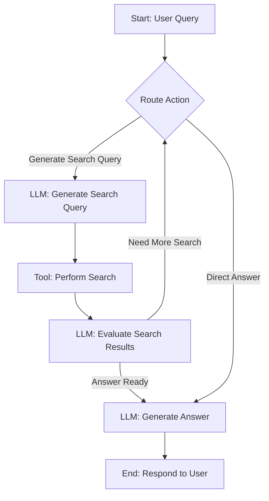

# Chapter 2: Agent's Research Workflow

Building an intelligent AI agent capable of dynamic interaction requires more than just memory; it demands a structured approach to decision-making and action sequencing. In the [previous chapter on Agent's Memory](chapter_01.md), we explored how our agent retains crucial context and state throughout its operations. Now, we shift our focus to *how* the agent utilizes this memory to perform complex tasks, navigating through a series of steps to achieve its goals. This chapter unveils the "brain" of our agent: its research workflow.

---

### Problem & Motivation

Imagine you ask an AI, "Research the latest advancements in quantum computing and summarize key findings." A naive AI might just perform a single search and return some links, or try to generate an answer without sufficient context. This approach is prone to errors, hallucination, and incomplete information. Real-world research is rarely a single step; it involves:

*   **Understanding the query:** What exactly is being asked?
*   **Formulating search queries:** How to effectively find relevant information?
*   **Executing searches:** Using external tools to gather data.
*   **Evaluating results:** Are the search results useful? Do we need to refine our approach or search further?
*   **Synthesizing information:** Combining disparate pieces of information into a coherent answer.
*   **Iterating:** If the initial answer is insufficient, the agent should be able to go back and refine its understanding or search.

The challenge lies in orchestrating these steps dynamically, allowing the agent to adapt its behavior based on the ongoing conversation and the quality of retrieved information. Without a clear, adaptable workflow, the agent would struggle to perform sophisticated, multi-turn interactions. This structured workflow is paramount for our `gemini-fullstack-langgraph-quickstart` project, enabling the agent to conduct thorough, reliable research.

---

### Core Concept Explanation: LangGraph and State Machines

The "Agent's Research Workflow" defines the step-by-step process the AI agent follows to answer a user's query. It's built using **LangGraph**, a powerful library that allows us to construct *state machines* for building robust, multi-actor applications with Large Language Models (LLMs). Think of a state machine as a flowchart where the agent moves from one defined "state" (or action) to another, based on specific conditions.

In LangGraph, this workflow is modeled as a **graph**, composed of:
1.  **Nodes**: These are the individual steps or actions the agent can perform. Each node is essentially a Python function that takes the current `state` (our agent's memory) and returns an updated state or a decision. Examples include generating a search query, performing a web search, or generating a final answer.
2.  **Edges**: These define the transitions between nodes. Edges can be *direct* (always go from A to B) or *conditional* (go from A to B if condition X is met, or from A to C if condition Y is met). This conditional routing is what makes the agent dynamic and intelligent, allowing it to adapt its workflow based on the information it processes.

By defining nodes and their connections, LangGraph provides a clear, visual, and programmatic way to orchestrate complex multi-turn interactions. It intrinsically handles the flow of control, state management (passing the shared state between nodes), and decision-making logic, making it an ideal choice for building our AI research agent that needs to perform dynamic information retrieval and structured research workflows. It brings reliability and predictability to what could otherwise be a chaotic conversational process.

---

### Practical Usage Examples: Building a Simple Workflow

Let's start with a very simple LangGraph example to illustrate the core concepts before diving into our full research agent. We'll use a `StateGraph` which is designed to work with a shared state object, perfectly aligning with our `Agent's Memory`.

First, we need to define our state, which is essentially the memory shared across all nodes. For simplicity, let's assume our state just holds a `messages` list.

```python
from typing import TypedDict, List
from langchain_core.messages import BaseMessage

class AgentState(TypedDict):
    messages: List[BaseMessage]
    # ... other state variables from Chapter 1
```
*(Explanation: `AgentState` is a Python dictionary-like object that holds all the information the agent needs. `messages` will store the conversation history.)*

Now, let's define a couple of simple nodes (functions) that represent actions:

```python
from langgraph.graph import StateGraph, START, END
from langchain_core.messages import HumanMessage, AIMessage

def greet_user_node(state: AgentState):
    print("Agent: Hello, how can I help?")
    new_messages = [AIMessage(content="Hello, how can I help?")]
    return {"messages": state.get("messages", []) + new_messages}

def process_query_node(state: AgentState):
    user_query = state["messages"][-1].content
    print(f"Agent: Processing query: '{user_query}'")
    # In a real scenario, this would involve an LLM or tool call
    new_messages = [AIMessage(content=f"Understood: '{user_query}'.")]
    return {"messages": state.get("messages", []) + new_messages}
```
*(Explanation: These are our agent's "actions." `greet_user_node` simulates an initial greeting, and `process_query_node` would take the user's last message and "process" it. Each node updates the shared `AgentState`.)*

Next, we build the graph by adding these nodes and defining the flow (edges):

```python
workflow = StateGraph(AgentState)

workflow.add_node("greet", greet_user_node)
workflow.add_node("process", process_query_node)

workflow.add_edge(START, "greet") # Start at 'greet'
workflow.add_edge("greet", "process") # After greeting, go to process
workflow.add_edge("process", END) # After processing, end

app = workflow.compile()
```
*(Explanation: We instantiate a `StateGraph` with our `AgentState`. We add our functions as `nodes` with unique names. Then we define `edges`: `START` indicates where the graph begins, and `END` indicates termination. Here, the flow is `START -> greet -> process -> END`.)*

Finally, we can run this simple graph with an initial input:

```python
initial_messages = [HumanMessage(content="What is the weather like?")]
result = app.invoke({"messages": initial_messages})
print("Final State:", result["messages"])
```
*(Expected Output Snippet):*
```
Agent: Hello, how can I help?
Agent: Processing query: 'What is the weather like?'
Final State: [HumanMessage(content='What is the weather like?'), AIMessage(content='Hello, how can I help?'), AIMessage(content="Understood: 'What is the weather like.'.")]
```
*(Explanation: We `invoke` the compiled graph with an initial `AgentState`. The graph executes the nodes in order, updating the `messages` list. The final `result` contains the accumulated state.)*

This example demonstrates the foundational structure of a LangGraph workflow: defining state, creating action nodes, connecting them with edges, and running the compiled graph.

---

### Internal Implementation Walkthrough: The Agent's Full Research Graph

Our `gemini-fullstack-langgraph-quickstart` project leverages LangGraph to create a sophisticated research workflow. This agent uses a central `AgentState` (as discussed in [Chapter 1: Agent's Memory](chapter_01.md)) and orchestrates several specialized nodes to fulfill research requests.

Let's visualize the core flow of our agent's research process:


*(Explanation: This flowchart illustrates the agent's research loop. It starts with a user query, then routes to either generate a search query or attempt a direct answer. If a search is needed, it goes through a cycle of generating queries, performing searches, and evaluating results, looping back if more information is required. Once an answer is deemed ready, it generates the final response.)*

Here's a breakdown of the key nodes and their roles, conceptually mapped to functions you'd find in files like `agent_workflow.py` or `nodes.py`:

1.  **`route_action` (Conceptual Node)**: This is a *conditional router*. It examines the current `AgentState` (specifically the `messages` and potentially an internal `tool_code` or `action_plan`).
    *   **Decision**: Does the agent need to perform a search to answer the query, or can it formulate a direct answer based on existing knowledge/context?
    *   **Implementation**: This node would likely use an LLM call (e.g., `gemini-pro`) to decide the next best action, or a rule-based system.
    *   **Example Output**: Returns a string like `"generate_search_query"` or `"generate_answer"`.

2.  **`generate_search_query` (Node)**: If `route_action` decides a search is necessary, this node springs into action.
    *   **Input**: The user's query and potentially previous search attempts from `AgentState`.
    *   **Process**: Uses an LLM (e.g., `gemini-pro`) to formulate precise search queries suitable for a search engine. It considers the current conversational turn and the overall research goal.
    *   **Output**: Updates `AgentState` with a list of proposed search queries (e.g., `["latest quantum computing breakthroughs", "quantum computing applications 2024"]`).

3.  **`perform_search` (Node)**: This node acts as the bridge to external tools.
    *   **Input**: The search queries generated by `generate_search_query` from `AgentState`.
    *   **Process**: Calls a configured search tool (e.g., Google Search API). It executes each query and collects the raw search results (links, snippets).
    *   **Output**: Updates `AgentState` with the raw search results.

4.  **`evaluate_search_results` (Node)**: A crucial step for intelligent iteration.
    *   **Input**: The raw search results and the original user query from `AgentState`.
    *   **Process**: Uses an LLM to analyze the retrieved information. It determines if the results are sufficient to answer the user's query, or if more information is needed (e.g., by generating new, refined search queries).
    *   **Decision**: Based on the evaluation, it determines if the workflow should loop back to `generate_search_query` (to perform more searches) or proceed to `generate_answer`.
    *   **Output**: Updates `AgentState` with refined information, and returns a decision string (e.g., `"continue_research"` or `"synthesize_answer"`) to be used by the graph's conditional edges.

5.  **`generate_answer` (Node)**: The final synthesis stage.
    *   **Input**: All relevant information gathered through the research process, and the original user query, from `AgentState`.
    *   **Process**: Uses an LLM to synthesize a comprehensive, coherent, and concise answer based on the evaluated search results. It structures the answer appropriately for the user.
    *   **Output**: Updates `AgentState` with the final answer content, which is then presented to the user via the frontend.

**Conditional Edges**: The intelligence of the workflow largely depends on *conditional edges*. For example, after `evaluate_search_results`, an edge function (`should_continue_research`) would check the state's decision and direct the flow:
*   If `"continue_research"`, the edge routes back to `generate_search_query`.
*   If `"synthesize_answer"`, the edge routes to `generate_answer`.

This iterative loop allows the agent to dynamically refine its understanding and information retrieval until it's confident it has sufficient data to provide a high-quality answer.

---

### System Integration

The "Agent's Research Workflow" is the central orchestration engine of our `gemini-fullstack-langgraph-quickstart` project, connecting various components:

*   **Dependency on [Agent's Memory (Overall State)](chapter_01.md)**: The LangGraph workflow operates on a shared `AgentState`. Every node receives, processes, and potentially updates this state. This tight coupling ensures that the agent's memory (conversation history, tool outputs, research findings) is always current and accessible to all parts of the workflow.
*   **Interaction with Tools**: Nodes like `perform_search` are responsible for invoking external tools (e.g., a web search API). The workflow defines *when* and *how* these tools are used, and processes their outputs.
*   **Leveraging LLM Models**: The majority of the "intelligent" nodes (`route_action`, `generate_search_query`, `evaluate_search_results`, `generate_answer`) make calls to Google's Gemini models. The LangGraph simply orchestrates these LLM interactions into a coherent research process.
*   **Frontend-Backend Communication**: The compiled LangGraph lives on the backend. User input from the frontend triggers an `invoke` call on the graph, and the final output from the `generate_answer` node is sent back to the frontend for display.
*   **Influence of [Agent Configuration](chapter_03.md)**: The behavior of the agent (e.g., which models to use, search parameters, stopping criteria) can be influenced by configuration parameters. These parameters are typically loaded into the `AgentState` or accessed by the nodes during execution, allowing for flexible and customizable research workflows.

Data flows through the `AgentState` between the nodes. A user query enters the graph, intermediate research findings and decisions are stored in the state, and the final answer emerges from the graph's `END` node, delivered back to the user.

---

### Best Practices & Tips

*   **Modularize Nodes**: Keep your node functions focused on a single responsibility. This makes them easier to test, debug, and reuse. For example, `generate_search_query` should only generate queries, not perform the search itself.
*   **Clear State Management**: Ensure each node clearly defines what it reads from and writes to the `AgentState`. Avoid unexpected side effects. Use `TypedDict` for your state to benefit from type hints.
*   **Robust Error Handling**: Implement error handling within each node, especially when interacting with external tools or LLMs. Decide how the graph should react to errors (e.g., retry, log and continue, terminate gracefully).
*   **Effective Conditional Routing**: Design your conditional edges carefully. The logic for transitioning between nodes is critical for the agent's intelligence. Use clear, explicit return values from nodes to drive these transitions.
*   **Logging and Observability**: Add logging within nodes to trace the agent's path through the graph and inspect the state at various points. This is invaluable for debugging complex workflows.
*   **Test Individual Nodes**: Write unit tests for each node function independently. This ensures that each component of your workflow behaves as expected before integrating them into the full graph.
*   **Incremental Development**: Start with a simple graph (like our `greet` and `process` example), then gradually add complexity, new nodes, and conditional logic.

---

### Chapter Conclusion

The "Agent's Research Workflow," powered by LangGraph, is the beating heart of our AI research agent. It transforms a static AI into a dynamic, adaptive problem-solver by orchestrating a series of intelligent steps. We've seen how `Nodes` represent actions, `Edges` dictate flow, and the shared `AgentState` (our memory) binds it all together. This structured approach allows the agent to iteratively gather information, make informed decisions, and synthesize comprehensive answers, tackling complex research tasks with confidence.

Having understood how the agent performs its actions and manages its workflow, the next logical step is to explore how we can customize and control this behavior. In the [next chapter, Agent Configuration](chapter_03.md), we will delve into the various parameters and settings that allow us to tailor the agent's capabilities and fine-tune its research process.