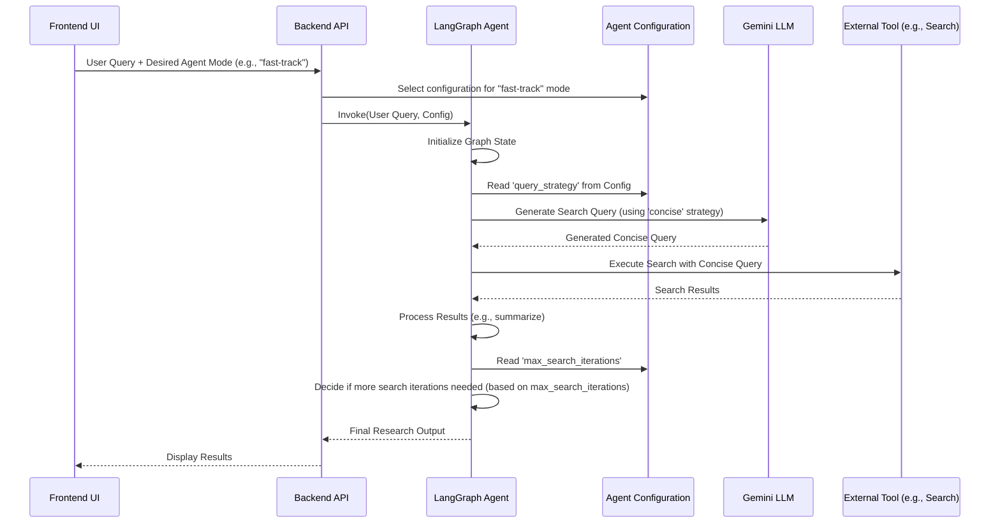

# Chapter 3: Agent Configuration

In the previous chapter, we delved into the intricacies of the [Agent's Research Workflow](chapter_02.md), understanding how our AI agent navigates a structured graph of actions to fulfill a user's research request. We saw how nodes and edges orchestrate the steps from query generation to information synthesis. However, a truly intelligent and versatile agent isn't just a fixed sequence of steps; it's an adaptable entity that can modify its approach based on context, user preference, or desired outcome. This is where **Agent Configuration** comes into play.

---

### Problem & Motivation

Imagine a chef who can only cook one dish, or a car that only has one speed. While functional, such systems lack the flexibility required for real-world scenarios. Similarly, an AI research agent with a fixed strategy for every query would quickly hit its limitations. Different research tasks demand different approaches: sometimes you need a quick, concise answer; other times, a deep, comprehensive dive. A user might want to limit the number of search queries to save time or resources, while another might want to exhaust all relevant search avenues.

The core problem this abstraction solves is the rigidness of a hardcoded agent behavior. Without configuration, developers would need to create entirely new agents or modify core logic for every slight variation in desired behavior, leading to bloated code and maintenance nightmares. Agent Configuration is important in this project because it allows our `gemini-fullstack-langgraph-quickstart` agent to be versatile. It enables users or developers to fine-tune its operation dynamically, making it suitable for a broader range of research scenarios and user preferences without altering the underlying LangGraph structure or LLM prompt templates themselves.

Consider a concrete use case: A user might want the agent to adopt a "fast-track" research mode that prioritizes speed over exhaustive detail, perhaps by generating fewer, but highly targeted, search queries. Alternatively, for critical research, they might prefer a "deep-dive" mode that allows for more iterative searches and a broader information gathering strategy. Agent Configuration provides the mechanism to switch between these modes effortlessly.

---

### Core Concept Explanation

At its heart, **Agent Configuration** is the mechanism by which we inject dynamic parameters and instructions into our AI agent, influencing its decision-making and execution path without rewriting its fundamental logic. Think of it as providing a set of "tuning knobs" or "instruction cards" to our agent before it starts its task. These knobs or cards dictate how the agent should interpret its overall goal, how it interacts with its tools, and even how it navigates its [Research Workflow](chapter_02.md).

In our project, configuration parameters can range from simple boolean flags (e.g., `enable_image_search: true`) to more complex enumerable types (e.g., `query_strategy: "concise"` or `query_strategy: "comprehensive"`). They can also include numeric values like `max_iterations` for a loop or `temperature` for LLM responses. These parameters are typically passed to the agent at the beginning of a research session or even with each turn of a multi-turn conversation.

The beauty of this approach lies in its ability to decouple behavior from implementation. Instead of having hardcoded values scattered throughout the agent's logic, we centralize these decision-making levers. This not only makes the agent more robust and easier to modify but also opens up possibilities for sophisticated user interfaces where users can customize the agent's behavior directly through settings or prompts. It's like giving our AI research agent different "personalities" or "specializations" on demand.

---

### Practical Usage Examples

Let's illustrate how we might use Agent Configuration to implement our "fast-track" vs. "deep-dive" research modes by influencing the query generation strategy.

First, imagine a simple configuration dictionary:

```python
# config_example.py
agent_config_fast_track = {
    "query_strategy": "concise",
    "max_search_iterations": 1
}

agent_config_deep_dive = {
    "query_strategy": "comprehensive",
    "max_search_iterations": 3
}
```
*Here, we define two distinct configuration profiles. The `query_strategy` dictates how search queries are formed, and `max_search_iterations` limits how many times the agent attempts to refine its search.*

When initializing or invoking the agent, we would pass this configuration along with the user's query:

```python
# app.py (simplified backend interaction)
from agent_core import research_agent
from config_example import agent_config_fast_track

user_query = "What are the benefits of LangGraph?"

# Start the agent with a specific configuration
result = research_agent.invoke(
    {"messages": [("user", user_query)]},
    config={"configurable": {"agent_config": agent_config_fast_track}}
)
print(result)
```
*This code snippet shows how a specific configuration, `agent_config_fast_track`, is passed to the agent's `invoke` method. The agent will then use these settings throughout its workflow.*

Let's look at how the `query_strategy` might affect an LLM prompt for generating search queries:

```python
# agent_nodes.py (simplified search query generation node)
from langchain_core.messages import HumanMessage
from langchain_core.prompts import ChatPromptTemplate

def generate_search_query(state: dict, config: dict):
    # Extract config from the LangGraph's 'configurable' state
    agent_config = config.get("configurable", {}).get("agent_config", {})
    query_strategy = agent_config.get("query_strategy", "default")

    if query_strategy == "concise":
        prompt_text = "Generate 1-2 very concise search queries for: {user_query}. Output as JSON."
    elif query_strategy == "comprehensive":
        prompt_text = "Generate 3-5 broad and detailed search queries for: {user_query}. Output as JSON."
    else:
        prompt_text = "Generate 2-3 standard search queries for: {user_query}. Output as JSON."

    prompt = ChatPromptTemplate.from_template(prompt_text)
    user_query = state["messages"][-1].content # Get latest user query
    
    # Assuming 'llm' is globally available or passed
    response = llm.invoke(prompt.format(user_query=user_query)) 
    # ... process response and update state
    return {"search_queries": ["query1", "query2"]} # Simplified output
```
*In this simplified `generate_search_query` function, the `query_strategy` from our configuration directly influences the prompt sent to the LLM. This changes how many and what type of search queries are generated, demonstrating the direct impact of configuration.*

---

### Internal Implementation Walkthrough

The integration of Agent Configuration into a LangGraph-based agent typically involves several key steps:

1.  **Configuration Definition**: Configuration parameters are defined, usually as Python dictionaries or Pydantic models for type safety and validation. These can be simple static objects or dynamically loaded from environment variables or a database.
2.  **Passing Configuration to LangGraph**: When you invoke a LangGraph agent, you can pass a `config` dictionary to the `invoke()` method. LangGraph automatically makes this `config` dictionary available to all nodes and edges in the graph via the `config` argument in their function signatures. For our project, we'd typically nest our agent-specific configurations under a `configurable` key, like `{"configurable": {"agent_config": {...}}}`.
3.  **Accessing Configuration within Nodes**: Inside a node function (like `generate_search_query` above), the `config` dictionary is received as an argument. The node then extracts the relevant parameters from this dictionary.
4.  **Influencing Node Logic**: Once extracted, configuration parameters are used to alter the node's behavior. This could mean:
    *   **Modifying LLM prompts**: As seen in the example, changing instructions for query generation, summarization, or analysis.
    *   **Conditional Tool Use**: Deciding which tools to call based on flags (e.g., `if config.enable_image_search: call_image_tool()`).
    *   **Loop Control**: Adjusting iteration limits for recursive processes (e.g., `max_search_iterations`).
    *   **Dynamic Edge Traversal**: In more advanced scenarios, configuration could even influence which path the graph takes, though this is often handled by state updates.

Let's visualize the data flow for how configuration influences the agent's workflow:


*This sequence diagram illustrates how configuration flows from the user request, through the backend, and directly into the LangGraph agent, influencing specific actions taken by the LLM and guiding the agent's overall research process.*

In practice, the `gemini-fullstack-langgraph-quickstart` project might have configuration definitions in a dedicated file (e.g., `src/backend/config.py` or similar) and then pass these as part of the `state` or `config` object during the agent's execution.

---

### System Integration

Agent Configuration is not an isolated component; it's a crucial input that informs the behavior of other core abstractions in the system:

*   **Integration with [Agent's Research Workflow](chapter_02.md)**: This is the most direct integration. Configuration parameters dictate how the LangGraph workflow executes. They influence conditional logic within nodes, modify prompts for LLM calls (e.g., for query generation or summarization nodes), and control loop bounds. Without configuration, the workflow would always follow a single, fixed path.
*   **Interaction with [Agent's Memory (Overall State)](chapter_01.md)**: While the configuration itself is typically *not* stored directly in the agent's memory (as it's often transient for a given invocation), it heavily influences *what* gets added to the memory and *how* the memory evolves. For instance, a "verbose" configuration might lead the agent to store more intermediate search results or LLM reasoning steps in its memory state, whereas a "concise" configuration might only store the final answers. The configuration guides the agent's decisions about what information is relevant to persist or update within its `state`.
*   **Frontend UI and Backend API**: The configuration often originates from the frontend UI, where users might select "modes" or adjust "sliders." This input is then transmitted via the backend API to the LangGraph agent. The backend API (`src/backend/api.py` conceptually) acts as the bridge, ensuring that user-defined preferences are correctly mapped to the `config` object expected by the agent.

Essentially, configuration acts as the control panel for the entire agent system, allowing external factors (like user preferences) to shape the agent's internal machinery and its interactions with tools and memory.

---

### Best Practices & Tips

To leverage Agent Configuration effectively, consider these best practices:

*   **Modularize Configuration**: Keep your configuration separate from your core agent logic. Use dedicated files (e.g., `config.py`, `.env` files, or database entries) to store and manage configurations. This improves readability, maintainability, and allows for easy swapping of configurations.
*   **Provide Sensible Defaults**: Always design your agent to work reasonably well even without explicit configuration. Provide default values for all parameters, ensuring the agent is robust and easy to get started with.
*   **Validate Configuration Inputs**: Implement validation checks for configuration parameters. Ensure values are of the correct type, within expected ranges, or from a set of allowed options (e.g., `query_strategy` must be "concise" or "comprehensive"). This prevents runtime errors and unexpected agent behavior.
*   **Granular vs. Abstract Configuration**: Strive for a balance. Too granular, and users get overwhelmed; too abstract, and control is lost. For example, instead of separate `search_tool_timeout`, `summary_tool_timeout`, use a `default_tool_timeout` and allow overrides for specific tools if needed.
*   **Document Configuration Options**: Clearly document all available configuration parameters, their purpose, valid values, and their impact on the agent's behavior. This is crucial for both users and developers.
*   **Consider Versioning for Complex Configurations**: If your configuration schema evolves, consider versioning it, especially if used across different deployments or user profiles.
*   **Troubleshooting Tip**: If your agent is behaving unexpectedly, the configuration is often the first place to check. Verify that the correct configuration is being passed, that its values are as expected, and that the agent's internal logic correctly interprets these values.

---

### Chapter Conclusion

This chapter has illuminated the pivotal role of **Agent Configuration** in transforming a rigid AI agent into a flexible, adaptable, and powerful research assistant. By allowing dynamic adjustments to its behavior and decision-making processes, configuration empowers our `gemini-fullstack-langgraph-quickstart` agent to cater to diverse user needs and research contexts, from "fast-track" summaries to "deep-dive" comprehensive analyses. We've explored its core concepts, practical applications through examples, internal mechanisms within the LangGraph framework, and its crucial integration with the agent's memory and workflow.

With the ability to customize the agent's strategy, the project achieves a significant level of versatility, enabling developers and users alike to tailor the AI's research approach. This concludes our exploration of the `gemini-fullstack-langgraph-quickstart` project's core components. We've journeyed from understanding the agent's central state and memory, through its structured research workflow, and finally to the dynamic customization offered by agent configuration. These foundational chapters provide a complete understanding of how to build, operate, and adapt a sophisticated AI research agent.