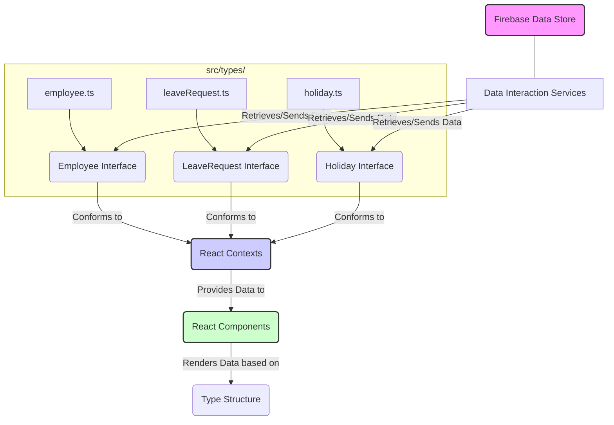

# Chapter 1: Data Models (Types)

This is the first chapter in our journey through the `hr-app` project documentation. Here, we lay the foundational groundwork by defining the essential data structures that govern our application.

---

### Problem & Motivation

Imagine building an application without a clear understanding of the data it needs to manage. It would be like trying to construct a building without blueprints – chaotic, prone to errors, and incredibly difficult to maintain. In the context of our HR application, we deal with critical information about employees, their leave requests, and company holidays. Without a standardized way to define and interact with this data, inconsistencies would quickly emerge, leading to bugs, incorrect displays, and a confusing development experience.

For instance, consider displaying a list of employees. How do we ensure that every employee entry consistently has a `name`, `email`, and `role`? What if some entries are missing crucial fields or use different naming conventions? This lack of structure not only makes development challenging but also compromises data integrity, which is paramount in an HR system.

This chapter addresses these challenges by introducing **Data Models** (or **Types**). Our goal is to establish clear, predictable structures for all key data entities within the `hr-app`. By doing so, we ensure that every part of the application – from fetching data from Firebase to rendering it in a React component – operates with a consistent understanding of what each piece of information represents. This clarity is crucial for building a robust, maintainable, and error-free HR application.

---

### Core Concept Explanation

At its heart, a **Data Model** or **Type** serves as a blueprint or a contract for how a piece of data should be structured. Think of it as defining the "shape" of an object. For our `hr-app`, these types precisely dictate what properties an `Employee` object should have, what information constitutes a `LeaveRequest`, and how a `Holiday` is defined. This explicit definition brings numerous benefits, especially in a JavaScript environment enhanced with TypeScript.

TypeScript, which we use in `hr-app`, allows us to define these types using `interface` or `type` keywords. These definitions are compile-time checks; they don't add any runtime code but provide invaluable guidance during development. They ensure that when you're working with an `Employee` object, for example, you know exactly what properties are available (like `name`, `email`, `id`) and their expected data types (e.g., `string`, `number`).

The primary advantages of defining data models include:

*   **Consistency:** All parts of the application will expect and provide data in the same format.
*   **Predictability:** Developers know exactly what data fields to expect when interacting with an object.
*   **Maintainability:** Changes to data structures can be quickly identified and propagated, reducing bugs.
*   **Developer Experience:** Integrated Development Environments (IDEs) can provide intelligent auto-completion and error checking, significantly speeding up development.

By establishing these types upfront, we create a stable foundation for all subsequent development, ensuring that our `hr-app` manages its complex data with precision and clarity.

---

### Practical Usage Examples

Let's dive into defining the core data models for our `hr-app` using TypeScript interfaces. These interfaces will reside in a central location, typically within a `src/types` directory, making them easily accessible across the entire project.

#### 1. The `Employee` Model

The `Employee` interface defines the structure for all employee records in our system.

```typescript
// src/types/employee.ts
export interface Employee {
  id: string;
  firstName: string;
  lastName: string;
  email: string;
  role: 'Admin' | 'Employee' | 'Manager'; // Role can be one of these specific strings
  department: string;
  startDate: string; // ISO Date string (e.g., '2023-01-15')
  status: 'Active' | 'On Leave' | 'Terminated';
}
```
This `Employee` interface specifies that every employee object must have a unique `id`, `firstName`, `lastName`, `email`, a predefined `role`, `department`, their `startDate`, and their current `status`. This ensures consistency when fetching or displaying employee data.

Here's how you might create an `Employee` object conforming to this type:

```typescript
import { Employee } from './types/employee';

const newEmployee: Employee = {
  id: 'emp_001',
  firstName: 'Jane',
  lastName: 'Doe',
  email: 'jane.doe@hr-app.com',
  role: 'Employee',
  department: 'Marketing',
  startDate: '2023-04-01',
  status: 'Active',
};

console.log(newEmployee.firstName); // Output: Jane
```
When you declare `newEmployee` as type `Employee`, TypeScript will check if all required properties are present and have the correct types. If you forget a property or assign a wrong type, TypeScript will immediately flag an error during development.

#### 2. The `LeaveRequest` Model

The `LeaveRequest` interface structures the data for employee leave applications.

```typescript
// src/types/leaveRequest.ts
export interface LeaveRequest {
  id: string;
  employeeId: string; // References Employee.id
  type: 'Annual' | 'Sick' | 'Maternity' | 'Paternity' | 'Unpaid';
  startDate: string; // ISO Date string
  endDate: string;   // ISO Date string
  reason: string;
  status: 'Pending' | 'Approved' | 'Rejected';
  requestedDate: string; // When the request was made
}
```
This interface details all necessary fields for a leave request, including its `id`, the `employeeId` it's associated with, the `type` of leave, the period (`startDate`, `endDate`), `reason`, `status`, and when it was `requestedDate`.

Example of a `LeaveRequest` object:

```typescript
import { LeaveRequest } from './types/leaveRequest';

const holidayLeave: LeaveRequest = {
  id: 'leave_001',
  employeeId: 'emp_001',
  type: 'Annual',
  startDate: '2024-07-15',
  endDate: '2024-07-19',
  reason: 'Family vacation to the beach.',
  status: 'Pending',
  requestedDate: '2024-06-01',
};

// A function expecting a LeaveRequest
function processLeave(request: LeaveRequest) {
  console.log(`Processing ${request.type} leave for employee ${request.employeeId}.`);
}

processLeave(holidayLeave);
// Expected output: Processing Annual leave for employee emp_001.
```
Here, the `processLeave` function explicitly expects an argument of type `LeaveRequest`, ensuring that any object passed to it will have the required structure.

#### 3. The `Holiday` Model

The `Holiday` interface defines company-wide or public holidays.

```typescript
// src/types/holiday.ts
export interface Holiday {
  id: string;
  name: string;
  date: string; // ISO Date string (e.g., '2024-12-25')
  type: 'Public' | 'Company'; // e.g., 'Public Holiday', 'Company Observed'
}
```
This interface simplifies how we manage and display holidays, ensuring each holiday has a `name`, `date`, and `type`.

```typescript
import { Holiday } from './types/holiday';

const christmas: Holiday = {
  id: 'hol_001',
  name: 'Christmas Day',
  date: '2024-12-25',
  type: 'Public',
};

console.log(`${christmas.name} is on ${christmas.date}.`);
// Expected output: Christmas Day is on 2024-12-25.
```
These practical examples demonstrate how these data models provide clear guidelines for structuring data throughout the `hr-app`, making development more predictable and less error-prone.

---

### Internal Implementation Walkthrough

In the `hr-app`, our data models are purely definitional constructs leveraging TypeScript. They do not involve complex runtime logic or internal processing on their own. Instead, they act as static contracts that guide the application's data flow.

Typically, these TypeScript interfaces are defined in a dedicated directory, such as `src/types/`. Each core entity (Employee, LeaveRequest, Holiday) might have its own file for better organization (e.g., `src/types/employee.ts`, `src/types/leaveRequest.ts`, `src/types/holiday.ts`). Alternatively, for smaller projects, they could be consolidated into a single `src/types/index.ts` file.


As shown in the diagram, the interfaces (`Employee`, `LeaveRequest`, `Holiday`) define the expected shape of data at various stages. When `Data Interaction Services` fetch employee information from `Firebase Data Store`, they expect the incoming data to match the `Employee` interface. Similarly, when `React Contexts` store this data in the global state, they ensure it adheres to these types. Finally, `React Components` consume this typed data, confidently rendering it on the user interface, knowing its precise structure.

This approach ensures that the "internal implementation" of data handling across the application consistently aligns with these predefined models, preventing runtime type errors and enhancing overall code quality.

---

### System Integration

Data models are not isolated; they are fundamental to how different parts of the `hr-app` project communicate and function. They act as the common language spoken by our application's various components.

*   **[Data Interaction Services](chapter_02.md):** This is where our types first come to life beyond their definition. The services responsible for fetching data from our Firebase backend (or any future API) will use these data models to correctly type the incoming data. When an `Employee` record is retrieved, the service ensures it conforms to the `Employee` interface before passing it further into the application. Conversely, when creating or updating data, these services will expect the outgoing payload to match the defined types.

*   **[Global State Management (React Contexts)](chapter_03.md):** Once data is fetched by the interaction services, it often needs to be stored in a central location accessible to many components. React Contexts will be used to manage this global state. The state will hold arrays of `Employee` objects, `LeaveRequest` objects, and `Holiday` objects, all strictly adhering to their respective interfaces. This ensures that any component consuming data from a context receives it in a predictable, typed format.

*   **[Application Pages (Views)](chapter_06.md):** The user interface, composed of various React components and pages, directly consumes the data structured by these models. When a page displays a list of employees, it expects each item in that list to be an `Employee` object. This type safety allows developers to confidently access properties like `employee.firstName` or `employee.email` without worrying about potential `undefined` errors or misspellings, as TypeScript has already verified the structure.

In essence, our data models form the backbone of data integrity throughout the entire `hr-app`, from backend interaction to frontend rendering. They provide a reliable contract that binds all parts of the system together.

---

### Best Practices & Tips

Adhering to best practices when defining and using data models will significantly enhance the maintainability, scalability, and developer experience of the `hr-app`.

*   **Keep Types Granular and Focused:** Each interface should represent a single, clear entity. Avoid creating overly broad interfaces that try to encompass too many unrelated properties. This improves readability and reusability.
    *   *Good:* `interface Employee { ... }`, `interface LeaveRequest { ... }`
    *   *Avoid:* `interface AppData { employees: Employee[]; leaveRequests: LeaveRequest[]; ... }` (This can be a context state, but not a core model itself).

*   **Use Optional Properties (`?`) Judiciously:** If a property might not always be present, mark it as optional using `?`. This clearly communicates its potential absence and avoids runtime errors.
    ```typescript
    interface EmployeeProfile {
      id: string;
      firstName: string;
      lastName: string;
      phoneNumber?: string; // Optional field
      address?: string;     // Optional field
    }
    ```

*   **Extend Types for Reusability and Specificity:** Leverage TypeScript's `extends` keyword to build more specific types from general ones. This reduces duplication and clarifies relationships. For instance, a `NewEmployee` type might omit the `id` which is typically generated by the backend.
    ```typescript
    interface BaseEmployee {
      firstName: string;
      lastName: string;
      email: string;
    }

    interface Employee extends BaseEmployee {
      id: string; // ID is added once persisted
      role: 'Admin' | 'Employee';
    }

    interface NewEmployee extends BaseEmployee {
      // No ID needed for creation
      role: 'Admin' | 'Employee';
    }
    ```

*   **Centralize Type Definitions:** Store all your interfaces in a dedicated directory (e.g., `src/types/`). This makes them easy to find, manage, and import consistently across the project. Using an `index.ts` file in that directory to export them all can also simplify imports:
    ```typescript
    // src/types/index.ts
    export * from './employee';
    export * from './leaveRequest';
    export * from './holiday';

    // In a component:
    import { Employee, LeaveRequest } from '../types';
    ```

*   **Avoid `any` Type:** While `any` can quickly silence TypeScript errors, it defeats the purpose of type safety. Strive to define precise types for all your data. If you're unsure, try to infer the type or define a general `unknown` type and narrow it down later.

*   **Type Naming Conventions:** Use PascalCase for interface names (e.g., `Employee`, `LeaveRequest`).

**Common Pitfalls to Avoid:**

*   **Inconsistent Naming:** Using `employeeName` in one place and `empName` in another for the same concept. Stick to a single convention.
*   **Undefined Behavior with Missing Properties:** Not marking optional fields can lead to runtime crashes if a property is accessed but doesn't exist.
*   **Over-normalization:** While good to keep types focused, don't break down entities into too many tiny types if they are always used together. Find a sensible balance.

By following these best practices, we ensure our data models are not just functional but also a powerful asset for developing a high-quality `hr-app`.

---

### Chapter Conclusion

In this foundational chapter, we explored the critical role of Data Models (Types) within the `hr-app`. We established that by defining precise structures for key entities like `Employee`, `LeaveRequest`, and `Holiday` using TypeScript interfaces, we gain immense benefits in terms of data consistency, predictability, and developer efficiency. We walked through practical examples of these models and understood how they act as blueprints that guide data throughout the application's lifecycle.

The explicit definition of these types is the cornerstone upon which the rest of our `hr-app` will be built. They ensure that all parts of the system "speak the same language" when it comes to data, minimizing errors and facilitating smoother development.

As we move forward, these data models will be instrumental. In the next chapter, we will delve into **[Data Interaction Services](chapter_02.md)**. These services will be responsible for communicating with our Firebase backend, ensuring that data is fetched, stored, and updated in strict adherence to the models we've defined here. Understanding our data models is the first crucial step towards building a robust and reliable HR application.