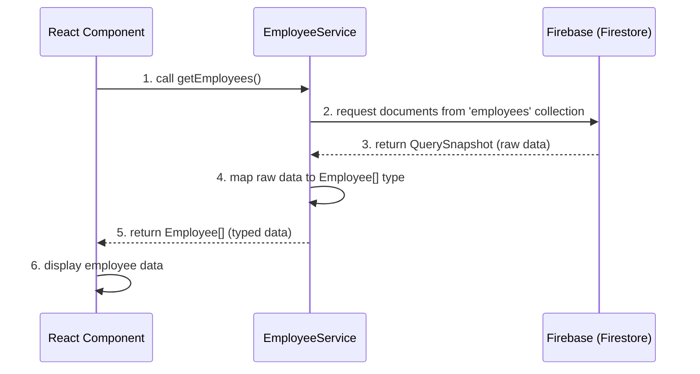

# Chapter 2: Data Interaction Services

Welcome back to our exploration of the hr-app! In the previous chapter, [Data Models (Types)](chapter_01.md), we established the foundational blueprints for all the data entities in our application, such as `Employee`, `LeaveRequest`, and `Holiday`. These types provide a clear, consistent structure for understanding our data. Now, we're ready to tackle how our application actually *interacts* with this data – a crucial step that brings our theoretical models to life.

---

### Problem & Motivation

Imagine building an application where every time a user wants to see a list of employees, update a leave request, or add a new holiday, the UI component itself has to figure out how to connect to the database, send a query, handle the response, and manage any errors. This approach quickly leads to a tangled mess of code: UI components become bloated with data logic, the same database calls are repeated across different parts of the application, and debugging becomes a nightmare. This lack of separation between "what to display" and "how to get the data" is a common problem in many applications.

In our `hr-app`, we need a robust and scalable way to manage employee data, leave requests, and holidays. We want to ensure that our React components focus solely on rendering the user interface and responding to user interactions, without getting bogged down in the complexities of database communication. This separation of concerns is vital for creating maintainable, testable, and reusable code.

Specifically, consider the task of displaying an employee directory. A UI component needs a list of all employees. Without a dedicated service, this component would have to directly query Firebase, parse the results, and handle any network issues. If another component also needs employee data, it would duplicate much of this logic. Our solution, Data Interaction Services, will centralize this logic, providing a clean, consistent interface for all data operations.

---

### Core Concept Explanation

Data Interaction Services, often simply called "services" or "API services," are specialized modules designed to encapsulate all the logic related to communicating with a backend data store. In the context of our `hr-app`, these services act as the exclusive gateway between our frontend React application and our Firebase backend.

Think of these services as dedicated "data agents" or "librarians" for specific types of information. If you need employee information, you go to the `EmployeeService`. If you need to manage leave requests, you interact with `LeaveService`. Each service knows exactly how to speak the language of the backend (Firebase's API) for its particular data domain. They handle tasks like constructing database queries, sending requests, receiving responses, transforming raw database data into our predefined [Data Models (Types)](chapter_01.md), and gracefully handling any errors that might occur during these operations.

The primary benefit of this approach is **abstraction**. Our UI components don't need to know the intricate details of Firebase queries or data structures. They simply call a function like `employeeService.getEmployees()` and receive a list of `Employee` objects. This significantly simplifies component logic, promotes code reusability, and makes our application more resilient to changes in the backend technology. This layer handles the **CRUD** operations: **C**reate, **R**ead, **U**pdate, and **D**elete data, making data management consistent and centralized.

---

### Practical Usage Examples

Let's illustrate how a React component would interact with our `EmployeeService` to perform common data operations, focusing on our motivating use case: managing employee data.

First, we'll assume a `firebase.ts` utility file that exports our initialized Firebase `db` instance, and our `Employee` type from the previous chapter.

```typescript
// src/utils/firebase.ts
import { initializeApp } from 'firebase/app';
import { getFirestore } from 'firebase/firestore';

const firebaseConfig = {
  apiKey: "YOUR_API_KEY",
  authDomain: "YOUR_AUTH_DOMAIN",
  projectId: "YOUR_PROJECT_ID",
  storageBucket: "YOUR_STORAGE_BUCKET",
  messagingSenderId: "YOUR_MESSAGING_SENDER_ID",
  appId: "YOUR_APP_ID"
};

const app = initializeApp(firebaseConfig);
export const db = getFirestore(app);
```
*This snippet initializes Firebase Firestore, making our database instance (`db`) available for services to use.*

```typescript
// src/types/Employee.ts (from Chapter 1)
export interface Employee {
  id: string;
  firstName: string;
  lastName: string;
  email: string;
  position: string;
  // ... other employee properties
}
```
*This defines the `Employee` structure, which our services will use to type data.*

Now, let's look at how our `EmployeeService` would be structured and used:

#### 1. Fetching All Employees

To get a list of all employees, a component simply calls `employeeService.getEmployees()`.

```typescript
// src/services/employeeService.ts (Snippet 1: getEmployees)
import { collection, getDocs } from 'firebase/firestore';
import { db } from '../utils/firebase';
import { Employee } from '../types/Employee'; // Our Employee data model

const employeesCollectionRef = collection(db, 'employees');

export const employeeService = {
  async getEmployees(): Promise<Employee[]> {
    const data = await getDocs(employeesCollectionRef);
    return data.docs.map(doc => ({ ...doc.data(), id: doc.id } as Employee));
  },
  // ... other service methods
};
```
*This function retrieves all documents from the 'employees' collection in Firebase and maps them to our `Employee` type, including the document ID.*

```typescript
// src/pages/EmployeeDirectory.tsx (Component Usage Example)
import React, { useEffect, useState } from 'react';
import { employeeService } from '../services/employeeService';
import { Employee } from '../types/Employee';

function EmployeeDirectory() {
  const [employees, setEmployees] = useState<Employee[]>([]);

  useEffect(() => {
    const fetchEmployees = async () => {
      const data = await employeeService.getEmployees();
      setEmployees(data);
    };
    fetchEmployees();
  }, []);

  return (
    <div>
      <h2>Employee Directory</h2>
      {employees.map(emp => (
        <p key={emp.id}>{emp.firstName} {emp.lastName}</p>
      ))}
    </div>
  );
}
export default EmployeeDirectory;
```
*In this React component, `useEffect` calls `employeeService.getEmployees()` to fetch and display the data. Notice how simple the component's data fetching logic is.*

#### 2. Adding a New Employee

To add a new employee, the service handles the details of interacting with Firebase.

```typescript
// src/services/employeeService.ts (Snippet 2: addEmployee)
import { addDoc, collection } from 'firebase/firestore';
import { db } from '../utils/firebase';
import { Employee } from '../types/Employee';

// ... (employeesCollectionRef and getEmployees from above)

export const employeeService = {
  // ... getEmployees
  async addEmployee(newEmployee: Omit<Employee, 'id'>): Promise<string> {
    const docRef = await addDoc(employeesCollectionRef, newEmployee);
    return docRef.id; // Return the ID of the newly created employee
  },
  // ... other service methods
};
```
*This function takes a new employee object (without an `id`, as Firebase generates it) and adds it to the 'employees' collection, returning the new document's ID.*

```typescript
// src/components/AddEmployeeForm.tsx (Component Usage Example)
import React, { useState } from 'react';
import { employeeService } from '../services/employeeService';

function AddEmployeeForm() {
  const [firstName, setFirstName] = useState('');
  const handleSubmit = async (e: React.FormEvent) => {
    e.preventDefault();
    const newEmployeeData = { firstName, lastName: 'Doe', email: 'john@example.com', position: 'Developer' };
    const employeeId = await employeeService.addEmployee(newEmployeeData);
    alert(`Employee added with ID: ${employeeId}`);
    setFirstName('');
  };

  return (
    <form onSubmit={handleSubmit}>
      <input type="text" value={firstName} onChange={e => setFirstName(e.target.value)} placeholder="First Name" />
      <button type="submit">Add Employee</button>
    </form>
  );
}
export default AddEmployeeForm;
```
*The component collects form data and passes it directly to `employeeService.addEmployee()`, abstracting the Firebase interaction.*

#### 3. Updating an Employee

Updating an existing employee follows a similar pattern.

```typescript
// src/services/employeeService.ts (Snippet 3: updateEmployee)
import { doc, updateDoc } from 'firebase/firestore';
import { db } from '../utils/firebase';
import { Employee } from '../types/Employee';

// ... (employeesCollectionRef, getEmployees, addEmployee from above)

export const employeeService = {
  // ... getEmployees, addEmployee
  async updateEmployee(id: string, updates: Partial<Employee>): Promise<void> {
    const employeeDocRef = doc(db, 'employees', id);
    await updateDoc(employeeDocRef, updates);
  },
  // ... other service methods
};
```
*This function targets a specific employee by `id` and applies partial updates to their document in Firebase.*

#### 4. Deleting an Employee

Deleting an employee is also handled directly by the service.

```typescript
// src/services/employeeService.ts (Snippet 4: deleteEmployee)
import { doc, deleteDoc } from 'firebase/firestore';
import { db } from '../utils/firebase';

// ... (employeesCollectionRef, getEmployees, addEmployee, updateEmployee from above)

export const employeeService = {
  // ... getEmployees, addEmployee, updateEmployee
  async deleteEmployee(id: string): Promise<void> {
    const employeeDocRef = doc(db, 'employees', id);
    await deleteDoc(employeeDocRef);
  },
};
```
*This function removes an employee document from the 'employees' collection based on its `id`.*

---

### Internal Implementation Walkthrough

Let's dive deeper into how `employeeService.ts` actually performs its magic internally.

At its core, `employeeService.ts` (and similar services for `leaveRequest` or `holiday`) orchestrates calls to the Firebase Firestore SDK.

1.  **Firebase Initialization:** It first imports the `db` instance from `src/utils/firebase.ts`. This `db` object is our entry point to interacting with Firestore.

2.  **Collection Reference:** For each service, we typically define a reference to the specific Firestore collection it manages. For `employeeService`, this is `employeesCollectionRef`, pointing to the `employees` collection. This makes it easier to perform operations without repeatedly typing the collection path.

    ```typescript
    // Inside src/services/employeeService.ts
    import { collection, getDocs, addDoc, updateDoc, deleteDoc, doc } from 'firebase/firestore';
    import { db } from '../utils/firebase';
    import { Employee } from '../types/Employee';

    const employeesCollectionRef = collection(db, 'employees');
    ```
    *This line creates a reference to the 'employees' collection in our Firestore database.*

3.  **Method Implementation (`getEmployees` as an example):**
    *   **Calling Firebase:** The `getEmployees` method uses `getDocs(employeesCollectionRef)` which sends a request to Firebase Firestore to retrieve all documents within the `employees` collection. This operation is asynchronous, so we use `await`.
    *   **Data Transformation:** The raw data returned by Firebase (`QuerySnapshot`) is not directly in our `Employee` type. It's an object containing metadata and an array of `QueryDocumentSnapshot` objects. Each `doc` in `data.docs` has a `.data()` method that returns the document's fields and a `.id` property for the document's unique ID. We map these raw snapshots into our `Employee` type, ensuring consistency. We merge the `id` into the `data()` object.
    *   **Error Handling:** (Not explicitly shown in quick examples, but crucial) In a real-world scenario, each async service method would be wrapped in a `try-catch` block to gracefully handle network issues, permission errors, or data inconsistencies from Firebase.

#### Sequence Diagram: Fetching Employees

This diagram illustrates the flow when a React component requests employee data:


*This diagram visually represents how the `React Component`, `EmployeeService`, and `Firebase` interact during a data fetch operation, highlighting the abstraction provided by the service.*

For `addEmployee`, `updateEmployee`, and `deleteEmployee`, the internal logic involves using specific Firestore functions (`addDoc`, `updateDoc`, `deleteDoc`) with the appropriate collection or document references, ensuring that the data sent to Firebase matches our defined types as closely as possible.

---

### System Integration

Data Interaction Services are a central piece of our `hr-app`'s architecture, seamlessly integrating with several other key abstractions:

*   **Integration with [Data Models (Types)](chapter_01.md):** This is perhaps the most direct connection. Our services are built *around* our data models. When data is fetched from Firebase, the services are responsible for transforming the raw backend response into instances of our `Employee`, `LeaveRequest`, or `Holiday` types. Conversely, when data is sent to Firebase (e.g., adding a new employee), the services ensure that the data conforms to the expected structure defined by these models. This guarantees type safety and consistency throughout the application.

*   **Integration with [Global State Management (React Contexts)](chapter_03.md):** After data is fetched by a service, it often needs to be made available to multiple components across the application. This is where global state management comes in. Our services will typically fetch the data, and then the calling component or an intermediary (like a React Context provider) will take this data and update the application's global state. This prevents components from having to refetch the same data repeatedly and ensures a single source of truth for the application's state.

*   **Integration with UI Components:** React components are the direct consumers of these services. Instead of embedding complex data fetching logic, components simply import the relevant service (e.g., `employeeService`) and call its methods. This clean separation allows components to focus purely on rendering and user interaction, leading to much cleaner and more readable component code.

*   **Error Handling and User Feedback:** Services are the ideal place to catch and manage errors that occur during backend communication. While services handle the *technical* error, the UI component that called the service is responsible for providing meaningful *user feedback* (e.g., "Failed to load employees," or a success message).

---

### Best Practices & Tips

To maximize the benefits of Data Interaction Services in your `hr-app`, consider these best practices:

*   **Dedicated Services per Data Entity:** Create a separate service for each major data entity (e.g., `employeeService.ts`, `leaveService.ts`, `holidayService.ts`). This adheres to the Single Responsibility Principle, making services focused and easier to manage.
*   **Centralized Firebase Configuration:** Keep your Firebase initialization and `db` export in a single utility file (e.g., `src/utils/firebase.ts`). This avoids redundancy and makes configuration changes simple.
*   **Robust Error Handling:** Always wrap your asynchronous Firebase calls in `try-catch` blocks within the service methods. Log errors internally and consider re-throwing a simplified, custom error that the calling component can easily understand and react to (e.g., `throw new Error('Failed to fetch employees');`).
    ```typescript
    // Example: Error handling in a service method
    async getEmployees(): Promise<Employee[]> {
      try {
        const data = await getDocs(employeesCollectionRef);
        return data.docs.map(doc => ({ ...doc.data(), id: doc.id } as Employee));
      } catch (error) {
        console.error("Error fetching employees:", error);
        throw new Error("Could not retrieve employee data. Please try again later.");
      }
    }
    ```
*   **Return Typed Data:** Ensure that service methods consistently return data that conforms to your [Data Models (Types)](chapter_01.md). This provides type safety and predictability for consumers.
*   **Abstraction over Specific Backend:** While we're using Firebase, try to keep the *interface* of your services generic. For instance, `getEmployees()` is better than `getEmployeesFromFirestore()`. This makes it conceptually easier to swap out the backend later if needed, though the internal implementation would still require refactoring.
*   **Loading and State Management:** Services only fetch/modify data. The *management* of loading states (`isLoading`, `isError`) or the data itself in the UI is typically handled by the calling component, often in conjunction with [Global State Management (React Contexts)](chapter_03.md).
*   **Testing:** Services are highly testable in isolation. You can mock the Firebase `db` object to test the data transformation and error handling logic without needing a live backend connection.

**Common Pitfalls to Avoid:**
*   **Direct Firebase Calls in Components:** The most common mistake is bypassing the service layer and embedding Firebase logic directly into React components. This defeats the purpose of services.
*   **Overly Generic Services:** A single `dataService` handling all entities can become a monolithic bottleneck. Stick to dedicated services per entity.
*   **Ignoring Errors:** Failing to implement proper `try-catch` blocks can lead to unhandled promise rejections and silent failures in the application.

---

### Chapter Conclusion

In this chapter, we've explored the critical role of Data Interaction Services in our `hr-app`. We've seen how they act as a dedicated, robust layer for all backend communication, abstracting away the complexities of Firebase and providing a clean, typed interface for our React components. By centralizing CRUD operations, these services ensure our application is modular, maintainable, and scalable.

We started with defining our data models, and now we've learned how to interact with them through services. The data fetched and manipulated by these services is now ready to be shared and managed across our application. In the next chapter, we will bridge the gap between our data services and our UI by introducing [Global State Management (React Contexts)](chapter_03.md). This will allow us to efficiently store and access the data retrieved by our services from any component in our application, ensuring a smooth and responsive user experience.