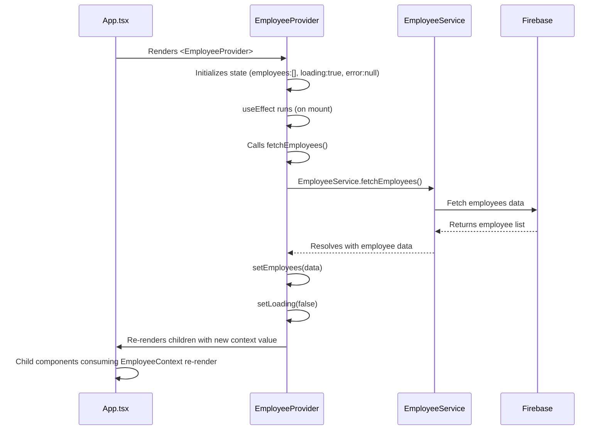
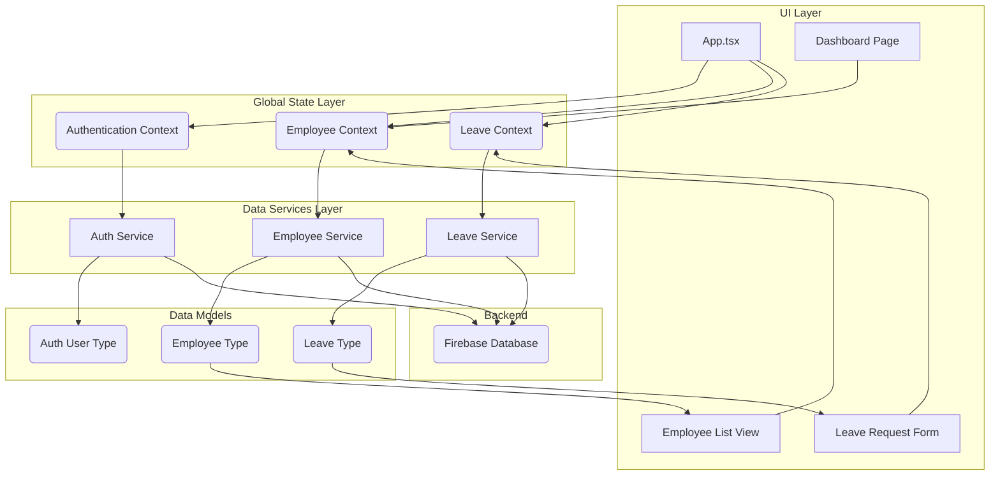

# Chapter 3: Global State Management (React Contexts)

Building upon the foundation laid by our [Data Interaction Services](chapter_02.md), which handle the communication with our Firebase backend, we now turn our attention to how this retrieved data, along with other critical application state, is efficiently distributed and managed across our `hr-app`'s frontend. This chapter introduces React Contexts as our primary mechanism for global state management.

---

### Problem & Motivation

In any moderately complex React application, you often encounter a scenario known as "prop drilling." This occurs when data needs to be passed down through multiple layers of nested components, even if intermediary components don't directly use that data. For instance, imagine the `hr-app`'s dashboard needs to display the currently logged-in user's name, which might be provided by an `AuthService`. If the user's name is needed in a component several levels deep (e.g., `App > Layout > Sidebar > UserProfileCard`), you would have to pass the `userName` prop from `App` to `Layout`, then `Layout` to `Sidebar`, and finally `Sidebar` to `UserProfileCard`. This leads to verbose, inflexible code that's hard to refactor.

This problem becomes particularly acute in the `hr-app` due to its nature of managing various centralized data entities: employee lists, leave requests, holiday schedules, and the authenticated user's status. Without a robust solution, every component requiring access to, say, the list of all employees (fetched via our [Data Interaction Services](chapter_02.md)) would either have to fetch it themselves (inefficient) or receive it via prop drilling (cumbersome). React Contexts provide a structured, clean, and efficient way to make this crucial data available globally, precisely when and where it's needed, without the overhead of manual prop passing. Our concrete use case for this chapter will involve centralizing the `employees` list, making it accessible to any component displaying or modifying employee data.

---

### Core Concept Explanation

React's Context API is a mechanism that allows you to share values like user authentication status, theme preferences, or—in our case—global data entities such as employee lists, between components without explicitly passing a prop through every level of the component tree. It provides a way to "subscribe" components to changes in a particular context, ensuring they re-render when the relevant data updates.

The core components of the Context API are:
1.  **`React.createContext()`**: This function creates a Context object. When React renders a component that subscribes to this Context object, it will read the current context value from the closest matching `Provider` above it in the tree.
2.  **`Context.Provider`**: Every Context object comes with a Provider React component. It allows consuming components to subscribe to context changes. The Provider accepts a `value` prop to be passed to consuming components that are descendants of this Provider. A single Provider can be connected to many consumers.
3.  **`useContext(Context)`**: This is a React Hook that lets you read and subscribe to context from a function component. It returns the current context value for that context. The component will re-render whenever the context value changes.

Think of it like a central broadcast channel. A `Provider` is like a broadcaster, sending out specific information (the `value` prop). Any component within its scope can tune into this channel using `useContext` (acting as a receiver) and access that information directly, without needing an intermediary to pass it along. In the `hr-app`, we'll set up separate channels for authentication status, employee data, and leave requests, ensuring each piece of global state is managed and distributed independently and efficiently.

---

### Practical Usage Examples

Let's illustrate how we set up and consume a simple `EmployeeContext` to provide our application with a list of employees fetched from our [Data Interaction Services](chapter_02.md).

#### 1. Defining the Employee Context

First, we define the context object and its expected data shape.

```typescript
// src/contexts/EmployeeContext.ts
import { createContext, useContext } from 'react';
import { Employee } from '../types/employee'; // From Chapter 1

interface EmployeeContextType {
  employees: Employee[];
  loading: boolean;
  error: string | null;
  addEmployee: (employee: Employee) => Promise<void>;
  updateEmployee: (id: string, employee: Partial<Employee>) => Promise<void>;
  deleteEmployee: (id: string) => Promise<void>;
}

export const EmployeeContext = createContext<EmployeeContextType | undefined>(undefined);

// Custom hook for convenience
export const useEmployees = () => {
  const context = useContext(EmployeeContext);
  if (context === undefined) {
    throw new Error('useEmployees must be used within an EmployeeProvider');
  }
  return context;
};
```
*Explanation*: We define the `EmployeeContextType` interface, outlining the data and functions our context will provide. `createContext` initializes the context with `undefined` as a default. A custom `useEmployees` hook is created to simplify consumption and provide a helpful error message if used outside its provider.

#### 2. Creating the Employee Provider Component

This component will fetch the employee data using our `EmployeeService` (from [Data Interaction Services](chapter_02.md)) and make it available through the context.

```typescript
// src/contexts/EmployeeProvider.tsx
import React, { useState, useEffect, useCallback } from 'react';
import { EmployeeContext } from './EmployeeContext';
import { Employee } from '../types/employee';
import { EmployeeService } from '../services/employeeService'; // From Chapter 2

interface EmployeeProviderProps {
  children: React.ReactNode;
}

export const EmployeeProvider: React.FC<EmployeeProviderProps> = ({ children }) => {
  const [employees, setEmployees] = useState<Employee[]>([]);
  const [loading, setLoading] = useState<boolean>(true);
  const [error, setError] = useState<string | null>(null);

  const fetchEmployees = useCallback(async () => {
    setLoading(true);
    setError(null);
    try {
      const data = await EmployeeService.fetchEmployees();
      setEmployees(data);
    } catch (err: any) {
      setError(err.message || 'Failed to fetch employees');
      console.error("Error fetching employees:", err);
    } finally {
      setLoading(false);
    }
  }, []); // Empty dependency array means this function is created once

  useEffect(() => {
    fetchEmployees();
  }, [fetchEmployees]); // Re-run if fetchEmployees itself changes (unlikely here)

  // ... (add, update, delete employee functions will go here)

  const contextValue = { employees, loading, error, 
    addEmployee: async () => {}, // Placeholder
    updateEmployee: async () => {}, // Placeholder
    deleteEmployee: async () => {} // Placeholder
  };

  return (
    <EmployeeContext.Provider value={contextValue}>
      {children}
    </EmployeeContext.Provider>
  );
};
```
*Explanation*: `EmployeeProvider` is a React component that wraps its children. It uses `useState` to manage the `employees` array, `loading` status, and `error` state. `useEffect` calls `fetchEmployees` (which uses `EmployeeService`) once when the component mounts to load the initial data. The `contextValue` object is then passed to `EmployeeContext.Provider`, making this data accessible to all child components.

#### 3. Consuming the Employee Context in a Component

Any component nested within `EmployeeProvider` can now access the `employees` list, `loading` state, and `error` status.

```tsx
// src/components/EmployeeListDisplay.tsx
import React from 'react';
import { useEmployees } from '../contexts/EmployeeContext';

const EmployeeListDisplay: React.FC = () => {
  const { employees, loading, error } = useEmployees();

  if (loading) {
    return <p>Loading employees...</p>;
  }

  if (error) {
    return <p style={{ color: 'red' }}>Error: {error}</p>;
  }

  return (
    <div>
      <h2>Employee Directory</h2>
      {employees.length === 0 ? (
        <p>No employees found.</p>
      ) : (
        <ul>
          {employees.map(employee => (
            <li key={employee.id}>{employee.firstName} {employee.lastName}</li>
          ))}
        </ul>
      )}
    </div>
  );
};

export default EmployeeListDisplay;
```
*Explanation*: The `EmployeeListDisplay` component simply calls `useEmployees()` to get the current context value. It then renders different UI based on the `loading`, `error`, or `employees` data. Notice how it directly accesses the data without receiving any props for employees.

#### 4. Integrating the Provider into the Application

Finally, the `EmployeeProvider` needs to wrap the parts of the application that require access to employee data. Typically, this is done high up in the component tree, often in `App.tsx`.

```tsx
// src/App.tsx
import React from 'react';
import { EmployeeProvider } from './contexts/EmployeeProvider';
import EmployeeListDisplay from './components/EmployeeListDisplay';
import Header from './components/Header';
import Footer from './components/Footer';

function App() {
  return (
    <EmployeeProvider> {/* All children can now access EmployeeContext */}
      <Header />
      <main>
        <EmployeeListDisplay />
        {/* Other components that might need employee data */}
      </main>
      <Footer />
    </EmployeeProvider>
  );
}

export default App;
```
*Explanation*: By wrapping `Header`, `main`, and `Footer` with `EmployeeProvider`, any component rendered within `App` (including `EmployeeListDisplay`) can now use the `useEmployees` hook to access the centralized employee data.

---

### Internal Implementation Walkthrough

The `EmployeeProvider` is a stateful component that serves as the central hub for employee-related data. Let's trace its internal workings step-by-step:

1.  **Initialization**: When `EmployeeProvider` first renders, it initializes its internal state using `useState`. `employees` is an empty array, `loading` is `true`, and `error` is `null`.
2.  **Data Fetching Trigger (`useEffect`)**: The `useEffect` hook runs after the initial render. Its dependency array `[fetchEmployees]` ensures that `fetchEmployees` is called.
3.  **`fetchEmployees` Execution**:
    *   `setLoading(true)`: Sets the loading flag, causing any consuming components to display a loading indicator.
    *   `setError(null)`: Clears any previous errors.
    *   `EmployeeService.fetchEmployees()`: This is where our [Data Interaction Services](chapter_02.md) come into play. It makes an asynchronous call to Firebase to retrieve the list of employees.
    *   **Success**: If the fetch is successful, `setEmployees(data)` updates the internal `employees` state with the fetched data.
    *   **Error**: If an error occurs, `setError(err.message)` updates the error state.
    *   `setLoading(false)`: Regardless of success or failure, the loading flag is set to `false` when the operation completes.
4.  **Context Value Update**: Each time `employees`, `loading`, or `error` state changes within `EmployeeProvider`, the `contextValue` object is re-created.
5.  **Provider Re-render**: `EmployeeContext.Provider` re-renders, passing the new `contextValue` to all its descendants.
6.  **Consumer Re-render**: Any component that uses `useEmployees()` (like `EmployeeListDisplay`) detects the change in the context value and triggers its own re-render, displaying the updated `employees` data, loading status, or error message.

This flow centralizes the logic for fetching and managing employee data within the `EmployeeProvider`, ensuring consistency and avoiding redundant data fetches across the application.


*Explanation*: The sequence diagram visualizes how `App.tsx` renders `EmployeeProvider`, which then orchestrates the data fetching through `EmployeeService` from `Firebase`. Once data is received, `EmployeeProvider` updates its internal state, which in turn causes `App.tsx` and its consuming children to re-render with the new context value.

---

### System Integration

React Contexts form a crucial layer, acting as a bridge between our backend data services and the user interface.

*   **Integration with [Data Models (Types)](chapter_01.md)**: Contexts directly manage and distribute data structured according to our defined types (e.g., `Employee`, `Leave`, `Holiday`). The `EmployeeContextType` and the `employees` array within `EmployeeProvider` strictly adhere to the `Employee` interface defined in Chapter 1, ensuring data consistency.
*   **Integration with [Data Interaction Services](chapter_02.md)**: Providers like `EmployeeProvider` directly invoke methods from our services (e.g., `EmployeeService.fetchEmployees()`) to retrieve or modify data from Firebase. This decouples the data fetching logic from the presentation components and centralizes it within the context providers.
*   **Facilitating [User Authentication Flow](chapter_04.md)**: A dedicated `AuthContext` will be instrumental in managing user login/logout status, user tokens, and user profile information globally. This context will likely interact with an `AuthService` (similar to `EmployeeService`) to handle authentication operations and then provide the authenticated user's details to the entire application.
*   **Impact on [Application Pages (Views)](chapter_06.md)**: All major application pages and components will leverage these global contexts to access necessary data. Instead of passing `employees` as props to a Dashboard component, then to an EmployeeList component, the `EmployeeList` component on the Dashboard can simply `useEmployees()`. This simplifies component signatures and promotes reusability.


*Explanation*: This diagram illustrates how `App.tsx` initializes multiple contexts. These contexts then rely on the respective data services to interact with Firebase, adhering to the data models. UI components and pages then consume these contexts to display and interact with the data.

---

### Best Practices & Tips

1.  **Separate Concerns with Multiple Contexts**: Instead of one giant context, create separate contexts for different domains (e.g., `AuthContext`, `EmployeeContext`, `LeaveContext`, `ThemeContext`). This prevents unnecessary re-renders in components that only care about one specific piece of global state.
2.  **Wrap Providers Strategically**: Place providers as high as possible in the component tree, but only where their shared state is actually needed. For `hr-app`, placing them in `App.tsx` makes sense for global data.
3.  **Use `useMemo` for Context Values**: If the `value` prop passed to a `Context.Provider` changes on every render (e.g., if it's an object created inline `{ value: myValue }`), all consuming components will re-render, even if the underlying data hasn't conceptually changed. Use `React.useMemo` to memoize the context value:

    ```tsx
    const contextValue = useMemo(() => ({ employees, loading, error, addEmployee, updateEmployee, deleteEmployee }), 
                                 [employees, loading, error, addEmployee, updateEmployee, deleteEmployee]);
    // This object is only re-created if its dependencies change.
    return <EmployeeContext.Provider value={contextValue}>...</EmployeeContext.Provider>;
    ```
4.  **Custom Hooks for Consumption**: As shown with `useEmployees`, creating a custom hook that wraps `useContext` is a good practice. It centralizes the context consumption logic, provides a clear API, and allows for better error handling if the hook is used outside its provider.
5.  **When Not to Use Context**: Context is *not* a replacement for all state management. For component-specific state or prop-drilling that's only 1-2 levels deep, regular `useState` and props are often simpler and more performant. Use Context for genuinely global or widely shared state.
6.  **Avoid Large, Infrequently Changing Data**: While effective for our core HR data, avoid putting extremely large datasets that rarely change into a context, as it might lead to memory inefficiencies if not managed carefully.
7.  **Performance Considerations**: Every time a `Context.Provider`'s `value` prop changes, all consumers of that context will re-render. Be mindful of how frequently the `value` changes and use `useMemo`/`useCallback` for functions and objects within the value.

---

### Chapter Conclusion

This chapter has provided a comprehensive look into Global State Management using React Contexts, a cornerstone of the `hr-app`'s architecture. We've understood how Contexts solve the problem of prop drilling, offering a clean and efficient mechanism to distribute vital application data like employee lists, authentication status, and leave requests throughout the application. We walked through the practical implementation of an `EmployeeContext`, seeing how it integrates with our [Data Interaction Services](chapter_02.md) to fetch and provide data, and how UI components can easily consume this data.

By centralizing state management, we ensure data consistency, simplify component interfaces, and enhance the overall maintainability and scalability of our application. This structured approach to state management is particularly crucial as we move towards handling user authentication. In the upcoming chapter, we will delve into the details of the application's authentication flow, where Contexts will play a pivotal role in managing user sessions and access control.

The next chapter will build directly on these concepts to establish robust authentication in our `hr-app`.

[User Authentication Flow](chapter_04.md)