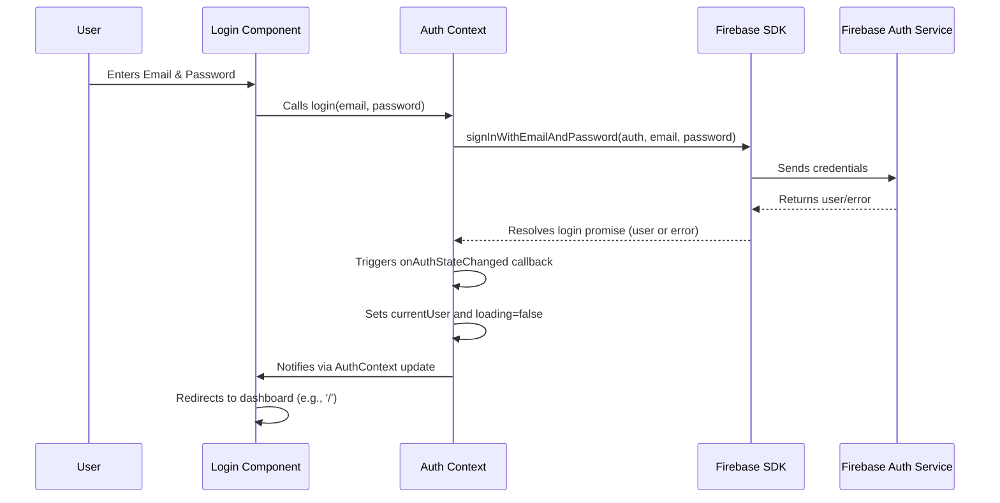

# Chapter 4: User Authentication Flow

Building upon our understanding of [Global State Management (React Contexts)](chapter_03.md), we now shift our focus to securing our HR application. Just as contexts provide a centralized mechanism to share data across components, they also offer an ideal pattern for managing something as critical as a user's authentication status, making it readily available wherever needed.

---

### Problem & Motivation

In any application dealing with sensitive information, especially an HR system managing employee data, unrestricted access is a significant security vulnerability. Without a proper authentication system, anyone could potentially view, modify, or delete crucial employee records, leave requests, or holiday schedules. This poses serious risks to data privacy, integrity, and compliance.

The core problem this chapter addresses is how to *identify* users, *verify* their credentials, and *control their access* to different parts of the application. For instance, an HR administrator should be able to log in to a secure dashboard to manage all employees, whereas an unauthenticated visitor should only see a login or public information page. Our motivation is to ensure that only authorized individuals can interact with the system's core functionalities, safeguarding sensitive HR data and maintaining a secure operational environment.

---

### Core Concept Explanation

User Authentication Flow refers to the complete process by which a user proves their identity to an application. In our `hr-app`, this flow encompasses several key stages: user registration (optional, but good practice), logging in, maintaining a session, and logging out. It is fundamental to securing the application and personalizing user experiences.

We leverage **Firebase Authentication** for its robust and easy-to-integrate solution, handling user management, secure password storage, and various sign-in methods. Combined with **React Context**, we create a global authentication state that informs all parts of our application about the current user's status – whether they are logged in, who they are, and if the authentication process is currently underway (e.g., while checking credentials). This allows us to protect routes, display user-specific information, and offer different functionalities based on the user's authenticated state. A key concept here is **Protected Routes**, which are components or pages that are only accessible if a user is authenticated.

---

### Practical Usage Examples

Let's see how we can set up an `AuthContext` to manage our user's authentication state and protect routes.

First, we define our `AuthContext` and an `AuthProvider` component that will wrap our entire application, providing the authentication state and methods.

```jsx
// src/context/AuthContext.js
import React, { createContext, useContext, useState, useEffect } from 'react';
import { auth } from '../firebaseConfig'; // Firebase instance from chapter 2

const AuthContext = createContext();

export const useAuth = () => useContext(AuthContext);

export const AuthProvider = ({ children }) => {
  const [currentUser, setCurrentUser] = useState(null);
  const [loading, setLoading] = useState(true);

  // ... (login/logout functions will go here)

  useEffect(() => {
    const unsubscribe = auth.onAuthStateChanged(user => {
      setCurrentUser(user);
      setLoading(false);
    });
    return unsubscribe;
  }, []);

  const value = {
    currentUser,
    loading,
    // login, logout functions
  };

  return (
    <AuthContext.Provider value={value}>
      {!loading && children}
    </AuthContext.Provider>
  );
};
```
*Explanation*: This code establishes our `AuthContext` and `AuthProvider`. The `AuthProvider` uses `auth.onAuthStateChanged` to listen for real-time changes in the user's authentication status from Firebase. It sets `currentUser` and manages a `loading` state to ensure our application doesn't render before Firebase has checked the user's session. The `useAuth` hook provides an easy way to access this context in any component.

Next, let's implement the actual login and logout functions within our `AuthProvider`.

```jsx
// src/context/AuthContext.js (continued)
import { signInWithEmailAndPassword, signOut } from 'firebase/auth'; // Import functions

// ... (previous imports and AuthContext setup)

export const AuthProvider = ({ children }) => {
  // ... (currentUser, loading state definitions)

  const login = (email, password) => {
    return signInWithEmailAndPassword(auth, email, password);
  };

  const logout = () => {
    return signOut(auth);
  };

  const value = {
    currentUser,
    loading,
    login,
    logout,
  };

  return (
    <AuthContext.Provider value={value}>
      {!loading && children}
    </AuthContext.Provider>
  );
};
```
*Explanation*: We've added `login` and `logout` functions to the context value. These functions directly use Firebase Authentication methods (`signInWithEmailAndPassword`, `signOut`) to interact with our backend. When a user logs in or out, `onAuthStateChanged` will detect the change and update `currentUser` automatically.

Now, let's create a simple login component that utilizes our `useAuth` hook.

```jsx
// src/components/Login.jsx
import React, { useRef, useState } from 'react';
import { useAuth } from '../context/AuthContext';
import { useNavigate } from 'react-router-dom'; // Assuming react-router-dom

function Login() {
  const emailRef = useRef();
  const passwordRef = useRef();
  const { login } = useAuth();
  const [error, setError] = useState('');
  const [loading, setLoading] = useState(false);
  const navigate = useNavigate();

  async function handleSubmit(e) {
    e.preventDefault();
    try {
      setError('');
      setLoading(true);
      await login(emailRef.current.value, passwordRef.current.value);
      navigate('/'); // Redirect to dashboard on success
    } catch {
      setError('Failed to log in');
    }
    setLoading(false);
  }

  return (
    <form onSubmit={handleSubmit}>
      <h2>Log In</h2>
      {error && <p style={{ color: 'red' }}>{error}</p>}
      <input type="email" ref={emailRef} placeholder="Email" required />
      <input type="password" ref={passwordRef} placeholder="Password" required />
      <button disabled={loading} type="submit">Log In</button>
    </form>
  );
}

export default Login;
```
*Explanation*: This `Login` component collects email and password, then calls the `login` function from `useAuth`. It handles loading states and displays errors, redirecting the user to the home page upon successful login.

Finally, we need a way to protect our routes. This is done with a `PrivateRoute` component.

```jsx
// src/components/PrivateRoute.jsx
import React from 'react';
import { Outlet, Navigate } from 'react-router-dom';
import { useAuth } from '../context/AuthContext';

const PrivateRoute = () => {
  const { currentUser, loading } = useAuth();

  if (loading) {
    return <div>Loading authentication...</div>;
  }

  return currentUser ? <Outlet /> : <Navigate to="/login" replace />;
};

export default PrivateRoute;
```
*Explanation*: The `PrivateRoute` component uses `useAuth` to check `currentUser`. If there's a user and not still loading, it renders the child components (`<Outlet />`). Otherwise, it redirects the unauthenticated user to the `/login` page, ensuring that only authenticated users can access the routes wrapped by this component.

---

### Internal Implementation Walkthrough

The `AuthContext` primarily manages the global authentication state using React's `useState` and `useEffect` hooks.

1.  **Initialization**: When the `AuthProvider` first mounts, `currentUser` is `null` and `loading` is `true`.
2.  **Firebase Listener**: A `useEffect` hook registers an `onAuthStateChanged` listener with Firebase. This listener is the heart of our authentication flow.
    *   Whenever the user's sign-in status changes (e.g., they log in, log out, or their session is automatically restored by Firebase), this listener is triggered.
    *   If a user is logged in, Firebase provides a `user` object, which we store in `currentUser`.
    *   If no user is logged in, `user` will be `null`.
    *   After the initial check (or any subsequent change), `setLoading(false)` is called, indicating that the authentication state has been determined.
3.  **`login` and `logout` Functions**: These functions wrap Firebase's SDK calls (`signInWithEmailAndPassword`, `signOut`). When these are called, Firebase handles the actual communication with its backend, performing authentication. Upon success or failure, the `onAuthStateChanged` listener is triggered, updating our `currentUser` state.
4.  **Context Provision**: The `AuthContext.Provider` makes `currentUser`, `loading`, `login`, and `logout` available to any descendant component that calls `useAuth()`.
5.  **Loading State Management**: The `{!loading && children}` conditional rendering ensures that the application doesn't try to render components that might rely on `currentUser` before Firebase has had a chance to confirm the user's authentication status. This prevents flickering or errors.

Here's a sequence diagram illustrating a user logging in:


*Explanation*: The user interacts with the `Login Component`. The component uses the `login` function provided by the `Auth Context`. This function then uses the Firebase SDK to authenticate with the Firebase Auth Service. Once Firebase responds, the `onAuthStateChanged` listener within the `Auth Context` updates the `currentUser` state, which in turn causes components using `useAuth` (like `Login Component`) to re-render or perform actions based on the new authentication status.

---

### System Integration

The User Authentication Flow is deeply integrated with other key abstractions in the `hr-app`:

*   **[Global State Management (React Contexts)](chapter_03.md)**: The `AuthContext` *is* a React Context, making the authentication state globally accessible. This is the primary integration point, allowing any component to quickly check `currentUser` or call `login`/`logout`.
*   **[Overall Application Layout & Navigation](chapter_05.md)**: The `PrivateRoute` component directly integrates with our routing setup (e.g., `react-router-dom`). It dictates which parts of the application are accessible based on authentication status. The main application layout will use this to render different navigation bars or views for authenticated vs. unauthenticated users.
    ```jsx
    // src/App.js (simplified routing)
    import { BrowserRouter as Router, Routes, Route } from 'react-router-dom';
    import { AuthProvider } from './context/AuthContext';
    import PrivateRoute from './components/PrivateRoute';
    import Login from './components/Login';
    import Dashboard from './pages/Dashboard';
    import Employees from './pages/Employees';

    function App() {
      return (
        <Router>
          <AuthProvider> {/* Wraps the entire application */}
            <Routes>
              {/* Public Routes */}
              <Route path="/login" element={<Login />} />

              {/* Protected Routes */}
              <Route element={<PrivateRoute />}>
                <Route path="/" element={<Dashboard />} />
                <Route path="/employees" element={<Employees />} />
              </Route>
            </Routes>
          </AuthProvider>
        </Router>
      );
    }
    export default App;
    ```
    *Explanation*: The `AuthProvider` wraps the entire router, ensuring all routes have access to the authentication context. The `PrivateRoute` component then acts as a gatekeeper for specific routes like `/` (Dashboard) and `/employees`.
*   **[Data Interaction Services](chapter_02.md)**: After a user logs in, their `currentUser` object often contains a unique `uid` (User ID) and potentially an authentication token. These can be used by our data interaction services to:
    *   Fetch user-specific data (e.g., an employee's personal leave requests).
    *   Implement Firebase Security Rules that restrict data access based on the `uid` of the authenticated user. For example, a service might only fetch `leaveRequests` where `requesterId` matches `auth.currentUser.uid`.

---

### Best Practices & Tips

*   **Handle Loading States Gracefully**: Always display a loading indicator while `loading` is `true` in your `AuthContext` to prevent UI flickering or errors from trying to render components before the auth state is known.
*   **Clear Error Messages**: Provide informative feedback to users if login or registration fails (e.g., "Invalid credentials", "Email already in use").
*   **Secure Firebase Rules**: While client-side protected routes prevent casual access, your Firebase Security Rules are the ultimate line of defense for your data. Ensure your rules only allow authenticated users (and specifically authorized users/roles) to read/write sensitive data.
*   **Separate Concerns**: Keep authentication logic (Firebase interactions) separate from UI components. The `AuthContext` pattern facilitates this by centralizing authentication logic.
*   **User Experience (UX)**: After successful login, redirect users to an appropriate dashboard or the page they initially tried to access. After logout, redirect to the login page or a public landing page.
*   **Password Security**: Never store user passwords directly in your client-side code. Firebase Authentication handles this securely for you.
*   **Environment Variables**: If you have any sensitive Firebase configurations beyond what's handled by typical setup, store them in environment variables (`.env` file) and never commit them to version control.

---

### Chapter Conclusion

This chapter has laid the essential groundwork for securing our `hr-app` by implementing a robust user authentication flow. We've explored how Firebase Authentication, combined with React Contexts, provides a powerful and flexible solution for managing user sessions, protecting application routes, and making authentication state globally available. By understanding the core concepts, implementing practical components like `Login` and `PrivateRoute`, and integrating them thoughtfully within our application structure, we've ensured that sensitive HR data remains accessible only to authorized personnel.

With a secure authentication system in place, we can now confidently build out the user interface and navigation, knowing that access to various parts of the application can be effectively controlled. In the next chapter, we will delve into the [Overall Application Layout & Navigation](chapter_05.md), designing how authenticated and unauthenticated users experience the structure and flow of the `hr-app`.