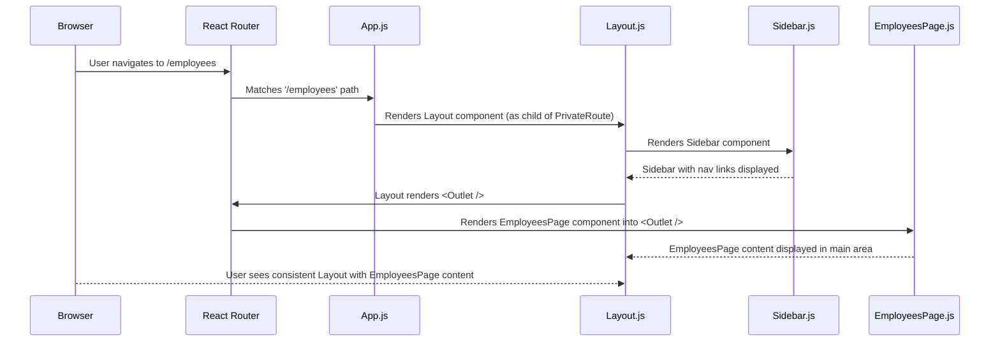

# Chapter 5: Overall Application Layout & Navigation

Building upon the robust [User Authentication Flow](chapter_04.md) we established, where users gain secure access to our HR application, the next crucial step is to define how they will interact with it visually and navigate through its various functionalities. Once a user is authenticated, they need a clear, consistent, and intuitive interface to manage employee data, leave requests, and holidays.

---

### Problem & Motivation

Imagine an application where every page has a different header, the navigation links are placed inconsistently, or common elements like a sidebar suddenly disappear. Such an experience would be disorienting, inefficient, and frustrating for users. Without a defined application layout, developers would also face the challenge of repeating common UI components (like a navigation menu or a header) on every single page, leading to redundant code, increased maintenance, and a higher chance of inconsistencies.

In the `hr-app`, this problem is particularly relevant. Once an HR administrator logs in, they need to quickly switch between viewing employee profiles, approving leave requests, and checking holiday schedules. If the primary navigation for these sections isn't consistently available, or if the main content area shifts unexpectedly, it would severely hinder their productivity and make the application difficult to learn and use. This abstraction solves the problem of UI fragmentation by providing a single, coherent wrapper for all authenticated application content.

---

### Core Concept Explanation

The **Overall Application Layout & Navigation** defines the fundamental skeletal structure of our `hr-app`'s user interface. Think of it as the building's blueprint: it specifies where the main entrance is, where the hallways run, and where the rooms (our individual pages) are located, but not the specific furniture or decor within each room. This concept primarily involves two key aspects:

1.  **Consistent Visual Structure**: This refers to the persistent elements that remain visible regardless of the specific page a user is on. For `hr-app`, this typically includes a sidebar for primary navigation, a top header (potentially displaying user information or quick actions), and a main content area that dynamically changes based on the user's route. This consistency provides a sense of place and reduces cognitive load.

2.  **Intuitive Navigation Experience**: This governs how users move between different sections or "pages" of the application. By integrating a well-defined navigation system (like a sidebar menu), users can easily discover and access all available features without getting lost. We achieve this by leveraging client-side routing, allowing for smooth transitions without full page reloads, making the application feel fast and responsive.

This structured approach ensures that our application maintains a professional appearance, is easy to learn, and provides a seamless user experience, acting as the consistent wrapper for all authenticated content within the application.

---

### Practical Usage Examples

To achieve a consistent layout and navigation in our React application, we typically create a `Layout` component that wraps the core application pages. This component includes shared UI elements like the sidebar and the main content area, where specific page components are rendered.

First, let's look at a simplified `App.js` that uses our `Layout` component. Notice how the `Layout` component conditionally renders based on authentication status (handled by the `AuthContext` from Chapter 3 and 4).

```javascript
// src/App.js (Simplified)
import React from 'react';
import { BrowserRouter as Router, Routes, Route, Navigate } from 'react-router-dom';
import { AuthProvider, useAuth } from './contexts/AuthContext'; // From Chapter 3
import Layout from './components/Layout/Layout';
import LoginPage from './pages/LoginPage'; // From Chapter 4

const PrivateRoute = ({ children }) => {
  const { currentUser } = useAuth();
  return currentUser ? children : <Navigate to="/login" />;
};

function AppContent() {
  return (
    <Routes>
      <Route path="/login" element={<LoginPage />} />
      <Route
        path="/*" // All other paths go through the Layout
        element={
          <PrivateRoute>
            <Layout />
          </PrivateRoute>
        }
      />
    </Routes>
  );
}

function App() {
  return (
    <Router>
      <AuthProvider> {/* Wraps the whole app with Auth context */}
        <AppContent />
      </AuthProvider>
    </Router>
  );
}

export default App;
```
*Explanation*: The `App` component sets up the `BrowserRouter` and `AuthProvider`. `AppContent` defines our routes. The `PrivateRoute` component ensures that only authenticated users can access routes wrapped by `Layout`. If not authenticated, they are redirected to `/login`. All authenticated routes will render within the `Layout` component.

Next, let's define a basic `Sidebar` component which will be part of our overall layout. This component would contain the primary navigation links.

```javascript
// src/components/Layout/Sidebar.js
import React from 'react';
import { NavLink } from 'react-router-dom';

const Sidebar = () => {
  return (
    <nav className="bg-gray-800 text-white w-64 p-4 min-h-screen">
      <h2 className="text-2xl font-bold mb-6">HR App</h2>
      <ul>
        <li>
          <NavLink to="/dashboard" className="block py-2.5 px-4 rounded transition duration-200 hover:bg-gray-700">
            Dashboard
          </NavLink>
        </li>
        <li>
          <NavLink to="/employees" className="block py-2.5 px-4 rounded transition duration-200 hover:bg-gray-700">
            Employees
          </NavLink>
        </li>
        <li>
          <NavLink to="/leave" className="block py-2.5 px-4 rounded transition duration-200 hover:bg-gray-700">
            Leave Requests
          </NavLink>
        </li>
        {/* ... more links */}
      </ul>
    </nav>
  );
};

export default Sidebar;
```
*Explanation*: The `Sidebar` component renders a simple navigation menu using `NavLink` from `react-router-dom`. `NavLink` automatically applies an active class to the currently selected link, providing visual feedback to the user.

Finally, we integrate the `Sidebar` into our main `Layout` component. This component also uses `Outlet` from `react-router-dom` to render nested routes, meaning our actual page content will appear here.

```javascript
// src/components/Layout/Layout.js
import React from 'react';
import { Outlet } from 'react-router-dom';
import Sidebar from './Sidebar';

const Layout = () => {
  return (
    <div className="flex min-h-screen bg-gray-100">
      <Sidebar />
      <div className="flex-1 flex flex-col">
        <header className="bg-white shadow p-4">
          <h1 className="text-xl font-semibold">Welcome to HR App!</h1>
          {/* User info, logout button, etc. can go here */}
        </header>
        <main className="p-6 flex-1">
          <Outlet /> {/* This is where nested page components will render */}
        </main>
      </div>
    </div>
  );
};

export default Layout;
```
*Explanation*: The `Layout` component defines the overall visual structure. It includes the `Sidebar` on the left, a `Header` at the top of the main content area, and a `<main>` tag containing `<Outlet />`. The `<Outlet />` component is a placeholder where React Router will render the specific child route component (e.g., `EmployeesPage`, `LeaveRequestsPage`) based on the current URL.

---

### Internal Implementation Walkthrough

The `Overall Application Layout & Navigation` in the `hr-app` is primarily implemented using React components and `react-router-dom` for client-side routing. Let's walk through how these pieces fit together:

1.  **Entry Point (`App.js`):** The `App.js` file acts as the root of our application. It wraps the entire application with `BrowserRouter` (for routing capabilities) and `AuthProvider` (for global authentication state). It then uses `Routes` to define different paths. Crucially, all authenticated routes are nested under a `PrivateRoute` component which in turn renders the `Layout` component. This ensures that the layout is only displayed after successful authentication.

2.  **The `Layout` Component (`src/components/Layout/Layout.js`):** This is the heart of our layout system.
    *   It defines a flexbox container (`div className="flex"` with `min-h-screen`) to visually arrange the sidebar and main content area side-by-side.
    *   It imports and renders the `Sidebar` component.
    *   It creates a separate flex column for the main content (`div className="flex-1 flex flex-col"`). This column typically contains a `Header` (for application-wide elements like a title or user dropdown) and the `main` content area.
    *   The `main` area hosts the `<Outlet />` component from `react-router-dom`. This is a critical piece: it tells `react-router-dom` *where* to render the child routes that are nested under the layout route.

3.  **The `Sidebar` Component (`src/components/Layout/Sidebar.js`):** This component is responsible for displaying the primary navigation links.
    *   It uses `NavLink` components from `react-router-dom`. `NavLink` is similar to `Link` but automatically adds an `active` class to the rendered element when its `to` prop matches the current URL. This is used for styling the currently active navigation item.
    *   Each `NavLink` points to a specific route within the application (e.g., `/employees`, `/leave`).

4.  **Routing Structure within `Layout`:** To make the `<Outlet />` functional, we need to define our routes in `App.js` such that they are children of the route that renders the `Layout` component.

    ```javascript
    // src/App.js (Route definitions snippet)
    // ...
    <Route
      path="/*" // All other paths after login
      element={
        <PrivateRoute>
          <Layout />
        </PrivateRoute>
      }
    >
      {/* Nested routes will render inside Layout's <Outlet /> */}
      <Route path="dashboard" element={<DashboardPage />} />
      <Route path="employees" element={<EmployeesPage />} />
      <Route path="employees/:id" element={<EmployeeDetailPage />} />
      <Route path="leave" element={<LeaveRequestsPage />} />
      <Route path="holidays" element={<HolidaysPage />} />
      <Route path="" element={<Navigate to="dashboard" replace />} /> {/* Default sub-route */}
      <Route path="*" element={<NotFoundPage />} /> {/* Catch-all for undefined sub-routes */}
    </Route>
    // ...
    ```
    *Explanation*: When a user navigates to `/employees`, the `Layout` component is rendered, and inside its `<Outlet />`, the `EmployeesPage` component will be displayed. The `Sidebar` remains constant, providing persistent navigation.

Here's a simplified sequence diagram illustrating the flow when an authenticated user navigates to a new page (e.g., `/employees`):



---

### System Integration

The `Overall Application Layout & Navigation` abstraction is a foundational layer that integrates with several other core concepts within the `hr-app`:

*   **[User Authentication Flow](chapter_04.md)**: This is the most direct integration. The layout and navigation components are typically rendered *only after* a user has successfully authenticated. The `PrivateRoute` component, utilizing the `useAuth` hook, conditionally renders the `Layout`. If `currentUser` (from `AuthContext`) is null, the user is redirected to the login page, preventing unauthorized access to the application's internal structure and data.

*   **[Global State Management (React Contexts)](chapter_03.md)**: The `AuthContext` (part of global state) is crucial for determining whether to display the authenticated layout or the login page. Furthermore, the `Layout` or its child `Header` component might consume other contexts (e.g., a `UserContext` to display the current user's name or avatar) or dispatch actions that update global state (e.g., a logout button).

*   **[Application Pages (Views)](chapter_06.md)**: The layout provides the consistent *container* for all application pages. Each individual page component (e.g., `EmployeesPage`, `LeaveRequestsPage`) is rendered within the `<Outlet />` of the `Layout`. The layout defines the surrounding structure, while the pages provide the specific content and functionality for a given route. This separation of concerns is fundamental for modularity and maintainability.

*   **[Data Models (Types)](chapter_01.md)** and **[Data Interaction Services](chapter_02.md)**: While the layout itself doesn't directly interact with data models or services, the pages rendered within it certainly do. The `Layout` provides the visual framework, but it's the specific pages that will use the defined data models and interaction services to fetch, display, and manipulate employee, leave, or holiday data.

This layering ensures that the application's structure, navigation, state, authentication, and data interactions are all interconnected in a predictable and manageable way, forming a cohesive whole.

---

### Best Practices & Tips

*   **Responsiveness:** Design your layout (Sidebar, Header, Main content) to be responsive. Use CSS frameworks (like Tailwind CSS used in examples) or media queries to adjust the layout for different screen sizes (e.g., collapse sidebar into a hamburger menu on mobile).
*   **Accessibility:** Ensure your navigation is accessible. Use semantic HTML elements (`<nav>`, `<ul>`, `<li>`, `<a>` or `NavLink`), provide proper ARIA attributes where necessary, and ensure keyboard navigation works correctly.
*   **Lazy Loading:** For larger applications, consider lazy loading your page components. This means pages are only loaded when they are needed, improving initial load times. `react-router-dom` supports this with `React.lazy()` and `Suspense`.

    ```javascript
    // Example of lazy loading a page
    import React, { Suspense, lazy } from 'react';
    import { Route } from 'react-router-dom';

    const EmployeesPage = lazy(() => import('../../pages/EmployeesPage'));

    // In your Routes definition:
    // <Route path="employees" element={
    //   <Suspense fallback={<div>Loading Employees...</div>}>
    //     <EmployeesPage />
    //   </Suspense>
    // } />
    ```
*   **Error Boundaries:** Wrap your `<Outlet />` or individual page components with React Error Boundaries to gracefully handle rendering errors within specific parts of the UI without crashing the entire application.
*   **Clear Visual Cues:** Ensure the active navigation item is clearly highlighted using `NavLink`'s active styling. This helps users understand their current location in the application.
*   **Separation of Concerns:** Keep your `Layout` component focused solely on the structural arrangement and generic elements. Avoid putting page-specific logic or heavy data fetching directly into the layout. Pages rendered via `Outlet` should handle their own data and specific UI.
*   **Consistent Styling:** Use a consistent styling methodology (e.g., Tailwind CSS, CSS Modules, Styled Components) across your layout and components to maintain a unified look and feel.

---

### Chapter Conclusion

This chapter has laid the essential groundwork for how users will visually interact with and navigate through the `hr-app`. By establishing a consistent `Layout` component and leveraging `react-router-dom` for navigation, we've created a coherent and intuitive user experience. The persistent sidebar and main content area ensure that users always know where they are and how to access different functionalities, solving the critical problem of UI fragmentation.

We've seen how the `Layout` integrates seamlessly with our [User Authentication Flow](chapter_04.md) to secure content and with [Global State Management (React Contexts)](chapter_03.md) to respond to authentication status. This structured approach not only enhances user experience but also greatly improves the maintainability and scalability of our React frontend.

With the application's overall structure and navigation firmly in place, we are now ready to populate the main content area with the specific functionalities and user interfaces. The next chapter will delve into the implementation of the individual **[Application Pages (Views)](chapter_06.md)**, which will fill the `<Outlet />` of our layout with dynamic and interactive components for managing employees, leave, and holidays.