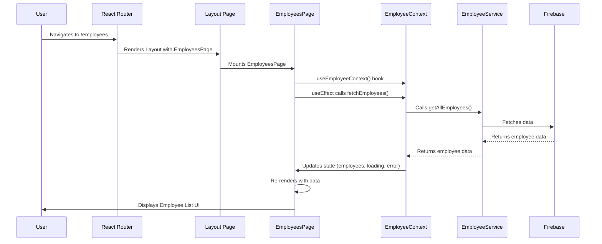

# Chapter 6: Application Pages (Views)

In the previous chapter, [Overall Application Layout & Navigation](chapter_05.md), we established the foundational structure of our HR application, including the consistent header, sidebar, and how users navigate between different sections. This layout provides the shell; now, we dive into the core content that fills that shell: the individual **Application Pages**, also known as Views. These pages are where the user's journey truly unfolds, presenting specific data and allowing direct interaction with the application's features.

---

### Problem & Motivation

Imagine building an HR application with dozens of features: viewing employee profiles, adding new hires, approving leave requests, and managing holiday schedules. Without a clear structure for these distinct functionalities, the codebase would quickly become a tangled mess of components, making it impossible to maintain, scale, or even understand. Where does the logic for displaying a list of employees live? How does it get the data, and how does it render it?

This is the problem that Application Pages solve. They act as dedicated containers for specific feature sets, providing a clear boundary for different sections of the application. For our `hr-app`, consider the task of displaying a list of all employees. We need a specific screen for this, where we can fetch employee data, present it in an organized manner (perhaps with search and filter options), and allow users to interact with individual employee records. This "Employees" screen is a perfect example of an application page, consolidating related UI and logic into a cohesive unit.

---

### Core Concept Explanation

Application Pages (or Views) are the top-level React components that correspond to distinct routes or screens in our `hr-app`. Unlike smaller, reusable UI components (like a `Button` or `Input` field), pages are typically responsible for:

1.  **Orchestration**: They assemble various smaller UI components to form a complete screen.
2.  **Data Fetching/Consumption**: Pages often interact directly with [Global State Management (React Contexts)](chapter_03.md) to retrieve application-wide data (like employee lists, user authentication status, or system settings) and to trigger actions that modify this state.
3.  **Layout Integration**: They render *within* the overall application layout defined in [Overall Application Layout & Navigation](chapter_05.md).
4.  **Handling Page-Specific Logic**: While complex business logic should be delegated, pages might contain logic specific to their screen, such as managing local UI state (e.g., form input values before submission, filter criteria) or handling navigation events.

Think of an application page as a director of a play. It doesn't perform all the acting itself; instead, it coordinates the actors (smaller components), tells them when to appear, and provides them with the script (data) they need to deliver their lines (render UI) effectively. Each page represents a distinct "scene" in our HR application, focused on a particular user goal or feature.

---

### Practical Usage Examples

Let's illustrate how a typical application page, like our `EmployeesPage`, brings together concepts from previous chapters. This page will display a list of employees, leveraging our `EmployeeContext` for data.

#### 1. Creating a Basic Page Component

An application page is essentially a React functional component. It's often placed in a `src/pages` directory.

```jsx
// src/pages/EmployeesPage.jsx
import React from 'react';

const EmployeesPage = () => {
  return (
    <div>
      <h2>Employee Directory</h2>
      {/* Employee list will go here */}
    </div>
  );
};

export default EmployeesPage;
```
*Explanation*: This simple component `EmployeesPage` is the foundation. It provides a heading for our employee directory, setting the stage for more content.

#### 2. Consuming Global State (Employee Context)

Our page needs to fetch employee data. We'll use the `useEmployeeContext` hook we learned about in [Global State Management (React Contexts)](chapter_03.md).

```jsx
// src/pages/EmployeesPage.jsx
import React, { useEffect } from 'react';
import { useEmployeeContext } from '../contexts/EmployeeContext'; // From chapter 3

const EmployeesPage = () => {
  const { employees, fetchEmployees, loading, error } = useEmployeeContext();

  useEffect(() => {
    fetchEmployees(); // Trigger data fetch on component mount
  }, [fetchEmployees]); // Dependency array to ensure effect runs once

  if (loading) return <p>Loading employees...</p>;
  if (error) return <p>Error: {error.message}</p>;

  return (
    <div>
      <h2>Employee Directory</h2>
      {/* Map through employees and render them */}
    </div>
  );
};

export default EmployeesPage;
```
*Explanation*: We import `useEmployeeContext` to access `employees`, `fetchEmployees`, `loading`, and `error` from our global state. The `useEffect` hook ensures that `fetchEmployees` is called when the page first loads, initiating the data retrieval process. We also handle loading and error states for a better user experience.

#### 3. Rendering Sub-Components

Now, let's render the actual employee list using a hypothetical `EmployeeCard` component.

```jsx
// src/pages/EmployeesPage.jsx
import React, { useEffect } from 'react';
import { useEmployeeContext } from '../contexts/EmployeeContext';
import EmployeeCard from '../components/EmployeeCard'; // A smaller UI component

const EmployeesPage = () => {
  const { employees, fetchEmployees, loading, error } = useEmployeeContext();

  useEffect(() => {
    fetchEmployees();
  }, [fetchEmployees]);

  if (loading) return <p>Loading employees...</p>;
  if (error) return <p>Error: {error.message}</p>;

  return (
    <div>
      <h2>Employee Directory</h2>
      <div className="employee-list">
        {employees.map(employee => (
          <EmployeeCard key={employee.id} employee={employee} />
        ))}
      </div>
    </div>
  );
};

export default EmployeesPage;
```
*Explanation*: After fetching, we iterate over the `employees` array and render an `EmployeeCard` for each employee. This demonstrates how pages compose smaller, focused UI components to build a complete view. The `EmployeeCard` itself would be responsible for displaying an individual employee's details based on the [Data Models (Types)](chapter_01.md).

---

### Internal Implementation Walkthrough

At its core, an application page in a React application is a component that acts as an entry point for a specific route. When a user navigates to a URL associated with a page, the React Router (as set up in [Overall Application Layout & Navigation](chapter_05.md)) renders that page component.

Let's trace the flow for our `EmployeesPage`:

1.  **User Navigation**: The user clicks a link in the sidebar (e.g., "Employees").
2.  **Router Match**: The application's router ([Overall Application Layout & Navigation](chapter_05.md)) matches the URL (e.g., `/employees`) to the `EmployeesPage` component.
3.  **Page Mounts**: The `EmployeesPage` component is mounted within the main content area of the application's `Layout`.
4.  **Context Consumption**: Inside `EmployeesPage`, the `useEmployeeContext()` hook is called, providing access to the global employee state and actions.
5.  **Data Fetch Trigger**: The `useEffect` hook within `EmployeesPage` calls `fetchEmployees()` from the context.
6.  **Service Interaction**: The `fetchEmployees` action (defined in `EmployeeContext`) dispatches an action and internally calls `employeeService.getAllEmployees()` ([Data Interaction Services](chapter_02.md)) to communicate with Firebase.
7.  **State Update**: As data is fetched, the `EmployeeContext` updates its internal state (`loading`, `employees`, `error`).
8.  **Page Re-renders**: Due to context state changes, `EmployeesPage` (and any other components consuming `EmployeeContext`) re-renders.
9.  **UI Display**: The page now displays the fetched `employees` by mapping over them and rendering `EmployeeCard` components.

Here's a simplified sequence diagram illustrating this interaction:


*Explanation*: This diagram shows how a user's action triggers a chain of events, starting from navigation, involving the React Router, the main layout, the `EmployeesPage`, the `EmployeeContext` for state management, the `EmployeeService` for backend interaction, and finally Firebase for data. The `EmployeesPage` acts as the orchestrator for this entire process from the UI perspective.

---

### System Integration

Application Pages are the central hub where all other abstractions converge to form a functional user interface.

*   **[Overall Application Layout & Navigation](chapter_05.md)**: Pages are rendered *within* the main `Layout` component. The `React Router` from this chapter determines which page to render based on the URL.
*   **[Global State Management (React Contexts)](chapter_03.md)**: Pages are primary consumers of contexts. They use `useContext` hooks to access shared state (e.g., `authState`, `employeeState`) and dispatch actions to modify that state (e.g., `login`, `fetchEmployees`).
*   **[Data Interaction Services](chapter_02.md)**: While pages typically don't directly call services, they trigger actions in contexts which, in turn, utilize these services to interact with Firebase. This ensures a clean separation of concerns.
*   **[Data Models (Types)](chapter_01.md)**: The data displayed by pages (e.g., employee objects, leave requests) strictly adheres to the types defined in our data models, ensuring consistency and type safety throughout the application.
*   **[User Authentication Flow](chapter_04.md)**: Pages often depend on the authentication state. Protected routes, configured in the navigation flow, prevent unauthenticated users from accessing certain pages. Inside pages, the `useAuthContext` hook allows displaying user-specific information or conditional UI.

This intricate web of connections ensures that our `hr-app` is modular, maintainable, and scalable.

---

### Best Practices & Tips

1.  **Keep Pages Thin**: Pages should primarily act as orchestrators. Avoid embedding complex business logic directly within page components. Delegate logic to custom hooks, smaller components, or utility functions.
2.  **Focus on Data Consumption and UI Composition**: A page's main job is to consume data from global state (contexts) or props and then arrange smaller, more focused UI components to present that data.
3.  **Lazy Loading Pages**: For larger applications, consider using React's `React.lazy()` and `Suspense` for code-splitting pages. This can significantly improve initial load times by only loading the JavaScript for a page when it's actually needed.

    ```jsx
    // src/AppRoutes.jsx (example from chapter 5)
    import React, { Suspense, lazy } from 'react';
    import { Routes, Route } from 'react-router-dom';
    import MainLayout from './layout/MainLayout';
    // ... other imports

    const LazyDashboardPage = lazy(() => import('./pages/DashboardPage'));
    const LazyEmployeesPage = lazy(() => import('./pages/EmployeesPage'));

    const AppRoutes = () => (
      <Routes>
        <Route path="/" element={<MainLayout />}>
          <Route index element={
            <Suspense fallback={<div>Loading Dashboard...</div>}>
              <LazyDashboardPage />
            </Suspense>
          } />
          <Route path="employees" element={
            <Suspense fallback={<div>Loading Employees...</div>}>
              <LazyEmployeesPage />
            </Suspense>
          } />
          {/* ... other routes */}
        </Route>
      </Routes>
    );
    export default AppRoutes;
    ```
    *Explanation*: `React.lazy()` allows us to define a dynamic import for components. When the route is matched, `Suspense` displays a fallback while the component's code chunk is being downloaded.

4.  **Error Boundaries**: Wrap your page components (or sections of them) with React Error Boundaries. This prevents UI crashes in one part of the application from bringing down the entire application.

    ```jsx
    // src/components/ErrorBoundary.jsx (example)
    import React from 'react';

    class ErrorBoundary extends React.Component {
      constructor(props) {
        super(props);
        this.state = { hasError: false, error: null, errorInfo: null };
      }

      static getDerivedStateFromError(error) {
        return { hasError: true };
      }

      componentDidCatch(error, errorInfo) {
        console.error("ErrorBoundary caught an error:", error, errorInfo);
        this.setState({ error, errorInfo });
      }

      render() {
        if (this.state.hasError) {
          return (
            <div style={{ padding: '20px', border: '1px solid red', color: 'red' }}>
              <h2>Something went wrong in this section.</h2>
              <details style={{ whiteSpace: 'pre-wrap' }}>
                {this.state.error && this.state.error.toString()}
                <br />
                {this.state.errorInfo && this.state.errorInfo.componentStack}
              </details>
            </div>
          );
        }
        return this.props.children;
      }
    }
    export default ErrorBoundary;
    ```
    ```jsx
    // src/pages/EmployeesPage.jsx (usage)
    import React from 'react';
    import ErrorBoundary from '../components/ErrorBoundary'; // Assuming you made one

    const EmployeesPage = () => {
      // ... page logic
      return (
        <ErrorBoundary> {/* Wrap the content that might fail */}
          <div>
            <h2>Employee Directory</h2>
            {/* ... rest of the page content */}
          </div>
        </ErrorBoundary>
      );
    };
    export default EmployeesPage;
    ```
    *Explanation*: The `ErrorBoundary` component catches JavaScript errors in its child component tree. If an error occurs, it renders a fallback UI instead of crashing the entire application, providing a more robust user experience.

---

### Chapter Conclusion

This chapter, "Application Pages (Views)," marks the culmination of our documentation journey for the `hr-app`. We've moved from defining the fundamental data structures in [Data Models (Types)](chapter_01.md) and creating robust [Data Interaction Services](chapter_02.md) to managing global application state with [Global State Management (React Contexts)](chapter_03.md) and securing access through the [User Authentication Flow](chapter_04.md). We then designed a consistent user experience with [Overall Application Layout & Navigation](chapter_05.md).

Finally, in this chapter, we brought all these pieces together. Application pages are the user-facing manifestation of our entire architecture. They serve as the orchestrators, integrating data, state, and UI components to deliver the rich, dynamic experience of the `hr-app`. By understanding how pages consume global state, render sub-components, and fit within the overall navigation, you now have a complete picture of how the `hr-app` is structured from data to user interface.

This documentation has covered all the essential building blocks and their interconnections, providing a comprehensive guide for anyone looking to understand, develop, and maintain the `hr-app`.