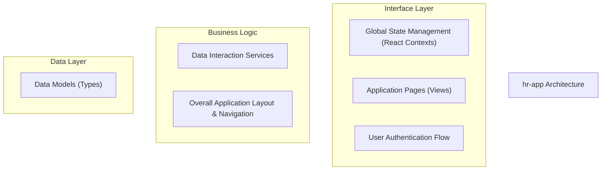
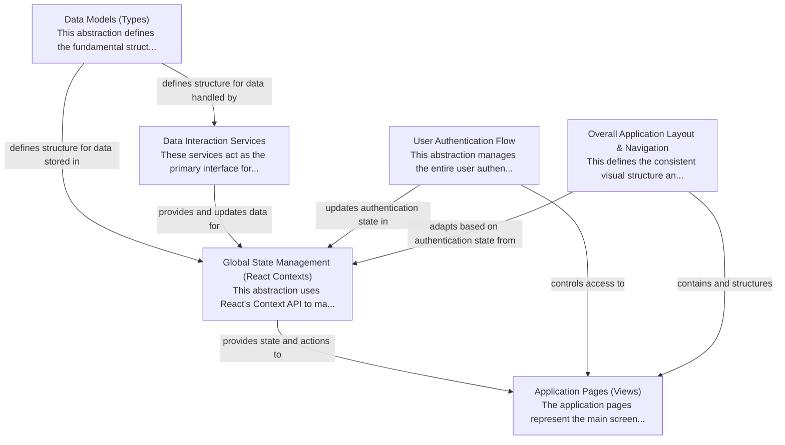

# hr-app Tutorial

Welcome to the comprehensive tutorial for hr-app. This tutorial is automatically generated from the codebase to help you understand the core concepts and implementation patterns.

## Project Overview

This HR application is a React-based frontend designed to manage employee data, leave requests, and holidays. 
It leverages Firebase for backend data persistence and utilizes React Contexts for centralized state management, 
ensuring a structured approach to data interaction and dynamic user interface rendering across its various pages.

## System Architecture

## Component Relationships

## Table of Contents

1. [Chapter 1: Data Models (Types)](chapter_01.md) - Comprehensive documentation for Data Models (Types) following structured methodology...
2. [Chapter 2: Data Interaction Services](chapter_02.md) - Comprehensive documentation for Data Interaction Services following structured methodology...
3. [Chapter 3: Global State Management (React Contexts)](chapter_03.md) - Comprehensive documentation for Global State Management (React Contexts) following structured method...
4. [Chapter 4: User Authentication Flow](chapter_04.md) - Comprehensive documentation for User Authentication Flow following structured methodology...
5. [Chapter 5: Overall Application Layout & Navigation](chapter_05.md) - Comprehensive documentation for Overall Application Layout & Navigation following structured methodo...
6. [Chapter 6: Application Pages (Views)](chapter_06.md) - Comprehensive documentation for Application Pages (Views) following structured methodology...

## How to Use This Tutorial

1. **Start with Chapter 1** to understand the foundational concepts
2. **Follow the sequence** - each chapter builds upon previous concepts
3. **Practice with code examples** - every chapter includes practical examples
4. **Refer to diagrams** - use architecture diagrams for visual understanding
5. **Cross-reference concepts** - chapters link to related topics

## Tutorial Features

- **Progressive Learning**: Concepts are introduced in logical order
- **Code Examples**: Every chapter includes practical, executable code
- **Visual Diagrams**: Mermaid diagrams illustrate complex relationships
- **Cross-References**: Easy navigation between related concepts
- **Beginner-Friendly**: Written for newcomers to the codebase

## Contributing

This tutorial is auto-generated from the codebase. To improve it:
1. Update the source code documentation
2. Add more detailed comments to key functions
3. Regenerate the tutorial using the documentation system

---

*Generated using AI-powered codebase analysis*
