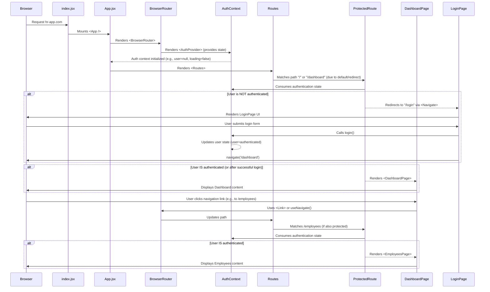

# Chapter 7: Application Entry and Routing

In the preceding chapter, we thoroughly explored [User Authentication](chapter_06.md), detailing how users log into the `hr-app`, maintain their sessions, and secure access to sensitive features. While authentication determines *who* can access the application, the logical next step is to define *how* they navigate once inside, and *where* the application begins its journey. This chapter, "Application Entry and Routing," bridges the gap between a user gaining access and their interaction with the various parts of our HR system.

---

### Problem & Motivation

Imagine opening a complex book without a table of contents or distinct chapters. You wouldn't know where to start, or how to find the specific information you need. Similarly, a web application without a clear entry point and a robust navigation system is chaotic. Users would be lost, unable to move between the employee directory, leave request forms, or the administrative dashboard.

For the `hr-app`, this problem is critical. We need a defined starting point for our React application (the *Application Entry*) and a seamless way for users to traverse its many [Application Views (Pages)](chapter_05.md), such as `/dashboard`, `/employees`, or `/leaves`, without disruptive full-page reloads. Furthermore, as established in [User Authentication](chapter_06.md), certain paths, like `/dashboard`, should only be accessible to authenticated users, while `/login` should be the default for unauthenticated visitors.

Consider a concrete use case: A user visits `hr-app.com`. If they are not logged in, the application should automatically redirect them to `hr-app.com/login`. Once they successfully log in, they should be navigated to `hr-app.com/dashboard`. From there, clicking a "View Employees" link should smoothly transition them to `hr-app.com/employees`. This entire flow, from initial load to internal navigation, is orchestrated by the application's entry point and routing system.

---

### Core Concept Explanation

The "Application Entry and Routing" abstraction has two primary facets. **Application Entry** refers to the very first point where our React application is initialized and mounted into the web browser's Document Object Model (DOM). This is typically a single JavaScript file that serves as the root of the entire application.

**Routing**, on the other hand, is the mechanism by which the application presents different [Application Views (Pages)](chapter_05.md) to the user based on the URL in the browser's address bar. In a Single Page Application (SPA) like the `hr-app`, routing handles these URL changes without requesting an entirely new HTML page from the server. Instead, it dynamically swaps out React components, providing a fast and fluid user experience. This means when a user navigates from `/dashboard` to `/employees`, only the content area of the page updates, not the entire page.

Key terminology often associated with routing includes:
- **Router**: The main component that enables client-side routing.
- **Routes**: A collection of individual route definitions.
- **Route**: A single path-to-component mapping (e.g., `/dashboard` maps to `DashboardPage`).
- **Link**: A component used for declarative navigation, typically rendered as an `<a>` tag.
- **`useNavigate` Hook**: A React hook for programmatic navigation (e.g., redirecting after login).
- **Protected Routes**: Routes that require specific conditions (like authentication) to be met before access is granted.

In React applications, libraries like `React Router DOM` are the standard tools for implementing this sophisticated navigation behavior, bringing our [Application Views (Pages)](chapter_05.md) to life through intuitive URL structures.

---

### Practical Usage Examples

Let's illustrate how application entry and routing come together to solve our motivating use case: guiding users based on their authentication status.

#### 1. Application Entry Point (`index.jsx`)

The very first step is to initialize our React application. This `index.jsx` file is where `hr-app` begins.

```jsx
// src/index.jsx
import React from 'react';
import ReactDOM from 'react-dom/client';
import App from './App';
import './index.css'; // Global styles

ReactDOM.createRoot(document.getElementById('root')).render(
  <React.StrictMode>
    <App />
  </React.StrictMode>,
);
```
This code creates the root of our React application, linking it to an HTML element with the ID 'root' (typically found in `public/index.html`). It then renders our main `App` component within `React.StrictMode` for development checks.

#### 2. Setting Up the Router (`App.jsx`)

The `App.jsx` component is where we typically configure our main router and define the top-level routes. We'll use `BrowserRouter` from `react-router-dom`.

```jsx
// src/App.jsx
import { BrowserRouter, Routes, Route, Navigate } from 'react-router-dom';
import { AuthProvider } from './contexts/AuthContext'; // Chapter 3
import { LoginPage } from './pages/LoginPage'; // Chapter 5
import { DashboardPage } from './pages/DashboardPage';
import { ProtectedRoute } from './components/ProtectedRoute'; // Custom component

function App() {
  return (
    <BrowserRouter>
      <AuthProvider> {/* Provides auth state globally */}
        <Routes>
          <Route path="/login" element={<LoginPage />} />
          <Route 
            path="/dashboard" 
            element={
              <ProtectedRoute>
                <DashboardPage />
              </ProtectedRoute>
            } 
          />
          {/* Default route / Redirect unauthenticated users to login */}
          <Route path="*" element={<Navigate to="/dashboard" replace />} />
        </Routes>
      </AuthProvider>
    </BrowserRouter>
  );
}
export default App;
```
Here, `BrowserRouter` wraps our entire application, enabling routing. `AuthProvider` (from [Global State Management (Contexts)](chapter_03.md)) is placed inside so all routes and components can access authentication status. We define specific `Route`s for `/login` and `/dashboard`. The `ProtectedRoute` component is key for enforcing access control. The `*` path acts as a catch-all, redirecting any unmatched paths to `/dashboard`.

#### 3. Implementing a Protected Route

The `ProtectedRoute` component ensures that only authenticated users can access certain routes. It leverages the authentication state provided by our `AuthContext`.

```jsx
// src/components/ProtectedRoute.jsx
import React, { useContext } from 'react';
import { Navigate } from 'react-router-dom';
import { AuthContext } from '../contexts/AuthContext'; // Chapter 3

export const ProtectedRoute = ({ children }) => {
  const { user, loading } = useContext(AuthContext);

  if (loading) {
    return <div>Loading authentication...</div>; // Or a spinner
  }

  if (!user) {
    // If not authenticated, redirect to the login page
    return <Navigate to="/login" replace />;
  }

  return children; // If authenticated, render the child components (the protected page)
};
```
This `ProtectedRoute` component checks the `user` state from `AuthContext`. If `user` is null (meaning not authenticated), it uses `Navigate` to redirect to `/login`. Otherwise, it renders the `children` prop, which is the actual page component (e.g., `DashboardPage`) that needs protection.

#### 4. Navigating Programmatically (`LoginPage.jsx`)

After a successful login, we need to programmatically redirect the user to the dashboard.

```jsx
// src/pages/LoginPage.jsx (simplified)
import React, { useContext } from 'react';
import { useNavigate } from 'react-router-dom';
import { AuthContext } from '../contexts/AuthContext'; // Chapter 3

export const LoginPage = () => {
  const { login } = useContext(AuthContext);
  const navigate = useNavigate();

  const handleSubmit = async (event) => {
    event.preventDefault();
    // Assume username/password are collected
    await login('test@example.com', 'password123'); // From AuthContext
    navigate('/dashboard'); // Programmatic navigation
  };

  return (
    <form onSubmit={handleSubmit}>
      {/* Input fields for username, password */}
      <button type="submit">Log In</button>
    </form>
  );
};
```
In the `LoginPage`, once the `login` function from `AuthContext` (from [User Authentication](chapter_06.md)) successfully completes, the `useNavigate` hook is used to send the user to the `/dashboard` path, completing our use case flow.

---

### Internal Implementation Walkthrough

The "Application Entry and Routing" system in `hr-app` orchestrates a seamless user experience by defining how the application starts and how users navigate. This walkthrough explains the internal flow.

1.  **Application Bootstrapping (`index.jsx`):** The process begins with `src/index.jsx`. This file imports `React` and `ReactDOM`, and is responsible for mounting the root `App` component into the `root` DOM element in `public/index.html`. This is the single entry point for the entire React application.

2.  **Router Initialization (`App.jsx`):** Inside `src/App.jsx`, the `BrowserRouter` component from `react-router-dom` is rendered at the top level. This component uses the HTML5 history API to keep your UI in sync with the URL. It enables client-side routing for all components wrapped within it.

3.  **Global State (`AuthProvider`):** Crucially, the `AuthProvider` (from [Global State Management (Contexts)](chapter_03.md)) is nested immediately inside `BrowserRouter`. This ensures that all components, including our routing logic and protected routes, have access to the global authentication state (e.g., `isAuthenticated`, `user`, `loading`).

4.  **Route Definition (`Routes` and `Route`):** The `Routes` component acts as a container for all individual `Route` definitions. Each `Route` maps a specific `path` (like `/login` or `/dashboard`) to a corresponding [Application View (Pages)](chapter_05.md) component (e.g., `LoginPage` or `DashboardPage`).

5.  **Protected Route Logic (`ProtectedRoute`):** For routes like `/dashboard`, we wrap the target page component (`DashboardPage`) within our custom `ProtectedRoute` component. This component is where access control logic lives.
    *   It uses `useContext(AuthContext)` to retrieve the current authentication status (`user`, `loading`) from the global state.
    *   If `loading` is true, it displays a loading indicator.
    *   If `user` is null (meaning the user is not authenticated), it programmatically redirects the user to the `/login` page using the `Navigate` component.
    *   If `user` is present, it renders its `children`, which is the actual protected page component.

6.  **Navigation (`Link` and `useNavigate`):**
    *   `Link` components (e.g., in a navigation bar) are used for declarative navigation, generating `<a>` tags that handle routing internally without full page reloads.
    *   The `useNavigate` hook (e.g., in `LoginPage`) allows for imperative, programmatic navigation, typically used after actions like form submissions or API calls.

Here's a sequence diagram illustrating the initial load and navigation for a protected route:



---

### System Integration

The "Application Entry and Routing" system acts as the central coordinator, connecting several other core abstractions within the `hr-app`:

-   **[Global State Management (Contexts)](chapter_03.md):** The `AuthContext` is inextricably linked with routing, especially for `ProtectedRoute` components. The routing system relies on the global authentication state to determine whether a user can access a particular route or if they need to be redirected. Other contexts (e.g., for user roles) could also be used to create more granular route protection.

-   **[Application Views (Pages)](chapter_05.md):** These are the ultimate destinations for our routes. Each `Route` component typically points to a specific Page component (e.g., `DashboardPage`, `EmployeesPage`, `LeaveRequestPage`). The router's job is to load and display the correct page based on the URL.

-   **[User Interface Components](chapter_04.md):** Many UI components, especially navigation elements like sidebars, headers, and buttons, will use routing primitives such as `Link` components to enable user navigation. For example, a `Sidebar` component will have `Link`s to `/dashboard`, `/employees`, and `/leaves`.

-   **[User Authentication](chapter_06.md):** This abstraction directly informs the routing decisions. The `isAuthenticated` status, managed by the authentication system, is consumed by `ProtectedRoute` to protect routes, ensuring that only logged-in users can access authorized sections of the application. Furthermore, successful logins and logouts often trigger programmatic redirects using `useNavigate`.

The data flow is clear: the authentication state (from [Global State Management (Contexts)](chapter_03.md) and [User Authentication](chapter_06.md)) dictates what routes are accessible. The routing system then uses this information to display the appropriate [Application Views (Pages)](chapter_05.md) by dynamically rendering components, which are often composed of various [User Interface Components](chapter_04.md).

---

### Best Practices & Tips

Implementing application entry and routing effectively is crucial for a smooth user experience and maintainable codebase.

1.  **Centralize Route Definitions:** Define all your routes in a single, well-organized file (e.g., `App.jsx` or a dedicated `routes.js`). This makes it easier to understand the application's structure and manage changes.
2.  **Use Meaningful Paths:** Choose descriptive and user-friendly URL paths (e.g., `/employees` instead of `/users`, `/leave-requests` instead of `/leaves`). This improves SEO and user comprehension.
3.  **Implement a 404 (Not Found) Page:** Always include a catch-all route (`<Route path="*" element={<NotFoundPage />} />`) as the last route definition to handle URLs that don't match any defined path. This prevents users from seeing a blank screen.
4.  **Leverage Nested Routes for Layouts:** For complex layouts where parts of the UI remain constant while inner content changes (e.g., a dashboard with a consistent sidebar but changing main content), use nested routes. This avoids prop drilling and keeps components modular.
5.  **Programmatic vs. Declarative Navigation:** Use `Link` for standard UI navigation (e.g., buttons, menu items) as it's more declarative. Reserve `useNavigate` for programmatic redirects, typically after actions like form submissions or API calls.
6.  **Handle Authentication Redirects Gracefully:** Ensure that after a user logs in or logs out, they are redirected to an appropriate page (`/dashboard` after login, `/login` after logout). The `ProtectedRoute` component is a great way to manage this for route access.
7.  **Optimize Performance for Large Applications:** For very large applications with many routes and components, consider lazy loading routes using `React.lazy()` and `Suspense`. This can reduce the initial bundle size and speed up page load times by only loading code for the routes a user actually visits.
8.  **Avoid Deep Nesting of `AuthContext`:** While `AuthContext` needs to wrap the `Routes`, avoid nesting it too deeply within specific components if its purpose is global authentication. Placing it high up (e.g., in `App.jsx`) ensures maximum availability without performance penalties.

---

### Chapter Conclusion

This chapter on "Application Entry and Routing" has illuminated how the `hr-app` begins its execution and how users seamlessly navigate its various sections. We've seen how `index.jsx` serves as the initial entry point, launching our React application, and how `React Router DOM` provides the robust framework for defining pathways, handling URL changes, and dynamically rendering distinct [Application Views (Pages)](chapter_05.md).

Crucially, we integrated our routing logic with [User Authentication](chapter_06.md) through the `ProtectedRoute` component, demonstrating how global state from [Global State Management (Contexts)](chapter_03.md) dictates access to specific parts of the application. This synergy ensures that `hr-app` is not only functional and user-friendly but also secure, guiding users to the right content based on their identity and permissions.

With a clear understanding of application entry and routing, we've now assembled all the fundamental pieces of the `hr-app`. From basic data structures and backend services to global state, UI components, pages, and authentication, this chapter ties everything together, providing a complete picture of the application's architecture and flow. The `hr-app` is now fully conceptualized, from its deepest data models to its user-facing navigation system.