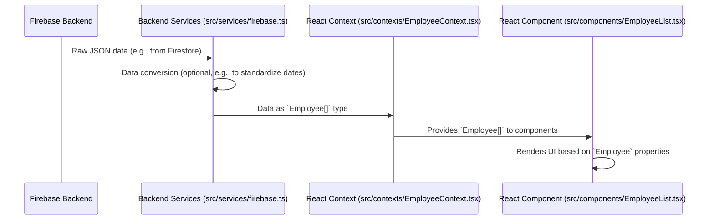

# Chapter 2: Data Models (Types)

Welcome back! In the [Authentication System](chapter_01.md), we established a secure foundation, ensuring only authorized users can access our HR application. Now that we know *who* can use the system, the next crucial step is to define *what kind of information* they will be interacting with. This leads us directly into understanding Data Models, which are the blueprints for all the data in our `hr-app`.

---

### Problem & Motivation

Imagine building an HR application without a clear definition of what an "employee" is. Does an employee have a first name, a last name, an ID, a department? What about their salary, or their hire date? Without these structures, developers might store inconsistent data, leading to bugs, confusion, and a brittle application that's hard to maintain. For instance, one part of the app might expect `firstName`, while another expects `first_name`, creating data retrieval and display errors.

In our `hr-app`, we need to manage employees and their leave requests. This requires a consistent way to represent an `Employee` with their personal details, job information, and unique identifier. Similarly, a `LeaveRequest` needs to define who requested it, what dates are involved, and its current status. Without these agreed-upon structures, managing HR data would be chaotic, making it impossible to build reliable features like listing employees, approving leaves, or generating reports. Data models solve this by providing a single source of truth for our data's shape.

---

### Core Concept Explanation

Data models, often represented as "types" or "interfaces" in TypeScript, are essentially contracts that define the structure and properties of the data we'll use throughout our application. Think of them like a blueprint for a house: it specifies how many rooms there are, where the doors and windows go, and what materials are used. The house (your data) must conform to this blueprint (your data model).

In the context of our React `hr-app`, using TypeScript for data models brings immense benefits. TypeScript allows us to define these structures explicitly, providing static type checking during development. This means the compiler can catch common data-related errors *before* the code even runs, greatly reducing bugs and improving code quality. For example, if you try to access a property that doesn't exist on an `Employee` object, TypeScript will immediately warn you.

These types ensure that every part of our application — from the components displaying employee lists to the functions interacting with our Firebase backend — understands and expects data in the same format. This consistency makes the codebase more predictable, easier to read, and simpler to extend. It acts as a universal language for our data, making collaboration smoother and development faster.

---

### Practical Usage Examples

Let's look at the foundational types for our `hr-app`: `Employee` and `LeaveRequest`. These interfaces will dictate the structure of data we fetch from Firebase and display in our UI.

We'll typically define these in a central location, like `src/types/index.ts`.

```typescript
// src/types/index.ts

export interface Employee {
  id: string;
  firstName: string;
  lastName: string;
  email: string;
  department: string;
  position: string;
  hireDate: string; // ISO date string, e.g., '2023-01-15'
  status: 'active' | 'on_leave' | 'terminated';
}
```
*Explanation*: This `Employee` interface defines the core properties every employee object must have. The `id` is crucial for Firebase, `firstName` and `lastName` for identification, and other fields for HR management. Notice the `status` uses a "union type" to restrict its values to a predefined set.

Now, for `LeaveRequest`:

```typescript
// src/types/index.ts (continued)

export interface LeaveRequest {
  id: string;
  employeeId: string;
  startDate: string; // ISO date string
  endDate: string;   // ISO date string
  type: 'vacation' | 'sick' | 'personal';
  status: 'pending' | 'approved' | 'rejected';
  reason?: string; // The '?' makes this property optional
  requestedAt: string; // Timestamp of request
}
```
*Explanation*: The `LeaveRequest` interface specifies details for a leave application. It links to an `employeeId`, defines the dates and type of leave, its status, and includes an optional `reason` field. `requestedAt` stores when the request was made.

Here's how you might create an object conforming to the `Employee` type:

```typescript
import { Employee } from '../types'; // Assuming this file is in src/data/

const newEmployee: Employee = {
  id: 'emp-001',
  firstName: 'Alice',
  lastName: 'Smith',
  email: 'alice.smith@example.com',
  department: 'Engineering',
  position: 'Software Engineer',
  hireDate: '2022-03-10',
  status: 'active',
};

console.log(newEmployee.firstName); // Outputs: Alice
```
*Explanation*: This code snippet demonstrates creating an `Employee` object. By explicitly annotating `newEmployee` with the `Employee` type, TypeScript ensures that all required properties are present and correctly typed. If we tried to omit `firstName` or provide a non-string value for `email`, TypeScript would throw an error during development.

---

### Internal Implementation Walkthrough

In the `hr-app`, our data models are centrally located in the `src/types` directory. This ensures that all components, services, and contexts can import and use the same definitions, maintaining a single source of truth.

```
src/
├── components/
├── contexts/
├── hooks/
├── pages/
├── services/
│   └── firebase.ts
└── types/
    └── index.ts  <-- Our data models live here
```

The `index.ts` file within `src/types` typically contains all the core interfaces. As the application grows, you might split these into more specific files (e.g., `employeeTypes.ts`, `leaveTypes.ts`) for better organization, then re-export them from `index.ts`.

```typescript
// src/types/index.ts

// Employee related types
export interface Employee {
  id: string;
  firstName: string;
  lastName: string;
  email: string;
  department: string;
  position: string;
  hireDate: string;
  status: 'active' | 'on_leave' | 'terminated';
  // Additional fields might be added here, like phone, address, managerId etc.
}

// Leave Request related types
export interface LeaveRequest {
  id: string;
  employeeId: string;
  startDate: string;
  endDate: string;
  type: 'vacation' | 'sick' | 'personal';
  status: 'pending' | 'approved' | 'rejected';
  reason?: string;
  requestedAt: string;
}

// Firebase specific types (e.g., for user authentication data)
export interface AuthUser {
  uid: string;
  email: string | null;
  displayName: string | null;
  photoURL: string | null;
}
```
*Explanation*: This shows how our `src/types/index.ts` file consolidates various interfaces. Each interface clearly defines the structure for different entities. The `AuthUser` interface, for example, defines the structure of user data returned by Firebase Authentication, which is crucial for our [Authentication System](chapter_01.md).

Here's a simplified sequence of how types influence data flow from Firebase to a React component:


*Explanation*: The sequence diagram illustrates the journey of data. Firebase sends raw data. Our [Backend Services](chapter_03.md) (`src/services/firebase.ts`) fetch this data and ensure it conforms to our `Employee` (or `LeaveRequest`) types. This typed data is then passed to a [Global State Provider](chapter_05.md) (like `EmployeeContext`), which finally makes it available to React Components (`EmployeeList.tsx`) for rendering. The types act as guardians at each stage, ensuring data consistency.

---

### System Integration

Data models are the bedrock upon which our entire `hr-app` is built. They are implicitly or explicitly used across almost all other abstractions:

*   **[Backend Services](chapter_03.md)**: When our `firebase.ts` service fetches data from Firestore, it expects the retrieved documents to conform to `Employee` or `LeaveRequest` types. Similarly, when sending data to Firebase, these types guide the structure of the data being written.
*   **[Global State Providers (React Contexts)](chapter_05.md)**: Our React Contexts (e.g., `EmployeeContext`, `LeaveContext`) hold the application's global state. This state is typed using our data models. For instance, `EmployeeContext` might store an array of `Employee[]`, ensuring that any component consuming this context always receives employee data in the expected format.
*   **Application Routing & Layout (Chapter 4)**: While not directly dependent on data models for routing logic, the components rendered by the router will extensively use these types for their props and internal state.
*   **Employee Management Feature (Chapter 6)**: This entire feature heavily relies on the `Employee` and `LeaveRequest` types. Forms for creating/editing employees will be built around these types, and employee lists will display data according to their defined properties.

**Data Flow Example:**

Consider adding a new employee.

1.  A form component (part of [Employee Management Feature](chapter_06.md)) collects user input.
2.  This input is assembled into an `Employee` object.
3.  The `Employee` object is passed to a function in [Backend Services](chapter_03.md) to be saved in Firebase.
4.  After successful save, the new `Employee` object is used to update the `EmployeeContext` (a [Global State Provider](chapter_05.md)).
5.  All components consuming `EmployeeContext` (like an employee list) automatically re-render with the new `Employee` data, conforming to the defined type.

---

### Best Practices & Tips

1.  **Single Source of Truth**: Define your core data models in one central location (e.g., `src/types/index.ts`). This prevents discrepancies and makes updates easier.
2.  **Immutability with `readonly`**: For properties that should not be changed after creation (like `id`), consider using the `readonly` keyword to enforce immutability at the type level.
    ```typescript
    export interface Employee {
      readonly id: string; // ID cannot be changed after assignment
      firstName: string;
      // ...
    }
    ```
3.  **Optional Properties**: Use `?` for properties that might not always be present, like `reason?: string;` on a `LeaveRequest`. This clearly communicates that a property is optional and avoids `undefined` related bugs.
4.  **Descriptive Naming**: Give your interfaces clear, concise, and descriptive names that reflect the entity they represent (e.g., `Employee`, `LeaveRequest`, not `Emp` or `LReq`).
5.  **Union Types for Enums**: Instead of traditional TypeScript enums, consider using union types for string literals (e.g., `'active' | 'on_leave'`) when the options are few and fixed. This often provides better type inference and smaller bundle sizes.
6.  **Extend Interfaces for Variations**: If you have similar data structures with minor differences, use `extends` to avoid duplication.
    ```typescript
    interface BaseUser {
      id: string;
      email: string;
    }

    export interface EmployeeUser extends BaseUser {
      firstName: string;
      lastName: string;
      position: string;
    }
    ```
7.  **Data Validation vs. Type Checking**: Remember that TypeScript types provide *static* checks during development. For *runtime* data validation (e.g., ensuring a string is a valid email format after receiving it from a form or backend), you'll still need validation libraries (like Zod or Yup) or manual checks. Types *guide* validation, they don't replace it.

---

### Chapter Conclusion

Data models are the unsung heroes of well-structured applications. By defining clear interfaces for `Employee`, `LeaveRequest`, and other entities, we establish a robust and predictable foundation for our `hr-app`. This not only significantly reduces bugs during development but also makes the codebase much easier to understand, maintain, and extend as the project grows. With our data types clearly defined, we're now ready to tackle how we interact with our backend to actually store and retrieve this structured data.

Next up, we'll dive into how our application communicates with Firebase to perform CRUD operations on these beautifully defined data models in [Backend Services](chapter_03.md).