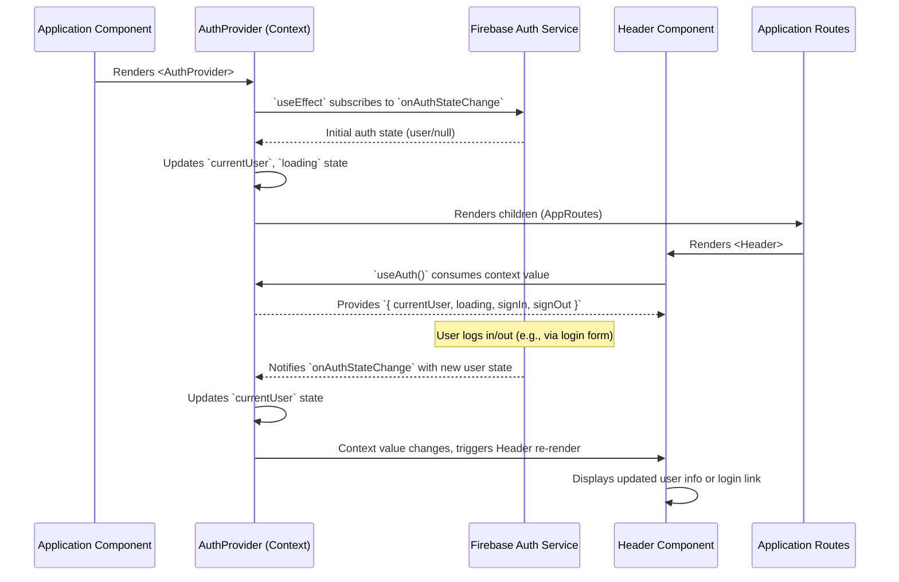

# Chapter 5: Global State Providers (React Contexts)

In the previous chapter, we established the foundational structure of our `hr-app`'s user interface through [Application Routing & Layout](chapter_04.md). We learned how different views are organized and how users navigate between them, providing the skeleton for our application. Now, we turn our attention to the lifeblood of many modern React applications: global state management. This chapter delves into **Global State Providers (React Contexts)**, explaining how we can efficiently share critical data across our application without the cumbersome process of "prop drilling."

---

### Problem & Motivation

As our `hr-app` grows, many components, regardless of their position in the component tree, will need access to shared information. For instance, the currently logged-in user's details (`currentUser`) are required by the navigation bar, profile pages, and various content components to display personalized information or control access. Similarly, the list of `employees` or `leaveRequests` might need to be accessed and updated from multiple, unrelated parts of the application.

Without a centralized mechanism, passing this data would involve "prop drilling"—manually passing props down through many layers of intermediate components that don't even need the data themselves. This quickly makes the codebase rigid, harder to read, and a nightmare to maintain. Imagine passing the `currentUser` object through `App -> Layout -> Sidebar -> UserProfileLink`, even if only `UserProfileLink` actually uses it. This chapter introduces React Context API as the elegant solution to this very common problem, ensuring that essential HR data is readily available wherever it's needed within our `hr-app`.

---

### Core Concept Explanation

React Context API provides a way to pass data through the component tree without having to pass props down manually at every level. It's designed to share "global" data, such as the current authenticated user, theme, or preferred language, across a tree of React components. In `hr-app`, this means we can store our `currentUser`, the list of `employees`, or pending `leaveRequests` in a central place, and any component can "subscribe" to this data without explicitly receiving it as props.

The Context API involves three main pieces:
1.  **`React.createContext`**: This function creates a Context object. When React renders a component that subscribes to this Context object, it will read the current Context value from the closest matching `Provider` above it in the tree.
2.  **`Context.Provider`**: This is a React component that allows consuming components to subscribe to context changes. It accepts a `value` prop to be passed to consuming components that are descendants of this Provider. A single Provider can be wrapped around an entire subtree, making the provided value available to all components within that subtree.
3.  **`useContext` Hook**: This is the most common way to consume context in functional components. It takes a Context object (the one returned from `React.createContext`) and returns the current context `value` for that context. The consuming component will re-render whenever the context `value` changes.

Think of it like a public bulletin board in a busy office. Instead of individual managers (parent components) personally delivering every announcement (props) to every employee (child components), the important messages (global state) are simply posted on the bulletin board. Any employee can walk up and read the announcements whenever they need to, without being directly handed the information. This central "bulletin board" is our React Context, and `useContext` allows components to "read" from it.

---

### Practical Usage Examples

Let's illustrate how we manage the `currentUser` state using React Context. This `AuthContext` will hold our user object and authentication functions, making them accessible throughout the application.

First, we define our `AuthContext` and its `Provider` component.

```tsx
// src/context/AuthContext.tsx
import React, { createContext, useContext, useState, useEffect } from 'react';
import { User } from '../types/user'; // [Data Models (Types)](chapter_02.md)
import { authService } from '../services/authService'; // [Backend Services](chapter_03.md)

interface AuthContextType {
  currentUser: User | null;
  loading: boolean;
  signIn: (email: string, password: string) => Promise<void>;
  signOut: () => Promise<void>;
}

const AuthContext = createContext<AuthContextType | undefined>(undefined);

export const AuthProvider: React.FC<{ children: React.ReactNode }> = ({ children }) => {
  const [currentUser, setCurrentUser] = useState<User | null>(null);
  const [loading, setLoading] = useState(true);

  // Monitors Firebase auth state changes
  useEffect(() => {
    const unsubscribe = authService.onAuthStateChange((user) => {
      setCurrentUser(user);
      setLoading(false);
    });
    return unsubscribe; // Cleanup subscription on unmount
  }, []);

  const signIn = async (email: string, password: string) => {
    await authService.signIn(email, password);
  };

  const signOut = async () => {
    await authService.signOut();
  };

  const value = { currentUser, loading, signIn, signOut };

  return (
    <AuthContext.Provider value={value}>
      {!loading && children} {/* Render children once auth state is known */}
    </AuthContext.Provider>
  );
};

// Custom hook for consuming the AuthContext
export const useAuth = () => {
  const context = useContext(AuthContext);
  if (context === undefined) {
    throw new Error('useAuth must be used within an AuthProvider');
  }
  return context;
};
```
*Explanation*: We create `AuthContext` with `createContext`. The `AuthProvider` component wraps its children, maintaining `currentUser` and `loading` state. It uses `useEffect` to listen for real-time authentication changes from Firebase via `authService`, automatically updating the `currentUser`. It also exposes `signIn` and `signOut` functions. Finally, `useAuth` is a custom hook that simplifies consuming this context in any component.

Next, we integrate the `AuthProvider` into our main application component, `App.tsx`, so that all routes and components can access the authentication state.

```tsx
// src/App.tsx (simplified for context)
import React from 'react';
import { BrowserRouter as Router } from 'react-router-dom';
import AppRoutes from './routes/AppRoutes'; // From [Application Routing & Layout](chapter_04.md)
import { AuthProvider } from './context/AuthContext';

function App() {
  return (
    <Router>
      <AuthProvider> {/* Wrap the entire application with AuthProvider */}
        <AppRoutes />
      </AuthProvider>
    </Router>
  );
}

export default App;
```
*Explanation*: By wrapping `<AppRoutes />` with `<AuthProvider>`, we ensure that `currentUser`, `loading`, `signIn`, and `signOut` are available to any component rendered by `AppRoutes` or its children. This makes the `currentUser` accessible globally within our React tree.

Now, any component that needs the current user's information or the authentication functions can simply use the `useAuth` hook.

```tsx
// src/components/Header.tsx
import React from 'react';
import { useAuth } from '../context/AuthContext';
import { Link } from 'react-router-dom';

const Header: React.FC = () => {
  const { currentUser, signOut } = useAuth(); // Consume the AuthContext

  const handleSignOut = async () => {
    await signOut();
  };

  return (
    <header className="app-header">
      <nav>
        {currentUser ? (
          <>
            <span>Welcome, {currentUser.displayName || currentUser.email}!</span>
            <button onClick={handleSignOut}>Sign Out</button>
          </>
        ) : (
          <Link to="/login">Login</Link>
        )}
      </nav>
    </header>
  );
};

export default Header;
```
*Explanation*: The `Header` component directly uses `useAuth()` to get `currentUser` and `signOut`. It can then conditionally render a welcome message and a sign-out button, or a login link, without receiving any props related to authentication. This demonstrates the power of context in avoiding prop drilling.

---

### Internal Implementation Walkthrough

The `AuthContext` works by creating a subscription mechanism. When a component (like `Header`) calls `useAuth()`, it's essentially saying, "Hey, give me the current value from the `AuthContext`!" The `AuthProvider` component is responsible for holding that value and updating it.

Let's break down the flow:

1.  **`AuthProvider` Initialization**: When `App.tsx` renders `<AuthProvider>`, it initializes its internal state (`currentUser` and `loading`).
2.  **Firebase Connection**: The `useEffect` hook inside `AuthProvider` establishes a listener with `authService.onAuthStateChange`. This listener observes Firebase's authentication status in real-time.
3.  **State Update**: Whenever Firebase detects a user login, logout, or session change, `authService.onAuthStateChange` notifies `AuthProvider`. `AuthProvider` then updates its `currentUser` and `loading` state using `setCurrentUser` and `setLoading`.
4.  **Context Value Propagation**: When `AuthProvider`'s state (`currentUser` or `loading`) changes, the `value` object passed to `<AuthContext.Provider>` is updated.
5.  **Component Re-render**: Any component wrapped by `AuthProvider` that consumes `AuthContext` via `useAuth()` (e.g., `Header`) will detect this `value` change and re-render with the new `currentUser` information.

This ensures that our application's UI automatically reflects the current authentication status without manual data passing.


*Sequence Diagram Explanation*: The `App` component is the entry point, rendering the `AuthProvider`. The `AuthProvider` acts as a bridge to `AuthService` (our wrapper around Firebase Auth), listening for changes. When authentication state changes, `AuthProvider` updates its internal state and consequently the value it provides to its context. Components like `Header` that consume this context via `useAuth()` automatically receive these updates and re-render.

---

### System Integration

Global State Providers are deeply integrated into the `hr-app`'s architecture, acting as central hubs for various types of data.

*   **Authentication System ([chapter_01.md])**: The `AuthContext` is the direct bridge between our Firebase [Authentication System](chapter_01.md) and the React UI. It consumes the raw authentication state from `authService` (part of [Backend Services](chapter_03.md)) and exposes it in a React-friendly format (`currentUser`, `signIn`, `signOut`). This ensures that user sessions are consistently managed and reflected throughout the application.

*   **Data Models (Types) ([chapter_02.md])**: The `AuthContext` uses the `User` [Data Models (Types)](chapter_02.md) to define the structure of the `currentUser` object. Similarly, other contexts (e.g., `EmployeeContext`, `LeaveContext`) would rely on the `Employee` and `LeaveRequest` types to shape the data they manage.

*   **Backend Services ([chapter_03.md])**: Context Providers frequently interact with [Backend Services](chapter_03.md). For instance, `AuthProvider` calls `authService.signIn()` and `authService.signOut()`. Future contexts, like an `EmployeeProvider`, would call `employeeService.getEmployees()`, `employeeService.addEmployee()`, etc., to fetch and mutate data, then update their internal state.

*   **Application Routing & Layout ([chapter_04.md])**: As shown in `App.tsx`, the `AuthProvider` wraps the entire `AppRoutes` (defined in [Application Routing & Layout](chapter_04.md)). This placement is crucial as it ensures that *all* routes and the components rendered within them have access to the authentication context. Conditional routing (e.g., redirecting unauthenticated users from protected routes) is often implemented by checking the `currentUser` status from `AuthContext` within route guards or wrapper components.

---

### Best Practices & Tips

1.  **Granularity**: Avoid creating one monolithic context for all global state. Instead, create separate contexts for distinct domains (e.g., `AuthContext`, `EmployeeContext`, `LeaveContext`, `ThemeContext`). This keeps concerns separated, improves readability, and limits unnecessary re-renders when only one part of the global state changes.

    ```tsx
    // src/App.tsx
    import { AuthProvider } from './context/AuthContext';
    import { EmployeeProvider } from './context/EmployeeContext'; // Future context

    function App() {
      return (
        <AuthContext.Provider>
          <EmployeeContext.Provider> {/* Nest providers for different concerns */}
            {/* ... rest of the app */}
          </EmployeeContext.Provider>
        </AuthContext.Provider>
      );
    }
    ```

2.  **Custom Hooks for Consumption**: Always create custom hooks (like `useAuth` or `useEmployees`) to consume your contexts. This abstracts away the `useContext(MyContext)` call, provides a clear error message if the hook is used outside its `Provider`, and makes components cleaner.

    ```tsx
    // Instead of:
    // const { currentUser } = useContext(AuthContext);

    // Do this:
    const { currentUser } = useAuth(); // Cleaner, safer
    ```

3.  **Memoize Context Values**: If the `value` prop passed to a `Provider` is an object or array, and it's created inline (e.g., `{ currentUser, loading, signIn, signOut }`), it will be a new object on every render of the Provider. This can cause unnecessary re-renders for consuming components, even if the underlying data hasn't conceptually changed. Use `React.useMemo` to memoize the value object if its dependencies haven't changed.

    ```tsx
    // src/context/AuthContext.tsx (inside AuthProvider)
    const value = React.useMemo(() => ({
      currentUser, loading, signIn, signOut
    }), [currentUser, loading, signIn, signOut]); // Memoize the value object

    return (
      <AuthContext.Provider value={value}>
        {/* ... */}
      </AuthContext.Provider>
    );
    ```

4.  **Consider State Collocation**: React Context is excellent for *global* state. However, for state only needed by a small subtree or an individual component and its immediate children, consider keeping that state local (e.g., using `useState` or `useReducer` within the component). Don't over-contextualize.

5.  **Loading States**: Always manage loading states (`loading` boolean in `AuthContext`) for asynchronous operations within your Providers. This allows components to render loading indicators or prevent interactions until data is ready.

---

### Chapter Conclusion

This chapter has provided a comprehensive understanding of **Global State Providers (React Contexts)** within our `hr-app`. We've seen how React Context elegantly solves the problem of prop drilling, allowing crucial application-wide data like `currentUser` to be shared efficiently across disparate components. By establishing `AuthContext`, we've laid a robust foundation for managing user authentication state, demonstrating the core principles of creating, providing, and consuming context. This mechanism not only simplifies data flow but also improves the maintainability and scalability of our React application.

Having mastered the sharing of global state, we are now perfectly positioned to build out specific features that will leverage this centralized data. The next logical step is to implement the functionality for managing employees, which will undoubtedly rely on a dedicated context to store and update the list of employees, integrating with our backend services and data models.

Proceed to the next chapter to dive into: [Employee Management Feature](chapter_06.md)