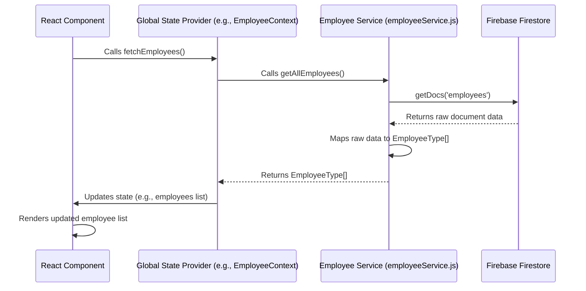

# Chapter 3: Backend Services

Having established a clear understanding of our data structures in [Data Models (Types)](chapter_02.md), the next logical step in building our `hr-app` is to define *how* we interact with that data. Our application needs to fetch employee lists, add new leave requests, update existing records, and more. This is where **Backend Services** come into play.

---

### Problem & Motivation

Imagine every part of our application directly writing queries to a database or making raw API calls. The component responsible for displaying employees would need to know the specifics of how to connect to Firebase, which collection to query, how to handle pagination, and so on. Similarly, the component for approving leave requests would duplicate this low-level data access logic. This approach leads to several problems:
*   **Tight Coupling**: UI components become tightly coupled to the backend technology. If we ever decide to switch from Firebase to another database, a significant portion of our UI code would need rewriting.
*   **Redundancy**: The same data access logic (e.g., fetching all employees) would be scattered across multiple components, leading to duplicated code and making updates difficult.
*   **Maintainability**: Debugging data-related issues becomes harder as the logic is spread out and mixed with UI concerns.
*   **Testability**: Testing individual components becomes complex as they depend on an active database connection.

To address these challenges, the `hr-app` implements a dedicated **Backend Services** layer. This layer acts as an intermediary, abstracting away the complexities of direct database interaction and providing a clean, consistent API for the rest of the application to consume. For instance, when the application needs to retrieve all employees, it simply calls a function like `employeeService.getAllEmployees()`, without needing to know *how* that data is fetched from Firebase.

---

### Core Concept Explanation

**Backend Services**, often referred to as a Data Access Layer (DAL) or Repository Pattern, represent the specific modules responsible for interacting with the backend data store – Firebase, in the case of our `hr-app`. Their primary role is to encapsulate all logic related to **CRUD** (Create, Read, Update, Delete) operations for our core entities like employees, leave requests, and application settings.

Essentially, these services provide a set of functions that act as a public API for data manipulation. They translate generic data requests from the application (e.g., "get all employees") into specific database operations (e.g., "query the 'employees' collection in Firestore"). By doing so, they achieve a critical **separation of concerns**: the UI and business logic parts of the application only know *what* data they need, while the Backend Services know *how* to get or store that data. This architecture ensures that if the underlying database technology changes, only the Backend Services layer needs modification, leaving the rest of the application largely untouched.

For the `hr-app`, our Backend Services will primarily interact with Firebase Firestore for persistent data storage and potentially Firebase Authentication (though the core authentication logic is handled in [Chapter 1: Authentication System](chapter_01.md)). Each major data entity (Employees, Leaves) will likely have its own dedicated service module to maintain modularity and organization, such as `employeeService.js` and `leaveService.js`. These services are designed to be entirely independent of any React-specific logic, making them highly reusable and testable.

---

### Practical Usage Examples

Let's illustrate how easily other parts of our application can interact with the backend services to perform common operations, using our motivating example of fetching employees.

First, we need to import the relevant service. Let's assume we have an `employeeService.js` file.

```javascript
// In a React component or a global state provider
import { getAllEmployees, addEmployee } from '../services/employeeService';
```
*Here, we import specific functions from our `employeeService` module. This makes our code explicit about what functionalities it needs from the backend.*

Now, fetching all employees is as simple as calling the `getAllEmployees` function:

```javascript
async function fetchEmployees() {
  try {
    const employees = await getAllEmployees();
    console.log('Fetched employees:', employees);
    // Update application state with employees
  } catch (error) {
    console.error('Error fetching employees:', error);
    // Display an error message to the user
  }
}

fetchEmployees();
```
*This code snippet demonstrates calling the `getAllEmployees` function. It's an `async` operation because data retrieval is typically non-blocking. The fetched `employees` array would conform to our `EmployeeType` data model.*

Similarly, adding a new employee is straightforward:

```javascript
import { EmployeeStatus } from '../types/employeeTypes'; // For type consistency

async function createNewEmployee() {
  const newEmployeeData = {
    firstName: 'Jane',
    lastName: 'Doe',
    email: 'jane.doe@example.com',
    position: 'Marketing Manager',
    department: 'Marketing',
    startDate: '2023-01-15',
    status: EmployeeStatus.ACTIVE,
  };
  try {
    const addedEmployee = await addEmployee(newEmployeeData);
    console.log('Employee added successfully:', addedEmployee);
    // Re-fetch employee list or update local state
  } catch (error) {
    console.error('Error adding employee:', error);
  }
}

createNewEmployee();
```
*This example shows how `addEmployee` is called with new employee data. The function returns the newly created employee (often with its unique ID), which can then be used to update the UI or confirm the operation.*

---

### Internal Implementation Walkthrough

Delving into the `employeeService.js` module, we'll see how it interacts directly with Firebase Firestore. The core idea is to use the Firebase SDK to perform the actual database operations and then transform the raw database results into our predefined data models (like `EmployeeType`) for consistency.

Let's assume our project structure includes a `firebaseConfig.js` file for initializing Firebase and `services/employeeService.js` for employee-related operations.

```javascript
// src/firebaseConfig.js
import { initializeApp } from 'firebase/app';
import { getFirestore } from 'firebase/firestore';
import { getAuth } from 'firebase/auth'; // Used by Auth System, but good to include

const firebaseConfig = {
  apiKey: "YOUR_API_KEY",
  authDomain: "YOUR_AUTH_DOMAIN",
  projectId: "YOUR_PROJECT_ID",
  storageBucket: "YOUR_STORAGE_BUCKET",
  messagingSenderId: "YOUR_MESSAGING_SENDER_ID",
  appId: "YOUR_APP_ID"
};

const app = initializeApp(firebaseConfig);
export const db = getFirestore(app);
export const auth = getAuth(app);
```
*This file initializes our Firebase application and exports `db` (Firestore instance) and `auth` (Auth instance), which will be used by our services and authentication system respectively.*

Now, let's look at a simplified `employeeService.js`:

```javascript
// src/services/employeeService.js
import { db } from '../firebaseConfig'; // Our initialized Firestore instance
import { collection, getDocs, addDoc, doc, updateDoc, deleteDoc } from 'firebase/firestore';
import { EmployeeType } from '../types/employeeTypes'; // Our data model

const employeesCollectionRef = collection(db, 'employees'); // Reference to the 'employees' collection

/**
 * Fetches all employees from Firestore.
 * @returns {Promise<EmployeeType[]>} A promise that resolves to an array of EmployeeType objects.
 */
export const getAllEmployees = async () => {
  const data = await getDocs(employeesCollectionRef);
  return data.docs.map(doc => ({
    id: doc.id,
    ...doc.data()
  }));
};

/**
 * Adds a new employee to Firestore.
 * @param {Omit<EmployeeType, 'id'>} employeeData The employee data to add (without ID).
 * @returns {Promise<EmployeeType>} A promise that resolves to the added employee with its ID.
 */
export const addEmployee = async (employeeData) => {
  const docRef = await addDoc(employeesCollectionRef, employeeData);
  return { id: docRef.id, ...employeeData };
};
```
*This `employeeService.js` module defines functions (`getAllEmployees`, `addEmployee`) that encapsulate the Firebase Firestore logic. It imports `db` for the database instance and `EmployeeType` for type safety. The `getDocs` function retrieves all documents from the 'employees' collection, and `addDoc` creates a new document. Notice how `doc.id` is manually added as Firestore document IDs are separate from the document data itself.*

Let's visualize the flow for `getAllEmployees` using a sequence diagram:


*This sequence diagram illustrates the typical data flow when fetching employees. The React Component triggers an action, which goes through a Global State Provider (for centralized state management), then to the `Employee Service` which interacts with Firebase, and finally, the data flows back to update the UI.*

---

### System Integration

The **Backend Services** layer is strategically positioned as a core utility, interacting closely with several other key abstractions in the `hr-app`:

1.  **[Data Models (Types)](chapter_02.md)**: This is a fundamental connection. The Backend Services are responsible for ensuring that data retrieved from or sent to Firebase *conforms* to the `EmployeeType`, `LeaveRequestType`, and other defined models. This provides type safety and consistency throughout the application.
2.  **[Global State Providers (React Contexts)](chapter_05.md)**: This is where Backend Services are primarily consumed. React Contexts (or other state management solutions) often wrap these services to provide application-wide access to data. For example, an `EmployeeContext` might expose functions like `loadEmployees` which internally call `employeeService.getAllEmployees()`. This decouples components from direct backend service calls, making state management more centralized.
3.  **[Employee Management Feature](chapter_06.md)** and other feature modules: These high-level features are the direct *consumers* of the data exposed by the Global State Providers, which in turn rely on Backend Services. A component in the Employee Management Feature, for example, will trigger an action like "add new employee," which flows through the state provider, ultimately invoking `employeeService.addEmployee()`.
4.  **[Authentication System](chapter_01.md)**: While the Authentication System handles user login/logout directly, secured Backend Service operations might implicitly rely on the user's authentication status. For instance, Firebase security rules would check if the authenticated user has permission to perform a certain write operation via the Backend Services.

This layered approach ensures a clear flow of data and responsibilities, enhancing modularity.

---

### Best Practices & Tips

*   **Error Handling**: Always wrap your asynchronous service calls in `try...catch` blocks. Network issues, permission denied errors, or malformed data can occur. Services should either throw specific errors that the calling layer can handle, or return a structured response indicating success/failure and any error messages.
*   **Asynchronous Operations**: Backend interactions are inherently asynchronous. Leverage `async/await` for cleaner, more readable code when dealing with Promises returned by Firebase SDK functions.
*   **Input Validation**: Although our data models provide structure, consider adding basic input validation within the service layer before sending data to the backend, especially for `add` and `update` operations. This adds an extra layer of defense against invalid data.
*   **Data Transformation**: Services are the ideal place to transform raw data from the database into the application's specific data models and vice-versa. For instance, converting Firebase Timestamps to JavaScript `Date` objects.
*   **Single Responsibility Principle**: Each service (e.g., `employeeService`, `leaveService`) should focus on managing a single resource or entity. Avoid creating a monolithic `backendService.js` that handles everything.
*   **No UI or State Logic**: Keep Backend Services purely focused on data access. They should not contain any UI-specific logic (e.g., showing toasts) or directly manage global application state. That's the responsibility of the UI components or state management layers.
*   **Mocking for Testing**: Design your services to be easily mockable. This allows you to write unit tests for your components and state providers without needing an actual Firebase connection, speeding up testing and improving reliability.

---

### Chapter Conclusion

This chapter has provided a deep dive into the **Backend Services** of our `hr-app`. We've seen how this crucial abstraction tackles the complexities of data persistence, offering a clean, maintainable, and scalable way to interact with Firebase. By separating data access logic from the rest of the application, we've laid a strong foundation for future development, ensuring our application remains robust and adaptable. Understanding these services is key, as they are the bridge between our defined [Data Models (Types)](chapter_02.md) and the actual stored information.

With our data access mechanisms now well-defined, the next step is to explore how users will navigate and interact with the application. In the upcoming chapter, we will delve into **[Application Routing & Layout](chapter_04.md)**, defining the structure and user experience of our `hr-app`.