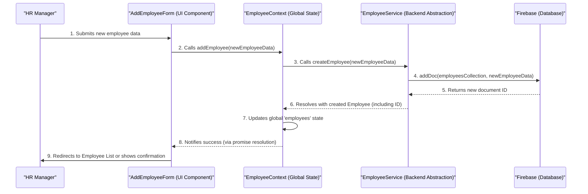

# Chapter 6: Employee Management Feature

Building upon the foundation of shared data provided by [Global State Providers (React Contexts)](chapter_05.md), this chapter delves into the practical implementation of managing employee records within our `hr-app`. This feature is the heart of any HR application, bringing together all the architectural layers we've established so far to create a truly functional system.

---

### Problem & Motivation

An HR application's fundamental purpose is to manage human resources data. At the core of this data lies information about employees. Without a robust and intuitive system to add new employees, view their details, update their records, and, when necessary, remove them, the `hr-app` would fail to serve its primary function. Manual processes for managing employee data are inherently error-prone, time-consuming, and scale poorly, making a digital solution indispensable.

This "Employee Management Feature" directly addresses the core need outlined in the project summary: managing HR-related data, primarily employees. It transforms the abstract definitions of data models and backend interactions into tangible user functionality.

Consider a concrete use case: Imagine an HR manager, Maria, needs to onboard a new employee, 'Alice Johnson'. Maria requires a dedicated, user-friendly section in the application where she can input Alice's personal details, contact information, job role, and other relevant data. Once saved, Maria should be able to easily find Alice's record, modify it if her details change, or view all her information at a glance. This chapter will demonstrate how our `hr-app` provides exactly this capability, leveraging all the previous architectural decisions.

---

### Core Concept Explanation

The **Employee Management Feature** is a comprehensive set of functionalities within the `hr-app` dedicated to the entire lifecycle of an employee record. It encompasses the user interface components and the underlying logic required to perform **CRUD** (Create, Read, Update, Delete) operations on `Employee` data.

At its essence, this feature orchestrates the interaction between various parts of our application. It provides the visual components (forms, lists, detail views) that users interact with. These components then communicate with a dedicated global state provider (the `EmployeeContext` from [Global State Providers (React Contexts)](chapter_05.md)) to manage the current list of employees within the application. The `EmployeeContext`, in turn, utilizes the `employeeService` (part of [Backend Services](chapter_03.md)) to interact with Firebase, ensuring that all employee data is persistently stored and retrieved. Throughout this process, the structure and integrity of employee data are strictly enforced by the `Employee` [Data Models (Types)](chapter_02.md).

In summary, this feature brings together:
*   **User Interface (UI)**: Components like `EmployeeList`, `AddEmployeeForm`, `EditEmployeeForm`, and `EmployeeDetail`.
*   **Global State**: `EmployeeContext` to centralize employee data and provide CRUD operations to any component.
*   **Backend Integration**: `employeeService` to communicate with Firebase for data persistence.
*   **Data Structure**: `Employee` type to define the shape of employee records.

---

### Practical Usage Examples

To illustrate how the Employee Management Feature works, let's walk through common interactions. We'll focus on the UI components and how they interact with the `EmployeeContext` to perform operations.

#### 1. Listing Employees

The `EmployeeList` component displays all employees fetched from our global state. It consumes the `EmployeeContext` to access the `employees` array.

```typescript jsx
// src/features/employees/components/EmployeeList.tsx
import React, { useContext } from 'react';
import { EmployeeContext } from '../../../contexts/EmployeeContext';
import { Link } from 'react-router-dom';

const EmployeeList: React.FC = () => {
  const { employees, loading, error } = useContext(EmployeeContext);

  if (loading) return <p>Loading employees...</p>;
  if (error) return <p>Error: {error}</p>;

  return (
    <div>
      <h2>Employee Directory</h2>
      {/* Link to add a new employee */}
      <Link to="/employees/add">Add New Employee</Link>
      <ul>
        {employees.map((employee) => (
          <li key={employee.id}>
            <Link to={`/employees/${employee.id}`}>
              {employee.firstName} {employee.lastName} - {employee.position}
            </Link>
          </li>
        ))}
      </ul>
    </div>
  );
};

export default EmployeeList;
```
This component uses `useContext(EmployeeContext)` to get the current list of `employees`. It displays a loading message while data is being fetched and an error message if something goes wrong. Each employee's name links to their detailed view.

#### 2. Adding an Employee

The `AddEmployeeForm` allows the HR manager to input details for a new employee. When submitted, it calls the `addEmployee` function provided by the `EmployeeContext`.

```typescript jsx
// src/features/employees/components/AddEmployeeForm.tsx
import React, { useContext, useState } from 'react';
import { EmployeeContext } from '../../../contexts/EmployeeContext';
import { useNavigate } from 'react-router-dom';
import { Employee } from '../../../types/employee'; // Import Employee type

const AddEmployeeForm: React.FC = () => {
  const { addEmployee, loading, error } = useContext(EmployeeContext);
  const navigate = useNavigate();
  const [newEmployee, setNewEmployee] = useState<Partial<Employee>>({
    firstName: '', lastName: '', email: '', position: ''
  });

  const handleSubmit = async (e: React.FormEvent) => {
    e.preventDefault();
    if (newEmployee.firstName && newEmployee.lastName) {
      await addEmployee(newEmployee as Omit<Employee, 'id'>);
      navigate('/employees'); // Redirect after successful add
    }
  };

  return (
    <form onSubmit={handleSubmit}>
      <h3>Add New Employee</h3>
      <input
        type="text"
        placeholder="First Name"
        value={newEmployee.firstName || ''}
        onChange={(e) => setNewEmployee({ ...newEmployee, firstName: e.target.value })}
      />
      {/* ... other input fields for lastName, email, position */}
      <button type="submit" disabled={loading}>
        {loading ? 'Adding...' : 'Add Employee'}
      </button>
      {error && <p style={{ color: 'red' }}>Error: {error}</p>}
    </form>
  );
};

export default AddEmployeeForm;
```
This form collects employee data and, on submission, calls `addEmployee` from the context. The `navigate` hook is used to redirect the user to the employee list after the new employee is successfully added. The `loading` state from the context disables the button to prevent multiple submissions.

#### 3. Editing an Employee

The `EditEmployeeForm` pre-fills with an employee's existing data and allows updates. It utilizes the `updateEmployee` function from the `EmployeeContext`.

```typescript jsx
// src/features/employees/components/EditEmployeeForm.tsx
import React, { useContext, useState, useEffect } from 'react';
import { EmployeeContext } from '../../../contexts/EmployeeContext';
import { useNavigate, useParams } from 'react-router-dom';
import { Employee } from '../../../types/employee';

const EditEmployeeForm: React.FC = () => {
  const { employeeId } = useParams<{ employeeId: string }>();
  const { employees, updateEmployee, loading, error } = useContext(EmployeeContext);
  const navigate = useNavigate();
  const [currentEmployee, setCurrentEmployee] = useState<Employee | undefined>(undefined);

  useEffect(() => {
    // Find employee from context based on ID from URL params
    const employeeToEdit = employees.find(emp => emp.id === employeeId);
    if (employeeToEdit) {
      setCurrentEmployee(employeeToEdit);
    } else {
      // Handle case where employee not found (e.g., redirect or show error)
      navigate('/employees');
    }
  }, [employees, employeeId, navigate]);

  const handleSubmit = async (e: React.FormEvent) => {
    e.preventDefault();
    if (currentEmployee && employeeId) {
      await updateEmployee(employeeId, currentEmployee);
      navigate(`/employees/${employeeId}`); // Redirect to detail page
    }
  };

  if (!currentEmployee) return <p>Loading employee data...</p>;

  return (
    <form onSubmit={handleSubmit}>
      <h3>Edit Employee: {currentEmployee.firstName} {currentEmployee.lastName}</h3>
      <input
        type="text"
        value={currentEmployee.firstName}
        onChange={(e) => setCurrentEmployee({ ...currentEmployee, firstName: e.target.value })}
      />
      {/* ... other input fields */}
      <button type="submit" disabled={loading}>
        {loading ? 'Updating...' : 'Update Employee'}
      </button>
      {error && <p style={{ color: 'red' }}>Error: {error}</p>}
    </form>
  );
};

export default EditEmployeeForm;
```
This component first fetches the employee data based on the `employeeId` from the URL parameters using `useParams`. It then pre-fills the form with this data and, upon submission, calls `updateEmployee` from the context.

#### 4. Viewing Employee Details

The `EmployeeDetail` component displays comprehensive information for a single employee, again using data from the `EmployeeContext`.

```typescript jsx
// src/features/employees/components/EmployeeDetail.tsx
import React, { useContext } from 'react';
import { EmployeeContext } from '../../../contexts/EmployeeContext';
import { useParams, Link } from 'react-router-dom';

const EmployeeDetail: React.FC = () => {
  const { employeeId } = useParams<{ employeeId: string }>();
  const { employees, loading, error, deleteEmployee } = useContext(EmployeeContext);
  const employee = employees.find(emp => emp.id === employeeId);

  const handleDelete = async () => {
    if (employeeId && confirm('Are you sure you want to delete this employee?')) {
      await deleteEmployee(employeeId);
      // Redirect to employee list or show confirmation
    }
  };

  if (loading) return <p>Loading employee details...</p>;
  if (error) return <p>Error: {error}</p>;
  if (!employee) return <p>Employee not found.</p>;

  return (
    <div>
      <h2>{employee.firstName} {employee.lastName}</h2>
      <p>Email: {employee.email}</p>
      <p>Position: {employee.position}</p>
      {/* ... other details */}
      <Link to={`/employees/edit/${employee.id}`}>Edit Employee</Link>
      <button onClick={handleDelete} style={{ marginLeft: '10px' }}>Delete Employee</button>
    </div>
  );
};

export default EmployeeDetail;
```
This component dynamically finds the employee using the `employeeId` from the URL. It displays their details and provides links to edit or a button to delete the employee, demonstrating the `deleteEmployee` function from the context.

---

### Internal Implementation Walkthrough

Let's trace the journey of an employee record, focusing on the "Add New Employee" use case, to understand the internal workings of this feature.

The core of the Employee Management Feature relies on the `EmployeeContext` (defined in `src/contexts/EmployeeContext.tsx`) which acts as the central hub, providing the `employees` data and the CRUD functions (`addEmployee`, `updateEmployee`, `deleteEmployee`) to all consuming components. These context functions, in turn, delegate the actual data persistence tasks to the `employeeService` (defined in `src/services/employeeService.ts`), which directly communicates with Firebase.

Here's a step-by-step breakdown of adding a new employee, starting from the user interface:

1.  **User Interaction**: An HR manager navigates to the "Add New Employee" page and fills out the `AddEmployeeForm` (`src/features/employees/components/AddEmployeeForm.tsx`).
2.  **Form Submission**: Upon clicking "Add Employee", the form's `handleSubmit` function is triggered. This function collects the form data into a `newEmployee` object.
3.  **Context Call**: The `handleSubmit` function then calls `addEmployee(newEmployee)` which is destructured from `useContext(EmployeeContext)`.
    ```typescript
    // Inside AddEmployeeForm.tsx
    // ...
    const { addEmployee } = useContext(EmployeeContext);
    // ...
    const handleSubmit = async (e) => {
      e.preventDefault();
      await addEmployee(newEmployeeData); // Calls the context's addEmployee
      // ...
    };
    ```
4.  **Context Logic**: The `addEmployee` function within `EmployeeContext.tsx` is responsible for two main things:
    *   It calls `employeeService.createEmployee(newEmployeeData)` to send the data to the backend.
    *   Upon a successful response from the service, it updates its internal `employees` state, usually by appending the newly created employee to the existing array. This triggers a re-render in all components consuming `EmployeeContext`.
    ```typescript
    // Inside src/contexts/EmployeeContext.tsx
    // ...
    const addEmployee = async (employeeData: Omit<Employee, 'id'>) => {
      try {
        setLoading(true);
        const addedEmployee = await employeeService.createEmployee(employeeData);
        setEmployees((prev) => [...prev, addedEmployee]); // Update local state
        setError(null);
      } catch (err: any) {
        setError(err.message);
      } finally {
        setLoading(false);
      }
    };
    // ...
    ```
5.  **Backend Service Interaction**: The `employeeService.createEmployee` function (`src/services/employeeService.ts`) is an abstraction layer for Firebase. It uses the Firebase SDK to add a new document to the "employees" collection in our Firestore database.
    ```typescript
    // Inside src/services/employeeService.ts
    // ...
    import { db } from '../config/firebase'; // Firestore instance
    import { collection, addDoc, getDocs, doc, updateDoc, deleteDoc } from 'firebase/firestore';
    import { Employee } from '../types/employee';

    const employeesCollectionRef = collection(db, 'employees');

    export const createEmployee = async (employee: Omit<Employee, 'id'>): Promise<Employee> => {
      const docRef = await addDoc(employeesCollectionRef, employee);
      return { id: docRef.id, ...employee }; // Return employee with generated ID
    };
    // ...
    ```
6.  **Firebase Persistence**: Firebase Firestore receives the data and stores it, generating a unique ID for the new employee document.
7.  **Response Handling**: Firebase responds to the `employeeService`, which then resolves the promise for the `EmployeeContext`. The context updates its state, and the `AddEmployeeForm` can then redirect the user, indicating success.

Here's a sequence diagram illustrating this flow:



---

### System Integration

The Employee Management Feature is a prime example of how all previously documented architectural layers converge to deliver core application functionality.

*   **[Data Models (Types)](chapter_02.md)**: The feature heavily relies on the `Employee` interface defined in `src/types/employee.ts`. This ensures that all employee data, whether being sent to Firebase or displayed in the UI, adheres to a consistent and predictable structure. For example, `EmployeeList`, `AddEmployeeForm`, and `EmployeeContext` all operate with objects typed as `Employee`.

*   **[Backend Services](chapter_03.md)**: The `employeeService.ts` module is the dedicated interface for all employee-related data operations with Firebase. The `EmployeeContext` calls functions like `createEmployee`, `getEmployees`, `updateEmployee`, and `deleteEmployee` from this service, abstracting away the direct Firebase SDK calls. This separation of concerns ensures that the UI and state management layers don't need to know the specifics of database interaction.

*   **[Global State Providers (React Contexts)](chapter_05.md)**: The `EmployeeProvider` and `EmployeeContext` are crucial. They manage the central `employees` array, keeping it synchronized across the application. Components like `EmployeeList` and `EmployeeDetail` simply consume the context to get the latest employee data, while forms like `AddEmployeeForm` and `EditEmployeeForm` use the context's provided actions (e.g., `addEmployee`, `updateEmployee`) to modify this shared state, which in turn triggers backend updates.

*   **[Application Routing & Layout](chapter_04.md)**: This feature integrates seamlessly with the application's routing. Specific routes are defined for employee-related pages, such as `/employees` (for the list), `/employees/add` (for adding), `/employees/:id` (for details), and `/employees/edit/:id` (for editing). The main layout's `Sidebar` includes navigation links that lead to the employee management section, making it accessible within the overall UI structure.

*   **[Authentication System](chapter_01.md)**: Security is paramount for HR data. The [Authentication System](chapter_01.md) ensures that only authenticated users (e.g., an HR manager) can access the routes and functionalities related to employee management. Unauthenticated users would be redirected to the login page, protecting sensitive employee information.

---

### Best Practices & Tips

Implementing core features like Employee Management offers several opportunities to apply best practices:

*   **Form Validation**: Always validate user input on both the client-side (for immediate feedback and better UX, e.g., using libraries like React Hook Form with Yup) and server-side (for data integrity and security, as client-side validation can be bypassed). Ensure required fields are marked and proper error messages are displayed.
*   **Error Handling and Feedback**: Implement robust error handling. When an API call fails, capture the error and provide clear, user-friendly feedback to the user. Show loading indicators (as seen in examples) during data operations to inform the user that something is happening.
*   **Optimistic UI Updates**: For actions like adding or updating an employee, consider updating the UI *immediately* before the backend confirms the change. This makes the application feel much faster and more responsive. If the backend operation fails, you can then "roll back" the UI change and display an error.
*   **Modular Component Design**: Break down complex forms or lists into smaller, reusable components (e.g., a generic `TextInput` component, or `EmployeeCard` for list items). This improves maintainability and reusability.
*   **Data Consistency**: While `React Context` is great for global state, for very frequently changing or extremely complex state, consider using a dedicated state management library (like Redux Toolkit or Zustand) if the application scales significantly beyond the current scope. For `hr-app`, React Context is sufficient.
*   **Clear UX for CRUD Operations**:
    *   **Create**: After adding, usually redirect to the list view or the detail page of the newly created item.
    *   **Read**: Provide search/filter capabilities for large lists.
    *   **Update**: Pre-fill forms with existing data. After updating, redirect to the detail view.
    *   **Delete**: Always ask for confirmation before deleting sensitive data. Provide visual feedback upon successful deletion (e.g., a toast message).

---

### Chapter Conclusion

This chapter marks a significant milestone in our `hr-app` journey. By implementing the **Employee Management Feature**, we have successfully brought together all the foundational architectural components developed in previous chapters into a coherent and functional whole. We started with user authentication, defined robust data models, built flexible backend services, established a clear application layout and routing, and finally, integrated a global state management system.

The Employee Management Feature serves as a testament to the power of a well-structured application, demonstrating how separation of concerns and clear interfaces lead to a maintainable, scalable, and understandable codebase. It validates the design choices made, from abstracting Firebase interactions to centralizing state with React Context.

This concludes our comprehensive tutorial on building the `hr-app`. You now possess a complete understanding of how a modern React application, backed by Firebase, can be architected to manage core business logic effectively. The principles and patterns learned here are applicable to a wide range of web development projects, empowering you to build robust and user-friendly applications.