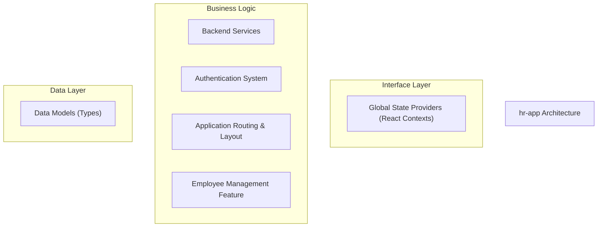
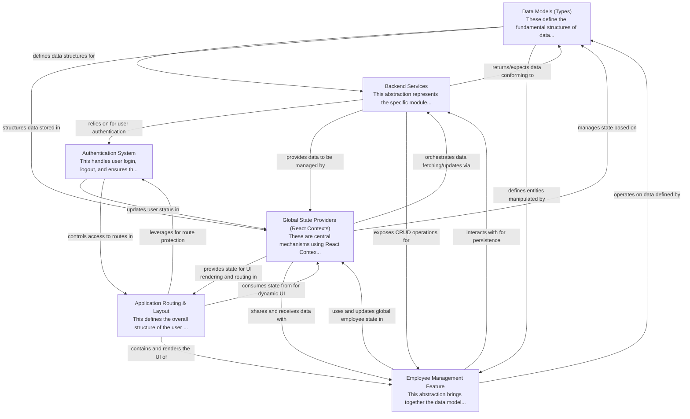

# hr-app Tutorial

Welcome to the comprehensive tutorial for hr-app. This tutorial is automatically generated from the codebase to help you understand the core concepts and implementation patterns.

## Project Overview

'hr-app' is a React-based frontend application designed to manage HR-related data, primarily employees and leave requests. It utilizes Firebase as a backend for data persistence and user authentication, providing a user-friendly interface with global state management via React Context. The application's architecture emphasizes a clear separation of concerns, from data modeling to UI layout and backend interactions, ensuring modularity and maintainability.

## System Architecture

## Component Relationships

## Table of Contents

1. [Chapter 1: Authentication System](chapter_01.md) - Comprehensive documentation for Authentication System following structured methodology...
2. [Chapter 2: Data Models (Types)](chapter_02.md) - Comprehensive documentation for Data Models (Types) following structured methodology...
3. [Chapter 3: Backend Services](chapter_03.md) - Comprehensive documentation for Backend Services following structured methodology...
4. [Chapter 4: Application Routing & Layout](chapter_04.md) - Comprehensive documentation for Application Routing & Layout following structured methodology...
5. [Chapter 5: Global State Providers (React Contexts)](chapter_05.md) - Comprehensive documentation for Global State Providers (React Contexts) following structured methodo...
6. [Chapter 6: Employee Management Feature](chapter_06.md) - Comprehensive documentation for Employee Management Feature following structured methodology...

## How to Use This Tutorial

1. **Start with Chapter 1** to understand the foundational concepts
2. **Follow the sequence** - each chapter builds upon previous concepts
3. **Practice with code examples** - every chapter includes practical examples
4. **Refer to diagrams** - use architecture diagrams for visual understanding
5. **Cross-reference concepts** - chapters link to related topics

## Tutorial Features

- **Progressive Learning**: Concepts are introduced in logical order
- **Code Examples**: Every chapter includes practical, executable code
- **Visual Diagrams**: Mermaid diagrams illustrate complex relationships
- **Cross-References**: Easy navigation between related concepts
- **Beginner-Friendly**: Written for newcomers to the codebase

## Contributing

This tutorial is auto-generated from the codebase. To improve it:
1. Update the source code documentation
2. Add more detailed comments to key functions
3. Regenerate the tutorial using the documentation system

---

*Generated using AI-powered codebase analysis*
