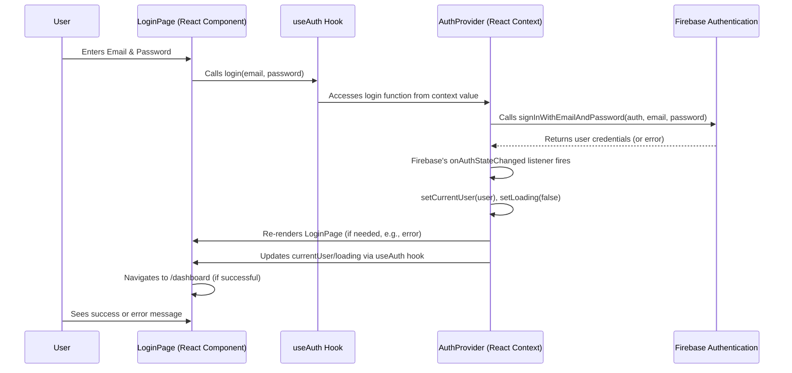

# Chapter 1: Authentication System

This is the first chapter in our journey through the `hr-app` project. It lays the foundational stone for securing our application and managing user access.

---

## 1.1 Problem & Motivation

Imagine an HR application where sensitive employee data, such as personal details, salary information, and leave requests, is stored. Without proper safeguards, anyone could potentially access or alter this critical information, leading to serious privacy breaches and operational chaos. This is the fundamental problem our **Authentication System** addresses.

In the `hr-app`, we need a robust mechanism to:
1.  **Verify User Identity**: Ensure that only legitimate HR personnel or employees can log in.
2.  **Control Access**: Restrict what users can see or do based on whether they are logged in or not.
3.  **Maintain User Sessions**: Allow users to remain logged in across page refreshes or browser sessions without constant re-authentication.

Our concrete use case for this chapter is straightforward: an HR manager needs to log in to the `hr-app` securely using their email and password. Once logged in, they should be able to access the dashboard to view and manage employee data. If they try to access any protected part of the application without logging in, they should be automatically redirected to the login page. This ensures that our sensitive HR data remains protected.

---

## 1.2 Core Concept Explanation

At its heart, the **Authentication System** is about proving "who you are." In our `hr-app`, it's the gatekeeper that determines if you're a valid user before granting entry to the application's features. We've chosen **Firebase Authentication** for this crucial task due to its ease of integration, scalability, and robust security features, abstracting away much of the backend authentication complexity.

Key concepts in our authentication system include:

*   **User**: An individual who interacts with the application. Each user has a unique identity (e.g., email address) and authentication credentials (e.g., password).
*   **Login/Logout**: The processes of authenticating a user (signing in) and ending their session (signing out).
*   **Session**: The period during which a user is authenticated and can access protected resources without re-entering credentials. Firebase automatically manages session persistence.
*   **Protected Routes**: Specific parts of the application (e.g., the employee dashboard) that require a user to be authenticated to access.
*   **Authentication Context (AuthContext)**: A React Context API provider that makes the current user's authentication state and related functions (login, logout) available globally to any component that needs them. This centralizes authentication logic and simplifies its consumption throughout the application.

By integrating Firebase Authentication with React's Context API, we establish a powerful, maintainable, and secure authentication layer that is seamlessly woven into the `hr-app`'s frontend architecture.

---

## 1.3 Practical Usage Examples

Let's see how our HR manager use case translates into code, focusing on the client-side interaction.

### 1.3.1 Setting Up Firebase

First, we need to initialize Firebase in our project. This typically happens in a dedicated file like `src/firebase.js`.

```javascript
// src/firebase.js
import { initializeApp } from 'firebase/app';
import { getAuth } from 'firebase/auth';

// Your web app's Firebase configuration
const firebaseConfig = {
  apiKey: "YOUR_API_KEY",
  authDomain: "YOUR_AUTH_DOMAIN",
  projectId: "YOUR_PROJECT_ID",
  storageBucket: "YOUR_STORAGE_BUCKET",
  messagingSenderId: "YOUR_MESSAGING_SENDER_ID",
  appId: "YOUR_APP_ID"
};

// Initialize Firebase
const app = initializeApp(firebaseConfig);
export const auth = getAuth(app); // Export the auth instance
```
*Explanation*: This snippet initializes Firebase using your project's configuration details. It then exports the `auth` object, which is the main interface for interacting with Firebase Authentication services. Replace the placeholder values with your actual Firebase project configuration.

### 1.3.2 The Login Component

Our login page will use a simple form to capture the user's email and password. We'll utilize a custom `useAuth` hook (which wraps our `AuthContext`) to access the login functionality.

```javascript
// src/components/LoginPage.jsx
import React, { useState } from 'react';
import { useAuth } from '../contexts/AuthContext'; // Custom hook

function LoginPage() {
  const [email, setEmail] = useState('');
  const [password, setPassword] = useState('');
  const [error, setError] = useState('');
  const { login } = useAuth(); // Access login function from context

  const handleSubmit = async (e) => {
    e.preventDefault();
    setError('');
    try {
      await login(email, password);
      // Redirect to dashboard or home after successful login
      // navigate('/dashboard'); (assuming react-router-dom)
      console.log('Logged in successfully!');
    } catch (err) {
      setError('Failed to log in: ' + err.message);
    }
  };

  return (
    <form onSubmit={handleSubmit}>
      <h2>Login</h2>
      {error && <p style={{ color: 'red' }}>{error}</p>}
      <input type="email" value={email} onChange={(e) => setEmail(e.target.value)} placeholder="Email" required />
      <input type="password" value={password} onChange={(e) => setPassword(e.target.value)} placeholder="Password" required />
      <button type="submit">Log In</button>
    </form>
  );
}

export default LoginPage;
```
*Explanation*: The `LoginPage` component handles user input for email and password. When the form is submitted, it calls the `login` function provided by our `useAuth` hook. This function attempts to authenticate the user against Firebase. On success, the user is considered logged in; on failure, an error message is displayed.

### 1.3.3 Protecting Routes

To ensure only authenticated users can access the HR dashboard, we'll create a `PrivateRoute` component.

```javascript
// src/components/PrivateRoute.jsx
import React from 'react';
import { Navigate, Outlet } from 'react-router-dom';
import { useAuth } from '../contexts/AuthContext'; // Custom hook

function PrivateRoute() {
  const { currentUser, loading } = useAuth(); // Get current user and loading state

  if (loading) {
    return <div>Loading authentication...</div>; // Show a loading indicator
  }

  // If currentUser exists, render the child routes; otherwise, redirect to login
  return currentUser ? <Outlet /> : <Navigate to="/login" replace />;
}

export default PrivateRoute;
```
*Explanation*: The `PrivateRoute` component checks the `currentUser` state from our `AuthContext`. If `currentUser` is available (meaning the user is logged in), it renders the nested routes (`<Outlet />`). If `currentUser` is null or undefined, it redirects the user to the `/login` page, effectively protecting the child routes. The `loading` state prevents flickering during the initial authentication check.

---

## 1.4 Internal Implementation Walkthrough

The heart of our authentication system resides in the `AuthContext`, which provides the global state and functions related to user authentication. Let's look at the core files involved.

### 1.4.1 `AuthContext.js`: The Global Authentication Provider

This file defines the `AuthContext` and its `AuthProvider` component, which will wrap our entire application to make authentication state globally available.

```javascript
// src/contexts/AuthContext.js
import React, { useContext, useState, useEffect, createContext } from 'react';
import { auth } from '../firebase'; // Import our Firebase auth instance
import {
  createUserWithEmailAndPassword,
  signInWithEmailAndPassword,
  signOut,
  onAuthStateChanged // Firebase listener
} from 'firebase/auth';

const AuthContext = createContext();

export function useAuth() {
  return useContext(AuthContext); // Custom hook for easy consumption
}

export function AuthProvider({ children }) {
  const [currentUser, setCurrentUser] = useState(null);
  const [loading, setLoading] = useState(true); // Initial loading state

  function signup(email, password) {
    return createUserWithEmailAndPassword(auth, email, password);
  }

  function login(email, password) {
    return signInWithEmailAndPassword(auth, email, password);
  }

  function logout() {
    return signOut(auth);
  }

  useEffect(() => {
    // This listener unsubscribes itself when the component unmounts
    const unsubscribe = onAuthStateChanged(auth, user => {
      setCurrentUser(user); // Update currentUser state
      setLoading(false); // Authentication check is complete
    });
    return unsubscribe;
  }, []); // Run only once on mount

  const value = {
    currentUser,
    signup,
    login,
    logout,
    loading
  };

  return (
    <AuthContext.Provider value={value}>
      {!loading && children} {/* Only render children once loading is false */}
    </AuthContext.Provider>
  );
}
```
*Explanation*:
1.  **`AuthContext`**: Created to hold our authentication-related values.
2.  **`useAuth` Hook**: A convenience hook to simplify consuming the context in components.
3.  **`AuthProvider` Component**:
    *   Manages `currentUser` state (the logged-in user object from Firebase) and `loading` state.
    *   Exposes `signup`, `login`, and `logout` functions, which wrap Firebase's corresponding methods.
    *   Uses `useEffect` with `onAuthStateChanged`: This is **critical**. It sets up a listener that Firebase calls whenever the user's authentication state changes (e.g., login, logout, token refresh). This listener updates `currentUser` and `loading`, ensuring our React app is always in sync with Firebase.
    *   The `AuthContext.Provider` makes `currentUser`, `loading`, and the authentication functions available to all its children.

### 1.4.2 Sequence Diagram: User Login Flow

Here's how the different parts interact when an HR manager attempts to log in:


*Explanation*: The user initiates login through the `LoginPage`. The `useAuth` hook provides the `login` function, which in turn calls Firebase's `signInWithEmailAndPassword`. Firebase then handles the actual authentication. Crucially, Firebase notifies our `AuthProvider` via the `onAuthStateChanged` listener, which updates the `currentUser` state. This state change then propagates through the `useAuth` hook to any consuming components, allowing the `LoginPage` to redirect or display status.

---

## 1.5 System Integration

The Authentication System is a foundational layer that integrates deeply with other parts of the `hr-app`.

*   **Application Routing & Layout**: The `AuthProvider` typically wraps the entire application, often around the routing mechanism, to ensure that authentication state is available globally. The `PrivateRoute` component, as shown earlier, is a direct integration point with our routing, controlling access to sensitive parts of the application. This will be further elaborated in [Application Routing & Layout](chapter_04.md).

*   **Global State Providers**: The `AuthContext` itself is a prime example of a global state provider. It makes critical information (`currentUser`, `loading`) available without prop-drilling, simplifying component design. Other contexts, such as those for managing employee data, might depend on the `currentUser` to fetch user-specific information or enforce permissions. This dependency highlights the importance of `AuthContext` as a precursor to other global states, covered in [Global State Providers (React Contexts)](chapter_05.md).

*   **UI Components**: Components like `Navbar` (to display "Welcome, [User Name]" or a "Logout" button) and various data management components (`EmployeeList`, `LeaveRequestForm`) will consume the `currentUser` from the `AuthContext` to conditionally render UI or pass user information when making API calls.

*   **Backend Services**: While Firebase handles direct authentication, any subsequent interactions with other backend services (e.g., if we had a custom Node.js API for complex calculations) would rely on the authenticated user's token (`currentUser.getIdToken()`) to prove their identity and authorize actions.

---

## 1.6 Best Practices & Tips

To ensure a robust and user-friendly authentication experience:

*   **Always Handle Loading States**: During the initial check with `onAuthStateChanged` and during login/signup attempts, `loading` state is crucial. Displaying a spinner or disabling buttons prevents UI flickering and multiple submissions.
*   **Comprehensive Error Handling**: Wrap all Firebase authentication calls in `try...catch` blocks to gracefully handle network issues, invalid credentials, or other Firebase errors. Provide clear, user-friendly error messages.
*   **Centralize Authentication Logic**: Keep all Firebase authentication calls within `AuthContext.js`. This makes updates easier and ensures consistency.
*   **Protect Your Routes**: Always use `PrivateRoute` or similar mechanisms to guard access to sensitive parts of your application. Never rely solely on client-side checks for security; the server-side rules (Firebase Security Rules) are the ultimate gatekeepers, which we'll touch on in future chapters.
*   **Provide a Clear Logout Path**: Make the logout functionality easily accessible to users, typically in a navigation bar or user profile menu.
*   **Security Considerations**: While Firebase manages many security aspects, always ensure your Firebase project's security rules are correctly configured to prevent unauthorized data access, even if your frontend has bugs.

---

## 1.7 Chapter Conclusion

In this chapter, we've established the vital **Authentication System** for our `hr-app`. We understood the critical problem it solves—securing sensitive HR data—and saw how Firebase Authentication, coupled with React Context, provides an elegant solution. We walked through its practical usage for logging in and protecting routes, and delved into the internal workings of the `AuthContext` and its seamless integration with other parts of our application.

A solid authentication foundation is paramount for any application dealing with user data. Now that we can securely identify our users, the next logical step is to define the structure of the data they will interact with.

Our journey continues as we explore how to define the shape and types of our application's data.

**Next Chapter:** [Data Models (Types)](chapter_02.md)