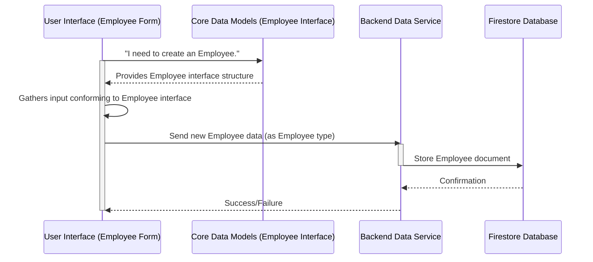

# Chapter 1: Core Data Models

This is the first chapter of our comprehensive tutorial for the `hr-app`. As we embark on building a robust Human Resources application, establishing a solid foundation for how we define and structure our data is paramount. This chapter will guide you through the principles and practicalities of Core Data Models, laying the groundwork for all subsequent development.

---

### Problem & Motivation

Imagine building an HR application where every developer, or even every part of the application, refers to employee details differently. One component might expect an employee's name as `fullName`, another as `employeeName`, and yet another as `name`. Some might expect a `hireDate` as a string, others as a Date object. This inconsistency would lead to a chaotic, error-prone, and incredibly difficult-to-maintain system.

This is precisely the problem that **Core Data Models** solve. They provide a unified "blueprint" or "contract" for how our application's key entities, like employees or leave requests, are represented. By defining these models clearly, we ensure that every piece of data is structured identically across the entire application, from the user interface to the backend database. For the `hr-app`, this is crucial for managing core HR functions consistently, such as ensuring all employee records capture the same essential information or that every leave request follows a predefined format.

Consider a concrete use case: Adding a new employee. Without a predefined `Employee` data model, the UI form might collect different fields than what the database expects, or what other parts of the application need to display. By establishing a clear `Employee` model, we guarantee that the form, the data storage, and the display components all operate on the same understanding of what an "employee" means. This consistency prevents bugs, simplifies development, and makes the system much more reliable.

---

### Core Concept Explanation: The Blueprint for Your Data

At its heart, a **Core Data Model** is a formal definition of how a specific type of data should look. Think of it as a **blueprint** for an object. Just as an architect's blueprint specifies the number of rooms, the dimensions, and the materials for a house, our data models specify the properties (fields), their names, and their data types (e.g., string, number, boolean) for an entity like an `Employee` or a `LeaveRequest`.

In TypeScript, a language we'll use extensively in `hr-app` for its type-checking capabilities, these blueprints are often defined using `interfaces` or `types`. An `interface` serves as a contract that objects must adhere to. If an object claims to be an `Employee`, it *must* have all the properties defined in the `Employee` interface, with the correct data types. This provides **type safety**, meaning the TypeScript compiler can catch potential errors related to incorrect data structures *before* the application even runs.

For our `hr-app`, the key terminology revolves around our main entities:
*   **Employee**: Represents a person working for the company, including their personal details, job information, and unique identifier.
*   **LeaveRequest**: Represents an employee's request for time off, including the type of leave, dates, status, and the employee who made the request.
*   **Holiday**: Represents company-wide non-working days.

These models ensure **data consistency**, meaning that whether you're fetching an employee's details from the database or updating a leave request through a form, the data will always have the same predictable shape. This predictability dramatically simplifies how different parts of the application interact with data, making our `hr-app` more robust and easier to expand in the future.

---

### Practical Usage Examples: Defining and Using Our Models

Let's look at how we define and use these core data models in our `hr-app`. We'll use TypeScript `interfaces` to provide strong type checking, which is a key benefit for maintaining large applications.

#### Defining the `Employee` Model

The `Employee` interface defines the expected structure for any employee record in our system.

```typescript
// src/types/employee.ts
export interface Employee {
  id: string;
  firstName: string;
  lastName: string;
  email: string;
  department: string;
  position: string;
  hireDate: string; // ISO 8601 date string
  status: 'active' | 'inactive' | 'on-leave';
}
```
This TypeScript `interface` acts as a blueprint. It states that any object considered an `Employee` must have these specific fields with their defined types. The `id` is crucial for uniquely identifying each employee.

#### Defining the `LeaveRequest` Model

Similarly, we define the `LeaveRequest` interface to standardize all leave requests.

```typescript
// src/types/leaveRequest.ts
export interface LeaveRequest {
  id: string;
  employeeId: string;
  type: 'annual' | 'sick' | 'unpaid' | 'maternity' | 'paternity';
  startDate: string; // ISO 8601 date string
  endDate: string;   // ISO 8601 date string
  status: 'pending' | 'approved' | 'rejected';
  reason?: string; // Optional field
  requestDate: string; // ISO 8601 date string
}
```
Here, `employeeId` links a leave request back to a specific `Employee`. We also see an optional field (`reason?`), indicating that it might not always be present.

#### Defining the `Holiday` Model

The `Holiday` interface specifies how company holidays are structured.

```typescript
// src/types/holiday.ts
export interface Holiday {
  id: string;
  name: string;
  date: string; // ISO 8601 date string
  type: 'public' | 'company';
}
```
This simple model helps us keep track of all official holidays, their dates, and types.

#### Using Data Models: Creating a New Employee

Now, let's see how these interfaces are used when we want to create an actual `Employee` object.

```typescript
import { Employee } from '../types/employee';

const newEmployee: Employee = {
  id: 'emp-001',
  firstName: 'Alice',
  lastName: 'Smith',
  email: 'alice.smith@example.com',
  department: 'Engineering',
  position: 'Software Engineer',
  hireDate: '2023-01-15',
  status: 'active',
};

console.log(newEmployee);
```
By declaring `newEmployee` as type `Employee`, TypeScript ensures that all required fields are present and have the correct types. If we missed `department` or used a `number` for `firstName`, TypeScript would flag an error during development. This is the "Quick Start" benefit – immediate feedback on data structure.

---

### Internal Implementation Walkthrough: Where Models Live and How They're Used

In our `hr-app`, these core data models typically reside in a dedicated directory, often named `src/types` or `src/models`. Each entity might have its own file for better organization and maintainability.

```
hr-app/
├── src/
│   ├── components/
│   ├── contexts/
│   ├── pages/
│   ├── services/
│   │   └── firebase.ts
│   └── types/             <- This is where our models live
│       ├── employee.ts
│       ├── leaveRequest.ts
│       └── holiday.ts
├── package.json
└── tsconfig.json
```

When defining our models in `src/types`, we use the `export` keyword so that other files in our project can `import` and use them.

For example, when an administrator uses a form in the UI to add a new employee, the data collected from that form will be structured according to the `Employee` interface. This structured data is then passed to a **Backend Data Service** (like a Firebase Firestore service) which, in turn, stores it.

Here's a sequence diagram illustrating this flow:


1.  The **User Interface (UI)**, specifically an employee creation form, internally uses the `Employee` interface to guide its structure and validate user input.
2.  Once the user submits the form, the collected data, now strongly typed as `Employee`, is passed to the **Backend Data Service**.
3.  The **Backend Data Service** then communicates with **Firestore**, our database, to persist this structured `Employee` data.

This shows how our `Core Data Models` are not just abstract definitions but active participants in the application's data flow, ensuring consistency from input to storage.

---

### System Integration: Connecting the Dots

Core Data Models are fundamental and interact with almost every other part of the `hr-app`:

*   **[Backend Data Services](chapter_02.md)**: These services are responsible for interacting with Firebase Firestore. They *expect* to receive data that conforms to our `Core Data Models` when creating or updating records, and they *return* data structured according to these models when fetching. This ensures seamless communication between our application and the database.

*   **[Global State Management (Contexts)](chapter_03.md)**: Our React Contexts, used for global state management, will store lists of employees, leave requests, and holiday information. These lists will be arrays of objects that conform precisely to our `Employee`, `LeaveRequest`, and `Holiday` interfaces, ensuring that our application's state is always consistent and predictable.

*   **[User Interface Components](chapter_04.md)**: UI components, such as forms, tables, and detail views, are designed to display or collect data based on these models. An "Employee Card" component, for instance, would expect an `Employee` object as a prop, knowing exactly which fields (e.g., `firstName`, `lastName`, `department`) to render.

*   **[Application Views (Pages)](chapter_05.md)**: Entire pages, like the "Employee List" page or "Leave Request Form," orchestrate multiple components and services. They rely on Core Data Models to manage the overall data flow, ensuring that data fetched from services is correctly shaped before being passed down to UI components or stored in global state.

This interconnectedness highlights the critical role of data models in providing a common language across the entire application architecture.

---

### Best Practices & Tips

To maximize the benefits of Core Data Models in `hr-app`, consider these best practices:

*   **Centralize Your Models**: Keep all your `interface` and `type` definitions in a dedicated `src/types` (or `src/models`) directory. This makes them easy to find, import, and manage.
*   **Be Explicit with Types**: Always use your defined interfaces when declaring variables, function parameters, and return types that handle your core entities. This leverages TypeScript's full power for type safety.
*   **Prioritize Immutability**: When updating an object based on a data model, especially in React, it's often better to create a *new* object with the updated values rather than directly mutating the existing one. This prevents unexpected side effects and aids state management.
    ```typescript
    const oldEmployee: Employee = { /* ... */ };
    const updatedEmployee: Employee = {
      ...oldEmployee, // Copy all existing fields
      status: 'on-leave', // Override specific fields
      department: 'HR'
    };
    ```
*   **Add Validation**: While TypeScript provides compile-time type safety, runtime validation is still crucial, especially for data coming from external sources (user input, API responses). Implement validation logic (e.g., using libraries like Zod or Yup) *before* saving data to ensure it adheres to business rules beyond just type.
*   **Version Your Models (for larger projects)**: As your application evolves, models might change. For very large or distributed systems, consider strategies to version your models (e.g., `EmployeeV1`, `EmployeeV2`) to handle backward compatibility gracefully. For `hr-app`, simple updates are likely sufficient initially.
*   **Avoid Over-Normalization in Interfaces**: While database schemas might sometimes be highly normalized, your *application's data models* can occasionally include denormalized fields (e.g., `employeeName` directly on `LeaveRequest` if frequently needed) for convenience, especially if it simplifies UI rendering and reduces API calls.
*   **Troubleshooting Tip**: If you encounter `TypeError` or unexpected data shapes, the first place to check is usually your data model definitions and how data is being converted or mapped to these models. Always ensure data matches the interface.

---

### Chapter Conclusion

In this foundational chapter, we've explored the critical role of **Core Data Models** in building a robust and maintainable application like the `hr-app`. We learned that these models act as essential blueprints, ensuring data consistency, enabling type safety through TypeScript interfaces, and preventing common errors related to data structure. From defining our `Employee`, `LeaveRequest`, and `Holiday` entities to understanding their integration across the application's architecture, we've established the bedrock for how our HR data will be organized.

With a clear understanding of our data's shape, we are now ready to delve into how this data is persisted, retrieved, and managed. The next chapter will focus on the **Backend Data Services** responsible for these operations, specifically leveraging Firebase Firestore to interact with our structured data.

Continue to the next chapter to learn how our `hr-app` interacts with the backend: [Backend Data Services](chapter_02.md)