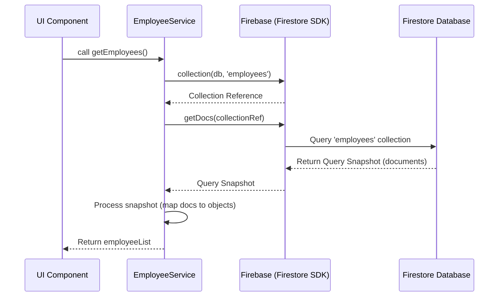
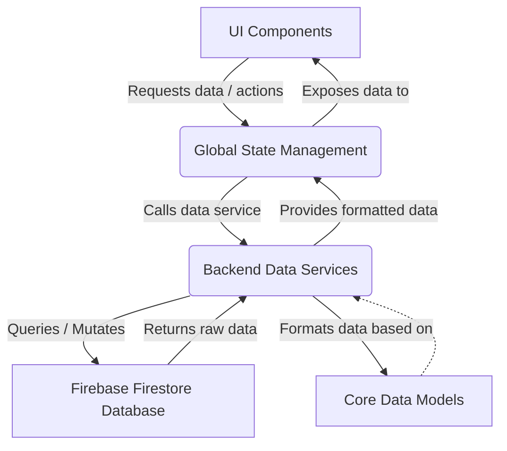

# Chapter 2: Backend Data Services

In the previous chapter, [Core Data Models](chapter_01.md), we established the foundational structures that define the entities within our HR application. We learned how an `Employee`, `LeaveRequest`, or `Holiday` should be shaped and structured. While these models provide a blueprint for our data, they don't handle how this data is actually stored, retrieved, or managed in a persistent way. This is precisely where Backend Data Services come into play.

---

### Problem & Motivation

Imagine building an HR application where every part of your user interface directly communicates with the database. One component might fetch employee details, another might save a new leave request, and yet another might delete a holiday entry. This approach quickly leads to a chaotic and unmaintainable codebase. Database query logic would be scattered throughout your application, making it difficult to debug, secure, and scale. Furthermore, changing your database technology would require rewriting large portions of your frontend code.

The 'Backend Data Services' abstraction solves this critical problem by centralizing all data-related operations. It acts as a dedicated layer that encapsulates the complexities of interacting with our chosen backend, Firebase Firestore. For the `hr-app`, this means providing a consistent and clean interface for any part of the application to perform CRUD (Create, Read, Update, Delete) operations on employee, leave, and settings data, without needing to know the specifics of Firestore's API. A concrete use case for this chapter will be **fetching a list of all employees** to display on a dashboard, ensuring we can easily retrieve and present up-to-date staff information.

---

### Core Concept Explanation

At its heart, a Backend Data Service is a set of functions designed to abstract away the direct interaction with your database. Think of it as the "data librarian" for your application. When you need information (e.g., employee details) or want to store something new (e.g., a new leave request), you don't go directly to the database shelves yourself. Instead, you ask the librarian, who knows exactly where to find or place the data, how to handle the requests, and how to communicate with the storage system.

In the context of the `hr-app`, our "librarian" is a collection of JavaScript modules that export functions like `getEmployees()`, `addLeaveRequest()`, `updateEmployee()`, and `deleteHoliday()`. These functions act as a public API for our application's data layer. They hide the underlying details of Firebase Firestore queries, security rules, and data formatting, presenting a simple, consistent interface to the rest of the application. This separation of concerns makes our application more modular, easier to test, and significantly more adaptable to changes in our data storage strategy or requirements.

---

### Practical Usage Examples

Let's illustrate how a frontend component would use our `Backend Data Services` to fetch the list of employees, addressing our motivating use case. First, we need to ensure our Firebase connection is established.

#### Initializing Firebase

Before any data service can communicate with Firestore, Firebase needs to be initialized in your application. This is typically done once, at the application's entry point.

```javascript
// src/config/firebase.js
import { initializeApp } from 'firebase/app';
import { getFirestore } from 'firebase/firestore';

// Your web app's Firebase configuration
const firebaseConfig = {
  apiKey: "YOUR_API_KEY",
  authDomain: "YOUR_AUTH_DOMAIN",
  projectId: "YOUR_PROJECT_ID",
  storageBucket: "YOUR_STORAGE_BUCKET",
  messagingSenderId: "YOUR_MESSAGING_SENDER_ID",
  appId: "YOUR_APP_ID"
};

// Initialize Firebase
const app = initializeApp(firebaseConfig);
export const db = getFirestore(app); // Export Firestore instance
```
This small configuration snippet sets up Firebase for our application, making the `db` (Firestore database instance) available for our data services to use.

#### Fetching Employees Service Function

Now, let's create a dedicated service function to get all employees. This function will live in a service file, abstracting the Firestore query.

```javascript
// src/services/employeeService.js
import { collection, getDocs } from 'firebase/firestore';
import { db } from '../config/firebase'; // Our Firestore instance

export const getEmployees = async () => {
  const employeesCol = collection(db, 'employees');
  const employeeSnapshot = await getDocs(employeesCol);
  const employeeList = employeeSnapshot.docs.map(doc => ({
    id: doc.id,
    ...doc.data()
  }));
  return employeeList;
};
```
The `getEmployees` function is an asynchronous function that queries the 'employees' collection in Firestore, retrieves all documents, and then maps them into a cleaner array of employee objects, each including its `id`.

#### Using the Service in a Component

A React component can now easily fetch employees without worrying about Firestore specifics:

```javascript
// src/components/EmployeeList.jsx
import React, { useEffect, useState } from 'react';
import { getEmployees } from '../services/employeeService';

function EmployeeList() {
  const [employees, setEmployees] = useState([]);

  useEffect(() => {
    const fetchEmployees = async () => {
      try {
        const data = await getEmployees();
        setEmployees(data);
      } catch (error) {
        console.error("Failed to fetch employees:", error);
      }
    };
    fetchEmployees();
  }, []);

  return (
    <div>
      <h2>Employee Directory</h2>
      {employees.map(employee => (
        <p key={employee.id}>{employee.firstName} {employee.lastName}</p>
      ))}
    </div>
  );
}
export default EmployeeList;
```
Here, the `EmployeeList` component simply calls `getEmployees()` from `employeeService.js`. It doesn't need to import `firebase/firestore` or know anything about collections, documents, or snapshots. It receives a clean array of employee data, which it then renders. This demonstrates the power of abstraction in keeping component logic clean and focused on presentation.

---

### Internal Implementation Walkthrough

Let's delve a bit deeper into what happens inside our `employeeService.js` and how it interacts with Firestore. Our project structure would typically include a `src/services` directory for all data services and `src/config` for Firebase initialization.

```
hr-app/
├── src/
│   ├── components/
│   ├── config/
│   │   └── firebase.js          // Firebase initialization
│   ├── services/
│   │   ├── employeeService.js   // Employee CRUD operations
│   │   ├── leaveService.js      // Leave request CRUD operations
│   │   └── settingsService.js   // Application settings CRUD operations
│   └── App.js
└── ...
```

When `getEmployees` is called, the following steps occur:

1.  **Import Firestore Instance**: It first imports the `db` object from `../config/firebase`, which is our initialized Firestore instance.
2.  **Reference Collection**: `collection(db, 'employees')` creates a reference to the 'employees' collection in our Firestore database. This tells Firestore which group of documents we're interested in.
3.  **Fetch Documents**: `getDocs(employeesCol)` sends a request to Firestore to retrieve all documents within that 'employees' collection. This is an asynchronous operation, meaning it takes time to complete, so we use `await`.
4.  **Process Snapshot**: The `await getDocs()` call returns a `QuerySnapshot`. This snapshot contains metadata about the query and, crucially, an array of `QueryDocumentSnapshot` objects (accessible via `employeeSnapshot.docs`), each representing a document in the collection.
5.  **Map Data**: We then iterate over `employeeSnapshot.docs` using `.map()`. For each document snapshot:
    *   `doc.id` retrieves the unique ID of the document generated by Firestore.
    *   `doc.data()` retrieves the actual data fields of the document as a plain JavaScript object.
    *   We combine these into a new object `{ id: doc.id, ...doc.data() }` to ensure each employee object includes its unique ID directly, which is useful for React keys and future operations.
6.  **Return List**: Finally, the function returns this processed `employeeList` array.

Here's a simple sequence diagram illustrating this flow:


This sequence ensures that the UI component only deals with the `employeeList` directly, completely abstracting the database interaction.

---

### System Integration

The Backend Data Services layer is a foundational piece that connects directly to our [Core Data Models](chapter_01.md) and feeds data into higher-level abstractions like [Global State Management (Contexts)](chapter_03.md) and ultimately to [User Interface Components](chapter_04.md).

*   **Core Data Models Integration**: The data services are responsible for *transforming* raw data from Firestore into the shapes defined by our [Core Data Models](chapter_01.md) (e.g., ensuring an employee object has `firstName`, `lastName`, `email` etc.). When adding or updating data, they also ensure that the data *conforms* to these models before sending it to the database.
*   **Global State Management Integration**: Once data is fetched by a data service, it's often passed to a React Context (e.g., `EmployeeContext`). This context then makes the data globally available to any component that needs it, avoiding prop-drilling and ensuring a single source of truth for our application's state.
*   **User Interface Components Integration**: Components don't directly call data services in most cases. Instead, they consume data from contexts, and when they need to trigger a data operation (like adding a new employee), they typically call a function provided by a context, which in turn orchestrates the call to the relevant data service.

Here's a simplified data flow diagram:


This flow highlights how data services act as the intermediary between the persistent storage and the application's interactive layers.

---

### Best Practices & Tips

Adhering to best practices for Backend Data Services is crucial for building a robust and maintainable application.

*   **Error Handling**: Always wrap your asynchronous database calls in `try...catch` blocks. This ensures that network issues, permission errors, or incorrect query paths are gracefully handled, preventing your application from crashing and providing meaningful feedback to the user or developer.
    ```javascript
    // Example with error handling
    export const getEmployees = async () => {
      try {
        const employeesCol = collection(db, 'employees');
        const employeeSnapshot = await getDocs(employeesCol);
        // ... process data ...
        return employeeList;
      } catch (error) {
        console.error("Error fetching employees:", error);
        throw new Error("Could not retrieve employee data."); // Re-throw for calling context
      }
    };
    ```
*   **Data Validation**: Before sending data to Firestore (e.g., `addEmployee`, `updateLeaveRequest`), it's good practice to validate the data against your [Core Data Models](chapter_01.md). This prevents malformed data from entering your database and ensures data integrity.
*   **Firestore Security Rules**: While data services abstract client-side interaction, never rely solely on them for security. Implement strong [Firestore Security Rules](https://firebase.google.com/docs/firestore/security/overview) to protect your data directly at the database level, ensuring only authorized users can perform specific operations.
*   **Reusability and Genericity**: Design your service functions to be as generic and reusable as possible. For instance, you might have a generic `addDocument(collectionName, data)` instead of separate `addEmployee`, `addLeave` functions, provided the data structure is consistent.
*   **Performance Considerations**:
    *   **Indexing**: Ensure your Firestore collections have appropriate indexes for frequently queried fields to optimize read performance.
    *   **Pagination**: For large collections, implement pagination in your `get` functions to fetch data in smaller, manageable chunks rather than loading everything at once.
    *   **Realtime Listeners**: Use Firestore's realtime listeners (`onSnapshot`) for data that needs to be constantly up-to-date (like chat messages or active leave requests) but be mindful of their impact on billing and resource usage.
*   **Troubleshooting Common Issues**:
    *   **Permission Denied**: Check your Firestore Security Rules. This is a very common cause of read/write failures.
    *   **Missing Data**: Verify the collection path and document IDs are correct. Data is case-sensitive!
    *   **Network Errors**: Ensure the user has an active internet connection and that Firebase services are reachable.

---

### Chapter Conclusion

In this chapter, we've explored the critical role of Backend Data Services in the `hr-app`. We've seen how they act as a robust and organized intermediary between our application's frontend and the Firebase Firestore database, centralizing data logic and significantly simplifying data management. By abstracting complex database interactions, these services enable us to write cleaner, more maintainable code and provide a solid foundation for future features.

We started with the conceptual understanding, moved through practical examples of fetching employee data, and delved into the internal workings and best practices. Now that we have a clear mechanism for interacting with our backend data, the next logical step is to explore how we can make this data readily available throughout our React application without manually passing it down through many levels of components. This leads us directly to our next topic: [Global State Management (Contexts)](chapter_03.md).