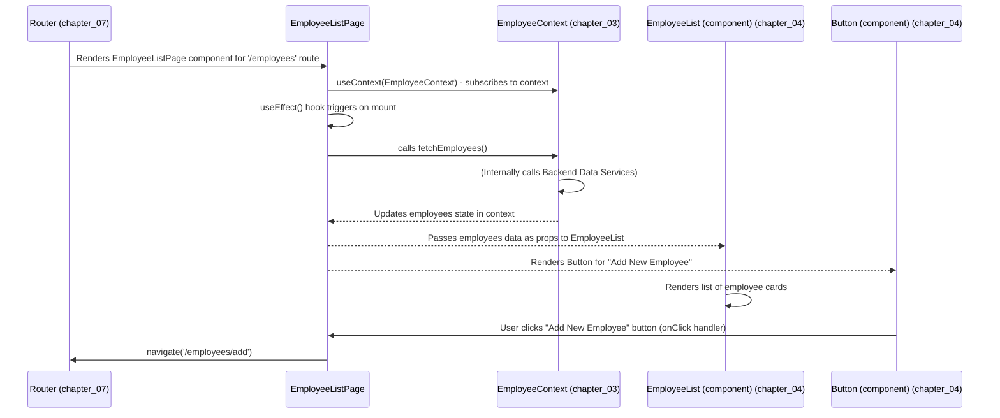

# Chapter 5: Application Views (Pages)

In the previous chapter, we explored [User Interface Components](chapter_04.md), the foundational visual building blocks of our `hr-app`. We learned how to create reusable elements like `Button`, `Input`, and more complex ones like `EmployeeList` or `LeaveRequestCard`, each designed to display specific data or capture user input. While these components are crucial, they are like individual bricks; they need to be arranged and combined to form complete rooms or sections of a house. This is precisely the role of **Application Views (Pages)**.

---

### Problem & Motivation

Imagine our HR application where a user needs to see a comprehensive list of all employees. This isn't just a single component; it requires a layout, a title, a navigation bar, the actual `EmployeeList` component, possibly a button to add a new employee, and maybe even a search bar. If each of these elements were handled independently without a coordinating structure, our application's UI would quickly become fragmented and difficult to manage. How do we ensure that all the necessary components for a specific user task are present, arranged correctly, and fed the right data?

This is the problem that Application Views (Pages) solve. They act as dedicated containers that orchestrate the various [User Interface Components](chapter_04.md) and connect them to the application's [Global State Management (Contexts)](chapter_03.md). Without pages, our application would lack distinct screens or workflows, making navigation and feature delivery incoherent. For the `hr-app`, pages are essential for presenting a clear "Employee List" screen, a dedicated "Add Employee" form, or a "Leave Request Dashboard," each offering a complete, focused user experience.

---

### Core Concept Explanation

**Application Views (Pages)** are high-level React components that represent distinct screens or sections of the `hr-app`. Think of them as the canvas upon which smaller [User Interface Components](chapter_04.md) are painted and arranged to form a complete picture. Each page is designed to fulfill a specific user goal, such as viewing all employees, submitting a leave request, or editing an employee's profile.

Pages are primarily responsible for:
1.  **Orchestration**: Deciding *which* components appear on a screen and *how* they are laid out.
2.  **Data Fetching**: Initiating data retrieval from [Global State Management (Contexts)](chapter_03.md) or directly from [Backend Data Services](chapter_02.md) when the page loads.
3.  **State Management**: Passing fetched data and event handlers down to child [User Interface Components](chapter_04.md) as props.
4.  **Routing**: Serving as the target for our application's routing system (which we'll cover in [Application Entry and Routing](chapter_07.md)). When a user navigates to a specific URL, a corresponding page component is rendered.

Unlike individual UI components, which are often stateless or manage only their internal presentation state, pages typically manage the *overall* state required for their screen, pulling information from various contexts and preparing it for display. They are the "smart" wrappers that give context to our "dumb" (presentational) components.

---

### Practical Usage Examples

Let's illustrate how pages bring together components and contexts.

#### Example 1: `EmployeeListPage.js`

This page is responsible for displaying a list of all employees and providing a way to navigate to the "add employee" functionality.

```jsx
// src/pages/EmployeeListPage.js
import React, { useContext, useEffect } from 'react';
import { EmployeeContext } from '../contexts/EmployeeContext';
import { EmployeeList } from '../components/EmployeeList';
import { Button } from '../components/common/Button';
import { useNavigate } from 'react-router-dom'; // For navigation

function EmployeeListPage() {
  const { employees, fetchEmployees } = useContext(EmployeeContext);
  const navigate = useNavigate();

  useEffect(() => {
    fetchEmployees(); // Fetch employees when the page loads
  }, [fetchEmployees]); // Dependency array includes fetchEmployees

  const handleAddEmployeeClick = () => {
    navigate('/employees/add'); // Navigate to the add employee page
  };

  return (
    <div className="container mx-auto p-4">
      <h2 className="text-2xl font-bold mb-4">Employee Directory</h2>
      <Button onClick={handleAddEmployeeClick} className="mb-4">
        Add New Employee
      </Button>
      {employees.length > 0 ? (
        <EmployeeList employees={employees} />
      ) : (
        <p>No employees found. Add one now!</p>
      )}
    </div>
  );
}

export default EmployeeListPage;
```
*Explanation*: The `EmployeeListPage` imports the `EmployeeContext` to access `employees` data and the `fetchEmployees` function. It uses `useEffect` to call `fetchEmployees` once when the page mounts. It then renders an `EmployeeList` component, passing the `employees` data as a prop. A `Button` component is also included to allow navigation to the employee creation page, demonstrating how pages orchestrate user flow.

---

#### Example 2: `AddEmployeePage.js`

This page provides a form for adding new employee details.

```jsx
// src/pages/AddEmployeePage.js
import React, { useContext } from 'react';
import { EmployeeContext } from '../contexts/EmployeeContext';
import { EmployeeForm } from '../components/EmployeeForm';
import { useNavigate } from 'react-router-dom';

function AddEmployeePage() {
  const { addEmployee } = useContext(EmployeeContext);
  const navigate = useNavigate();

  const handleSubmit = async (employeeData) => {
    await addEmployee(employeeData); // Use context to add employee
    navigate('/employees'); // Navigate back to the employee list
  };

  const handleCancel = () => {
    navigate('/employees'); // Go back without saving
  };

  return (
    <div className="container mx-auto p-4">
      <h2 className="text-2xl font-bold mb-4">Add New Employee</h2>
      <EmployeeForm onSubmit={handleSubmit} onCancel={handleCancel} />
    </div>
  );
}

export default AddEmployeePage;
```
*Explanation*: The `AddEmployeePage` imports `EmployeeContext` to use the `addEmployee` function. It renders an `EmployeeForm` component (which handles all the input fields internally) and passes a `handleSubmit` function as a prop. This `handleSubmit` function uses the context to persist the new employee data and then navigates the user back to the employee list.

---

### Internal Implementation Walkthrough

At its core, a page is a standard React functional component. Its "implementation" largely involves the intelligent composition of other elements:

1.  **Imports**: Pages typically import:
    *   Specific [User Interface Components](chapter_04.md) that they need to display.
    *   Relevant [Global State Management (Contexts)](chapter_03.md) to access shared data and functions.
    *   React hooks like `useState`, `useEffect`, `useContext`, and `useNavigate` from `react-router-dom`.

2.  **Context Consumption**: Using `useContext`, pages hook into global state. For instance, `EmployeeListPage` uses `EmployeeContext` to get the list of `employees`.

3.  **Data Loading (`useEffect`)**: Often, pages need to fetch data when they first load. This is done using the `useEffect` hook. A common pattern is to call a data-fetching function (provided by a context) inside `useEffect`.

4.  **JSX Layout**: The `return` statement of a page component contains the JSX that defines the layout of the screen. This is where `div` elements, headings, and all the imported [User Interface Components](chapter_04.md) are arranged.

5.  **Event Handling**: Pages might define event handlers (e.g., `handleAddEmployeeClick`, `handleSubmit`) that respond to user interactions (often from child components) by updating state, calling context functions, or navigating.

Here's a simplified sequence of events for `EmployeeListPage`:


*Explanation*: The Router directs to `EmployeeListPage`. The page then uses `EmployeeContext` to fetch data via `fetchEmployees` (which internally interacts with [Backend Data Services](chapter_02.md)). Once data is available, `EmployeeListPage` passes it to the `EmployeeList` UI component for display. It also renders a `Button` which, when clicked, triggers navigation to another page.

---

### System Integration

Application Views (Pages) are the glue that holds our frontend architecture together:

*   **Integration with [User Interface Components](chapter_04.md)**: Pages are the primary consumers of UI components. They import and compose them into meaningful screens, passing data and event handlers as props. For example, `EmployeeListPage` uses `EmployeeList` and `Button` components.
*   **Integration with [Global State Management (Contexts)](chapter_03.md)**: Pages directly interact with contexts to access and manipulate global application state. They use `useContext` to get data (e.g., `employees` from `EmployeeContext`) and functions (e.g., `fetchEmployees`, `addEmployee`). This ensures that the data displayed on a page is consistent and reactive.
*   **Integration with [Backend Data Services](chapter_02.md)**: While pages don't directly call backend services, they trigger functions from contexts (e.g., `addEmployee`), which in turn use the [Backend Data Services](chapter_02.md) to communicate with Firebase Firestore.
*   **Role in [Application Entry and Routing](chapter_07.md)**: Pages are the direct targets of our routing system. The router maps specific URL paths (e.g., `/employees`, `/employees/add`) to render corresponding page components. This defines the overall navigational structure of the application.

Pages act as a crucial layer, abstracting the complexity of data fetching and state management from pure UI components, and providing a cohesive user experience across different application sections.

---

### Best Practices & Tips

*   **Keep Pages Lean**: Pages should primarily focus on orchestration: fetching data, arranging components, and handling navigation. Avoid embedding complex business logic directly within page components; delegate such logic to [Global State Management (Contexts)](chapter_03.md) or custom hooks.
*   **Smart vs. Dumb Components**: Think of pages as "smart" components that know *what* data to get and *which* components to render, while [User Interface Components](chapter_04.md) are "dumb" (presentational) components that only know *how* to render data passed to them.
*   **Single Responsibility Principle**: Each page should ideally have a single, clear responsibility (e.g., `EmployeeListPage` manages the employee list view, `AddEmployeePage` manages adding an employee).
*   **Error Boundaries**: Consider wrapping complex page sections or even entire pages with React Error Boundaries to gracefully handle rendering errors within specific parts of the UI, preventing the entire application from crashing.
*   **Lazy Loading**: For larger applications, lazy loading pages (using `React.lazy` and `Suspense`) can significantly improve initial load times by only loading page code when it's actually needed. We will cover this briefly in [Application Entry and Routing](chapter_07.md).

---

### Chapter Conclusion

Application Views (Pages) are fundamental to structuring our `hr-app` by defining distinct screens and workflows. They serve as the orchestrators, bringing together [User Interface Components](chapter_04.md) and data from [Global State Management (Contexts)](chapter_03.md) to create complete and interactive user experiences. By adhering to best practices, we can build a maintainable and scalable application where each page clearly serves a specific purpose, contributing to a robust frontend architecture.

Having established how data is modeled, managed globally, rendered through components, and composed into pages, our next crucial step is to secure access to these pages and functions. In the upcoming chapter, we will delve into the critical aspects of **User Authentication**.

[User Authentication](chapter_06.md)