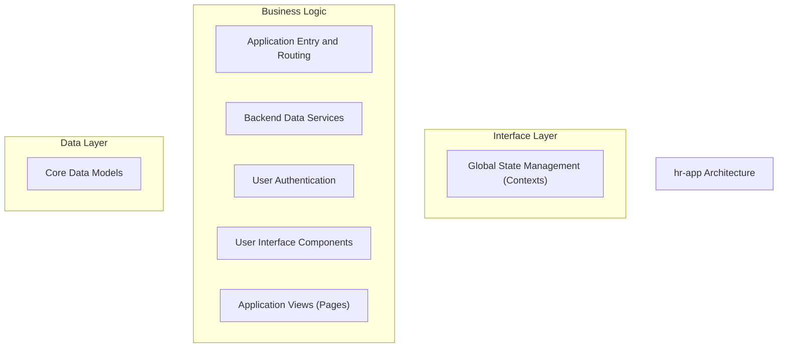
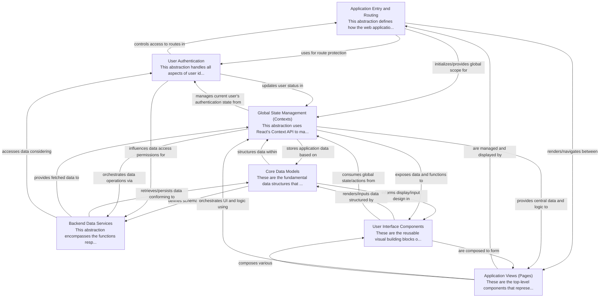

# hr-app Tutorial

Welcome to the comprehensive tutorial for hr-app. This tutorial is automatically generated from the codebase to help you understand the core concepts and implementation patterns.

## Project Overview

The 'hr-app' is a React-based web application designed to manage core HR functions, such as employee details and leave requests. It leverages Firebase Firestore for backend data persistence and organizes its frontend architecture using React Context for global state management and modular user interface components, all orchestrated by a robust routing system.

## System Architecture

## Component Relationships

## Table of Contents

1. [Chapter 1: Core Data Models](chapter_01.md) - Comprehensive documentation for Core Data Models following structured methodology...
2. [Chapter 2: Backend Data Services](chapter_02.md) - Comprehensive documentation for Backend Data Services following structured methodology...
3. [Chapter 3: Global State Management (Contexts)](chapter_03.md) - Comprehensive documentation for Global State Management (Contexts) following structured methodology...
4. [Chapter 4: User Interface Components](chapter_04.md) - Comprehensive documentation for User Interface Components following structured methodology...
5. [Chapter 5: Application Views (Pages)](chapter_05.md) - Comprehensive documentation for Application Views (Pages) following structured methodology...
6. [Chapter 6: User Authentication](chapter_06.md) - Comprehensive documentation for User Authentication following structured methodology...
7. [Chapter 7: Application Entry and Routing](chapter_07.md) - Comprehensive documentation for Application Entry and Routing following structured methodology...

## How to Use This Tutorial

1. **Start with Chapter 1** to understand the foundational concepts
2. **Follow the sequence** - each chapter builds upon previous concepts
3. **Practice with code examples** - every chapter includes practical examples
4. **Refer to diagrams** - use architecture diagrams for visual understanding
5. **Cross-reference concepts** - chapters link to related topics

## Tutorial Features

- **Progressive Learning**: Concepts are introduced in logical order
- **Code Examples**: Every chapter includes practical, executable code
- **Visual Diagrams**: Mermaid diagrams illustrate complex relationships
- **Cross-References**: Easy navigation between related concepts
- **Beginner-Friendly**: Written for newcomers to the codebase

## Contributing

This tutorial is auto-generated from the codebase. To improve it:
1. Update the source code documentation
2. Add more detailed comments to key functions
3. Regenerate the tutorial using the documentation system

---

*Generated using AI-powered codebase analysis*
