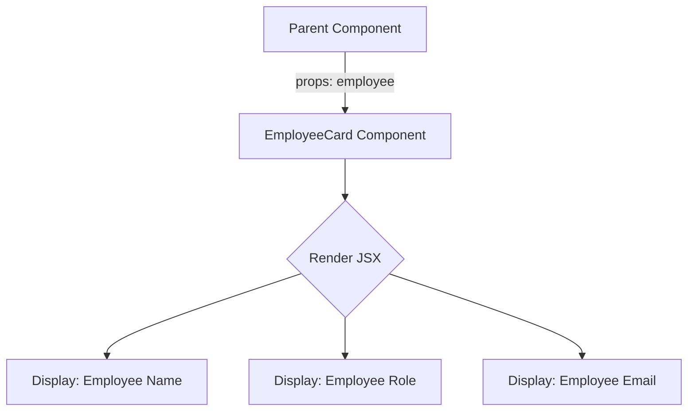

# Chapter 4: User Interface Components

Having established a robust system for [Global State Management (Contexts)](chapter_03.md), where application data and functions are readily available across our 'hr-app', the next logical step is to build the visual elements that interact with this state and present information to the user. This chapter focuses on **User Interface Components**—the foundational building blocks of our application's visual layer.

---

### Problem & Motivation

In a complex application like 'hr-app', building the user interface can quickly become chaotic without a structured approach. Imagine repeatedly writing the same HTML and CSS for an employee's display card or a generic input field. This leads to:

*   **Inconsistency**: Different parts of the app might look or behave slightly differently.
*   **Redundancy**: Developers waste time rewriting existing UI patterns.
*   **Maintenance Headaches**: A change to a common UI element requires updating it in many places.
*   **Difficulty in Collaboration**: Teams struggle to maintain a unified design language.

Our project, 'hr-app', needs a consistent and efficient way to render employee details, leave requests, and forms. For instance, displaying an employee's basic information (name, role, contact) on multiple screens (e.g., employee list, profile page, leave approval screen) would traditionally involve copying and pasting code. This is inefficient and error-prone. By creating reusable UI components, we solve these problems, ensuring a cohesive look and feel while boosting development speed and maintainability.

---

### Core Concept Explanation

User Interface Components are essentially self-contained, reusable pieces of UI that define both their appearance and behavior. In a React application like 'hr-app', a component is a JavaScript function or class that returns a piece of UI (JSX). They encapsulate presentation logic, state, and markup, making them independent units that can be composed together to build complex interfaces.

Think of UI components like LEGO bricks. You have basic bricks (atomic components like `Button`, `Input`), then you combine them to make small structures (molecular components like `EmployeeCard`, `LeaveRequestItem`), and eventually, these structures form larger models (organism components or entire pages like `EmployeeList` or `LeaveRequestForm`). This modular approach brings numerous benefits:

*   **Reusability**: Write once, use everywhere.
*   **Maintainability**: Fix an issue in one component, and it's fixed across the app.
*   **Testability**: Smaller, isolated components are easier to test.
*   **Separation of Concerns**: Each component focuses on a specific part of the UI.

In the 'hr-app', these components range from generic, presentational elements (like a `Card` or a `Spinner`) to more domain-specific ones (like an `EmployeeDetails` panel or a `LeaveRequestForm`). They receive data via `props` (properties) from their parent components or directly consume application-wide state via React Context, and they often manage their own internal state to handle user interactions.

---

### Practical Usage Examples

Let's illustrate the concept with a basic, but very common, component for our 'hr-app': an `EmployeeCard`. This component will display essential information about an employee.

First, let's define a simple component that accepts an `employee` object as a prop:

```jsx
// src/components/EmployeeCard.jsx
import React from 'react';

/**
 * Renders a card displaying basic employee information.
 * @param {object} props - Component props.
 * @param {object} props.employee - The employee data object.
 */
const EmployeeCard = ({ employee }) => {
  return (
    <div className="employee-card">
      <h3>{employee.firstName} {employee.lastName}</h3>
      <p>Role: {employee.role}</p>
      <p>Email: {employee.email}</p>
      {/* ... more employee details */}
    </div>
  );
};

export default EmployeeCard;
```
*Explanation*: This `EmployeeCard` is a functional React component. It expects an `employee` object as a property (`prop`). It then uses JSX to render a `div` containing the employee's first name, last name, role, and email. The `className="employee-card"` is for styling, which would be defined in a separate CSS file.

Now, let's see how we might use this `EmployeeCard` within another part of our application, perhaps an `EmployeeList` component:

```jsx
// src/components/EmployeeList.jsx (simplified)
import React from 'react';
import EmployeeCard from './EmployeeCard';

// Assume 'employees' data comes from a parent or context
const EmployeeList = ({ employees }) => {
  return (
    <div className="employee-list-container">
      <h2>Our Team</h2>
      {employees.map(employee => (
        <EmployeeCard key={employee.id} employee={employee} />
      ))}
    </div>
  );
};

export default EmployeeList;
```
*Explanation*: The `EmployeeList` component receives an array of `employees`. It then `map`s over this array, rendering an `EmployeeCard` for each employee. The `key={employee.id}` is crucial for React to efficiently update lists. This demonstrates how a reusable `EmployeeCard` component simplifies rendering multiple employee entries.

---

### Internal Implementation Walkthrough

At its core, a React component is a JavaScript function (or class, though functional components with Hooks are more common now) that describes what should be rendered to the UI. Let's look at a simpler, more atomic component like a `Button` to understand the internal workings.

```jsx
// src/components/Button.jsx
import React from 'react';

/**
 * A reusable button component.
 * @param {object} props - Component props.
 * @param {Function} props.onClick - Handler for click events.
 * @param {React.ReactNode} props.children - The content inside the button.
 * @param {'primary' | 'secondary' | 'danger'} [props.variant='primary'] - Button style variant.
 */
const Button = ({ onClick, children, variant = 'primary' }) => {
  // Construct a CSS class based on the variant prop
  const className = `btn btn-${variant}`;

  return (
    <button className={className} onClick={onClick}>
      {children}
    </button>
  );
};

export default Button;
```
*Explanation*:
1.  **`import React from 'react';`**: All React components need to import `React` to use JSX.
2.  **Functional Component**: `const Button = ({ onClick, children, variant = 'primary' }) => { ... };` defines a function component that receives `props` as its first argument (destructured here into `onClick`, `children`, and `variant`).
3.  **Default Props**: `variant = 'primary'` provides a default value for the `variant` prop if it's not explicitly passed.
4.  **JSX Return**: The function returns JSX, which is a syntax extension for JavaScript that allows you to write HTML-like code directly in your JavaScript files. React then transpiles this into `React.createElement` calls.
5.  **Props Usage**: `onClick={onClick}` and `className={className}` demonstrate how props are passed down to native HTML elements or other components. `{children}` renders whatever content is placed between the opening and closing tags of the `<Button>` component.

This simple `Button` component can now be used throughout the application, ensuring consistency in behavior and styling. For more complex components like `EmployeeCard`, they might also manage internal state using the `useState` hook or subscribe to global state using `useContext` (as learned in [Global State Management (Contexts)](chapter_03.md)).

Here's a simple diagram illustrating the data flow within our `EmployeeCard` component:


*Explanation*: The Parent Component provides the `employee` object as a prop to the `EmployeeCard`. The `EmployeeCard` then uses this data to render the specific details on the screen.

---

### System Integration

User Interface Components are at the heart of how users interact with the 'hr-app'. They integrate deeply with other abstractions:

1.  **Consuming [Core Data Models](chapter_01.md)**: Components often receive data structured according to our defined `Employee`, `LeaveRequest`, or `Holiday` models. For example, `EmployeeCard` directly expects an `Employee` object.

    ```jsx
    // Example: EmployeeCard expecting an Employee model
    // This implicitly assumes the 'employee' prop conforms to the Employee model from chapter_01.md
    const employeeData = {
      id: "emp-001",
      firstName: "John",
      lastName: "Doe",
      email: "john.doe@example.com",
      role: "Software Engineer",
      // ... other Employee model fields
    };
    <EmployeeCard employee={employeeData} />
    ```

2.  **Interacting with [Global State Management (Contexts)](chapter_03.md)**: Many components, especially those that need to perform actions or display global data (e.g., currently logged-in user, a list of all employees), will consume contexts. For instance, an `EmployeeForm` component might use an `EmployeeContext` to dispatch an action to add a new employee, which then uses [Backend Data Services](chapter_02.md).

    ```jsx
    // src/components/EmployeeForm.jsx (simplified)
    import React, { useState, useContext } from 'react';
    import { EmployeeContext } from '../context/EmployeeContext'; // From chapter_03.md

    const EmployeeForm = () => {
      const { addEmployee } = useContext(EmployeeContext);
      const [newEmployee, setNewEmployee] = useState({ /* ... */ });

      const handleSubmit = (e) => {
        e.preventDefault();
        addEmployee(newEmployee); // Calls context function, which uses chapter_02.md
        setNewEmployee({ /* ...reset */ });
      };

      return (
        <form onSubmit={handleSubmit}>
          {/* Input fields */}
          <button type="submit">Add Employee</button>
        </form>
      );
    };
    ```
    *Explanation*: The `EmployeeForm` uses `useContext(EmployeeContext)` to get the `addEmployee` function provided by the context. When the form is submitted, `addEmployee` is called, which internally leverages the backend services.

3.  **Assembling into [Application Views (Pages)](chapter_05.md)**: Individual UI components are the building blocks that `pages` (or views) compose to create complete user interfaces. A page like `EmployeeListPage` would primarily consist of an `EmployeeList` component, potentially with filtering components and navigation.

Here's a diagram illustrating how a component might interact within the broader system:

```mermaid
graph TD
    A[EmployeeForm Component] -->|uses useContext| B[EmployeeContext (Chapter 3)]
    B -->|dispatches addEmployee| C[Backend Data Services (Chapter 2)]
    C --> D[Firestore Database]
    E[EmployeeList Component] -->|uses useContext| B
    B -->|provides employees data| E
    E --> F[EmployeeCard Component];
    F -->|displays Employee Model| G[Core Data Models (Chapter 1)]
    H[Application Page (Chapter 5)] --> A & E;
```
*Explanation*: This flow shows how `EmployeeForm` and `EmployeeList` components interact with the `EmployeeContext` to either modify or retrieve data. The context, in turn, interacts with `Backend Data Services` and the `Firestore Database`. Ultimately, these components are assembled together to form an `Application Page`.

---

### Best Practices & Tips

*   **Single Responsibility Principle**: Each component should ideally do one thing well. A `Button` component should just be a button, not a button that also fetches data and manages complex state.
*   **Prop-Driven Design**: Design components to be configurable via props. This makes them more reusable and testable.
*   **Presentational vs. Container Components**:
    *   **Presentational components** (dumb components) focus solely on *how things look*. They receive data and callbacks via props and rarely have their own state. (e.g., `EmployeeCard`, `Button`).
    *   **Container components** (smart components) focus on *how things work*. They fetch data, manage state, and pass data/callbacks to presentational children. (e.g., `EmployeeList` when it fetches data from context). This distinction helps maintain a clear separation of concerns.
*   **Accessibility (A11y)**: Always consider accessibility. Use semantic HTML, provide `alt` text for images, manage focus, and ensure keyboard navigation.
*   **Styling**: Choose a consistent styling approach (CSS Modules, Styled Components, Tailwind CSS) and stick to it. Encapsulate component-specific styles to avoid conflicts.
*   **Storybook (Optional but Recommended)**: For larger projects, a tool like Storybook can be invaluable for developing, testing, and documenting UI components in isolation.
*   **Avoid Prop Drilling**: If a prop needs to be passed through many levels of components, consider using React Context (as covered in [Global State Management (Contexts)](chapter_03.md)) to make it available to deeply nested children without explicit passing at every level.

---

### Chapter Conclusion

User Interface Components form the visual backbone of our 'hr-app'. By adopting a modular and reusable approach, we ensure a consistent, maintainable, and scalable user interface. We've seen how to construct basic components, how they receive data via props, and how they integrate seamlessly with our global state management and data models. This foundation empowers us to build complex user experiences by composing smaller, well-defined units.

With a solid understanding of individual UI components, we are now ready to combine them into full-fledged pages that users will interact with.

**Next, we will explore how these components are orchestrated to form complete application views in the next chapter:** [Application Views (Pages)](chapter_05.md).