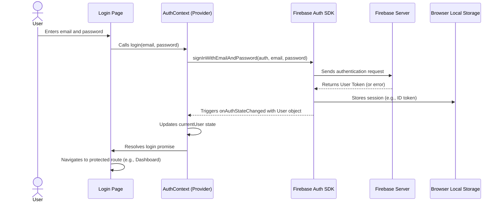

# Chapter 6: User Authentication

Welcome back! In the [previous chapter on Application Views (Pages)](chapter_05.md), we explored how to construct distinct screens for our HR application. These views, while visually appealing and functionally rich, currently lack a crucial element: *security*. Anyone can access them. This chapter introduces **User Authentication**, the gatekeeper that ensures only authorized individuals interact with the sensitive data and functionalities of our HR system.

---

### Problem & Motivation

Imagine an HR application where employee salaries, personal details, and confidential leave requests are freely accessible to anyone who types in the URL. This scenario, while convenient for developers, is a cybersecurity nightmare and a direct violation of privacy. In a professional environment, access to such sensitive information must be strictly controlled.

The core problem User Authentication solves is **identity verification and access control**. We need to confirm *who* is using the application and then grant or deny them access based on their identity and role. For the 'hr-app', this is paramount. An HR manager needs to view and manage all employee data, while a regular employee should only see their own details and submit their own leave requests. Without authentication, these distinctions are impossible to enforce.

Consider a concrete use case: **An HR administrator logs into the system.** They must provide valid credentials (e.g., email and password). Upon successful verification, the system acknowledges their identity, establishes a secure session, and grants them access to administrative dashboards, employee management features, and the ability to approve leave requests. If they fail to authenticate, they remain locked out, protecting the integrity and confidentiality of the HR data.

---

### Core Concept Explanation

User authentication is the process of verifying the identity of a user. It's about answering the fundamental question: "Are you who you say you are?" In the context of the 'hr-app', this typically involves a user providing a unique identifier (like an email address) and a secret (like a password). If these credentials match what's stored in our system, the user is considered authenticated.

Once authenticated, the system often establishes a *user session*. This session acts as a temporary ID card, allowing the user to navigate through the application without having to re-enter their credentials on every single page. This session persists until the user logs out or the session expires. Furthermore, beyond just knowing *who* the user is, we can then determine *what* they are allowed to do – a concept known as **authorization**, which often builds directly upon successful authentication.

For the 'hr-app', we leverage **Firebase Authentication** for its robust, scalable, and easy-to-integrate solution. Firebase handles the complexities of secure user storage, password hashing, session management, and various authentication methods (email/password, Google Sign-In, etc.). This allows us to focus on building the HR features rather than re-inventing security mechanisms. Key terms here include: **User Credentials** (email/password), **Authentication Provider** (Firebase), **User Session**, and **Protected Routes** (parts of the app requiring a logged-in user).

---

### Practical Usage Examples

To demonstrate how User Authentication works in our 'hr-app', let's look at the essential operations: logging a user in, logging them out, and protecting application content based on their authentication status. We'll utilize a React Context (`AuthContext`) to expose our authentication state and functions.

First, let's see how a login function might be used in a `Login` component:

```jsx
// src/pages/LoginPage.js (conceptual)
import React, { useState } from 'react';
import { useAuth } from '../contexts/AuthContext'; // Our custom hook

function LoginPage() {
  const [email, setEmail] = useState('');
  const [password, setPassword] = useState('');
  const { login } = useAuth(); // Access login function from context

  const handleSubmit = async (e) => {
    e.preventDefault();
    try {
      await login(email, password);
      // Redirect to dashboard or home on success
      console.log('User logged in successfully!');
    } catch (error) {
      console.error('Login failed:', error.message);
    }
  };

  return (
    <form onSubmit={handleSubmit}>
      <input type="email" value={email} onChange={(e) => setEmail(e.target.value)} placeholder="Email" />
      <input type="password" value={password} onChange={(e) => setPassword(e.target.value)} placeholder="Password" />
      <button type="submit">Log In</button>
    </form>
  );
}

export default LoginPage;
```
*Explanation*: This `LoginPage` component uses the `useAuth` hook to access the `login` function. When the form is submitted, `login` is called with the entered email and password. On success, the user is authenticated; on failure, an error is logged.

Next, logging out is even simpler, often triggered by a button in a navigation bar:

```jsx
// src/components/NavBar.js (conceptual)
import React from 'react';
import { useAuth } from '../contexts/AuthContext'; // Our custom hook

function NavBar() {
  const { currentUser, logout } = useAuth(); // Access user and logout function

  const handleLogout = async () => {
    try {
      await logout();
      console.log('User logged out successfully!');
      // Redirect to login page
    } catch (error) {
      console.error('Logout failed:', error.message);
    }
  };

  return (
    <nav>
      {currentUser ? (
        <>
          <span>Welcome, {currentUser.email}</span>
          <button onClick={handleLogout}>Log Out</button>
        </>
      ) : (
        <a href="/login">Log In</a>
      )}
    </nav>
  );
}

export default NavBar;
```
*Explanation*: The `NavBar` checks if `currentUser` exists from the `AuthContext`. If so, it displays the user's email and a "Log Out" button. Clicking this button calls the `logout` function, clearing the user's session.

Finally, to protect routes, we can create a `ProtectedRoute` component that leverages the `currentUser` state:

```jsx
// src/components/ProtectedRoute.js (conceptual)
import React from 'react';
import { useAuth } from '../contexts/AuthContext';
import { Navigate, Outlet } from 'react-router-dom'; // Assuming React Router

function ProtectedRoute({ children, redirectPath = '/login' }) {
  const { currentUser, loading } = useAuth(); // Get auth state

  if (loading) {
    return <div>Loading authentication...</div>; // Show a loading indicator
  }

  if (!currentUser) {
    return <Navigate to={redirectPath} replace />; // Redirect if not logged in
  }

  return children ? children : <Outlet />; // Render children or Outlet if authenticated
}

export default ProtectedRoute;
```
*Explanation*: This `ProtectedRoute` component is designed to wrap other components or routes. It first checks if the authentication state is still loading. Once loaded, if `currentUser` is `null` (meaning no user is logged in), it redirects the user to the specified `redirectPath` (e.g., `/login`). Otherwise, if a user is authenticated, it renders the content it's protecting.

---

### Internal Implementation Walkthrough

The heart of our User Authentication abstraction lies in integrating Firebase Authentication with a React Context. This setup allows us to manage the global authentication state efficiently.

1.  **Firebase Initialization**: First, Firebase is initialized within our application, providing access to the `auth` service. This usually happens in a file like `src/firebaseConfig.js`.

    ```javascript
    // src/firebaseConfig.js
    import { initializeApp } from 'firebase/app';
    import { getAuth } from 'firebase/auth'; // Import Firebase Auth service
    import { getFirestore } from 'firebase/firestore'; // For Firestore services

    // Your web app's Firebase configuration
    const firebaseConfig = {
      apiKey: "YOUR_API_KEY",
      authDomain: "YOUR_AUTH_DOMAIN",
      projectId: "YOUR_PROJECT_ID",
      storageBucket: "YOUR_STORAGE_BUCKET",
      messagingSenderId: "YOUR_MESSAGING_SENDER_ID",
      appId: "YOUR_APP_ID"
    };

    // Initialize Firebase
    const app = initializeApp(firebaseConfig);
    export const auth = getAuth(app); // Export the auth instance
    export const db = getFirestore(app); // Export Firestore instance
    ```
    *Explanation*: This file sets up the Firebase application and exports the `auth` object, which is the main interface for Firebase Authentication operations.

2.  **`AuthContext` Creation**: We create a React Context to hold the current user's information and authentication functions (`login`, `logout`).

    ```jsx
    // src/contexts/AuthContext.js
    import React, { createContext, useContext, useEffect, useState } from 'react';
    import { auth } from '../firebaseConfig'; // Import our auth instance
    import { signInWithEmailAndPassword, signOut, onAuthStateChanged } from 'firebase/auth';

    const AuthContext = createContext();

    export const useAuth = () => useContext(AuthContext); // Custom hook for convenience

    export const AuthProvider = ({ children }) => {
      const [currentUser, setCurrentUser] = useState(null);
      const [loading, setLoading] = useState(true);

      // Effect to listen for Firebase auth state changes
      useEffect(() => {
        const unsubscribe = onAuthStateChanged(auth, user => {
          setCurrentUser(user); // Update current user state
          setLoading(false);    // Authentication state is loaded
        });
        return unsubscribe; // Cleanup subscription on unmount
      }, []);

      // Login function using Firebase
      const login = (email, password) => {
        return signInWithEmailAndPassword(auth, email, password);
      };

      // Logout function using Firebase
      const logout = () => {
        return signOut(auth);
      };

      const value = {
        currentUser,
        loading, // Expose loading state
        login,
        logout
      };

      return (
        <AuthContext.Provider value={value}>
          {!loading && children} {/* Only render children once auth state is known */}
        </AuthContext.Provider>
      );
    };
    ```
    *Explanation*: The `AuthProvider` component wraps our entire application (or relevant parts). It uses `onAuthStateChanged` to automatically update `currentUser` whenever the Firebase authentication state changes (e.g., user logs in, logs out, or token refreshes). The `login` and `logout` functions are wrappers around Firebase's SDK methods. The `loading` state ensures that our application doesn't try to render authenticated content before Firebase has had a chance to determine if a user is already logged in.

Here's a sequence diagram illustrating the typical login flow:



---

### System Integration

User Authentication is a foundational layer that integrates deeply with other parts of the 'hr-app':

*   **[Global State Management (Contexts)](chapter_03.md)**: The `AuthContext` itself is a prime example of global state management. It makes the `currentUser` object and authentication functions available to any component that needs them, avoiding prop drilling.
*   **[Application Views (Pages)](chapter_05.md)**: Many pages, such as `EmployeeDetailsPage` or `LeaveRequestPage`, will require a user to be authenticated. The `ProtectedRoute` component (as shown above) wraps these pages in the routing configuration to enforce access.
*   **[Application Entry and Routing](chapter_07.md)**: This is where authentication state primarily dictates the user's navigation experience. Our main `App.js` or `Router` configuration will use the `AuthContext` to determine which routes are accessible and where to redirect unauthenticated users.
*   **[Backend Data Services](chapter_02.md)**: While Firebase Authentication handles user identity, any interaction with our Firestore data (like fetching employee details or submitting leave requests) through `BackendDataServices` will implicitly or explicitly rely on the authenticated user's ID to verify permissions or associate data. Firebase Security Rules are configured to use the authenticated user's ID (`request.auth.uid`) to control access to Firestore documents.

**Example of Routing Integration:**

```jsx
// src/App.js (simplified routing)
import React from 'react';
import { BrowserRouter as Router, Routes, Route } from 'react-router-dom';
import { AuthProvider } from './contexts/AuthContext';
import ProtectedRoute from './components/ProtectedRoute';

import LoginPage from './pages/LoginPage';
import DashboardPage from './pages/DashboardPage';
import EmployeesPage from './pages/EmployeesPage';

function App() {
  return (
    <AuthProvider> {/* Wrap entire application with AuthProvider */}
      <Router>
        <Routes>
          <Route path="/login" element={<LoginPage />} />
          {/* Protected routes */}
          <Route path="/" element={<ProtectedRoute />}>
            <Route index element={<DashboardPage />} />
            <Route path="employees" element={<EmployeesPage />} />
            {/* ... other authenticated routes */}
          </Route>
        </Routes>
      </Router>
    </AuthProvider>
  );
}

export default App;
```
*Explanation*: Here, `AuthProvider` is placed high in the component tree to make authentication data available everywhere. The `ProtectedRoute` is used as a wrapper for routes that require authentication, ensuring that `/` and `/employees` are only accessible to logged-in users.

---

### Best Practices & Tips

*   **Centralize Authentication Logic**: Keep all Firebase Authentication calls and state management within a dedicated `AuthContext` or `authService` to maintain a single source of truth for authentication status.
*   **Handle Loading States**: Always account for the time it takes to check the initial authentication status (the `loading` state in `AuthContext`). Display a loading spinner or a blank screen until the `currentUser` state is resolved.
*   **Robust Error Handling**: Implement `try...catch` blocks for all authentication operations (`login`, `logout`). Provide clear, user-friendly feedback for errors like incorrect credentials or network issues.
*   **Clear User Feedback**: During login, disable the submit button and show a loading indicator. After a successful login, provide a success message or immediate redirection. For logout, ensure the user is redirected to a public page.
*   **Secure Environment Variables**: For Firebase configuration, ensure sensitive details like API keys are loaded from environment variables (e.g., `.env` files in development, and CI/CD secrets in production) and never directly committed to version control.
*   **Protect Sensitive Data (Authorization)**: While authentication verifies *who* the user is, remember that authorization determines *what* they can do. Use Firebase Security Rules in Firestore to further restrict data access based on the authenticated user's UID and custom claims (roles).
*   **Avoid Over-Authenticating**: Don't force users to log in for public content. Only protect routes or components that truly require user identity.

---

### Chapter Conclusion

In this chapter, we've established the critical foundation of User Authentication for our 'hr-app'. We've understood why authentication is vital for security and privacy, especially when dealing with sensitive HR data. By leveraging Firebase Authentication and integrating it seamlessly with React Context, we've created a robust system for verifying user identities, managing sessions, and protecting application content.

We now have the tools to ensure that only our HR administrators can access the full employee roster and that individual employees can securely manage their own leave requests. This robust authentication layer makes our application reliable and trustworthy.

With user authentication in place, the next logical step is to weave this into the fabric of our application's navigation. In the upcoming [Chapter 7: Application Entry and Routing](chapter_07.md), we will explore how to set up the main application entry point and configure our routing system to intelligently direct users, utilizing the authentication state to manage access to protected areas.