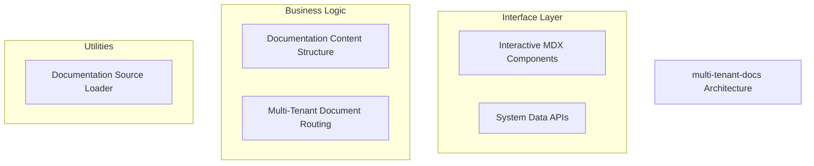
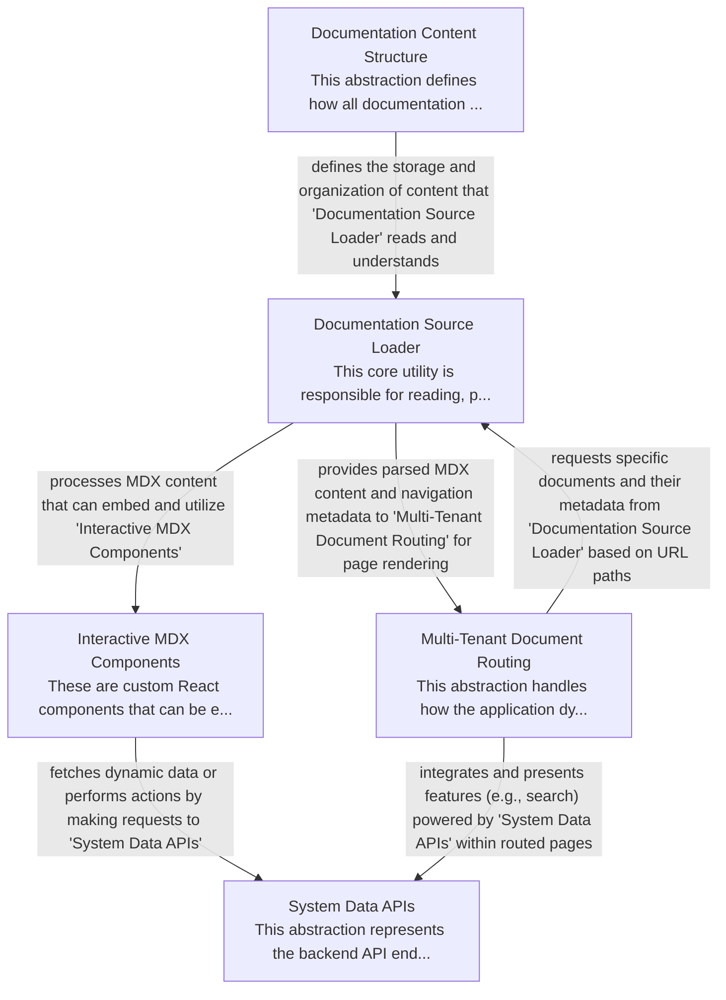

# multi-tenant-docs Tutorial

Welcome to the comprehensive tutorial for multi-tenant-docs. This tutorial is automatically generated from the codebase to help you understand the core concepts and implementation patterns.

## Project Overview

This multi-tenant documentation platform dynamically serves versioned content, leveraging a structured file system for organization. A core loader processes MDX content, which is then routed to specific tenant, version, and document pages. The platform enhances static documentation with interactive React components and integrates external dynamic data, including search functionality, through dedicated backend APIs.

## System Architecture

## Component Relationships

## Table of Contents

1. [Chapter 1: Multi-Tenant Document Routing](chapter_01.md) - Comprehensive documentation for Multi-Tenant Document Routing following structured methodology...
2. [Chapter 2: Documentation Content Structure](chapter_02.md) - Comprehensive documentation for Documentation Content Structure following structured methodology...
3. [Chapter 3: Documentation Source Loader](chapter_03.md) - Comprehensive documentation for Documentation Source Loader following structured methodology...
4. [Chapter 4: System Data APIs](chapter_04.md) - Comprehensive documentation for System Data APIs following structured methodology...
5. [Chapter 5: Interactive MDX Components](chapter_05.md) - Comprehensive documentation for Interactive MDX Components following structured methodology...

## How to Use This Tutorial

1. **Start with Chapter 1** to understand the foundational concepts
2. **Follow the sequence** - each chapter builds upon previous concepts
3. **Practice with code examples** - every chapter includes practical examples
4. **Refer to diagrams** - use architecture diagrams for visual understanding
5. **Cross-reference concepts** - chapters link to related topics

## Tutorial Features

- **Progressive Learning**: Concepts are introduced in logical order
- **Code Examples**: Every chapter includes practical, executable code
- **Visual Diagrams**: Mermaid diagrams illustrate complex relationships
- **Cross-References**: Easy navigation between related concepts
- **Beginner-Friendly**: Written for newcomers to the codebase

## Contributing

This tutorial is auto-generated from the codebase. To improve it:
1. Update the source code documentation
2. Add more detailed comments to key functions
3. Regenerate the tutorial using the documentation system

---

*Generated using AI-powered codebase analysis*
