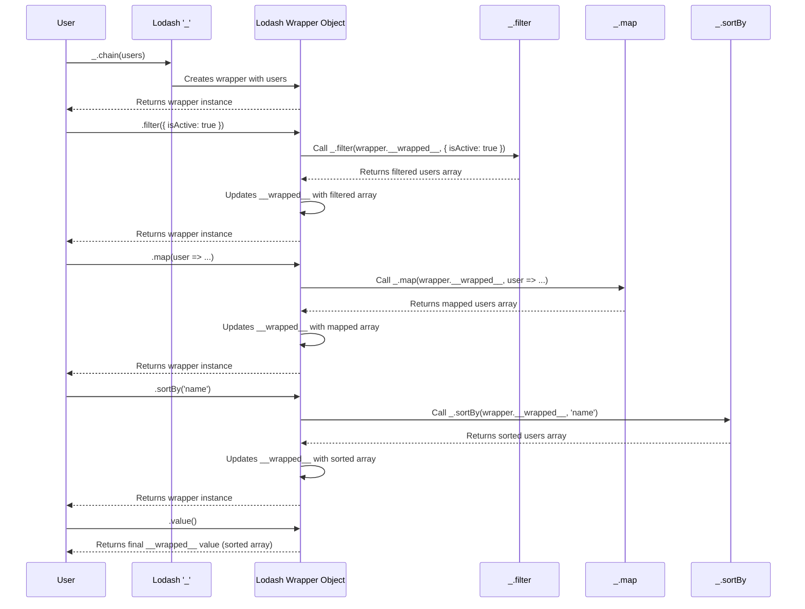

# Chapter 4: Chaining Operations

In the previous chapter, we explored [Collection Iterators](chapter_03.md), powerful functions like `_.map`, `_.filter`, and `_.forEach` that allow us to process arrays and objects effectively. These iterators, alongside other [Utility Functions](chapter_02.md), form the backbone of data manipulation in Lodash. However, as we start combining multiple operations, we can quickly encounter a common challenge: maintaining code readability and flow.

---

### Problem & Motivation

Imagine you have a list of user objects, and you need to perform a series of transformations: first, find all active users, then extract only their names and email addresses, and finally, sort them alphabetically by name. Without a mechanism to link these operations fluently, you'd end up with either deeply nested function calls or a series of temporary variables:

```javascript
const users = [
  { id: 1, name: 'Alice', email: 'alice@example.com', isActive: true },
  { id: 2, name: 'Bob', email: 'bob@example.com', isActive: false },
  { id: 3, name: 'Charlie', email: 'charlie@example.com', isActive: true }
];

// Problem: Nested calls
const processedUsersNested = _.sortBy(
  _.map(
    _.filter(users, { isActive: true }),
    user => ({ name: user.name, email: user.email })
  ),
  'name'
);

// Problem: Intermediate variables
const activeUsers = _.filter(users, { isActive: true });
const userDetails = _.map(activeUsers, user => ({ name: user.name, email: user.email }));
const sortedUsers = _.sortBy(userDetails, 'name');
```

Both approaches, while functional, can become cumbersome and reduce readability as the number of operations grows. Nested calls are hard to read from left-to-right, and intermediate variables introduce unnecessary noise and cognitive load. This is precisely the problem **Chaining Operations** in Lodash solves, allowing for a more natural, fluent, and readable sequence of data transformations.

---

### Core Concept Explanation

Lodash's chaining mechanism transforms a value into a *wrapper object* that "remembers" the original value and allows you to call subsequent Lodash methods on it. Each chained method returns this *same wrapper object*, enabling you to stack operations seamlessly. The actual computation and retrieval of the final result happen only when you explicitly tell the wrapper to `value()`.

The central idea is to shift from a "function-first" style (e.g., `_.filter(data, predicate)`) to a "data-first, method-on-data" style (e.g., `_chain(data).filter(predicate).value()`).

1.  **`_.chain(value)`**: This is the starting point. It takes your initial data (`value`) and wraps it inside a Lodash wrapper object. This object is special because it has all standard Lodash utility functions attached to it as methods.
2.  **Chained Methods**: When you call a Lodash method (like `filter`, `map`, `sortBy`) on the wrapper, it executes that operation on the *current value* held by the wrapper. Crucially, instead of returning the actual result of that operation, it returns the *wrapper itself*, but with its internal value updated to the result of the last operation.
3.  **`value()`**: This is the terminator. It tells the wrapper, "I'm done chaining; please give me the final processed value." At this point, all accumulated operations are applied, and the raw JavaScript value is returned.

This process creates a highly readable flow, moving from left-to-right, describing exactly what transformations are applied to the data in sequence. It's like building a pipeline for your data.

---

### Practical Usage Examples

Let's revisit our motivating use case and solve it elegantly using chaining. We want to find active users, extract specific details, and then sort them.

```javascript
const users = [
  { id: 1, name: 'Alice', email: 'alice@example.com', isActive: true },
  { id: 2, name: 'Bob', email: 'bob@example.com', isActive: false },
  { id: 3, name: 'Charlie', email: 'charlie@example.com', isActive: true }
];

// Using chaining for a fluent transformation pipeline
const processedUsersChained = _.chain(users)
  .filter({ isActive: true })
  .map(user => ({ name: user.name, email: user.email }))
  .sortBy('name')
  .value();

console.log(processedUsersChained);
/*
Output:
[
  { name: 'Alice', email: 'alice@example.com' },
  { name: 'Charlie', email: 'charlie@example.com' }
]
*/
```
**Explanation:**
1.  `_.chain(users)`: We start by wrapping our `users` array, indicating we want to begin a chained sequence of operations.
2.  `.filter({ isActive: true })`: This applies the `filter` operation to the wrapped array, keeping only objects where `isActive` is `true`. The result is a new internal array, but the *wrapper* is returned.
3.  `.map(user => ({ name: user.name, email: user.email }))`: The `map` operation transforms each filtered user object into a new object containing only `name` and `email`. Again, the wrapper is returned with the new internal array.
4.  `.sortBy('name')`: This sorts the currently held array of objects by their `name` property. The wrapper is returned.
5.  `.value()`: Finally, we call `value()` to unwrap the result and get the final, transformed array.

This chained approach is much more expressive and easier to follow than the nested or intermediate variable methods, clearly outlining the steps in the data's journey.

Let's look at another example with numbers: squaring even numbers and summing them.

```javascript
const numbers = [1, 2, 3, 4, 5, 6];

const sumOfSquaredEvens = _.chain(numbers)
  .filter(n => n % 2 === 0) // Keep even numbers
  .map(n => n * n)         // Square them
  .sum()                   // Sum the results
  .value();

console.log(sumOfSquaredEvens); // Output: 56 (4 + 16 + 36)
```
**Explanation:**
This example demonstrates chaining with numerical operations. We filter for even numbers, square them, and then use `_.sum` (which is also available on the wrapper) to add them up. The `value()` call produces the final sum.

---

### Internal Implementation Walkthrough

When you use `_.chain()`, Lodash doesn't immediately perform complex behind-the-scenes magic in terms of *lazy evaluation* for standard chaining (though it *does* for `_.tap` or `_.thru` in some contexts, and more explicitly in `lodash/fp`). Instead, `_.chain()` creates a *wrapper object*. This wrapper is essentially an object that holds your current data and has all Lodash utility methods *bound* to it.

Here's a simplified sequence of what happens:

1.  **`_.chain(initialValue)`**: You call `_.chain()` with your data. Lodash creates a new internal wrapper object (let's call it `_Wrapper`). This `_Wrapper` object stores `initialValue` as its internal `__wrapped__` property. It also inherits or has methods assigned to it that mirror all of Lodash's utility functions.
2.  **`_Wrapper.filter(predicate)`**: When you call a method like `filter` on this `_Wrapper`, the wrapper takes its current internal value (`__wrapped__`), passes it to the original `_.filter` function along with your `predicate`. The result of `_.filter` is then stored back into the `_Wrapper`'s `__wrapped__` property. Crucially, the *wrapper object itself* is returned, not the filtered array.
3.  **`_Wrapper.map(iterator)`**: The same process repeats. The `_Wrapper` takes its *now filtered* internal `__wrapped__` value, passes it to `_.map`, updates `__wrapped__` with the mapped result, and returns *itself* again.
4.  **`_Wrapper.value()`**: When `value()` is called, the `_Wrapper` simply returns its final `__wrapped__` property, which holds the result of all chained operations.


This diagram illustrates how the `Wrapper` acts as an intermediary, holding the current state of the data and forwarding method calls to the core Lodash utility functions, only revealing the final result when `value()` is invoked.

---

### System Integration

Chaining operations in Lodash serve as a powerful composition layer for various other Lodash features:

*   **[Utility Functions](chapter_02.md)**: Every standard utility function in Lodash becomes a method callable on the `_.chain()` wrapper. This includes functions for arrays, objects, strings, numbers, and more. Chaining provides a fluent syntax to combine any of these utilities.
*   **[Collection Iterators](chapter_03.md)**: As seen in our examples, collection iterators like `_.filter`, `_.map`, `_.forEach`, `_.reduce`, etc., are prime candidates for chaining. They are frequently used in sequences to transform data collections. Chaining makes these sequences highly readable.
*   **Functional Programming (FP) Module**: While `_.chain()` offers a fluent object-oriented style, the upcoming [Functional Programming (FP) Module](chapter_05.md) (`lodash/fp`) provides a more purely functional, data-last approach to composition, often through functions like `flow` or `pipe`. Chaining can be seen as a stepping stone or an alternative paradigm to `lodash/fp` for composing operations, offering a slightly different stylistic preference but aiming for similar goals of composability and readability.

In essence, chaining allows you to build sophisticated data processing pipelines by linking together smaller, atomic Lodash functions. It connects these individual tools into a cohesive workflow.

---

### Best Practices & Tips

*   **Prioritize Readability**: The primary benefit of chaining is enhanced readability. If a chain becomes excessively long or complex (e.g., more than 5-7 operations), consider breaking it into smaller, named chains or using intermediate variables to improve clarity.
*   **Always Call `value()`**: For standard `_.chain()`, forgetting to call `.value()` is a common pitfall. If you omit it, you'll get the Lodash wrapper object back, not your actual data.
*   **Understand Eager Evaluation**: By default, `_.chain()` is generally *eager*. This means each chained method operates on the entire collection and produces an intermediate result that is then passed to the next method. For very large collections and many operations, this can sometimes be less performant than truly lazy evaluation (which Lodash provides with `_.tap` or `_.thru` in some cases, or more explicitly in `lodash/fp`'s `flow`/`pipe` combined with specific collection methods). However, for most common use cases, the performance difference is negligible compared to the readability gains.
*   **Combine with `_` and `_fp`**: Chaining can be mixed with direct Lodash calls. For instance, you might use a `_.chain()` for a sequence of transformations, then pass the final `value()` to a non-chainable Lodash utility if necessary, although most are chainable.
*   **Use `commit()` for `clone()`-like behavior**: If you want to `clone()` the internal value of a chain at an intermediate step and then continue chaining, you can use `.commit()`. This creates a new wrapper instance with the current value.

---

### Chapter Conclusion

Chaining operations represent a cornerstone of Lodash's design philosophy, offering a powerful and intuitive way to construct fluent data transformation pipelines. By wrapping your data, `_.chain()` allows you to apply a sequence of [Utility Functions](chapter_02.md) and [Collection Iterators](chapter_03.md) in a highly readable, left-to-right manner, eliminating the clutter of nested calls or temporary variables. This significantly improves code clarity and maintainability for complex data manipulations. Understanding how `_.chain()` creates and manages its wrapper object, and the role of `value()` in retrieving the final result, is key to mastering this feature.

As you become more comfortable with chaining, you'll find it an invaluable tool for expressing sophisticated data transformations cleanly. This concept of composing operations sequentially also sets the stage for exploring more advanced functional programming paradigms, which we will delve into in the next chapter.

Next, we'll explore the dedicated [Functional Programming (FP) Module](chapter_05.md) in Lodash, which offers an even more opinionated and powerful approach to composable, data-last function patterns.