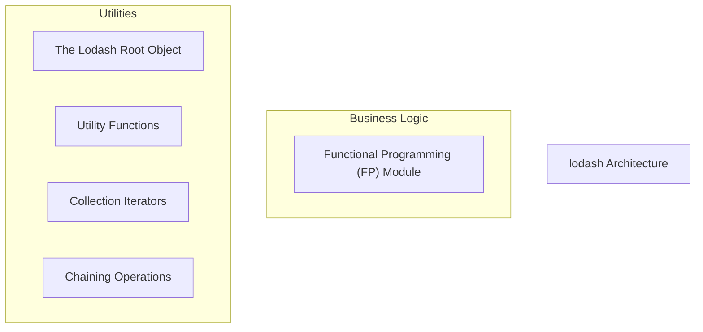
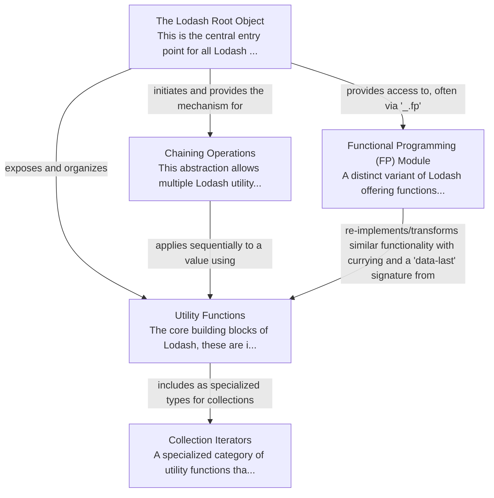

# lodash Tutorial

Welcome to the comprehensive tutorial for lodash. This tutorial is automatically generated from the codebase to help you understand the core concepts and implementation patterns.

## Project Overview

Lodash is a JavaScript utility library providing a wide range of functions for common programming tasks and data manipulations. Its core design revolves around a central root object ('_') that serves as the namespace, exposing individual utility functions, including specialized collection iterators. The library enhances usability through chaining operations for fluent sequences of transformations and offers a distinct functional programming module, 'lodash/fp', for highly composable, data-last function patterns.

## System Architecture

## Component Relationships

## Table of Contents

1. [Chapter 1: The Lodash Root Object](chapter_01.md) - Comprehensive documentation for The Lodash Root Object following structured methodology...
2. [Chapter 2: Utility Functions](chapter_02.md) - Comprehensive documentation for Utility Functions following structured methodology...
3. [Chapter 3: Collection Iterators](chapter_03.md) - Comprehensive documentation for Collection Iterators following structured methodology...
4. [Chapter 4: Chaining Operations](chapter_04.md) - Comprehensive documentation for Chaining Operations following structured methodology...
5. [Chapter 5: Functional Programming (FP) Module](chapter_05.md) - Comprehensive documentation for Functional Programming (FP) Module following structured methodology...

## How to Use This Tutorial

1. **Start with Chapter 1** to understand the foundational concepts
2. **Follow the sequence** - each chapter builds upon previous concepts
3. **Practice with code examples** - every chapter includes practical examples
4. **Refer to diagrams** - use architecture diagrams for visual understanding
5. **Cross-reference concepts** - chapters link to related topics

## Tutorial Features

- **Progressive Learning**: Concepts are introduced in logical order
- **Code Examples**: Every chapter includes practical, executable code
- **Visual Diagrams**: Mermaid diagrams illustrate complex relationships
- **Cross-References**: Easy navigation between related concepts
- **Beginner-Friendly**: Written for newcomers to the codebase

## Contributing

This tutorial is auto-generated from the codebase. To improve it:
1. Update the source code documentation
2. Add more detailed comments to key functions
3. Regenerate the tutorial using the documentation system

---

*Generated using AI-powered codebase analysis*
