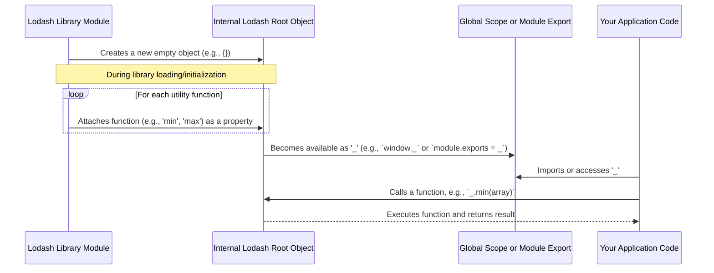

# Chapter 1: The Lodash Root Object

This is the first chapter in our exploration of Lodash, a versatile JavaScript utility library. We'll start at the very foundation: the Lodash root object, typically represented by the underscore `_` symbol.

---

### Problem & Motivation

In the early days of JavaScript development, libraries often introduced their functions directly into the global scope. Imagine if every function like `map`, `filter`, `find`, or `sortBy` became a global variable. This quickly leads to "global pollution," where different libraries or even different parts of the same application might define functions with the same name, leading to conflicts, unexpected behavior, and debugging nightmares. Managing numerous utility functions without a structured approach becomes a chaotic task.

Lodash addresses this fundamental problem by providing a clean, organized namespace for all its utilities. By consolidating hundreds of functions under a single, central object, it prevents global scope pollution and offers a consistent entry point for accessing its powerful features. This design significantly improves code readability, maintainability, and prevents conflicts, making development smoother and more predictable.

Consider a simple task: finding the smallest number in an array, and then perhaps the largest. Without Lodash, you might write a loop, or use `Math.min.apply()`. If you had dozens of such small tasks, you'd end up with many custom functions. Lodash offers a single, easy-to-remember way to access a `min` function and many others, all neatly tucked away under `_`.

---

### Core Concept Explanation

At its heart, "The Lodash Root Object" is simply a JavaScript object that acts as a container or *namespace* for all the utility functions Lodash provides. This object is conventionally named `_` (an underscore). When you import or include Lodash in your project, this `_` object becomes available, serving as your gateway to the entire library.

Think of the `_` object as a well-organized toolbox. Instead of having screwdrivers, hammers, and wrenches scattered all over your workbench (global scope), they are all neatly arranged within a single, clearly labeled toolbox (`_`). When you need a specific tool, you just open the `_` toolbox and pick it out, for example, `_.screwdriver()` or `_.hammer()`.

In a web browser environment, after including the Lodash script, the `_` object is typically attached directly to the global `window` object. In Node.js or modern JavaScript environments using module systems (like CommonJS or ES Modules), you explicitly import the `_` object from the Lodash package. Regardless of how it's made available, its purpose remains the same: to expose a consistent interface to Lodash's vast collection of functions, ensuring a predictable and conflict-free development experience. Every function you learn in Lodash will be accessed as a property of this `_` object, like `_.map()`, `_.filter()`, or `_.debounce()`.

---

### Practical Usage Examples

Let's see how easy it is to start using the Lodash root object to solve our motivating problem: finding the smallest and largest numbers in an array.

First, you need to ensure Lodash is available.

**1. Importing Lodash in a Node.js or Module Environment:**

```javascript
// In a Node.js project (CommonJS)
const _ = require('lodash');

// In a modern frontend project (ES Modules)
// import _ from 'lodash';

// Now the '_' object is available for use.
console.log('Lodash imported successfully!');
```
*Explanation*: These lines bring the entire Lodash library into your current file, assigning its root object to the variable `_`. This is the standard way to use Lodash in module-based JavaScript projects.

**2. Using the `_` object for basic array manipulations:**

Let's find the minimum and maximum values in an array using the `_.min` and `_.max` functions.

```javascript
const numbers = [4, 2, 8, 6, 1];

// Find the minimum value
const minVal = _.min(numbers);
console.log('Minimum value:', minVal);
// Expected Output: Minimum value: 1
```
*Explanation*: We pass our `numbers` array to `_.min()`. The `_` object acts as the gateway to the `min` function, which then processes the array and returns the smallest number.

```javascript
// Find the maximum value
const maxVal = _.max(numbers);
console.log('Maximum value:', maxVal);
// Expected Output: Maximum value: 8
```
*Explanation*: Similarly, `_.max()` is accessed through the `_` object to find the largest number. This demonstrates how intuitive it is to find and use specific utility functions once you have the `_` root object.

---

### Internal Implementation Walkthrough

While we interact with `_` as a ready-to-use object, it's helpful to understand its conceptual creation. When the Lodash library loads, its core logic essentially constructs this `_` object and then systematically attaches all its utility functions to it as properties.

Conceptually, the process looks like this:

1.  **Initialization**: An empty JavaScript object is created. Let's call it `lodashRoot`.
2.  **Population**: Each Lodash utility function (e.g., `min`, `max`, `map`, `filter`) is defined and then assigned as a method to `lodashRoot`.
    *   `lodashRoot.min = function(array) { /* min logic */ };`
    *   `lodashRoot.max = function(array) { /* max logic */ };`
    *   ... and so on for hundreds of functions.
3.  **Export/Global Exposure**: This populated `lodashRoot` object is then either exported as the default module (in Node.js/ESM) or attached to the global `window` object (in browsers), making it accessible as `_`.


This diagram illustrates that the `_` object isn't just an abstract idea; it's a concrete JavaScript object that gathers all of Lodash's capabilities into one convenient place. When you call `_.min()`, you're simply invoking the `min` method attached to this central `_` object.

---

### System Integration

The Lodash root object `_` is the absolute cornerstone of the entire Lodash library. It doesn't integrate with *other* system components in the traditional sense, but rather, *all* other Lodash abstractions integrate *with* and *through* it.

*   **Utility Functions**: Every single utility function provided by Lodash, such as `_.map`, `_.filter`, `_.debounce`, or `_.get`, is accessed as a method of the `_` object. The `_` object provides the entry point to these functions. Without it, you couldn't easily call `map` or `filter` from Lodash.
    *   For more details on these functions, refer to the [Utility Functions](chapter_02.md) chapter.

*   **Chaining Operations**: Lodash's powerful chaining mechanism, which allows you to perform sequences of transformations on data in a fluent, readable way, begins by wrapping a value with the `_` object itself (e.g., `_([1, 2, 3])`).
    *   Learn more about this in the [Chaining Operations](chapter_04.md) chapter.

*   **Functional Programming (FP) Module**: Even the specialized `lodash/fp` module, designed for a more functional programming style, still relies on the fundamental principles of packaging functions within a module, although its functions are typically imported individually and are *auto-curried*.
    *   Explore this advanced topic in the [Functional Programming (FP) Module](chapter_05.md) chapter.

Essentially, the `_` object is the central hub. All data flows into Lodash functions via this object, and all operations are initiated by calling methods that reside on it.

---

### Best Practices & Tips

1.  **Consistent Naming**: Always refer to the Lodash root object as `_`. This is the convention, and adhering to it makes your code immediately recognizable to other developers familiar with Lodash.
2.  **Avoid Global Conflicts (`_.noConflict()`)**: If you're working in a browser environment where another library also uses `_` as its global variable, Lodash provides `_.noConflict()`. This function relinquishes Lodash's control of the `_` variable and returns it to the previous owner, allowing you to assign Lodash to a different variable name.
    ```javascript
    // Suppose another library (e.g., Prototype.js) also uses '_'
    const lodash = _.noConflict();

    // Now, Lodash functions are accessed via 'lodash'
    lodash.each([1, 2], function(n) {
      console.log(n);
    });

    // The original '_' variable (e.g., from Prototype.js) is restored
    ```
    *Explanation*: `_.noConflict()` is a safety mechanism that prevents name clashes in global environments.
3.  **Modular Imports for Performance**: While using the full `_` object is convenient for quick development, in production environments, especially for client-side applications, importing individual functions (e.g., `import min from 'lodash/min';`) can significantly reduce your bundle size through tree-shaking. However, for getting started, the full `_` object is perfectly fine.
4.  **Modern JavaScript Alternatives**: Be aware that modern JavaScript has added many built-in array methods (e.g., `Array.prototype.map`, `Array.prototype.filter`). For simple cases, these native methods are often preferred for performance and readability. Lodash shines when you need more specialized utilities, object manipulations, or a consistent API across different data types and environments.

---

### Chapter Conclusion

In this chapter, we've established the foundational concept of the Lodash root object, `_`. We learned that it serves as the central namespace, preventing global pollution and providing a single, consistent entry point to the library's vast array of utility functions. We explored how to make `_` available in different JavaScript environments and saw practical examples of its use in solving common programming tasks like finding min/max values. We also gained a conceptual understanding of how `_` is populated internally and how it integrates as the core of all other Lodash features.

Understanding the `_` object is the first crucial step in mastering Lodash. It's the "key" that unlocks the entire library. With this knowledge, you're now ready to delve into the specific utility functions that make Lodash so powerful.

In the [next chapter, "Utility Functions"](chapter_02.md), we will explore a wide range of functions available through this `_` object, covering various categories of operations from arrays and objects to functions and strings.