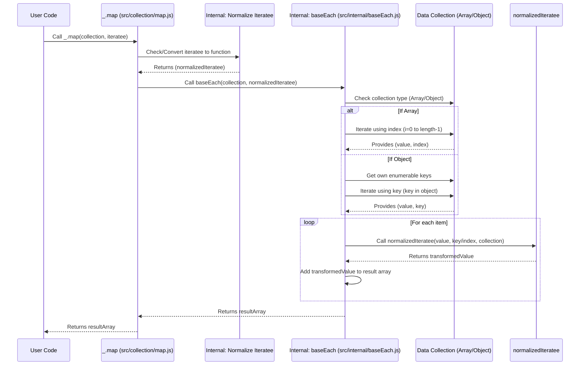

# Chapter 1: Collection Operations

This is the first chapter in our exploration of Lodash. We'll start at the fundamental level of how Lodash helps manage and manipulate data.

---

## Problem & Motivation

JavaScript, at its core, provides powerful mechanisms for working with data structures like arrays and objects. However, consistently performing common operations—such as iterating, mapping, filtering, or reducing—across *both* arrays and objects can sometimes feel disparate and verbose. For instance, iterating over an array typically uses `forEach` or a `for...of` loop, while iterating over an object requires `Object.keys().forEach` or a `for...in` loop with `hasOwnProperty` checks. This inconsistency can lead to less readable, more error-prone code, especially when dealing with data whose structure might vary.

This is where Lodash's collection operations become indispensable. They abstract away the underlying data structure, providing a unified, consistent, and highly optimized API for working with *collections*—which in Lodash terms refers to both arrays and objects. This significantly improves code clarity, reduces boilerplate, and enhances developer productivity by offering a single way to perform common data manipulation tasks, regardless of whether you have an array of items or an object of properties.

Consider a common scenario: you receive a list of user data, which might be an array of user objects or an object where keys are user IDs and values are user objects. You need to extract specific information, filter based on criteria, or group them. Without Lodash, you'd write conditional logic or duplicate code. With Lodash, you use the same functions, abstracting away the collection type.

---

## Core Concept Explanation

At its heart, Lodash's **Collection Operations** are a set of utility functions designed to iterate, transform, and manage data within both arrays and objects uniformly. The library considers anything that can be iterated over (like an array) or has enumerable properties (like an object) a "collection." These functions provide a consistent interface for common programming paradigms, making your code more predictable and easier to maintain.

Key ideas underpinning collection operations include:
*   **Iteration**: Systematically processing each element or property within a collection. Functions like `_.each` (or `_.forEach`) are prime examples.
*   **Transformation**: Creating a new collection based on the original, where each element has been modified or mapped. `_.map` is the quintessential transformation function.
*   **Filtering**: Selecting a subset of elements from a collection that meet specific criteria. `_.filter` (or `_.select`) is used for this purpose.
*   **Reduction (or Aggregation)**: Combining all elements of a collection into a single value. `_.reduce` is the most common function here.

The power of Lodash collection operations lies in their acceptance of an "iteratee" function. An iteratee is a function that gets called for each element or property in the collection, receiving the current value, its key (or index), and the entire collection. This allows for highly flexible and custom logic to be applied across diverse data structures using a single, clear API.

---

## Practical Usage Examples

Let's walk through our motivating use case: managing a list of user data. We'll demonstrate how Lodash's collection operations simplify common tasks.

First, let's define our sample user data. This could be an array or an object – Lodash handles both gracefully.

```javascript
const users = [
  { 'user': 'barney', 'age': 36, 'active': true, 'status': 'online' },
  { 'user': 'fred',   'age': 40, 'active': false, 'status': 'offline' },
  { 'user': 'pebbles', 'age': 1,  'active': true, 'status': 'online' }
];

const usersObject = {
  'user1': { 'user': 'barney', 'age': 36, 'active': true, 'status': 'online' },
  'user2': { 'user': 'fred',   'age': 40, 'active': false, 'status': 'offline' },
  'user3': { 'user': 'pebbles', 'age': 1,  'active': true, 'status': 'online' }
};
```
These are our sample data structures, an array of user objects and an object mapping IDs to user objects.

### Example 1: Extracting Specific Properties (`_.map`)

We want to get a list of just the usernames. `_.map` transforms each element in the collection into a new value.

```javascript
// Using an array
const userNamesArray = _.map(users, 'user');
console.log(userNamesArray); // => ['barney', 'fred', 'pebbles']

// Using an object
const userNamesObject = _.map(usersObject, 'user');
console.log(userNamesObject); // => ['barney', 'fred', 'pebbles']
```
As you can see, `_.map` works identically for both array and object collections, extracting the 'user' property from each item.

### Example 2: Filtering Active Users (`_.filter`)

We need to find all users who are currently active. `_.filter` selects elements that satisfy a given condition.

```javascript
// Using an array
const activeUsersArray = _.filter(users, { 'active': true });
console.log(activeUsersArray);
/*
// => [
//   { 'user': 'barney', 'age': 36, 'active': true, 'status': 'online' },
//   { 'user': 'pebbles', 'age': 1, 'active': true, 'status': 'online' }
// ]
*/

// Using an object
const activeUsersObject = _.filter(usersObject, 'active');
console.log(activeUsersObject);
/*
// => [
//   { 'user': 'barney', 'age': 36, 'active': true, 'status': 'online' },
//   { 'user': 'pebbles', 'age': 1, 'active': true, 'status': 'online' }
// ]
*/
```
`_.filter` accepts a shorthand for property matching. It efficiently returns a new array containing only the active users from either collection type.

### Example 3: Finding a Specific User (`_.find`)

Let's say we need to find the user named 'fred'. `_.find` returns the *first* element that satisfies the predicate.

```javascript
// Using an array
const fredUserArray = _.find(users, { 'user': 'fred' });
console.log(fredUserArray); // => { 'user': 'fred', 'age': 40, 'active': false, 'status': 'offline' }

// Using an object
const fredUserObject = _.find(usersObject, function(o) { return o.user === 'fred'; });
console.log(fredUserObject); // => { 'user': 'fred', 'age': 40, 'active': false, 'status': 'offline' }
```
Here, `_.find` quickly locates 'fred', demonstrating both the object shorthand and a custom iteratee function.

### Example 4: Grouping Users by Status (`_.groupBy`)

We want to categorize users by their online status. `_.groupBy` creates an object composed of keys generated from the results of running each element of collection through iteratee.

```javascript
// Using an array
const usersByStatusArray = _.groupBy(users, 'status');
console.log(usersByStatusArray);
/*
// => {
//   'online': [
//     { 'user': 'barney', 'age': 36, 'active': true, 'status': 'online' },
//     { 'user': 'pebbles', 'age': 1, 'active': true, 'status': 'online' }
//   ],
//   'offline': [
//     { 'user': 'fred', 'age': 40, 'active': false, 'status': 'offline' }
//   ]
// }
*/
```
`_.groupBy` is incredibly useful for organizing data, providing a quick way to aggregate data into categories.

---

## Internal Implementation Walkthrough

While Lodash provides a consistent external API, its internal implementation cleverly adapts to the type of collection it's processing. Let's conceptually walk through how a function like `_.map` might work.

The core idea for many collection methods is to have an internal, optimized iteration primitive that can handle both arrays and objects. Let's call this `baseEach`.

### Conceptual Internal Flow for `_.map`

1.  **`_.map(collection, iteratee)` is called:**
    *   The `collection` (e.g., `users` array or `usersObject`) and the `iteratee` (e.g., `'user'` string, or a function) are passed.
    *   Lodash's public `_.map` function (likely in `src/collection/map.js`) begins execution.

2.  **Iteratee Normalization:**
    *   If the `iteratee` is a string (like `'user'`), a property lookup function is created internally (e.g., `item => item.user`). This makes the `iteratee` always a function for the core logic. Lodash is smart about optimizing common cases like property names.

3.  **Core Iteration Dispatch (`baseEach`):**
    *   `_.map` then calls an internal helper, perhaps `baseMap` which in turn uses a generic iterator like `baseEach` (from `src/internal/baseEach.js` conceptually).
    *   `baseEach` checks the type of the `collection`:
        *   If it's an array or array-like (e.g., `arguments` object), it uses an optimized `for` loop, iterating by index.
        *   If it's an object, it iterates over its own enumerable properties (using `Object.keys()` or a similar mechanism).

4.  **Applying the Iteratee and Building Result:**
    *   For each element/property in the collection:
        *   The normalized `iteratee` function is invoked with the `(value, key|index, collection)` arguments.
        *   The return value of the `iteratee` is added to a new result array.

5.  **Return Value:**
    *   Once all elements have been processed, the new result array is returned by `_.map`.

### Sequence Diagram: `_.map` Conceptual Flow


This diagram illustrates how `_.map` leverages internal helpers to abstract away collection type, ensuring consistent and efficient processing.

---

## System Integration

Lodash's collection operations are foundational and integrate deeply with other parts of the library. They are often the first point of interaction when manipulating data.

*   **The Lodash Object (`_`)**: All collection methods are exposed directly on the main `_` object. This provides a singular, consistent entry point for all operations. For more details, refer to [The Lodash Object ('_')](chapter_03.md).
*   **Chaining**: Collection operations are designed to be chainable. This means you can combine multiple operations (`_.filter().map().sortBy()`) on a collection in a fluent, readable manner, often improving performance by iterating over the collection only once.
*   **Functional Programming (FP) Variant**: The `lodash/fp` module provides curried, immutable versions of many collection operations. While the core `_` object functions modify arrays in place where appropriate (or return new ones), `lodash/fp` explicitly emphasizes immutability, always returning new collections. This is crucial for functional programming paradigms. Explore this further in [Functional Programming (FP) Variant](chapter_05.md).
*   **Utility Functions**: While collection operations deal with multiple items, many [Utility Functions](chapter_02.md) operate on single values or provide helpers that can be used *within* collection iteratee functions (e.g., `_.isString`, `_.isEmpty`).

```javascript
// Example of chaining:
const activeUserNames = _(users)
  .filter({ 'active': true })
  .map('user')
  .value(); // .value() unwraps the Lodash wrapper to get the final result

console.log(activeUserNames); // => ['barney', 'pebbles']
```
This demonstrates how collection operations can be seamlessly chained together for complex data transformations.

---

## Best Practices & Tips

1.  **Prefer Specific Functions Over Generic `_.each` for Transformations**: While `_.each` (or `_.forEach`) is good for side effects, use `_.map` for transformations, `_.filter` for selections, and `_.reduce` for aggregations. This clarifies intent and often leads to more concise, functional code.
    ```javascript
    // Good: Clear intent
    const names = _.map(users, 'user');

    // Less ideal for transformation, as it requires manual array push
    const namesManual = [];
    _.each(users, user => namesManual.push(user.user));
    ```

2.  **Understand Predicate Shorthands**: Lodash offers powerful shorthands for `iteratee` arguments.
    *   **Property Shorthand**: `'user'` is equivalent to `item => item.user`.
    *   **Object Shorthand**: `{ 'active': true }` is equivalent to `item => item.active === true`.
    *   **Array Shorthand**: `['user', 'barney']` is equivalent to `item => item.user === 'barney'`.
    Always leverage these for conciseness.

3.  **Chain for Readability and Efficiency**: For complex sequences of operations, chaining (`_()...value()`) can improve readability and, in some cases, performance by optimizing the number of iterations over the collection.

4.  **Consider Immutability with `lodash/fp`**: If your project leans heavily into functional programming or state management (e.g., Redux), using `lodash/fp` for collection operations can help maintain immutability by always returning new collections instead of potentially modifying existing ones.

5.  **Performance Considerations**: Lodash functions are highly optimized, often outperforming native JavaScript loops for complex operations, especially in older JavaScript engines. However, for extremely performance-critical loops on very small, simple arrays, a native `for` loop might occasionally be marginally faster. For most application logic, Lodash's readability and consistency benefits far outweigh any micro-optimization concerns.

---

## Chapter Conclusion

In this chapter, we've explored the fundamental concept of **Collection Operations** in Lodash. We've seen how these functions provide a consistent, powerful, and efficient way to interact with both array and object data structures, solving the problem of inconsistent iteration and manipulation in vanilla JavaScript. We covered essential functions like `_.map`, `_.filter`, `_.find`, and `_.groupBy`, walked through a conceptual internal implementation, and discussed their integration with other Lodash features and best practices for their usage.

By abstracting away the specifics of data types, Lodash empowers developers to write cleaner, more maintainable code. This robust set of tools forms the bedrock for manipulating data effectively within any JavaScript project.

Next, we'll delve into another powerful category of Lodash functions: [Utility Functions](chapter_02.md), which provide invaluable helpers for individual values and general programming tasks.