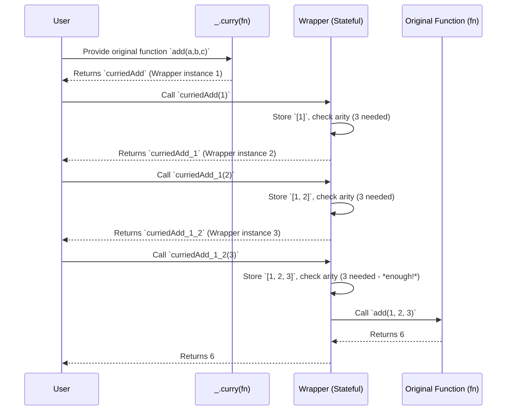

# Chapter 4: Currying and Placeholders (FP Concept)

As we explored in [Chapter 3: The Lodash Object ('_')](chapter_03.md), Lodash provides a vast array of utility functions accessible via the `_` object, designed to simplify common programming tasks. While these functions are incredibly powerful on their own, traditional invocation patterns can sometimes become rigid, especially when dealing with functions that require many arguments or when aiming for a more declarative, composable style of programming. This often leads to repetitive code or cumbersome intermediate variables.

---

### Problem & Motivation

Imagine you have a general-purpose function that performs an operation but requires several parameters to be specified. For instance, a `processData` function might need `(data, transformationFn, filterFn, options)`. If you frequently use this function with a fixed `transformationFn` and `options`, but varying `data` and `filterFn`, you'd find yourself repeatedly passing the same static arguments. This verbosity hinders code readability and reusability, making it hard to create specialized versions of your functions without writing wrapper functions manually.

This problem is particularly acute in functional programming paradigms, where the goal is to create small, reusable, and composable functions. How can we make a multi-argument function more flexible, allowing us to "pre-fill" some arguments and get a new function back, ready to accept the rest? Lodash addresses this with **Currying** and **Placeholders**, enabling a powerful style of partial application that transforms rigid functions into highly adaptable and composable building blocks, central to its `lodash/fp` variant.

---

### Core Concept Explanation

At the heart of enhancing function flexibility are two fundamental functional programming concepts: **Currying** and **Placeholders**.

**Currying** is a transformation technique where a function `f(a, b, c)` that takes multiple arguments is converted into a sequence of functions, each taking a single argument: `f(a)(b)(c)`. When you call the first function `f(a)`, it doesn't execute the original logic immediately; instead, it returns a new function that expects the next argument `b`. This continues until all arguments are provided, at which point the original function's logic is finally executed. Currying naturally facilitates *partial application*, allowing you to supply only a subset of arguments to a function and receive a new function expecting the remaining arguments.

**Partial Application**, while often synonymous with currying, specifically refers to the act of fixing a few arguments of a function to produce another function with a smaller arity (fewer arguments). Currying makes partial application a natural side effect of its step-by-step argument acceptance.

**Placeholders** are special values that work in conjunction with currying to provide even greater flexibility. They allow you to defer specific arguments until a later time, even if those arguments aren't the last ones expected. In Lodash's `_.curry` implementation, the special value `_` (the Lodash object itself) serves as a placeholder. This means you can provide arguments out of order, indicating "I'll fill this one in later," which is incredibly useful for adapting functions to various contexts without strict argument position constraints.

---

### Practical Usage Examples

Let's illustrate Currying and Placeholders using Lodash's `_.curry` function.

#### Basic Currying

First, let's define a simple function that sums three numbers. Then, we'll curry it.

```javascript
// A simple function that takes three arguments
const add = (a, b, c) => a + b + c;

// Curry the 'add' function
const curriedAdd = _.curry(add);

// Now, you can call it in various ways:
console.log(curriedAdd(1, 2, 3));
// Expected output: 6

console.log(curriedAdd(1)(2)(3));
// Expected output: 6
```
In this example, `_.curry(add)` transforms `add` into `curriedAdd`. We can provide all arguments at once, or one by one, and it will still produce the correct sum.

```javascript
// Or partially apply arguments:
const addOneAndTwo = curriedAdd(1, 2);
console.log(addOneAndTwo(3));
// Expected output: 6

const addFiveToX = curriedAdd(5); // Now it expects two more arguments
const addFiveAndSixToX = addFiveToX(6); // Now it expects one more
console.log(addFiveAndSixToX(7));
// Expected output: 18
```
Here, `addOneAndTwo` is a new function created by `curriedAdd` that already "remembers" `1` and `2`. It's waiting for the third argument. Similarly, `addFiveToX` and `addFiveAndSixToX` demonstrate step-by-step partial application.

#### Using Placeholders (`_`) for Flexible Argument Order

Now, let's use the Lodash object `_` as a placeholder to specify arguments out of order.

```javascript
// A function to format a message with prefix, main message, and suffix
const formatMessage = (prefix, message, suffix) =>
  `${prefix} ${message} ${suffix}`;

// Curry the formatMessage function
const curriedFormat = _.curry(formatMessage);

// Use a placeholder to create an 'error logger' that fixes prefix and suffix,
// but leaves the main message to be filled later.
const errorLogger = curriedFormat('ERROR:', _, '!!!');

// Now, call errorLogger with the actual message
console.log(errorLogger('Data failed to load'));
// Expected output: "ERROR: Data failed to load !!!"
```
In this example, `errorLogger` is a specialized function. We provided the `prefix` and `suffix` arguments, but used `_` as a placeholder for the `message` argument. When `errorLogger` is called with `'Data failed to load'`, that value slots into the placeholder's position.

```javascript
// Another example: A specialized formatter for a user's welcome message
const welcomeUser = curriedFormat('Welcome,', _, 'to our platform!');

// Call welcomeUser with the user's name
console.log(welcomeUser('Alice'));
// Expected output: "Welcome, Alice to our platform!"

// You can even use multiple placeholders if needed:
const fillMiddleFirst = curriedFormat(_, 'IMPORTANT ALERT', _);
console.log(fillMiddleFirst('!!!', '!!!'));
// Expected output: "!!! IMPORTANT ALERT !!!"
```
This demonstrates how placeholders allow for great flexibility, letting you define specialized functions without being constrained by the original function's argument order when partially applying.

---

### Internal Implementation Walkthrough

While the exact internal implementation of `_.curry` in Lodash is optimized and quite complex, we can understand its core mechanism conceptually. `_.curry` fundamentally involves creating and returning *wrapper functions* until enough arguments have been collected to invoke the original function.

Here's a simplified sequence of what happens when you curry a function:

1.  **Initial Call to `_.curry`**: You pass your original function (e.g., `add`) to `_.curry`. Lodash takes note of the original function's *arity* (the number of arguments it expects, typically derived from `func.length`).
2.  **Returns a Wrapper Function**: `_.curry` returns a new *wrapper function* (let's call it `curriedFn`). This `curriedFn` is the public interface you interact with.
3.  **Calling the Wrapper Function (`curriedFn`)**:
    *   When you call `curriedFn` with some arguments (e.g., `curriedAdd(1)`), this wrapper function internally collects these arguments.
    *   It then checks if the total number of collected arguments (including any from previous calls) is equal to or greater than the original function's arity.
    *   **If *not enough* arguments**: The `curriedFn` returns *another* new wrapper function. This new wrapper "remembers" all the arguments collected so far and is ready to accept more. This process repeats.
    *   **If *enough* arguments**: The `curriedFn` (or its latest wrapper descendant) finally calls the *original function* (`add`) with all the collected arguments in the correct order. The return value of the original function is then passed back to the user.
    *   **Placeholders (`_`) Handling**: If a placeholder (`_`) is encountered, the wrapper function marks that position as needing to be filled later. When subsequent calls provide arguments, they attempt to fill these placeholder slots before appending new arguments to the end.

A simplified conceptual flow could be visualized as:


This mechanism ensures that the original function is only executed when all necessary arguments have been accumulated, whether they arrive all at once, one by one, or out of order via placeholders.

---

### System Integration

Currying and placeholders are pivotal to the design and philosophy of Lodash's functional programming variant, `lodash/fp`. While `_.curry` is available directly on the main Lodash object, its true power shines when integrated into a pipeline of functional transformations.

*   **Composability**: Curried functions are inherently more composable. Functions like `_.flow` or `_.pipe` (which will be discussed in detail in the next chapter) expect functions that typically take a single argument or are easily adaptable. Currying allows multi-argument functions to be transformed into this single-argument-at-a-time style, fitting seamlessly into data transformation pipelines.
*   **Immutability**: By returning new functions rather than mutating existing state or directly executing with incomplete arguments, currying aligns perfectly with immutable programming practices, a cornerstone of `lodash/fp`.
*   **Point-Free Style**: Currying enables a "point-free" (or "tacit") style of programming, where functions are defined and combined without explicitly mentioning their arguments. This can lead to more concise and declarative code, enhancing readability once familiar with the pattern.
*   **Specialized Functions**: It allows developers to derive highly specialized versions of general utility functions, which can then be reused throughout the application. For instance, a generic `_.filter` can be curried to create a `filterActiveUsers` function that just needs a list of users.

This concept sets the stage for a deeper dive into [Functional Programming (FP) Variant](chapter_05.md), where these ideas are applied across the entire library to offer a more consistent and powerful functional programming experience.

---

### Best Practices & Tips

To leverage currying and placeholders effectively in your Lodash projects:

*   **Use when creating specialized functions**: If you find yourself repeatedly calling a function with the same initial arguments, it's a strong candidate for currying and partial application.
    ```javascript
    const log = _.curry((level, tag, message) => console.log(`[${level}] [${tag}] ${message}`));
    const errorLogger = log('ERROR', 'APP_CRASH');
    // Now you just need to provide the message:
    errorLogger('Unhandled exception caught');
    ```
*   **Prioritize readability**: While powerful, over-currying or complex placeholder usage can sometimes make code harder to follow for those unfamiliar with the pattern. Name your partially applied functions clearly.
*   **Be mindful of arity**: `_.curry` relies on the function's `length` property to determine how many arguments it expects. If your function uses rest parameters (`...args`) or has optional arguments without default values, `func.length` might not reflect the true number of required arguments, potentially leading to unexpected behavior.
*   **Consider `_.curryRight`**: Lodash also provides `_.curryRight`, which applies arguments from right-to-left. This can be useful in scenarios where the last arguments are the ones you want to fix first.
    ```javascript
    const divide = (numerator, denominator) => numerator / denominator;
    const curriedDivideRight = _.curryRight(divide);
    const divideByTwo = curriedDivideRight(2);
    console.log(divideByTwo(10)); // 10 / 2
    // Expected output: 5
    ```
*   **Embrace `lodash/fp`**: For projects fully committed to functional programming, consider using `lodash/fp`. All its functions are automatically curried by default, eliminating the need for explicit `_.curry` calls and providing a consistent FP experience.

---

### Chapter Conclusion

Currying and placeholders are not just abstract functional programming concepts; they are practical tools that significantly enhance the flexibility and composability of your JavaScript code, especially within the Lodash ecosystem. By transforming multi-argument functions into adaptable, partially applicable units, they enable developers to write cleaner, more declarative, and reusable code. This empowers you to build specialized functions on the fly and seamlessly integrate them into complex data transformation pipelines.

Having understood the core mechanisms of currying and placeholders, we are now perfectly positioned to dive deeper into Lodash's dedicated functional programming variant, `lodash/fp`, where these concepts are applied consistently across the entire library. This will unlock even more powerful patterns for functional development.

Proceed to learn more about the complete functional programming paradigm in Lodash: [Functional Programming (FP) Variant](chapter_05.md)