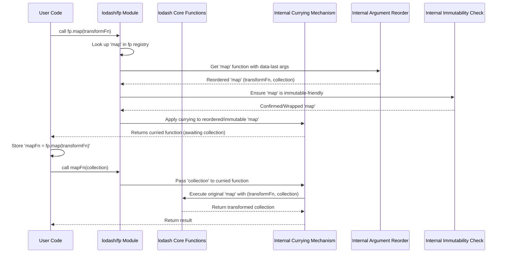

# Chapter 5: Functional Programming (FP) Variant

In the [previous chapter on Currying and Placeholders (FP Concept)](chapter_04.md), we delved into the theoretical underpinnings of functional programming that allow functions to be more flexible and composable. We explored how functions can be transformed to accept arguments one at a time and how special placeholders facilitate partial application. Now, we're ready to see these concepts brought to life in a practical and powerful way through `lodash/fp`, Lodash's specialized variant for functional programming.

---

### Problem & Motivation

While the main `lodash` library ([The Lodash Object ('_')](chapter_03.md)) is incredibly versatile, its default API design can sometimes present challenges for developers rigorously adhering to a functional programming paradigm. Many standard Lodash functions take the data collection as their *first* argument, and some even perform in-place mutations. This design can complicate function composition, making it less intuitive to chain operations using `pipe` or `flow` patterns, which thrive on data flowing through a sequence of functions. When data is the first argument, you often need helper functions or verbose arrow functions to re-wrap arguments, breaking the clean, "point-free" style desired in FP.

Consider a common scenario: you have a list of user objects, and you want to filter out inactive users, then extract their full names, and finally sort them alphabetically. In traditional imperative or even standard Lodash style, this might involve multiple steps, temporary variables, or chaining methods where argument order needs careful management. For example, `_.map(users, 'name')` takes `users` first. A pure FP approach demands immutability, predictable argument order (data-last), and automatic currying for seamless composition. This is precisely the problem `lodash/fp` solves, offering an opinionated, functional-first API designed for effortless chaining and immutability.

---

### Core Concept Explanation

The **Functional Programming (FP) Variant** of Lodash, accessed via `lodash/fp`, is a carefully crafted version of the library designed to fully embrace the principles of functional programming. It's not a separate library with different features, but rather a re-imagining of the existing [Collection Operations](chapter_01.md) and [Utility Functions](chapter_02.md) with specific FP conventions in mind.

At its heart, `lodash/fp` is built around three core tenets: **automatic currying**, **data-last arguments**, and a strong **emphasis on immutability**.
1.  **Automatic Currying**: Every function in `lodash/fp` is automatically curried. This means if a function expects multiple arguments, you can provide them one by one, and it will return a new function until all arguments are satisfied. This is a direct application of what we learned in [Currying and Placeholders (FP Concept)](chapter_04.md), making partial application incredibly natural.
2.  **Data-Last Arguments**: To facilitate seamless composition, `lodash/fp` reorders the arguments of most standard Lodash functions so that the data collection or target object is *always* the last argument. This convention is crucial for functions like `pipe` and `flow`, as it allows data to "flow" effortlessly from one function's output to the next function's final (data) argument.
3.  **Immutability**: `lodash/fp` prioritizes returning new data structures rather than modifying existing ones in place. While standard Lodash generally avoids mutation, `lodash/fp` reinforces this by selecting specific `lodash` implementations that guarantee immutability (e.g., `_.set` becomes `_.setImmutable` conceptually, always returning a new object). This ensures predictable behavior and prevents unintended side effects, a cornerstone of functional programming.

These principles combine to make `lodash/fp` an ideal tool for building highly composable, predictable, and robust applications where functions are treated as first-class citizens and data transformations are explicit and non-destructive.

---

### Practical Usage Examples

Let's illustrate the benefits of `lodash/fp` by solving our motivating use case: filtering active users, extracting full names, and sorting them.

First, we need to import `lodash/fp`. You typically import it as `fp` to distinguish it from standard `_`.

```javascript
import fp from 'lodash/fp';

const users = [
  { id: 1, firstName: 'Alice', lastName: 'Smith', isActive: true },
  { id: 2, firstName: 'Bob', lastName: 'Johnson', isActive: false },
  { id: 3, firstName: 'Charlie', lastName: 'Brown', isActive: true },
  { id: 4, firstName: 'Diana', lastName: 'Prince', isActive: false },
];
```
*Explanation*: We import the `lodash/fp` module and define our sample `users` array. Notice we use `fp` as the alias.

Now, let's apply our transformation using `fp.pipe`. The `pipe` function takes a series of functions and composes them from left to right, passing the output of one function as the input to the next.

```javascript
// 1. Filter active users
const filterActive = fp.filter({ isActive: true });
// (users) => users.filter(user => user.isActive === true)

// 2. Extract full names
const mapFullName = fp.map(user => `${user.firstName} ${user.lastName}`);
// (users) => users.map(user => user.firstName + ' ' + user.lastName)

// 3. Sort alphabetically
const sortByName = fp.sortBy(fp.identity); // fp.identity is just `x => x`
// (names) => names.sort()
```
*Explanation*: Here, we're creating three separate, curried functions. `fp.filter({ isActive: true })` doesn't immediately filter; it returns a new function that expects the collection as its *last* argument. Similarly for `fp.map` and `fp.sortBy`. `fp.identity` is used with `fp.sortBy` to sort the strings directly (as the names are already strings, `fp.identity` is the correct "selector").

Now, we compose them using `fp.pipe`:

```javascript
const getActiveSortedNames = fp.pipe(
  filterActive,
  mapFullName,
  sortByName
);

const result = getActiveSortedNames(users);

console.log(result);
// Expected Output:
// [ 'Alice Smith', 'Charlie Brown' ]
```
*Explanation*: `fp.pipe` takes our three pre-configured functions and chains them. When `getActiveSortedNames(users)` is called, `users` first goes into `filterActive`, its result goes into `mapFullName`, and that result goes into `sortByName`. The final output is an array of sorted full names of active users, all achieved immutably without side effects.

Compare this to a more traditional imperative or even standard Lodash approach:

```javascript
import _ from 'lodash'; // Standard Lodash

const activeUsers = _.filter(users, { isActive: true });
const fullNames = _.map(activeUsers, user => `${user.firstName} ${user.lastName}`);
const sortedNames = _.sortBy(fullNames); // Or fullNames.sort()

console.log(sortedNames);
// Expected Output:
// [ 'Alice Smith', 'Charlie Brown' ]
```
*Explanation*: While this also works, each step (`_.filter`, `_.map`, `_.sortBy`) is a separate call, potentially requiring intermediate variables or more complex chaining if not using `_.chain`. `lodash/fp`'s `pipe` allows for a cleaner, more declarative flow without explicit data arguments in the intermediate functions.

---

### Internal Implementation Walkthrough

The `lodash/fp` variant isn't a completely separate codebase; rather, it's generated from the main `lodash` library through a clever transformation process. Conceptually, for each function in standard `lodash`, `lodash/fp` applies a "conversion" layer.

This conversion process typically involves:
1.  **Argument Reordering**: Analyzing the function's signature and reordering arguments so that the "data" argument (e.g., the collection for `map`, `filter`, `reduce`) becomes the *last* argument.
2.  **Auto-Currying**: Wrapping the reordered function with a currying utility. This utility keeps track of received arguments and, once all expected arguments (except the data-last one, which is handled by `pipe`/`flow`) are provided, it returns a new function awaiting the final data. If *all* arguments are present, it executes the original function.
3.  **Immutability Enforcement**: For functions that might have mutable counterparts in standard Lodash (e.g., `_.assign` vs `_.assignIn`), `lodash/fp` selects or creates an immutable version (e.g., `fp.assign` implicitly behaves like `Object.assign({}, source, changes)`).

Let's visualize a simplified call flow for an `fp` function like `fp.map`:



*Explanation*: When you call `fp.map(transformFn)`, `lodash/fp` internally prepares the standard `_.map` function. It reorders its arguments so `collection` is last, ensures it adheres to immutability (by using the correct `lodash` internal or wrapping it), and then applies currying logic. This returns a new function (`mapFn`) that expects the collection. When `mapFn(collection)` is called, the curried function finally has all its arguments and executes the underlying standard `_.map` with the correct argument order, returning the immutable result. This process is repeated for almost every function in the `lodash/fp` variant. The `lodash/fp` module effectively acts as a "facade" over the core `lodash` functions, applying these FP transformations during its own build process.

---

### System Integration

The `lodash/fp` variant integrates seamlessly as an alternative API layer over the core `lodash` [Collection Operations](chapter_01.md) and [Utility Functions](chapter_02.md). It doesn't introduce entirely new functionalities but rather presents existing ones through a functional lens.

*   **Relationship to Core Functions**: `lodash/fp` functions like `fp.map`, `fp.filter`, `fp.reduce`, `fp.get`, `fp.set` are direct functional counterparts to `_.map`, `_.filter`, `_.reduce`, `_.get`, `_.set` (from [Chapter 1](chapter_01.md) and [Chapter 2](chapter_02.md)). The key difference is the argument order, automatic currying, and immutable behavior.
*   **Leveraging FP Concepts**: It directly builds upon the concepts introduced in [Currying and Placeholders (FP Concept)](chapter_04.md). Every function you use in `lodash/fp` is a living example of currying in action. While `lodash/fp` handles most currying automatically, you can still use explicit `fp.placeholder` (often just `_`) for more advanced partial applications if needed, although `fp.pipe` and `fp.flow` often make this unnecessary.
*   **Alternative to The Lodash Object ('_')**: Instead of accessing functions via the main `_` object ([The Lodash Object ('_')](chapter_03.md)), you import and use `fp` for functional-style operations. It's generally recommended *not* to mix `_` and `fp` functions directly in the same processing pipeline to avoid confusion with argument order and currying expectations.

**Data Flow Example with `fp.pipe`:**

```mermaid
graph TD
    A[Initial Data: Users Array] --> B{fp.filter({isActive: true})}
    B --> C{fp.map(user => FullName)}
    C --> D{fp.sortBy(fp.identity)}
    D --> E[Final Result: Sorted Names Array]

    subgraph lodash/fp Pipeline
        B
        C
        D
    end
```
*Explanation*: Data flows from `A` into the first function (`fp.filter`). The output of `fp.filter` becomes the input for `fp.map`, and so on, until the final result `E` is produced. Each step (`B`, `C`, `D`) is a pure function, operating on its input and producing a new output, without modifying the original data. This exemplifies a declarative, immutable data transformation pipeline.

---

### Best Practices & Tips

1.  **Embrace `fp.pipe` and `fp.flow`**: These functions are the cornerstone of `lodash/fp` for composing operations. Use `fp.pipe` for left-to-right composition and `fp.flow` for right-to-left (though `pipe` is generally more intuitive).
    ```javascript
    // Good: Clear, declarative pipeline
    const processUsers = fp.pipe(
      fp.filter({ isActive: true }),
      fp.map('email'),
      fp.sortBy(fp.identity)
    );
    const emails = processUsers(users);
    ```
2.  **Prioritize Point-Free Style**: Where possible, define functions that don't explicitly mention their arguments. This often results in more concise and readable code.
    ```javascript
    // Instead of:
    // fp.map(user => user.firstName)
    // Use:
    fp.map('firstName'); // fp.get also works: fp.map(fp.get('firstName'))
    ```
3.  **Avoid Mixing `lodash` and `lodash/fp`**: While technically possible, mixing the two variants in the same chain or context can lead to confusion due to differing argument orders and currying behaviors. Stick to one variant per file or major component.
4.  **Understand Currying Behavior**: Remember that `fp` functions expect arguments in a specific order (configuration/predicate first, data last). If you call a curried function with fewer arguments than it expects (excluding the data argument), it will return *another* function.
    ```javascript
    const filterByStatus = fp.filter({ status: 'pending' });
    // filterByStatus is now a function waiting for a collection
    const pendingItems = filterByStatus(allItems);
    ```
5.  **Immutability by Default**: Trust that `lodash/fp` functions will return new objects/arrays. Avoid attempting to mutate the results directly, as this defeats the purpose of FP and can lead to bugs.
6.  **Performance Considerations**: While `lodash/fp` adds a thin layer of overhead for currying and argument reordering, it's generally negligible for most applications. Focus on readability and correctness first; optimize only if profiling reveals a bottleneck.

---

### Chapter Conclusion

The `lodash/fp` variant offers a powerful and consistent approach to leveraging Lodash utilities within a functional programming paradigm. By enforcing automatic currying, data-last arguments, and immutability, it transforms Lodash into an ideal toolkit for building composable, predictable, and maintainable applications. We've seen how it simplifies complex data transformations through `pipe` and `flow`, directly applying the concepts of currying we discussed earlier.

Understanding `lodash/fp` not only enhances your ability to write cleaner, more robust JavaScript but also deepens your appreciation for functional programming principles. As you move forward in project development, choosing between standard `lodash` and `lodash/fp` will depend on your team's architectural preferences and coding style.

Having explored the functional heart of Lodash, our next step is to understand how this versatile library, including its FP variant, is built, packaged, and distributed for various development environments. Join us in the next chapter as we delve into the intricacies of Lodash's [Build and Distribution](chapter_06.md) system.