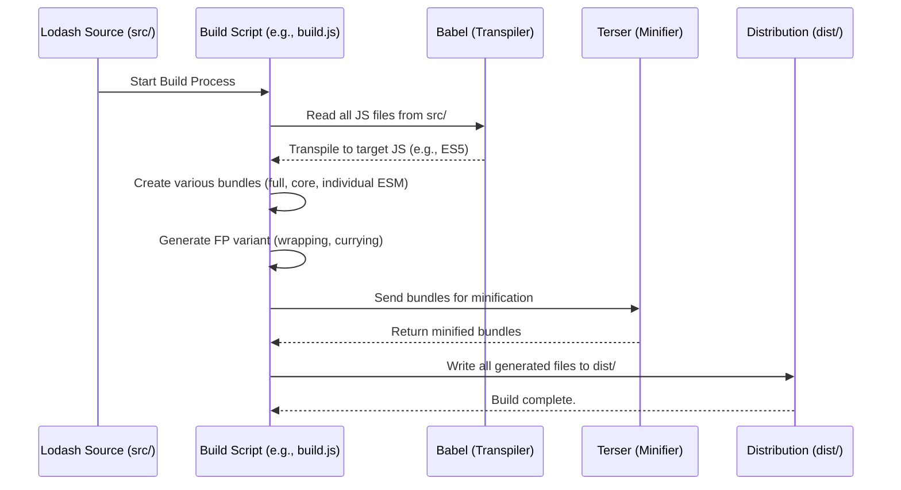

# Chapter 6: Build and Distribution

As we explored in the previous chapter, [Functional Programming (FP) Variant](chapter_05.md), Lodash offers tailored versions and features to suit diverse programming paradigms. Underlying this flexibility, and indeed the entire library's accessibility, is a robust *Build and Distribution* system. This crucial engine transforms the raw source code into the various ready-to-use packages that developers worldwide integrate into their projects.

---

### Problem & Motivation

The core challenge for a utility library as comprehensive as Lodash is how to efficiently deliver its vast array of functions to developers working in wildly different environments and with varying needs. A developer building a server-side Node.js application might require the full CommonJS module, while a frontend developer working on a single-page application needs a tiny, tree-shakeable ES Module build, perhaps even a specific subset like `lodash/fp`. Without a sophisticated build and distribution system, meeting these diverse requirements would be a logistical nightmare, leading to bloated bundles, inefficient loading, or a fractured developer experience.

Lodash's build system solves this by acting as a central factory. It takes all the individual helper functions (like those discussed in [Utility Functions](chapter_02.md)) and orchestrates their compilation, optimization, and packaging into specific formats. This ensures that whether you're using a full build via a CDN in a legacy browser or selectively importing functions with modern ES Modules, you get the most optimized and appropriate version of Lodash for your project.

Consider a practical use case: A web developer needs only `lodash.debounce` and `lodash.throttle` for a browser-based application. If they were forced to download the *entire* Lodash library, their application's bundle size would unnecessarily increase, slowing down page load times. The build and distribution system ensures that they can either import just those functions or use a specialized build that's already optimized for size, providing a seamless and performant experience.

---

### Core Concept Explanation

At its heart, the **Build and Distribution** system for Lodash is the intricate internal process responsible for transforming the library's modular source code (`src/`) into various optimized, ready-to-deploy packages located in the `dist/` directory. This process isn't just about compiling JavaScript; it's about tailoring the library for maximum efficiency and compatibility across different environments.

Think of it like a highly specialized food production line. The raw ingredients are individual utility function files (`src/array/chunk.js`, `src/object/merge.js`). The production line (the build system) then processes these ingredients through several stages:
1.  **Transpilation:** Converting modern JavaScript syntax (e.g., ES2015+) into older, more widely supported JavaScript, ensuring compatibility across various browsers and Node.js versions.
2.  **Minification:** Removing unnecessary characters from the code (whitespace, comments, shortening variable names) without changing its functionality. This significantly reduces file size, which is critical for web performance.
3.  **Optimization/Tree-shaking:** Identifying and discarding unused code. If a project only imports `lodash.debounce`, the build system ensures that functions like `lodash.map` or `lodash.reduce` are *not* included in the final bundle, resulting in much smaller output.
4.  **Bundling:** Grouping related code into single files, often in different module formats (e.g., CommonJS for Node.js, ES Modules for modern frontend bundlers, UMD for browser globals).

The output of this system is a diverse set of *distribution files*. These include the full `lodash.js` and `lodash.min.js` (for general use), `lodash-es.js` (for ES Modules), and specialized builds like `lodash/fp` (which provides the [Functional Programming (FP) Variant](chapter_05.md)). Each distribution is carefully crafted to serve a specific development context, allowing developers to choose the exact version they need without compromise.

---

### Practical Usage Examples

While this chapter focuses on how Lodash *itself* is built, understanding the direct impact on *how you use* the library is paramount. The build system's output dictates your import statements and script tags. Here’s how you'd interact with the results of Lodash's meticulous build and distribution process:

#### 1. Full Build via CDN (Browser Global)

For quick prototyping or environments without module bundlers, you can load the full, minified library directly from a Content Delivery Network. This exposes the `_` object globally, as discussed in [The Lodash Object ('_')](chapter_03.md).

```html
<!DOCTYPE html>
<html>
<head>
  <title>Lodash CDN Example</title>
  <script src="https://cdnjs.cloudflare.com/ajax/libs/lodash.js/4.17.21/lodash.min.js"></script>
</head>
<body>
  <script>
    const array = [1, 2, 3, 4];
    const doubled = _.map(array, n => n * 2);
    console.log(doubled); // Expected: [2, 4, 6, 8]
  </script>
</body>
</html>
```
*Explanation:* This example demonstrates loading the entire minified Lodash library from a CDN. All Lodash functions are then available globally via the `_` object, allowing immediate use of functions like `_.map`.

#### 2. Modular Import (ES Modules) for Modern Frontend

In modern JavaScript projects using bundlers like Webpack, Rollup, or Parcel, you'll typically install `lodash` via npm and import specific functions as ES Modules. This allows for effective tree-shaking, where only the functions you import are included in your final bundle.

```javascript
// my-component.js
import debounce from 'lodash/debounce';
import throttle from 'lodash/throttle';

function handleClick() {
  console.log('Button clicked!');
}

const debouncedClick = debounce(handleClick, 500);
const throttledClick = throttle(handleClick, 500);

// In a real app, these would be attached to event listeners
// For demonstration:
debouncedClick(); // Will only fire after 500ms of no subsequent calls
throttledClick(); // Will fire at most once every 500ms
```
*Explanation:* Here, we import only `debounce` and `throttle` from their specific paths. This is enabled by the `lodash` build system providing individual ES Module files (`lodash-es/debounce.js`, `lodash-es/throttle.js`) that modern bundlers can easily optimize, dramatically reducing the final bundle size compared to importing the entire library.

#### 3. CommonJS Import for Node.js

For server-side applications or older Node.js environments, CommonJS modules are the standard. The Lodash build system provides a full CommonJS compatible version.

```javascript
// server.js
const _ = require('lodash'); // Import the entire Lodash library
const path = require('path');

const users = [{ 'user': 'barney', 'age': 36 }, { 'user': 'fred', 'age': 40 }];
const sortedUsers = _.sortBy(users, ['user']);

console.log(sortedUsers);
// Expected: [ { user: 'barney', age: 36 }, { user: 'fred', age: 40 } ]

// Or specific functions
const merge = require('lodash/merge');
const defaultConfig = { port: 3000, env: 'development' };
const userConfig = { port: 8080 };
const finalConfig = merge(defaultConfig, userConfig);
console.log(finalConfig); // Expected: { port: 8080, env: 'development' }
```
*Explanation:* This illustrates importing Lodash in a Node.js environment using `require()`. You can either `require('lodash')` for the full library or `require('lodash/merge')` for individual functions, leveraging the CommonJS modules generated by the build system.

#### 4. Using the Functional Programming (FP) Variant

As explored in [Functional Programming (FP) Variant](chapter_05.md), Lodash offers `lodash/fp`. This separate distribution is also a product of the build system, providing automatically curried, data-last functions.

```javascript
// fp-example.js
import { map, add } from 'lodash/fp';

const incrementAll = map(add(1)); // 'add(1)' creates a function that adds 1
const numbers = [1, 2, 3];
const result = incrementAll(numbers);

console.log(result); // Expected: [2, 3, 4]
```
*Explanation:* This demonstrates importing curried functions from `lodash/fp`. The build system generates this distinct `fp` distribution specifically for functional programming paradigms, enabling elegant compositions like `map(add(1))`.

---

### Internal Implementation Walkthrough

The Lodash build system is a sophisticated set of scripts and configurations, primarily orchestrated via npm scripts and internal JavaScript tooling. While the exact details are deep within the Lodash repository, we can describe the conceptual flow:

1.  **Source Code (`src/`)**: Lodash's entire codebase is highly modularized, with each utility function residing in its own file within the `src/` directory (e.g., `src/array/chunk.js`, `src/object/assign.js`). This modularity is key for granular control during the build process.

2.  **Build Command (`npm run build`)**: When a developer (or the CI/CD pipeline) runs the build command, an internal build script kicks off. This script is usually a JavaScript file that coordinates various build steps.

3.  **Core Bundling & Transpilation**:
    *   The script first gathers all necessary source files.
    *   It then transpiles the modern JavaScript (e.g., ES2015+) to a target JavaScript version (e.g., ES5) using tools like Babel, ensuring broad compatibility.
    *   During this phase, different bundles are created:
        *   **Full Builds**: `lodash.js` (unminified) and `lodash.min.js` (minified) containing the entire library.
        *   **Core Builds**: A smaller version that excludes certain features.
        *   **ES Module Builds (`lodash-es/`)**: Individual files for each function are created in ES Module format, enabling efficient tree-shaking by modern bundlers.

4.  **FP Variant Generation**: The build system has a specific protocol to transform the standard Lodash functions into their functional programming (`lodash/fp`) counterparts. This involves wrapping functions to enforce auto-currying, data-last arguments, and immutability principles. These are then outputted into the `lodash/fp` directory.

5.  **Minification and Optimization**: For the `.min.js` and production-ready bundles, a JavaScript minifier (like Terser) is applied. This step drastically reduces file size by removing whitespace, comments, and performing various code optimizations without altering functionality.

6.  **Output (`dist/`)**: All the resulting transpiled, bundled, and minified files are placed into the `dist/` directory, ready for consumption. This includes `lodash.js`, `lodash.min.js`, the `lodash-es/` directory, and the `lodash/fp/` directory.

Here's a simplified sequence diagram illustrating the internal build process:



*Explanation:* This diagram visualizes the flow: source files are read by the build script, transpiled by Babel, then bundled and the FP variant is generated. Finally, Terser minifies the output, and all artifacts are written to the `dist/` directory. This ensures multiple, optimized versions of Lodash are available.

---

### System Integration

The Build and Distribution system is the invisible hand that connects the individual parts of Lodash to the external world and to each other.

*   **Enabling Modularity**: It takes the discrete functions discussed in [Collection Operations](chapter_01.md) and [Utility Functions](chapter_02.md) from their `src/` files and packages them. This allows developers to `import { map } from 'lodash';` or `require('lodash/map');`, thereby integrating only the specific functionality needed into their projects, directly impacting bundle size and load performance.

*   **Tailoring for FP**: The build system specifically processes and wraps functions to create the `lodash/fp` variant, ensuring that its functions are automatically curried and follow a data-last argument style, as highlighted in [Functional Programming (FP) Variant](chapter_05.md) and [Currying and Placeholders (FP Concept)](chapter_04.md). This is not a manual task but an automated transformation during the build.

*   **Environment Compatibility**: By generating multiple output formats (CommonJS, ES Modules, UMD globals), the build system ensures that Lodash can seamlessly integrate into virtually any JavaScript ecosystem, from Node.js backends to modern browser-based React/Vue/Angular applications to even older, non-modular web projects.

*   **Developer Experience**: It streamlines the developer's experience by providing reliable, optimized packages through npm and CDNs. When you `npm install lodash` or use a CDN link, you are consuming the direct output of this powerful, internal build system.

---

### Best Practices & Tips

Leveraging Lodash's build and distribution effectively can significantly impact your application's performance and maintainability.

*   **Import Specific Functions (Tree-Shaking)**: Always prefer importing individual functions when using ES Modules (e.g., with Webpack, Rollup).
    ```javascript
    // Good: Allows bundlers to tree-shake unused code
    import { cloneDeep } from 'lodash';
    // Even better for explicit tree-shaking if your bundler needs it:
    // import cloneDeep from 'lodash/cloneDeep';
    ```
    *Avoid:*
    ```javascript
    // Bad: Imports the entire Lodash library, even if only one function is used
    import _ from 'lodash';
    const cloned = _.cloneDeep(obj);
    ```
    This practice ensures your final bundle size is as small as possible, as only the code you explicitly use is included.

*   **Choose the Right Build**:
    *   For modern frontend projects with bundlers, `lodash` (which automatically points to `lodash-es` for ES module imports) is generally preferred for tree-shaking.
    *   For Node.js projects, `require('lodash')` works fine as tree-shaking is less critical server-side.
    *   For functional programming style, explicitly `import { map } from 'lodash/fp';`.
    *   For simple browser scripts without a build step, use the CDN link (`<script src="...lodash.min.js"></script>`).

*   **Performance Considerations**: The full `lodash.min.js` file is substantial. On the web, every kilobyte counts. By importing only what you need, you directly reduce download times and parsing overhead, leading to faster application startup.

*   **Common Pitfalls**:
    *   **Unnecessary Full Imports**: Accidentally importing the entire `lodash` library when only a few functions are needed, especially in frontend projects, is a common mistake that leads to bloated bundles. Always check your bundle analyzer if concerned about size.
    *   **Mixing `_` and `fp`**: While possible, it's generally best to stick to either the standard `_` object or the `lodash/fp` variant within a given codebase or component for consistency.

---

### Chapter Conclusion

This chapter concludes our deep dive into Lodash by revealing the powerful engine behind its flexibility and ubiquity: the Build and Distribution system. We've seen how this intricate process transforms modular source code into diverse, optimized packages tailored for every conceivable development environment. From providing the global `_` object for quick browser scripts to delivering tree-shakeable ES Modules for modern frontend frameworks and the specialized `lodash/fp` variant for functional programming, the build system ensures that Lodash remains a highly adaptable and performant utility library.

Understanding this system isn't just about internal mechanics; it empowers you as a developer to make informed choices about how you consume and integrate Lodash into your projects, leading to leaner, faster, and more robust applications. By adhering to best practices like importing specific functions and choosing the appropriate build, you can fully harness the power and efficiency that Lodash's comprehensive build process provides. This final chapter underscores the meticulous engineering that makes Lodash an indispensable tool in the JavaScript ecosystem.