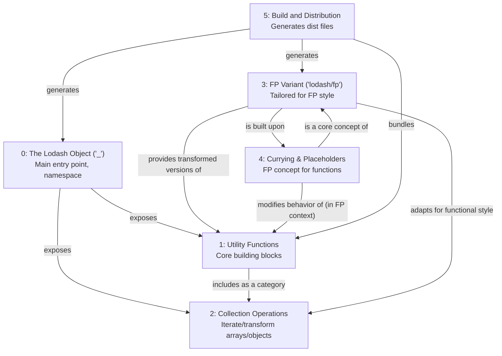

# lodash Tutorial

Welcome to the comprehensive tutorial for lodash. This tutorial is automatically generated from the codebase to help you understand the core concepts and implementation patterns.

## Project Overview

Lodash is a comprehensive JavaScript utility library offering a wide array of helper functions for common programming tasks like data manipulation and iteration. It provides a consistent API through the main '_' object, alongside a specialized functional programming variant, 'lodash/fp', which emphasizes immutability and composability. The entire library is packaged into various distributions via an internal build system to suit different development needs.


## System Architecture

```mermaid
graph TB
    title "lodash Architecture"

    subgraph "Interface Layer"
        L0["0: The Lodash Object ('_')"]
        L3["3: Functional Programming (FP) Variant"]
    end

    subgraph "Business Logic"
        L1["1: Utility Functions"]
        L2["2: Collection Operations"]
    end

    subgraph "Utilities"
        L4["4: Currying and Placeholders (FP Concept)"]
        L5["5: Build and Distribution"]
    end

    L0 --> L1
    L0 --> L2

    L3 --> L1
    L3 --> L2
    L3 --> L4

    L5 --> L0
    L5 --> L3
```

## Component Relationships



## Table of Contents

1. [Chapter 1: Collection Operations](chapter_01.md) - Comprehensive documentation for Collection Operations following structured methodology...
2. [Chapter 2: Utility Functions](chapter_02.md) - Comprehensive documentation for Utility Functions following structured methodology...
3. [Chapter 3: The Lodash Object ('_')](chapter_03.md) - Comprehensive documentation for The Lodash Object ('_') following structured methodology...
4. [Chapter 4: Currying and Placeholders (FP Concept)](chapter_04.md) - Comprehensive documentation for Currying and Placeholders (FP Concept) following structured methodol...
5. [Chapter 5: Functional Programming (FP) Variant](chapter_05.md) - Comprehensive documentation for Functional Programming (FP) Variant following structured methodology...
6. [Chapter 6: Build and Distribution](chapter_06.md) - Comprehensive documentation for Build and Distribution following structured methodology...

## How to Use This Tutorial

1. **Start with Chapter 1** to understand the foundational concepts
2. **Follow the sequence** - each chapter builds upon previous concepts
3. **Practice with code examples** - every chapter includes practical examples
4. **Refer to diagrams** - use architecture diagrams for visual understanding
5. **Cross-reference concepts** - chapters link to related topics

## Tutorial Features

- **Progressive Learning**: Concepts are introduced in logical order
- **Code Examples**: Every chapter includes practical, executable code
- **Visual Diagrams**: Mermaid diagrams illustrate complex relationships
- **Cross-References**: Easy navigation between related concepts
- **Beginner-Friendly**: Written for newcomers to the codebase

## Contributing

This tutorial is auto-generated from the codebase. To improve it:
1. Update the source code documentation
2. Add more detailed comments to key functions
3. Regenerate the tutorial using the documentation system

---

*Generated using AI-powered codebase analysis*
