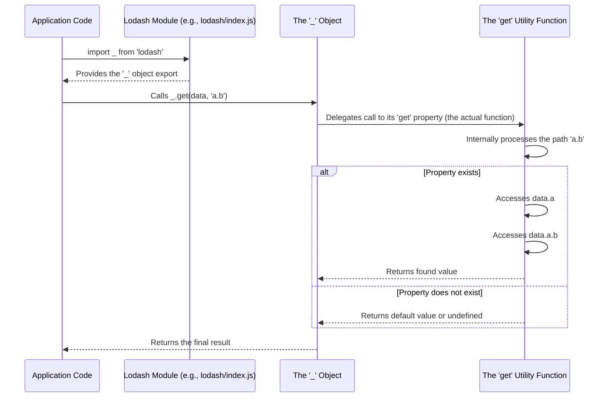

# Chapter 1: The Lodash Object ('_' namespace)

This is the first chapter in our journey through Lodash, laying the groundwork for understanding this powerful utility library. We'll start at the very beginning, introducing the central hub from which all of Lodash's functionalities emanate: the `_` (underscore) namespace.

---

### Problem & Motivation

JavaScript, while incredibly versatile, can sometimes be verbose or inconsistent when dealing with common programming tasks like manipulating collections, handling object properties, or adapting functions. Native solutions often require writing repetitive boilerplate code, especially when dealing with data that might be `null` or `undefined`, leading to `TypeError`s and less robust applications. For instance, safely accessing a deeply nested property in an object without knowing if intermediate properties exist can quickly become a tedious chain of `&&` operators or `if` statements.

The Lodash library addresses these challenges by providing a comprehensive, consistent, and performant set of utility functions. The `_` namespace is crucial because it acts as the single, well-organized entry point to all these utilities. Instead of importing dozens of individual functions, or having to remember disparate global functions, Lodash consolidates them under one predictable name. This drastically simplifies code, enhances readability, and boosts developer productivity by offering a standardized "toolbox" for everyday JavaScript problems.

Throughout this chapter, we'll use a common challenge as our guiding example: safely extracting information from a potentially complex and incomplete data structure, such as an API response. This will illustrate how the `_` object streamlines such tasks.

---

### Core Concept Explanation

At its heart, the Lodash library is designed around a central object, typically named `_`, which serves as a global namespace or a module export. This `_` object is essentially a container – a specialized JavaScript object whose properties are all the utility functions provided by Lodash. When you use Lodash, you're interacting directly with this `_` object to access its rich collection of helpers.

Think of the `_` object as a master toolbox for JavaScript development. Instead of having various tools scattered around your workshop (your codebase), or needing to custom-build a tool for every small task, the `_` toolbox provides a wide array of high-quality, pre-built tools, each designed for a specific job. Whether you need a "wrench" to `map` over an array, a "screwdriver" to `get` a property from an object, or a "tape measure" to `measure` the size of a collection, you know exactly where to find it: right inside the `_` toolbox.

This approach offers several key benefits: it prevents global namespace pollution, ensures consistent access patterns for all utilities, and makes the library incredibly intuitive to explore and use. By making `_` the central hub, Lodash effectively organizes hundreds of functions into a single, cohesive unit, ready to be wielded with simple dot notation (e.g., `_.map()`, `_.get()`).

---

### Practical Usage Examples

Let's see how the `_` object helps solve our motivating use case: safely accessing deeply nested object properties, and then explore some other fundamental uses.

First, ensure Lodash is installed in your project:

```bash
npm install lodash
```

Next, you can import it into your JavaScript file:

```javascript
import _ from 'lodash';
// Now the '_' object is available in your scope
```

#### Safely Accessing Nested Data

Consider an API response representing a `userProfile`, where some fields might be missing. We want to get the user's `street` address, and if it's not available, provide a default.

```javascript
import _ from 'lodash';

const userProfile = {
  id: 1,
  name: 'Alice',
  contact: {
    email: 'alice@example.com',
    phone: '123-456-7890'
  },
  // 'address' object is missing here
};

// Trying to get 'address.street' from userProfile
const street = _.get(userProfile, 'address.street', 'Street not provided');
console.log(street);
// Expected Output: Street not provided
```
*Explanation*: The `_.get()` function is called on the `_` object. It safely attempts to retrieve a value at the specified path (`'address.street'`) from `userProfile`. Since `userProfile.address` doesn't exist, it gracefully falls back to our provided default value, preventing a `TypeError`.

Let's see it with existing data:

```javascript
import _ from 'lodash';

const userProfileWithAddress = {
  id: 2,
  name: 'Bob',
  address: {
    street: '456 Oak Ave',
    city: 'Metropolis',
    zip: '90210'
  }
};

const bobStreet = _.get(userProfileWithAddress, 'address.street', 'N/A');
console.log(bobStreet);
// Expected Output: 456 Oak Ave
```
*Explanation*: Here, `_.get()` successfully traverses the `userProfileWithAddress` object to find `address.street` and returns its value.

#### Basic Utility Functions

Beyond `_.get()`, the `_` object provides access to a myriad of other useful functions:

```javascript
import _ from 'lodash';

// Example 1: Mapping over an array
const numbers = [1, 2, 3, 4];
const doubledNumbers = _.map(numbers, n => n * 2);
console.log(doubledNumbers);
// Expected Output: [2, 4, 6, 8]
```
*Explanation*: `_.map()` is a versatile function for transforming elements in a collection, returning a new array with the results.

```javascript
import _ from 'lodash';

// Example 2: Checking for null or undefined values
const valueA = null;
const valueB = 'Hello';
const valueC = undefined;

console.log(_.isNil(valueA)); // Output: true
console.log(_.isNil(valueB)); // Output: false
console.log(_.isNil(valueC)); // Output: true
```
*Explanation*: `_.isNil()` provides a simple, consistent way to check if a value is either `null` or `undefined`, abstracting away separate checks.

---

### Internal Implementation Walkthrough

While Lodash itself is a complex library, the fundamental mechanism for how the `_` object is made available and how it holds its functions is quite straightforward.

#### Module Exposure

In a modern JavaScript environment using modules (like Node.js or a browser bundler like Webpack), Lodash's main `index.js` file acts as the entry point. This file aggregates all the individual utility functions, which are typically defined in separate, smaller files (e.g., `get.js`, `map.js`, `isNil.js`).

A simplified view of how the `_` object is constructed and exported might look like this:

```javascript
// Simplified representation of lodash/index.js

// Imagine these are imported from their respective files:
// import get from './get.js';
// import map from './map.js';
// import isNil from './isNil.js';
// ... and hundreds more

// The core lodash object is assembled
const lodashObject = {
  get: function(/* args */) { /* implementation for get */ },
  map: function(/* args */) { /* implementation for map */ },
  isNil: function(/* args */) { /* implementation for isNil */ },
  // ... all other utility functions
};

// This object is then exported, making it available when you 'import _ from "lodash";'
export default lodashObject;

// For older CommonJS environments (Node.js without ESM), it would be:
// module.exports = lodashObject;

// In a browser context via a <script> tag, it might attach itself to the window object:
// window._ = lodashObject;
```

When you write `import _ from 'lodash';`, you're essentially importing this `lodashObject` and assigning it to the local `_` variable in your module.

#### How a Function Call is Resolved (`_.get()`)

When you invoke a function like `_.get(myObject, 'path')`, the following general sequence of events occurs:


*Explanation*: Your application code first imports the `_` object. When you call `_.get()`, you're accessing the `get` property of this `_` object, which is itself a function. This `get` function then executes its logic, safely traversing the provided data structure. Finally, the result (either the value found or a default) is returned back through the `_` object to your application code.

---

### System Integration

The `_` object is the foundational element that integrates all parts of the Lodash library and serves as the primary gateway for developers.

*   **Access to Core Utilities**: As we've seen, all the fundamental utility functions, covering areas like type checking, math operations, and object manipulation, are directly accessible as properties of the `_` object. These are the "building blocks" that the `_` object exposes, and we'll delve deeper into them in the next chapter: [Core Utility Functions](chapter_02.md).

*   **Collection Iterators**: Functions designed to work with arrays and objects (often referred to as "collections") for tasks like filtering, mapping, and reducing data are also housed under the `_` namespace. These powerful iterators will be explored in detail in [Collection Iterators](chapter_03.md).

*   **Foundation for Chaining Operations**: The `_` object is not just for direct function calls. It's also the starting point for Lodash's fluent chaining syntax. By wrapping a value with `_()`, you can chain multiple Lodash operations together, improving readability and composability. This powerful pattern will be thoroughly covered in [Chaining Operations](chapter_04.md).

*   **Functional Programming (FP) Style**: While `lodash/fp` is a separate module designed for a pure functional programming paradigm, the functions it provides are ultimately derived from the same core utilities found on the `_` object. The `_` object provides the imperative style access, while `lodash/fp` re-structures these functions for a data-last, curried approach, as we'll see in [Functional Programming (FP) Style](chapter_06.md).

In essence, the `_` object acts as the central switchboard, connecting developers to every facet of Lodash's extensive functionality.

---

### Best Practices & Tips

To make the most of the `_` object and Lodash, consider these best practices:

*   **Prefer Specific Imports for Production**: While `import _ from 'lodash';` is convenient for development and learning, for production applications (especially front-end bundles), importing specific functions can significantly reduce your bundle size due to "tree-shaking."
    ```javascript
    // Instead of:
    // import _ from 'lodash';
    // const value = _.get(obj, 'path');

    // Prefer for better tree-shaking:
    import get from 'lodash/get';
    import map from 'lodash/map';

    const value = get(obj, 'path');
    const transformed = map(arr, item => item * 2);
    ```
    This way, your application only includes the Lodash functions you actually use.

*   **Consistency is Key**: Decide whether your team will use the full `_` object import or individual function imports, and stick to it. Mixing both styles can make code harder to read and maintain.

*   **Avoid Global Pollution (in Browser)**: If you're working in a browser environment without a module bundler, Lodash might attach `_` to the global `window` object. While convenient, this practice can lead to conflicts if other libraries also try to use the `_` variable. Modern development workflows using `import` statements largely mitigate this.

*   **Use When It Adds Value**: Lodash functions often provide more robust, performant, or readable solutions than native JavaScript alternatives (e.g., `_.isEqual` vs. deep equality checks, `_.debounce` vs. manual debouncing). However, with modern JavaScript advancements (e.g., `Array.prototype.map`, optional chaining `?.`), consider if a native solution is equally clear and performant before reaching for Lodash for every task.

*   **Read the Documentation**: The official Lodash documentation is excellent. If you're unsure about a function's behavior or looking for a specific utility, it's the best resource.

---

### Chapter Conclusion

We've now established a solid understanding of the Lodash `_` object – the central point of access to the entire library. You've learned why it's crucial for solving common JavaScript problems with consistency and efficiency, and you've seen practical examples of how to use its core functionalities like `_.get()`, `_.map()`, and `_.isNil()`. We also peeked into its internal structure and how it integrates with the broader Lodash ecosystem.

With this foundational knowledge of the `_` namespace, you're now equipped to explore the vast array of utilities Lodash offers. In the next chapter, we will dive into specific categories of functions available through the `_` object, starting with the general-purpose utilities that form the backbone of many applications.

Get ready to explore the specific tools within our Lodash toolbox!

[Core Utility Functions](chapter_02.md)