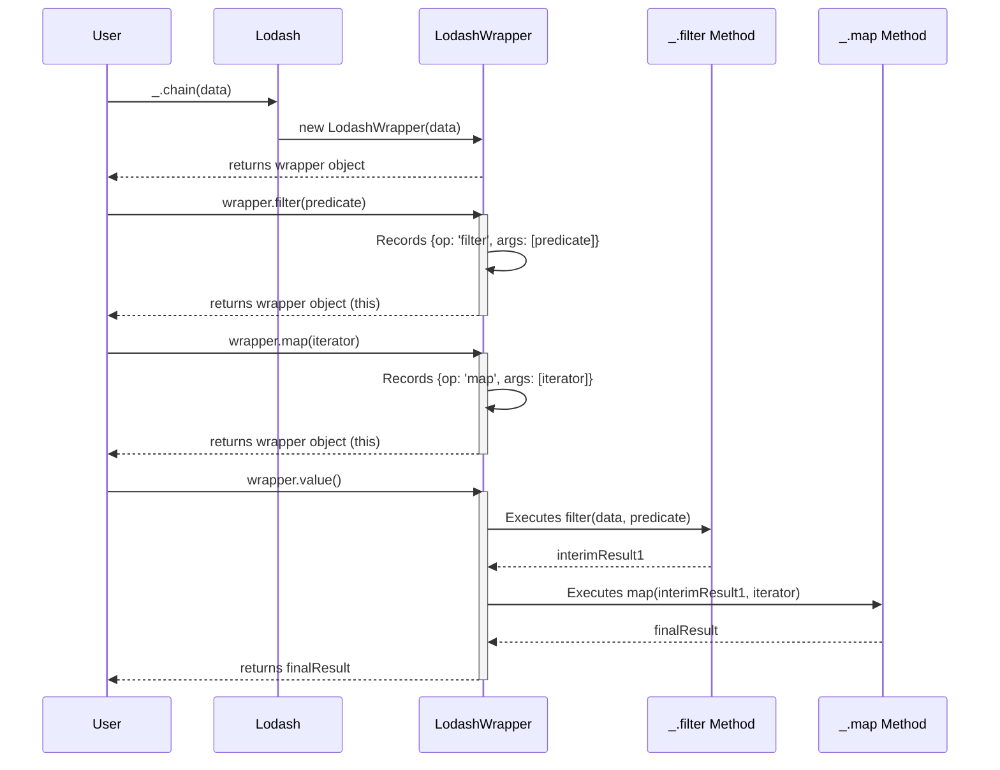

# Chapter 4: Chaining Operations

In the preceding chapter, [Collection Iterators](chapter_03.md), we explored how Lodash provides a powerful, unified way to iterate and transform data within various collections (arrays and objects). We learned to use functions like `_.map`, `_.filter`, and `_.reduce` to process data effectively. While these functions are incredibly useful individually, real-world applications often demand applying *multiple* such transformations sequentially. This leads us directly into the realm of Chaining Operations.

---

### Problem & Motivation

Imagine a common scenario: you have a list of user objects, and you need to perform several operations on them. Perhaps you want to filter out inactive users, then extract only their email addresses, and finally, sort these emails alphabetically. Without a mechanism to chain these operations, your code could quickly become cumbersome and difficult to follow. You might end up with a series of intermediate variables, like this:

```javascript
const users = [
  { id: 1, name: 'Alice', active: true, email: 'alice@example.com' },
  { id: 2, name: 'Bob', active: false, email: 'bob@example.com' },
  { id: 3, name: 'Charlie', active: true, email: 'charlie@example.com' }
];

// Problem: Multiple intermediate variables
const activeUsers = _.filter(users, { active: true });
const activeEmails = _.map(activeUsers, 'email');
const sortedEmails = _.sortBy(activeEmails);

console.log(sortedEmails);
// Expected: ['alice@example.com', 'charlie@example.com']
```

This approach, while functional, breaks the flow of logic and can obscure the primary intent: a series of transformations on a single dataset. In complex data pipelines, this verbosity can quickly make code unreadable and harder to debug. Lodash's chaining operations are designed precisely to solve this problem, enabling a more *fluent* and *declarative* style of programming where the sequence of transformations is clearly expressed.

---

### Core Concept Explanation

Chaining Operations in Lodash provide a way to apply multiple utility functions to a value in a sequential, readable manner without creating intermediate variables. At its heart, chaining works by wrapping your initial data in a special Lodash "wrapper object". When you call a Lodash method on this wrapper object, instead of immediately returning the result of that operation, it returns *another* wrapper object containing the state after the current operation. This allows you to call subsequent Lodash methods directly on the result of the previous one.

The process typically begins with `_.chain()` or, for arrays and objects, simply `_()`. Both methods take your initial data and convert it into a chainable wrapper. Each subsequent Lodash function invoked on this wrapper queues up an operation. The actual computation and unwrapping of the final result only happens when you explicitly call `value()`, `toJSON()`, or certain other terminal methods (like `_sum()` in some cases) at the end of your chain. This mechanism significantly enhances code readability and composability, allowing you to express complex data transformations as a single, continuous flow.

Consider chaining as an assembly line for your data. Your data enters the line, and each Lodash function along the chain acts as a station, performing a specific task. Crucially, the product (your data) doesn't leave the assembly line until it reaches the very end and `value()` is called. This "lazy" evaluation can sometimes lead to performance benefits, especially with larger datasets, as Lodash can optimize the execution of queued operations.

---

### Practical Usage Examples

Let's revisit our motivating example of filtering active users, extracting their emails, and sorting them.

#### 1. Basic Chaining with `_.chain()`

This is the explicit way to start a chain, suitable for any data type.

```javascript
const users = [
  { id: 1, name: 'Alice', active: true, email: 'alice@example.com' },
  { id: 2, name: 'Bob', active: false, email: 'bob@example.com' },
  { id: 3, name: 'Charlie', active: true, email: 'charlie@example.com' }
];

const sortedEmails = _.chain(users)
  .filter({ active: true })
  .map('email')
  .sortBy()
  .value(); // Terminates the chain and returns the result

console.log(sortedEmails);
// Output: ['alice@example.com', 'charlie@example.com']
```
*Explanation*: We start the chain with `_.chain(users)`, wrapping the `users` array. Then, `.filter({ active: true })` keeps only active users. `.map('email')` extracts the `email` property from each user. Finally, `.sortBy()` sorts the resulting emails alphabetically. The `.value()` call at the end executes all chained operations and returns the final array.

#### 2. Implicit Chaining with `_()` for Collections

For arrays and objects, you can often start a chain implicitly by simply calling `_()` with your collection. Lodash recognizes this and automatically wraps the collection in a chainable object.

```javascript
const numbers = [10, 5, 20, 15, 30];

const result = _(numbers)
  .filter(n => n > 10)
  .map(n => n * 2)
  .sortBy()
  .value();

console.log(result);
// Output: [30, 40, 60] (original numbers > 10 are 15, 20, 30. Mapped to 30, 40, 60. Sorted results in the same order.)
```
*Explanation*: Similar to `_.chain()`, using `_(numbers)` directly creates a chainable wrapper. The numbers greater than 10 are `15, 20, 30`. These are then multiplied by 2 to become `30, 40, 60`. `_.sortBy()` then sorts these, which in this specific case keeps them in the same order. `value()` retrieves the final array.

#### 3. Inspecting Chains with `_.tap()`

Sometimes you need to peek at the data at an intermediate step in a long chain without breaking the chain. `_.tap()` allows you to do exactly that. It executes a function with the current value in the chain and then *returns the original value*, allowing the chain to continue.

```javascript
const data = [1, 2, 3, 4, 5];

const processedData = _(data)
  .filter(n => n % 2 === 0)
  .tap(currentValue => {
    console.log('After filter:', currentValue);
    // Output: After filter: [2, 4]
  })
  .map(n => n * 10)
  .value();

console.log('Final result:', processedData);
// Output: Final result: [20, 40]
```
*Explanation*: The chain filters for even numbers. `_.tap()` then lets us log the `[2, 4]` array at that point. Importantly, `_.tap()` *does not modify* the chained value; it merely allows inspection before passing the original value to the next operation, `_.map()`.

#### 4. Injecting Custom Logic with `_.thru()`

If you need to apply a custom function that isn't a Lodash method within a chain, `_.thru()` is your friend. It passes the current chained value to your custom function and then wraps the *return value* of your function back into the chain.

```javascript
const temperatures = [32, 68, 86, 104]; // Fahrenheit

const toCelsius = fahrenheit => (fahrenheit - 32) * 5 / 9;

const celsiusTemps = _(temperatures)
  .map(temp => ({ f: temp })) // Convert to objects
  .thru(arr => arr.map(obj => ({ c: toCelsius(obj.f) }))) // Custom conversion
  .value();

console.log(celsiusTemps);
// Output: [{ c: 0 }, { c: 20 }, { c: 30 }, { c: 40 }]
```
*Explanation*: We start with Fahrenheit temperatures. `_.map()` wraps them in objects. Then, `_.thru()` takes the array of objects `{ f: temp }`, passes it to our `toCelsius` helper, which returns a new array of objects `{ c: temp }`. This new array is then re-wrapped into the chain.

---

### Internal Implementation Walkthrough

At a high level, Lodash chaining works by leveraging a `LodashWrapper` object. When you call `_.chain(value)` or `_(value)` for a collection, Lodash doesn't just pass `value` directly to the next function. Instead, it creates an instance of `LodashWrapper`, effectively holding onto `value` internally.

1.  **Wrapper Creation**:
    When `_.chain(initialValue)` is called, a `LodashWrapper` instance is created. This wrapper object holds a reference to `initialValue` and an internal array or queue to store pending operations.

2.  **Method Overriding**:
    Lodash attaches all its utility methods (like `filter`, `map`, `sortBy`) to `LodashWrapper.prototype`. When you call `wrapper.filter(predicate)`, it's not the original `_.filter` being called immediately. Instead, the `filter` method on the `LodashWrapper` object records the `filter` operation and its arguments into its internal queue. Crucially, it then returns `this` (the `LodashWrapper` instance itself), allowing you to call the next method directly.

3.  **Lazy Evaluation**:
    Operations are *queued*, not executed immediately. This means that if you have a very long chain, Lodash doesn't necessarily create new intermediate arrays or objects for every single step. For some functions (especially `_.filter` and `_.map` in sequences), Lodash can optimize by composing them into a single pass over the data. This is part of its "lazy" evaluation strategy.

4.  **Unwrapping with `value()`**:
    When `wrapper.value()` is called, the wrapper iterates through its queue of recorded operations. For each operation, it takes the current accumulated result, applies the next queued Lodash function with its recorded arguments, and updates the accumulated result. Once all operations are executed, the final result is returned, effectively unwrapping the value from the `LodashWrapper`.

Here's a simplified sequence diagram to visualize this internal process:


*Note*: The actual implementation is more complex, involving internal `LodashWrapper` methods that coordinate these steps and potentially apply optimizations. You can explore the source code in `lodash/wrapper.js` and `lodash/chain.js` for deeper insights.

---

### System Integration

Chaining is not a standalone feature; it acts as an orchestrator, seamlessly integrating various other Lodash utility functions. It provides a fluent syntax that binds together:

*   **[Core Utility Functions](chapter_02.md)**: Many basic transformation and inspection functions, like `_.get`, `_.set`, `_.isEqual`, can be used within chains if they operate on the chain's current value.
*   **[Collection Iterators](chapter_03.md)**: This is where chaining truly shines. Functions like `_.map`, `_.filter`, `_.reduce`, `_.each`, `_.sortBy`, `_.groupBy`, etc., are frequently used in sequence within a chain. The chaining mechanism allows data to flow through these iterators effortlessly.

The data flow is unidirectional: raw data enters the chain via `_.chain()` or `_()`, is successively processed by a series of Lodash functions, and the transformed data exits when `value()` is called. This creates a clear and understandable pipeline for data processing, making the overall system more modular and easier to reason about. The initial entry point to Lodash, described in [The Lodash Object ('_' namespace)](chapter_01.md), is where all these individual functions reside and from where the chaining process is initiated.

---

### Best Practices & Tips

1.  **Use Chaining for Readability**: The primary benefit of chaining is improved readability for sequential operations. If you have more than two or three operations on the same data, chaining can make your code much cleaner.
2.  **Know When to `value()`**: Always remember to call `value()` (or `toJSON()`) at the end of your chain to extract the final result. Without it, you'll still have the wrapper object.
3.  **Explicit vs. Implicit Chaining**:
    *   Use `_.chain()` for clarity, especially when dealing with non-collection types (e.g., numbers, strings) or when you want to explicitly signal the start of a chain.
    *   Use `_()` as a shorthand for arrays and objects when you want implicit chaining.
4.  **Avoid Overly Long Chains**: While powerful, excessively long chains (many methods deep) can become hard to debug and read. If a chain becomes very complex, consider breaking it into smaller, more manageable chains or refactor parts into helper functions.
5.  **Performance Considerations**: For simple, single operations, direct Lodash calls (`_.filter(array, predicate)`) might be marginally faster than chaining due to the overhead of the wrapper object. However, for multiple operations, chaining often offers comparable or even better performance due to internal optimizations (lazy evaluation, function composition). Don't prematurely optimize; prioritize readability unless profiling reveals a bottleneck.
6.  **Debugging Chains with `_.tap()`**: Leverage `_.tap()` to inspect the state of your data at various points within a chain without interrupting the flow. This is invaluable for debugging complex transformations.
7.  **Custom Logic with `_.thru()`**: When you need to integrate non-Lodash functions or custom logic into your chain, `_.thru()` is the cleanest way to do it. It ensures your custom function's output is correctly re-wrapped for subsequent Lodash operations.

---

### Chapter Conclusion

Chaining Operations stand as a cornerstone of Lodash's philosophy, transforming a library of individual utilities into a powerful, fluent language for data manipulation. By enabling a declarative, sequential application of functions, chaining drastically improves the readability and composability of your code, reducing boilerplate and making complex data pipelines easier to understand and maintain. It allows developers to express *what* they want to achieve with data, rather than getting bogged down in the mechanics of intermediate steps.

Having mastered the art of chaining, you're now equipped to build sophisticated data transformations with remarkable elegance. In the next chapter, [Function Adapters and Decorators](chapter_05.md), we will delve into another powerful aspect of Lodash: modifying and enhancing the behavior of functions themselves, offering even more flexibility in constructing robust and reusable functional components.