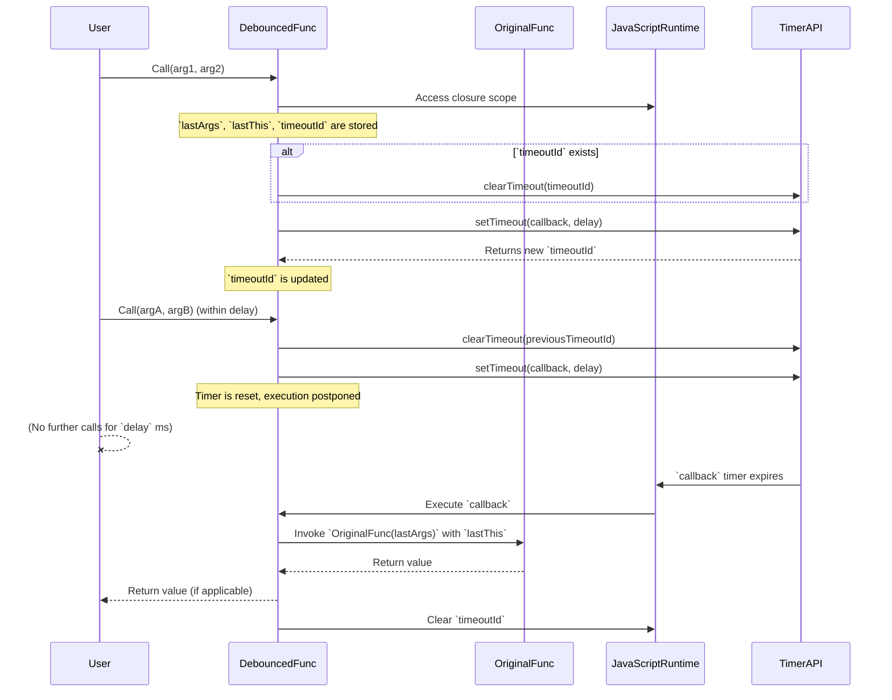

# Chapter 5: Function Adapters and Decorators

Welcome back to the Lodash journey! In the previous chapter, we explored [Chaining Operations](chapter_04.md), learning how to string together multiple Lodash utilities for a more fluent and readable coding style. Chaining allows us to process data through a pipeline of transformations. Now, we'll shift our focus from *what* functions do to *how* and *when* they are executed.

---

### Problem & Motivation

Imagine building a web application where users are typing into a search bar, and you want to fetch results from a server. If you make an API call on every single keystroke, you'll flood your server with requests, waste network resources, and potentially degrade user experience due to constant re-rendering. Similarly, consider a button that triggers a complex operation. If a user double-clicks it accidentally, the operation might run twice, leading to unwanted side effects or performance issues. Or perhaps you have a computationally expensive function that's called many times with the same arguments throughout your application's lifecycle. Re-calculating the same result repeatedly is inefficient.

These scenarios highlight a common need: the ability to *control* the execution of functions. We need mechanisms to limit how often a function runs, to delay its execution until certain conditions are met, or to cache its results to avoid redundant computations. This is precisely the problem that Lodash's Function Adapters and Decorators solve, allowing us to enhance and optimize existing functions without modifying their core logic.

---

### Core Concept Explanation

At the heart of Function Adapters and Decorators are *higher-order functions*. In JavaScript, a higher-order function is simply a function that either takes one or more functions as arguments or returns a function as its result (or both). Lodash leverages this powerful concept to provide a suite of utilities that *adapt* or *decorate* other functions.

Think of an adapter as an intermediary that sits between you and the original function. When you call the adapted function, the adapter intercepts the call, applies some logic (like checking a timer, looking up a cache, or pre-filling arguments), and *then* decides if and how to call the original function. A decorator is a type of adapter that "wraps" an existing function to add new behavior or modify its execution, similar to how a decorator adds flair or functionality to a room.

These utilities don't change the original function; instead, they return a *new* function with enhanced behavior. This principle is fundamental to functional programming, promoting immutability and allowing for powerful composition. Common examples include `_.debounce`, `_.throttle`, `_.memoize`, and `_.partial`, each addressing a specific execution control or optimization pattern. They enable us to write more performant, robust, and responsive applications by gracefully managing function calls.

---

### Practical Usage Examples

Let's illustrate how Lodash's function adapters solve our motivating problems.

#### 1. Debouncing (Controlling Rapid Execution)

`_.debounce(func, [wait=0], [options={}])` creates a debounced function that delays invoking `func` until after `wait` milliseconds have elapsed since the last time the debounced function was invoked. This is perfect for the search bar scenario.

```javascript
// A hypothetical function that makes an API call
function searchAPI(query) {
  console.log(`Searching for: ${query}...`);
  // In a real app, this would be an async API call
}

// Create a debounced version of searchAPI
const debouncedSearch = _.debounce(searchAPI, 500); // Wait 500ms

// Simulate user typing rapidly
debouncedSearch("apple");
debouncedSearch("applem");
debouncedSearch("applemus");
// Only the last call will trigger after 500ms of inactivity
// Expected output (after 500ms): Searching for: applemus...
```
*Explanation*: Even though `debouncedSearch` is called three times in quick succession, the `searchAPI` function only executes once, and only after a 500ms pause from the *last* invocation. This prevents unnecessary API calls.

#### 2. Throttling (Limiting Call Rate)

`_.throttle(func, [wait=0], [options={}])` creates a throttled function that only invokes `func` at most once per every `wait` milliseconds. Useful for resize events or frequently clicked buttons.

```javascript
function handleResize() {
  console.log("Window resized!");
}

// Create a throttled version, allowing calls at most every 1000ms
const throttledResize = _.throttle(handleResize, 1000);

// Simulate rapid resize events
window.addEventListener('resize', throttledResize);

// If the user drags the window border quickly, 'handleResize' will
// only be called once every second, not hundreds of times.
```
*Explanation*: If the window `resize` event fires many times within a second, `throttledResize` ensures that `handleResize` is called at most once every 1000 milliseconds.

#### 3. Memoization (Caching Results)

`_.memoize(func, [resolver])` creates a function that caches the result of `func` based on its arguments. If the same arguments are passed again, the cached result is returned, avoiding redundant computations.

```javascript
// An expensive function, e.g., Fibonacci
function fibonacci(n) {
  if (n <= 1) return n;
  console.log(`Calculating fib(${n})...`); // To show when it's actually called
  return fibonacci(n - 1) + fibonacci(n - 2);
}

// Create a memoized version
const memoizedFibonacci = _.memoize(fibonacci);

console.log(memoizedFibonacci(10));
// Expected: Calculating fib(10)..., Calculating fib(9)... etc. for unique calls
console.log(memoizedFibonacci(10)); // Uses cached result
// Expected: No "Calculating..." message, immediate return
console.log(memoizedFibonacci(5));
// Expected: Calculating fib(5)... (if not calculated as part of fib(10))
```
*Explanation*: The first call to `memoizedFibonacci(10)` performs the full calculation. The second call with `10` directly returns the cached result without re-executing `fibonacci`. When `memoizedFibonacci(5)` is called, it might reuse some intermediate results from `fib(10)` if its resolver allows, otherwise it computes new ones and caches them.

#### 4. Partial Application (Pre-filling Arguments)

`_.partial(func, [partials])` creates a function that invokes `func` with `partials` prepended to the arguments it receives.

```javascript
function greet(greeting, name) {
  return `${greeting}, ${name}!`;
}

// Create a function that always greets "Hello"
const sayHello = _.partial(greet, "Hello");

console.log(sayHello("Alice"));
// Expected: "Hello, Alice!"

// Create a function that always greets a specific person
const greetBob = _.partial(greet, _, "Bob"); // _ is a placeholder for future arguments

console.log(greetBob("Hi"));
// Expected: "Hi, Bob!"
```
*Explanation*: `_.partial` allows you to create specialized versions of functions by fixing some of their arguments upfront. The `_` (underscore) is a special placeholder indicating that the argument will be provided later.

---

### Internal Implementation Walkthrough

Let's take a simplified look at how `_.debounce` might work internally. While Lodash's actual implementation is highly optimized and robust, the core concept relies on closures and timers.



**Step-by-step for a simplified `debounce`:**

1.  **`_.debounce(func, wait)` is called:**
    *   It initializes a variable, say `timeoutId`, to `null` and `lastArgs`, `lastThis` to store arguments and context. These variables are *enclosed* within the scope of the returned debounced function.
    *   It returns a *new function* (let's call it `debouncedFunc`).

2.  **`debouncedFunc(...args)` is called:**
    *   The `debouncedFunc` captures the current arguments (`args`) and the `this` context.
    *   It checks if `timeoutId` is currently set (meaning there's an active timer from a previous invocation).
    *   If `timeoutId` exists, it calls `clearTimeout(timeoutId)` to cancel the pending execution. This is the crucial "reset" mechanism.
    *   It then sets a new timer using `setTimeout(callback, wait)`. The `callback` is a function that, when executed, will finally call the original `func` with the `lastArgs` and `lastThis`.
    *   The `timeoutId` is updated with the ID of this new timer.

3.  **No further `debouncedFunc` calls for `wait` milliseconds:**
    *   The `setTimeout` timer eventually expires.
    *   The `callback` function is executed.
    *   Inside the `callback`, the original `func` is invoked using `func.apply(lastThis, lastArgs)`.
    *   The `timeoutId` is reset to `null`, indicating no pending execution.

This pattern, using closures to maintain state (`timeoutId`, `lastArgs`, `lastThis`) and `setTimeout`/`clearTimeout` for timing control, is fundamental to how `debounce` and `throttle` operate. Lodash's actual implementation ([e.g., in `lodash.js` source](https://github.com/lodash/lodash/blob/master/debounce.js)) includes additional options like `leading` and `maxWait` for more control, but the core timing logic remains the same.

---

### System Integration

Function adapters and decorators are often integrated at the "edges" of an application or within utility layers to optimize behavior without modifying core business logic.

*   **Event Handling**: The most common integration is with DOM event listeners. Instead of directly assigning an event handler, you wrap it with `_.debounce` or `_.throttle`.
    ```javascript
    // Integrating with a UI event
    document.getElementById('search-input').addEventListener('input', debouncedSearch);
    window.addEventListener('scroll', _.throttle(checkScrollPosition, 200));
    ```
    This seamlessly integrates these optimizations into how user interactions are processed.

*   **API Interactions**: When making network requests, `_.debounce` can prevent redundant calls based on user input, while `_.throttle` could be used to limit the rate of polling requests.

*   **Computational Performance**: `_.memoize` is typically applied to pure functions that perform expensive calculations and are called frequently with potentially repetitive inputs. This can be within data transformation pipelines, or even as part of custom utility functions that are themselves called by [Collection Iterators](chapter_03.md).

*   **Functional Composition**: `_.partial` and its cousin `_.curry` (which we'll touch upon more in the next chapter on [Functional Programming (FP) Style](chapter_06.md)) are excellent for creating more specialized, reusable functions from general ones. They can be combined with other Lodash utilities for powerful data manipulation.

These adapters work independently of other Lodash features but can significantly enhance their performance when applied appropriately. They can wrap functions passed to `_.map`, `_.filter`, or functions used within [Chaining Operations](chapter_04.md) for specific scenarios where a performance bottleneck related to function execution frequency or redundant computation is identified.

---

### Best Practices & Tips

1.  **Choose Wisely: `debounce` vs. `throttle`**:
    *   **`debounce`**: Use when you want to execute a function *after* a period of inactivity. Ideal for search inputs, form validation, or "type-ahead" suggestions, where you only care about the final state after the user has stopped interacting.
    *   **`throttle`**: Use when you want to execute a function at a *regular interval*, regardless of how frequently the event fires. Ideal for scroll events, window resizing, or gaming controls, where you want continuous updates but not an overwhelming number of them.

2.  **Understand `this` Context**: By default, Lodash's debounced/throttled functions maintain the `this` context of their invocation. Be aware of this, especially if you're dealing with class methods or specific object contexts.

3.  **Memory Management with `_.memoize`**: While powerful, `_.memoize` can consume memory if the function is called with a vast number of unique arguments. In such cases, the cache can grow indefinitely. For scenarios requiring cache invalidation or size limits, consider implementing a more sophisticated caching mechanism or clearing the memoized function's cache using `memoizedFunc.cache.clear()`.

    ```javascript
    const memoizedFib = _.memoize(fibonacci);
    memoizedFib(10); // Calculation happens
    memoizedFib(20); // Calculation happens
    memoizedFib.cache.clear(); // Clears the entire cache
    memoizedFib(10); // Calculation happens again
    ```

4.  **Use `_.partialRight` for convenience**: If you need to pre-fill arguments from the *right* side of the function signature, `_.partialRight` is available.

    ```javascript
    function log(level, message, timestamp) {
      console.log(`[${timestamp}] [${level}] ${message}`);
    }

    const infoLog = _.partialRight(log, new Date().toISOString(), "INFO");
    infoLog("User logged in.");
    // Expected: [2023-10-27T10:00:00.000Z] [INFO] User logged in.
    ```

5.  **Avoid Over-optimization**: Don't just `debounce` or `throttle` every event handler. Apply these only when you observe or anticipate performance issues due to high frequency. Unnecessary application can introduce subtle delays or bugs.

6.  **Testing Debounced/Throttled Functions**: These functions can be tricky to test in unit tests due to their asynchronous nature. Consider using Jest's `jest.useFakeTimers()` and `jest.runAllTimers()` (or similar in other testing frameworks) to control `setTimeout` and `clearTimeout` for predictable testing.

---

### Chapter Conclusion

In this chapter, we've delved into Lodash's powerful Function Adapters and Decorators, understanding how they allow us to control and optimize function execution. We've seen how `_.debounce` and `_.throttle` manage the frequency of calls, `_.memoize` caches expensive results, and `_.partial` creates specialized functions. These higher-order functions are indispensable tools for building more efficient, responsive, and robust JavaScript applications by enhancing existing logic without alteration.

By understanding these patterns, you gain significant control over your application's behavior and performance. As we continue our journey, we'll explore even more advanced techniques for composing and managing functions. The next chapter will expand on some of these ideas, diving into [Functional Programming (FP) Style](chapter_06.md) with Lodash, where we'll see how a paradigm shift can lead to even cleaner and more predictable code.