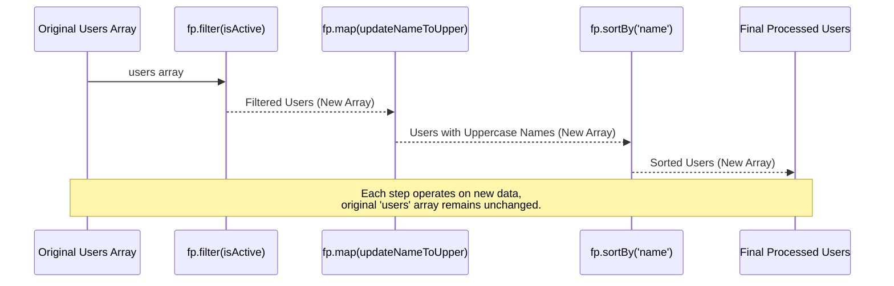

# Chapter 6: Functional Programming (FP) Style

In the [previous chapter on Function Adapters and Decorators](chapter_05.md), we explored how Lodash provides powerful tools to modify and enhance existing functions, controlling their execution and arguments. This foundational understanding of higher-order functions sets the stage perfectly for diving into **Functional Programming (FP) Style** with `lodash/fp`. While the regular Lodash library offers individual functions that *can* be used in a functional way, `lodash/fp` takes this a significant step further, reshaping the entire library to inherently support a pure functional programming paradigm.

---

### Problem & Motivation

Modern web applications often deal with complex data transformations, state management, and asynchronous operations. In this environment, writing code that is easy to understand, test, and maintain becomes crucial. Traditional imperative code, which relies heavily on mutable state and side effects, can quickly lead to hard-to-track bugs and tightly coupled modules. For example, consider a scenario where you need to process a list of user objects: filtering based on activity status, transforming their names, and then sorting them. If each step modifies the original list or relies on external state, debugging can be a nightmare.

This is where Functional Programming offers a compelling solution. FP emphasizes pure functions (functions that produce the same output for the same input and have no side effects), immutability (data that cannot be changed after creation), and composition (building complex operations from simpler, pure functions). The standard Lodash library, while offering many functional utilities, requires manual effort (e.g., using `_.curry` or `_.flow`) to consistently achieve this style.

`lodash/fp` addresses this problem directly. It provides a specialized version of Lodash where all functions are automatically curried and designed to be "data-last." This design promotes building declarative, immutable data pipelines, making code far more predictable and testable. Our guiding use case for this chapter will be to take an array of user objects, filter out inactive users, convert the names of the remaining users to uppercase, and then sort them alphabetically by name – all without modifying the original user data.

---

### Core Concept Explanation

At its heart, **Functional Programming (FP) Style** with `lodash/fp` is about leveraging a variant of the Lodash library specifically tailored for FP principles. It's not just a collection of functions; it's an opinionated approach to using Lodash to build robust and predictable applications.

The key concepts that define `lodash/fp` are:

1.  **Currying:** All `lodash/fp` functions are automatically *curried*. Currying is a transformation of functions that translates a function that takes multiple arguments into a sequence of functions, each taking a single argument. This allows you to partially apply arguments to a function, creating new, more specialized functions on the fly. For instance, instead of calling `filter(predicate, collection)`, you can call `filter(predicate)` to get a new function that expects a collection.

2.  **Data-Last Argument Order:** In `lodash/fp`, the data (or collection) that a function operates on is always the *last* argument. This seemingly small change is foundational for powerful function composition. When the data is last, you can easily chain functions together using tools like `fp.flow` (which is analogous to a pipe operator), where the output of one function becomes the input for the next, without needing to explicitly pass the data at each step.

3.  **Immutability:** `lodash/fp` functions are designed to be *immutable-first*. This means that when you perform an operation (like `map` or `filter`), the original data structure is never modified. Instead, a new data structure reflecting the changes is returned. This eliminates side effects, making your code easier to reason about and test, as you don't have to worry about unintended changes to your data.

4.  **Point-Free Style:** By embracing currying and data-last arguments, `lodash/fp` encourages *point-free style* (also known as tacit programming). This is where you define a function by composing other functions, without explicitly naming the arguments the function operates on. It leads to very concise and readable code, especially for data pipelines.

These principles combine to enable highly composable, predictable, and testable code, making `lodash/fp` an excellent choice for applications that value clarity and maintainability.

---

### Practical Usage Examples

Let's put `lodash/fp` into practice by addressing our motivating use case: filtering active users, transforming their names to uppercase, and then sorting them.

First, you import `lodash/fp`. Note that `lodash/fp` is a separate module, so you'd typically import it specifically.

```javascript
import * as fp from 'lodash/fp';

const users = [
  { id: 1, name: 'alice', active: true, department: 'engineering' },
  { id: 2, name: 'bob', active: false, department: 'hr' },
  { id: 3, name: 'charlie', active: true, department: 'engineering' },
  { id: 4, name: 'diana', active: false, department: 'marketing' }
];

console.log("Original Users:", users);
```
*(Explanation: We import the `lodash/fp` module, commonly aliased as `fp`, and define our initial dataset of user objects.)*

#### 1. Currying and Data-Last in Action

Let's see how currying and data-last arguments simplify filtering.

```javascript
// A curried function to check if a user is active
const isActive = fp.propEq('active', true);

// isActive is now a function that expects a user object.
// We can pass it directly to fp.filter.
const activeUsers = fp.filter(isActive, users);
console.log("Active Users:", activeUsers);
// Expected: [{ id: 1, name: 'alice', active: true, department: 'engineering' }, { id: 3, name: 'charlie', active: true, department: 'engineering' }]
```
*(Explanation: `fp.propEq('active', true)` creates a partially applied function that checks if the `active` property of an object is `true`. `fp.filter` then takes this predicate function and the `users` array, returning a new array containing only active users. Notice how `users` is the last argument to `fp.filter`.)*

#### 2. Transforming Data Immutably

Now, let's transform the names to uppercase. `fp.update` is useful for changing a specific property.

```javascript
// A curried function to transform a specific property's value
const updateNameToUpper = fp.update('name', fp.toUpper);

// Apply this transformation to each user in the activeUsers list
const usersWithUppercaseNames = fp.map(updateNameToUpper, activeUsers);
console.log("Users with Uppercase Names:", usersWithUppercaseNames);
// Expected: [{ id: 1, name: 'ALICE', active: true, ... }, { id: 3, name: 'CHARLIE', active: true, ... }]
```
*(Explanation: `fp.update('name', fp.toUpper)` creates a function that takes an object and updates its `name` property by applying `fp.toUpper` to its value. `fp.map` then applies this function to each user in `activeUsers`, returning a *new* array with updated user objects, leaving the `activeUsers` array untouched.)*

#### 3. Composing Operations with `fp.flow`

The real power of `lodash/fp` shines when composing these steps into a single, declarative pipeline using `fp.flow`. `fp.flow` creates a function that passes its arguments through a series of functions, each one piping its output to the next.

```javascript
// Our complete processing pipeline
const processUsers = fp.flow(
  fp.filter(fp.propEq('active', true)),     // 1. Filter active users
  fp.map(fp.update('name', fp.toUpper)),    // 2. Uppercase names
  fp.sortBy('name')                          // 3. Sort by name
);

const finalUsers = processUsers(users);
console.log("Final Processed Users:", finalUsers);
// Expected:
// [
//   { id: 1, name: 'ALICE', active: true, department: 'engineering' },
//   { id: 3, name: 'CHARLIE', active: true, department: 'engineering' }
// ]
```
*(Explanation: `fp.flow` takes multiple functions as arguments and returns a new function. When `processUsers(users)` is called, the `users` array is passed to the first function (`fp.filter(...)`). Its result is then passed to the second function (`fp.map(...)`), and so on, until the final sorted result is produced. This illustrates a clear, readable, and immutable data transformation pipeline.)*

---

### Internal Implementation Walkthrough

Understanding how `lodash/fp` achieves its functional style involves recognizing that it's essentially a carefully constructed layer on top of the regular Lodash library. It's not a re-implementation of every function from scratch, but rather a wrapper that modifies their behavior, primarily concerning argument order and automatic currying.

1.  **Argument Reordering (Data-Last):** For each standard Lodash function (e.g., `_.map(collection, iteratee)`), `lodash/fp` provides a variant (e.g., `fp.map(iteratee, collection)`) where the collection argument is moved to the last position. This is often achieved through a simple internal adapter that flips argument order before calling the original Lodash function.

2.  **Automatic Currying:** Every function exported by `lodash/fp` is automatically curried. This means you don't need to manually use `_.curry` as you might with the standard Lodash library. The currying logic is applied during the `lodash/fp` module's construction. As we saw in [Function Adapters and Decorators](chapter_05.md), currying essentially transforms a function `f(a, b, c)` into `f(a)(b)(c)`, allowing partial application. `lodash/fp` applies this automatically based on the arity (number of expected arguments) of the original Lodash function.

Let's visualize the `fp.flow` operation internally, using our user processing example:


*(Explanation: When `processUsers(users)` is invoked, the `users` array becomes the input for the first function in the `fp.flow` pipeline, `fp.filter(isActive)`. This function returns a *new* array of active users. This new array is then passed as the data-last argument to the next function, `fp.map(updateNameToUpper)`, which again produces a *new* array. Finally, this array is passed to `fp.sortBy('name')`, yielding the final sorted, new array. This sequence guarantees immutability throughout the pipeline.)*

Conceptually, the internal mechanism for a `lodash/fp` function might look something like this (simplified pseudo-code):

```javascript
// Imagine this is part of how lodash/fp is built
function createFpVersion(originalLodashFunction, argCount) {
  // Return a curried function that also reorders arguments
  return _.curry(function(...args) {
    // If all arguments are received, reorder them for the original function
    // (e.g., move collection to last) and then call originalLodashFunction
    if (args.length >= argCount) {
      const collection = args[argCount - 1]; // Assume collection is always the last argument in standard lodash
      const reorderedArgs = [...args.slice(0, argCount - 1), collection];
      return originalLodashFunction(...reorderedArgs);
    }
    // If not all arguments, return a new function (currying)
    // (Actual _.curry handles this more gracefully)
    // This is a simplification; the real _.curry is more robust.
    return createFpVersion(originalLodashFunction.bind(null, ...args), argCount - args.length);
  });
}

// Example: fp.map
// fp.map = createFpVersion(_.map, 2); // original _.map takes (collection, iteratee)
// The createFpVersion would ensure fp.map expects (iteratee, collection) and is curried.
```
*(Explanation: The `lodash/fp` build process essentially wraps each standard Lodash function. This wrapper applies `_.curry` to make it curried and, crucially, reorders the arguments so that the data collection is always the *last* argument. This transformation is done once when `lodash/fp` is built, or when it's initially imported, not on every function call, making it efficient.)*

---

### System Integration

`lodash/fp` plays a pivotal role in systems that prioritize predictable state management, testability, and a clear data flow. Its integration points are often where data transformations occur.

*   **Redux Reducers and State Management:** `lodash/fp` is an excellent fit for Redux reducers or any immutable state management pattern. Since its functions don't mutate their inputs, you can confidently use them to compute new states from old states without side effects. This guarantees that your reducer functions are pure, making your application's state transitions highly predictable and easy to debug.
    ```javascript
    // Example Redux-like reducer snippet
    const initialState = {
      todos: [{ id: 1, text: 'Learn FP', completed: false }]
    };

    const addTodo = (text, state) =>
      fp.update('todos', fp.concat(fp.objOf('id', state.todos.length + 1)(fp.objOf('text', text)(fp.objOf('completed', false)({})))), state);
      // More readable version:
      // fp.update(
      //   'todos',
      //   todos => fp.concat(todos, [{ id: todos.length + 1, text, completed: false }]),
      //   state
      // );

    const newState = addTodo('Build App', initialState);
    console.log("New State (Immutable):", newState);
    console.log("Original State (Unchanged):", initialState);
    ```
    *(Explanation: Here, `fp.update` creates a new state object, and `fp.concat` creates a new `todos` array. The `initialState` object remains completely unchanged, which is crucial for predictable state management.)*

*   **Data Pipelines and ETL (Extract, Transform, Load):** When dealing with data processing, `lodash/fp` excels at creating clear, declarative pipelines for transforming data. Whether it's processing data from an API, cleaning up user inputs, or preparing data for display, `fp.flow` provides an elegant way to define these steps.
*   **API Request Pre- and Post-processing:** You can use `lodash/fp` to normalize incoming API data or transform outgoing data before sending it. For example, ensuring all user IDs are numbers or filtering out sensitive fields.
*   **Composition with Custom Pure Functions:** `lodash/fp` seamlessly integrates with any other pure functions you write. You can include your own domain-specific transformations directly within an `fp.flow` pipeline.

While `lodash/fp` provides an alternative way to compose operations compared to [Chaining Operations](chapter_04.md), the core underlying [Core Utility Functions](chapter_02.md) are largely the same. The difference lies in how they are exposed and how arguments are handled to enable a more consistent FP style. For deep dives into specific function mechanics, you might still refer to the standard Lodash documentation.

---

### Best Practices & Tips

Adopting `lodash/fp` effectively involves embracing a functional mindset. Here are some best practices and tips:

*   **Embrace Immutability:** Always expect `lodash/fp` functions to return *new* data structures. Never rely on them modifying existing objects or arrays. This is the cornerstone of functional purity and predictability.
*   **Prefer `fp.flow` or `fp.pipe` for Composition:** For sequential operations, `fp.flow` (executed left-to-right) or `fp.pipe` (an alias for `fp.flow`) are your best friends. They make your data transformation pipelines incredibly readable and declarative.
    ```javascript
    const transformAndSort = fp.pipe(
      fp.filter(u => u.age > 18),
      fp.map(fp.update('name', fp.toUpper)),
      fp.sortBy('name')
    );
    ```
*   **Utilize Point-Free Style When Appropriate:** `fp.map('name')` is often cleaner than `fp.map(user => user.name)`. Similarly, `fp.filter(fp.propEq('active', true))` is more concise than `fp.filter(user => user.active === true)`. This makes your code more terse and expressive, but don't overdo it to the point of reduced readability.
*   **Avoid Mixing `lodash` and `lodash/fp` in Pipelines:** Due to the differing argument orders (data-first vs. data-last) and currying behavior, mixing standard Lodash functions directly within `fp.flow` or `fp.pipe` can lead to confusion and errors. Stick to `lodash/fp` functions when working in an `fp.flow` pipeline.
*   **Debugging Functional Pipelines:** When a complex `fp.flow` pipeline isn't producing the expected result, debugging can sometimes be tricky.
    *   **Break it down:** Temporarily split your `fp.flow` into intermediate variables to inspect the output of each step.
    *   **Use a tracing utility:** You can create a simple `trace` function to inject into your `fp.flow` to log intermediate values.
    ```javascript
    const trace = label => val => {
      console.log(`${label}:`, val);
      return val;
    };

    const debuggedProcessUsers = fp.flow(
      fp.filter(fp.propEq('active', true)),
      trace('After Filter'), // Log output after filtering
      fp.map(fp.update('name', fp.toUpper)),
      trace('After Map'),    // Log output after mapping
      fp.sortBy('name')
    );
    ```
*   **Performance Considerations:** While `lodash/fp` introduces some overhead due to currying and argument reordering, for most applications, this is negligible. The benefits in terms of code clarity, maintainability, and testability far outweigh the minor performance implications. For extremely high-performance scenarios or very large datasets, benchmark your specific use case.

---

### Chapter Conclusion

This chapter has guided you through the principles and practical applications of **Functional Programming (FP) Style** using `lodash/fp`. We've seen how this specialized module transforms the Lodash library into a powerful toolkit for building applications with pure functions, immutability, and declarative data pipelines.

By understanding and applying concepts like automatic currying, data-last argument order, and point-free composition with `fp.flow`, you can write code that is inherently more predictable, easier to test, and more robust against common programming pitfalls. `lodash/fp` empowers you to construct complex data transformations from simple, reusable functions, leading to highly maintainable and scalable systems.

This marks the conclusion of our comprehensive project documentation for Lodash. Throughout these chapters, we've journeyed from the fundamental `_` object and its core utilities, through powerful collection iterators and chaining mechanisms, to advanced function adapters and the pure functional paradigm offered by `lodash/fp`. You now possess a comprehensive understanding of Lodash's capabilities and how to leverage them effectively in diverse programming contexts.