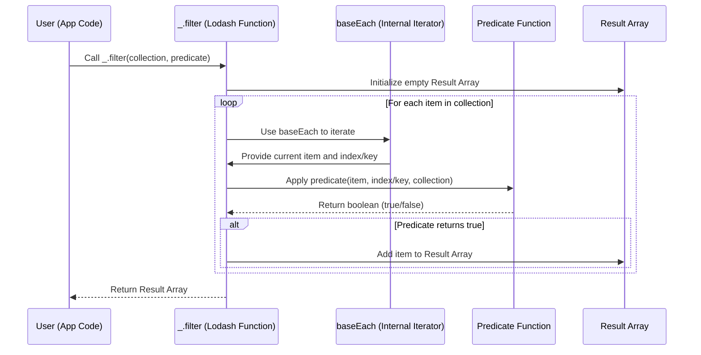

# Chapter 3: Collection Operations

In the previous chapter, [Utility Functions](chapter_02.md), we explored the fundamental building blocks of Lodash – individual, highly optimized functions for various common programming tasks. We learned how these functions enhance code readability and efficiency for tasks like type checking, cloning, and basic data manipulation. Now, we turn our attention to one of Lodash's most powerful categories: **Collection Operations**.

---

### Problem & Motivation

JavaScript's native methods for manipulating arrays and objects, while functional, can sometimes be inconsistent, verbose, or lack specific functionalities needed for complex data transformations. For instance, iterating over both arrays and objects with a single consistent API, performing deep transformations, or grouping data often requires writing boilerplate code, which can be error-prone and less performant.

Consider a common scenario: managing a list of user accounts. You might need to filter active users, extract specific properties like email addresses, or group them by their department. Without a robust utility library, accomplishing these tasks efficiently and consistently across different data structures (arrays of objects, or objects where keys are user IDs) can lead to repetitive and less readable code. This is where Lodash's Collection Operations become indispensable, providing a consistent, high-performance toolkit for handling any iterable data structure.

---

### Core Concept Explanation

Collection Operations in Lodash refer to a specialized set of utility functions designed to work seamlessly with both arrays and objects. Lodash treats these data structures as "collections," allowing developers to apply common operations like iteration, transformation, filtering, and reduction using a unified and intuitive API. This abstraction significantly simplifies data processing by standardizing the way you interact with diverse data types.

The core idea is to abstract away the underlying differences between arrays (indexed elements) and objects (keyed properties), providing a single function signature that adapts to the collection's nature. For arrays, functions operate on elements by index; for objects, they operate on property values by key. This consistency boosts developer productivity and reduces the cognitive load associated with switching between different data manipulation paradigms. Key concepts include *iterators* (functions that visit each element), *predicates* (functions that return true/false for filtering), and *iteratee callbacks* (functions applied to each element to transform it).

---

### Practical Usage Examples

Let's illustrate how Collection Operations solve our motivating use case of managing user data. Imagine we have an array of user objects:

```javascript
const users = [
  { id: 1, name: 'Alice', active: true, department: 'Engineering' },
  { id: 2, name: 'Bob', active: false, department: 'HR' },
  { id: 3, name: 'Charlie', active: true, department: 'Engineering' },
  { id: 4, name: 'David', active: true, department: 'Marketing' }
];
```

#### **1. Iterating Over Elements: `_.forEach`**

The `_.forEach` function iterates over elements in a collection, executing a callback function for each element. It's similar to `Array.prototype.forEach`, but works for objects as well.

```javascript
// Logs each user's name
_.forEach(users, (user) => {
  console.log(`User: ${user.name}`);
});
// Expected output:
// User: Alice
// User: Bob
// User: Charlie
// User: David
```
This example shows a simple loop through the `users` array, printing each user's name. `_.forEach` is perfect for side effects like logging or triggering events for each item.

#### **2. Filtering Collections: `_.filter`**

`_.filter` creates a new array of all elements for which the `predicate` callback returns `true`.

```javascript
const activeUsers = _.filter(users, { active: true });
console.log(activeUsers.map(u => u.name));
// Expected output: [ 'Alice', 'Charlie', 'David' ]
```
Here, `_.filter` efficiently selects only the users whose `active` property is `true`. Lodash allows passing an object as a shorthand for a predicate function, making the code very concise.

#### **3. Transforming Collections: `_.map`**

`_.map` creates a new array of values by running each element in the collection through an `iteratee` callback.

```javascript
const userNames = _.map(activeUsers, 'name');
console.log(userNames);
// Expected output: [ 'Alice', 'Charlie', 'David' ]
```
This example transforms our `activeUsers` array into an array containing only their names. Similar to `_.filter`, `_.map` also accepts a string as a shorthand to extract a property value.

#### **4. Grouping Collections: `_.groupBy`**

`_.groupBy` creates an object composed of keys generated from the results of running each element of collection through `iteratee`.

```javascript
const usersByDepartment = _.groupBy(users, 'department');
console.log(Object.keys(usersByDepartment));
// Expected output: [ 'Engineering', 'HR', 'Marketing' ]
```
`_.groupBy` takes our `users` array and organizes them into an object where each key is a department name, and its value is an array of users belonging to that department. This is incredibly useful for aggregation.

#### **5. Reducing Collections: `_.reduce`**

`_.reduce` (also known as `fold` or `inject`) reduces a collection to a single value by iteratively applying a function against an accumulator and each element in the collection.

```javascript
const totalActiveUsers = _.reduce(users, (sum, user) => {
  return sum + (user.active ? 1 : 0);
}, 0);
console.log(`Total active users: ${totalActiveUsers}`);
// Expected output: Total active users: 3
```
In this snippet, `_.reduce` counts the number of active users by iterating through the `users` array, adding 1 to the `sum` accumulator for each active user. The initial value for `sum` is `0`.

---

### Internal Implementation Walkthrough

While the exact internal implementation of Lodash functions can be quite optimized (sometimes involving C++ under the hood for Node.js or highly optimized JavaScript for browsers), we can understand the core logic behind a function like `_.filter`.

At its heart, `_.filter` needs to:
1.  Iterate over each element in the input collection.
2.  Apply a given `predicate` function to each element.
3.  If the predicate returns `true`, add the element to a new result collection.
4.  Return the new result collection.

Let's visualize this with a simplified flow for filtering an array:



**Step-by-step Explanation of `_.filter` (Simplified):**

1.  **Initialization:** When you call `_.filter(collection, predicate)`, Lodash first sets up an empty array or object (`Result Array` in the diagram) to store the elements that pass the filter.
2.  **Iteration:** Lodash then uses an internal helper, often `baseEach` or similar, which is a generic iterator designed to traverse both arrays and objects efficiently. This `baseEach` helper abstracts away the differences in iterating over indexed arrays versus keyed objects.
3.  **Predicate Application:** For each element (`item`) in the `collection`, `_.filter` calls the `predicate` function you provided (e.g., `{ active: true }` or a custom function). The `predicate` receives the `item` itself, its `index` (for arrays) or `key` (for objects), and the `collection` being iterated.
4.  **Conditional Inclusion:** Based on whether the `predicate` returns `true` or `false`, `_.filter` decides whether to include the current `item` in the `Result Array`.
5.  **Return:** Once all elements have been processed, `_.filter` returns the `Result Array` containing only the elements that satisfied the `predicate`.

This internal structure ensures that Lodash functions are performant and handle various collection types consistently.

---

### System Integration

Collection Operations are arguably the most frequently used functions in Lodash and integrate deeply with almost every other part of the library.

1.  **With [The 'lodash' Object](chapter_01.md):** All collection operations are methods directly available on the `_` object, serving as the primary entry point.
    ```javascript
    const _ = require('lodash');
    const filtered = _.filter(myArray, item => item.active);
    ```

2.  **With [Utility Functions](chapter_02.md):** Collection operations often leverage other utility functions. For example, a complex `predicate` for `_.filter` might involve `_.isObject`, `_.get`, or `_.isEqual`.
    ```javascript
    const data = [{ a: { b: 1 } }, { a: { b: 2 } }];
    const hasB1 = _.filter(data, item => _.get(item, 'a.b') === 1);
    console.log(hasB1); // Output: [ { a: { b: 1 } } ]
    ```

3.  **With [Property Access and Manipulation](chapter_04.md):** Functions like `_.map`, `_.filter`, and `_.sortBy` frequently use string shorthands that rely on Lodash's internal property access mechanisms (similar to `_.get`).
    ```javascript
    const users = [{ name: 'Alice', age: 30 }, { name: 'Bob', age: 25 }];
    const names = _.map(users, 'name'); // Uses internal property access
    console.log(names); // Output: [ 'Alice', 'Bob' ]
    ```

4.  **With [Chaining Operations](chapter_05.md):** Collection operations are fundamental to building fluent, chainable data processing pipelines. This allows for clear, sequential transformations.
    ```javascript
    const _ = require('lodash');
    const users = [
      { id: 1, name: 'Alice', active: true, department: 'Engineering' },
      { id: 2, name: 'Bob', active: false, department: 'HR' }
    ];

    const activeEngineers = _.chain(users)
      .filter({ active: true })
      .filter({ department: 'Engineering' })
      .map('name')
      .value();

    console.log(activeEngineers); // Output: [ 'Alice' ]
    ```
    This shows how filtering and mapping are combined in a chain.

5.  **With [Functional Programming (FP) Variant](chapter_06.md):** The `lodash/fp` module provides curried, data-last versions of these collection operations, promoting a more pure functional programming style.
    ```javascript
    const fp = require('lodash/fp');
    const getActiveEngineersFP = fp.pipe(
      fp.filter(fp.where({ active: true })),
      fp.filter(fp.where({ department: 'Engineering' })),
      fp.map('name')
    );
    const activeEngineersFP = getActiveEngineersFP(users);
    console.log(activeEngineersFP); // Output: [ 'Alice' ]
    ```
    Here, the collection operations are composed into a data pipeline, making the transformation logic reusable and clear.

---

### Best Practices & Tips

*   **Immutability First:** Most Lodash collection operations (like `_.map`, `_.filter`, `_.groupBy`) return new collections, rather than modifying the original in place. Embrace this immutable pattern to prevent unexpected side effects and make your code easier to reason about.
*   **Choose the Right Function:** Lodash offers many specific functions (e.g., `_.pick`, `_.omit`, `_.countBy`, `_.keyBy`) that are more expressive and often more efficient than a generic `_.forEach` or `_.reduce` for specific tasks.
*   **Predicate Shorthands:** Utilize Lodash's powerful shorthand for predicates (string, object, array) to write concise and readable code.
    *   `_.filter(users, 'active')` is shorthand for `_.filter(users, { 'active': true })`
    *   `_.map(users, 'name')` is shorthand for `_.map(users, user => user.name)`
    *   `_.filter(users, ['active', true])` is shorthand for `_.filter(users, { 'active': true })`
*   **Performance Considerations:** While Lodash is highly optimized, be mindful of nested loops or excessively complex `iteratee` functions on very large collections. For extremely performance-critical scenarios, consider specialized native implementations or Lodash's lazy evaluation with chaining (`_.chain()...value()`).
*   **Avoid Modifying Collections During Iteration:** If you are using `_.forEach` or a similar iterator, avoid adding or removing elements from the collection you are currently iterating over, as this can lead to unpredictable behavior. Instead, create a new collection for modifications.
*   **Error: Forgetting Return in `_.map` or `_.reduce`:** A common mistake is to forget to return a value from the `iteratee` function in `_.map` or `_.reduce`. This will result in `undefined` values in the new array for `_.map`, or incorrect accumulation for `_.reduce`.
    ```javascript
    // Incorrect:
    const ages = _.map(users, user => { user.age; }); // Will result in [undefined, undefined, ...]
    // Correct:
    const ages = _.map(users, user => user.age);
    ```

---

### Chapter Conclusion

Collection Operations form the backbone of data manipulation in Lodash, offering a comprehensive and consistent API for interacting with arrays and objects. We've seen how functions like `_.forEach`, `_.filter`, `_.map`, `_.groupBy`, and `_.reduce` provide powerful, readable, and efficient solutions to common data processing challenges. By abstracting away the complexities of different data structures, Lodash enables developers to focus on the *what* rather than the *how* of data transformation.

Understanding these operations is crucial for harnessing the full power of Lodash and for building robust, maintainable JavaScript applications. As we move forward, we'll see how these operations combine with other Lodash features, particularly when it comes to sophisticated ways of dealing with object properties and building complex, fluent data processing pipelines.

Our next chapter, [Property Access and Manipulation](chapter_04.md), will delve deeper into how Lodash provides powerful and safe ways to interact with properties of objects, complementing the collection operations we've learned today.