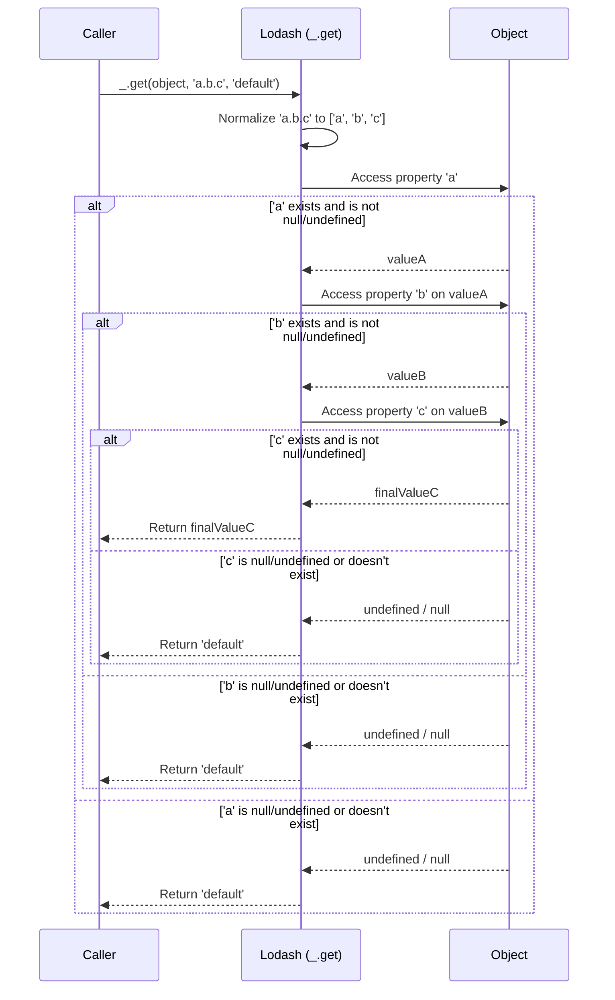

# Chapter 4: Property Access and Manipulation

Having explored how Lodash empowers us to iterate, transform, and filter various data structures with its [Collection Operations](chapter_03.md), we now turn our attention to a equally crucial aspect of data handling: precisely accessing and manipulating individual properties within those collections, especially in complex, nested objects. While collection operations help us work *with* groups of data, property access ensures we can reliably get *to* the specific pieces of data we need.

---

### Problem & Motivation

In JavaScript, directly accessing properties in deeply nested objects can quickly become a source of frustrating runtime errors. Imagine you have a `user` object, and you want to retrieve their primary address's city. A direct approach might look like `user.address.primary.city`. But what if `user.address` is `undefined`? Or `user.address.primary` doesn't exist? This would immediately throw a `TypeError: Cannot read properties of undefined (reading 'city')`. To prevent this, developers often resort to verbose conditional checks like `user && user.address && user.address.primary && user.address.primary.city`, which clutters code and reduces readability.

This problem is highly prevalent in applications dealing with unpredictable data sources (like APIs) or complex data models. Lodash, as a library focused on developer productivity and robust data manipulation, recognizes this as a critical pain point. It provides a set of highly optimized functions to safely access, set, and check properties, including nested ones, without the risk of `TypeError` exceptions. These utilities streamline object interactions, making your code cleaner and more resilient to unexpected data structures.

Let's consider a practical use case throughout this chapter: we need to display the primary email address from a `user` object, which might be missing personal contact details or even the primary email itself. If it's missing, we want to display a default value.

---

### Core Concept Explanation

Lodash's approach to property access and manipulation revolves around treating object paths as first-class citizens. Instead of stepping through each property manually and checking for `undefined` at every stage, Lodash functions accept a 'path' (either as a string like `'a.b.c'` or an array `['a', 'b', 'c']`) and handle the traversal and safety checks internally.

At its heart, this abstraction solves the "nullish coalescing" problem for nested paths. It allows you to specify a fallback value if a property along the path is `null` or `undefined`, much like the `??` operator for single values, but extended for complex paths. Key functions in this category include `_.get` for safe retrieval, `_.set` for safe assignment (even creating intermediate objects if needed), and `_.has` for checking property existence without triggering errors. These functions centralize the logic for robust object interaction, allowing developers to focus on the business logic rather than defensive coding. They effectively abstract away the tedious boilerplate of checking each level of an object structure.

---

### Practical Usage Examples

Let's apply these concepts to our motivating use case: safely retrieving a user's primary email address or a default message.

**1. Safely Getting Nested Properties with `_.get`**

The `_.get` function is your go-to for safe property access. It takes an object, a path, and an optional default value.

```javascript
const user1 = {
  id: 1,
  contact: {
    emails: [
      { type: 'primary', address: 'john.doe@example.com' },
      { type: 'secondary', address: 'jd@work.com' }
    ]
  }
};

const user2 = {
  id: 2,
  contact: { /* no emails */ }
};

const user3 = {
  id: 3,
  // no contact property
};

// Accessing primary email for user1
const email1 = _.get(user1, 'contact.emails[0].address', 'N/A');
console.log(`User 1 primary email: ${email1}`);
// Expected output: User 1 primary email: john.doe@example.com
```
Here, `_.get` successfully navigates the path for `user1`.

```javascript
// Accessing primary email for user2 (missing emails array)
const email2 = _.get(user2, 'contact.emails[0].address', 'Email Not Provided');
console.log(`User 2 primary email: ${email2}`);
// Expected output: User 2 primary email: Email Not Provided
```
For `user2`, `contact.emails` is missing, so `_.get` returns our provided default value.

```javascript
// Accessing primary email for user3 (missing contact object)
const email3 = _.get(user3, 'contact.emails[0].address', 'Contact Info Missing');
console.log(`User 3 primary email: ${email3}`);
// Expected output: User 3 primary email: Contact Info Missing
```
Even when `contact` is entirely missing, `_.get` gracefully handles it with the default.

**2. Setting Nested Properties with `_.set`**

`_.set` allows you to assign a value to a property at a specified path, creating intermediate objects/arrays if they don't exist. It modifies the object in place.

```javascript
const newUser = { id: 4 };

// Set a new primary email
_.set(newUser, 'contact.emails[0].address', 'jane.doe@example.com');
console.log(newUser.contact.emails[0].address);
// Expected output: jane.doe@example.com

// Set the type for the new email
_.set(newUser, 'contact.emails[0].type', 'primary');
console.log(newUser.contact.emails[0].type);
// Expected output: primary

// Check the complete structure
console.log(JSON.stringify(newUser, null, 2));
// Expected output will show the nested contact and emails array created.
/*
{
  "id": 4,
  "contact": {
    "emails": [
      {
        "address": "jane.doe@example.com",
        "type": "primary"
      }
    ]
  }
}
*/
```
Notice how `_.set` automatically created the `contact` object and the `emails` array, making deep assignments simple.

**3. Checking for Property Existence with `_.has`**

`_.has` checks if a property exists at a given path. It returns `true` or `false` and does not throw errors for non-existent paths.

```javascript
const product = {
  name: 'Laptop',
  details: {
    specs: {
      cpu: 'Intel i7',
      ram: '16GB'
    }
  }
};

console.log(_.has(product, 'details.specs.cpu'));    // true
console.log(_.has(product, 'details.specs.gpu'));    // false (gpu doesn't exist)
console.log(_.has(product, 'details.warranty'));     // false (warranty doesn't exist)
console.log(_.has(product, 'price'));                // false (price doesn't exist)
console.log(_.has(product, 'name'));                 // true
```
`_.has` is useful for conditional logic without risking errors.

**4. Retrieving Multiple Properties with `_.at`**

`_.at` allows you to pick multiple properties from various paths and returns them as an array of values.

```javascript
const settings = {
  theme: 'dark',
  notifications: {
    email: true,
    sms: false
  },
  preferences: {
    language: 'en',
    timezone: 'UTC'
  }
};

const selectedSettings = _.at(
  settings,
  'theme',
  'notifications.email',
  'preferences.language',
  'unknown.path' // This will be undefined in the output
);

console.log(selectedSettings);
// Expected output: [ 'dark', true, 'en', undefined ]
```
`_.at` is handy for extracting several pieces of data in one go, similar to destructuring but with path support and graceful handling of missing properties.

---

### Internal Implementation Walkthrough

Let's delve into how a function like `_.get` might work internally. While the actual Lodash implementation is highly optimized and handles various edge cases (like arrays, symbols, and deeply nested paths efficiently), the core logic for `_.get` can be understood as an iterative process:

At a high level, `_.get(object, path, defaultValue)` performs the following steps:

1.  **Normalize Path:** If the `path` is a string, it's parsed into an array of individual property keys (e.g., `'a.b[0].c'` becomes `['a', 'b', '0', 'c']`).
2.  **Iterative Traversal:** It starts with the `object` itself. For each key in the normalized path array, it attempts to access the property on the current value.
3.  **Safety Check:** After each property access, it checks if the retrieved value is `null` or `undefined`.
    *   If it *is* `null` or `undefined` at any intermediate step, the traversal stops, and `defaultValue` is returned immediately. This is the core mechanism that prevents `TypeError`s.
    *   If the property exists and is not `null`/`undefined`, the traversal continues with the newly retrieved value.
4.  **Final Result:** If the entire path is successfully traversed, the final value at the end of the path is returned. If at any point the path could not be resolved, the `defaultValue` is returned.

Here's a simplified sequence diagram for `_.get`:



This sequence highlights how `_.get` systematically checks each level of the path, providing a safety net against missing intermediate properties. Lodash achieves this efficiently using carefully crafted loops and conditional logic, often leveraging internal helper functions for path resolution.

---

### System Integration

Lodash's property access and manipulation functions are foundational and integrate seamlessly with other parts of the library:

*   **With [Collection Operations](chapter_03.md):** You'll frequently use `_.get` within collection iterators like `_.map`, `_.filter`, or `_.reduce`. For example, to extract a specific nested property from an array of objects:

    ```javascript
    const users = [
      { name: 'Alice', address: { city: 'New York' } },
      { name: 'Bob', address: { city: 'London' } },
      { name: 'Charlie' } // Missing address
    ];

    const cities = _.map(users, user => _.get(user, 'address.city', 'Unknown'));
    console.log(cities);
    // Expected output: [ 'New York', 'London', 'Unknown' ]
    ```
    Here, `_.map` iterates over the `users` collection, and `_.get` safely extracts the `city` from each, providing a default if missing.

*   **Preparing for [Chaining Operations](chapter_05.md):** Property access functions are often the first step in a fluent chain of operations. You might get a property, then transform it, then filter based on another nested property, all within a single chain.

    ```javascript
    const data = {
      items: [
        { id: 1, info: { status: 'active' } },
        { id: 2, info: { status: 'inactive' } },
        { id: 3, info: { status: 'pending' } }
      ]
    };

    // Example of setting a property before chaining (not a chain itself, but shows usage)
    _.set(data, 'items[0].info.priority', 'high');
    console.log(_.get(data, 'items[0].info.priority')); // high
    ```
    This demonstrates how `_.set` can prepare data that might then be processed further using `Collection Operations` or `Chaining Operations`.

These functions provide the necessary tools to reliably interact with complex data structures, forming a critical bridge between generic data processing and precise data point manipulation.

---

### Best Practices & Tips

1.  **Always Provide a Default Value for `_.get`**: Unless you explicitly expect `undefined` and handle it, providing a default makes your code more robust and predictable, preventing `undefined` from propagating through your application.
2.  **Use Path Strings for Simplicity**: For most common cases, `'prop1.prop2.prop3'` is more readable than `['prop1', 'prop2', 'prop3']`. Use array paths when property keys contain dots or other special characters that would be misinterpreted by string parsing.
3.  **Be Mindful of `_.set`'s Side Effects**: `_.set` modifies the original object in place. If you need to immutably update an object, you'll need to combine `_.set` with other techniques (like `_.cloneDeep` or object spread syntax before setting).
4.  **`_.has` vs. Direct Property Check**: `_.has(obj, path)` is safer for nested paths. For top-level properties or when you've already ensured intermediate paths exist, `obj.property !== undefined` or `Object.prototype.hasOwnProperty.call(obj, 'property')` can be slightly more performant if absolute speed is critical, but the safety of `_.has` often outweighs this for nested scenarios.
5.  **Consider `_.at` for Multiple Values**: When you need to retrieve several distinct (possibly nested) properties from an object, `_.at` offers a concise way to do it compared to multiple `_.get` calls.
6.  **Avoid Excessive Deep Nesting**: While Lodash makes deep access safe, overly nested data structures can still be a sign of a design flaw. If you find yourself consistently accessing properties 5+ levels deep, consider restructuring your data.

---

### Chapter Conclusion

This chapter has illuminated the critical role of Lodash's property access and manipulation functions in building robust and maintainable JavaScript applications. By abstracting away the complexities and pitfalls of direct property access, functions like `_.get`, `_.set`, `_.has`, and `_.at` empower developers to interact with complex, nested data structures confidently and efficiently. We've seen how they solve real-world problems by preventing common `TypeError` exceptions, reducing boilerplate code, and making object manipulation a breeze.

Understanding these utilities is fundamental to mastering Lodash. They serve as the foundation upon which more complex data transformations are built. As we move forward, we'll see how these precise manipulation capabilities become even more powerful when combined with Lodash's fluent [Chaining Operations](chapter_05.md), allowing you to construct expressive and highly readable data processing pipelines.