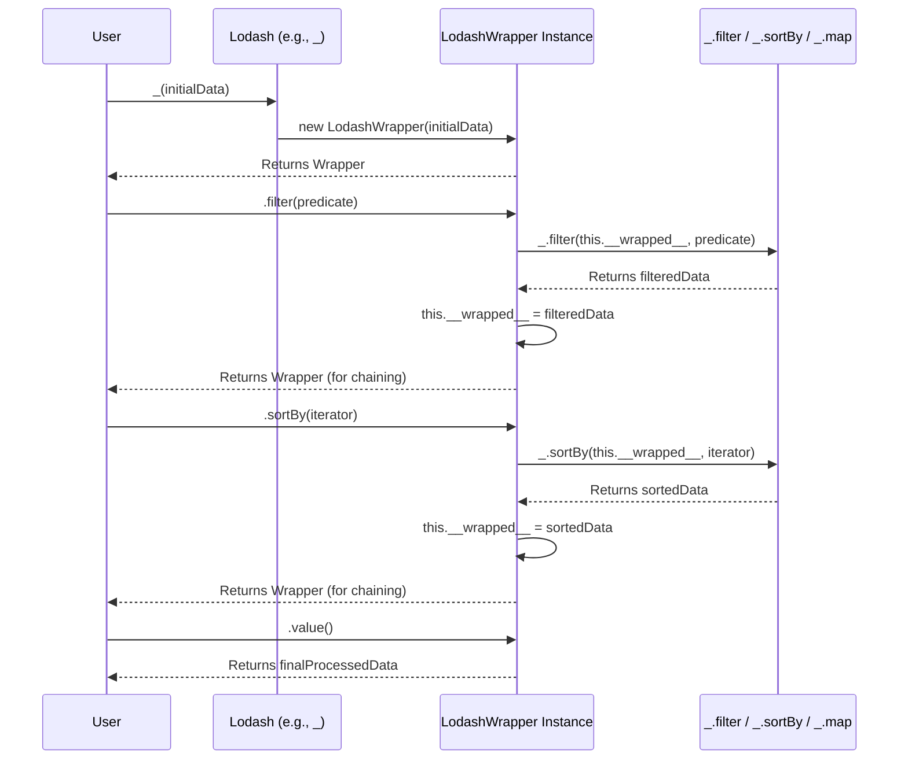

# Chapter 5: Chaining Operations

Our journey through Lodash has so far focused on individual functions, allowing us to perform targeted [Property Access and Manipulation](chapter_04.md) or execute diverse [Collection Operations](chapter_03.md). We've seen how these atomic utilities enhance productivity. Now, we'll explore a powerful feature that ties many of these individual operations together into a seamless, fluent workflow: Chaining Operations.

---

### Problem & Motivation

Imagine a common scenario: you have an array of user objects, and you need to perform several sequential transformations. For example, you might want to first filter out inactive users, then sort the remaining active users by their last login date, and finally extract only their names and email addresses. Without chaining, this often leads to a nested series of function calls, where the output of one function becomes the input of the next, making the code harder to read and debug.

```javascript
// Problematic non-chained example
const users = [
  { id: 1, name: 'Alice', active: true, lastLogin: '2023-10-25', email: 'alice@example.com' },
  { id: 2, name: 'Bob', active: false, lastLogin: '2023-09-01', email: 'bob@example.com' },
  { id: 3, name: 'Charlie', active: true, lastLogin: '2023-11-10', email: 'charlie@example.com' },
];

const activeUsers = _.filter(users, { active: true });
const sortedUsers = _.sortBy(activeUsers, 'lastLogin');
const finalResult = _.map(sortedUsers, user => _.pick(user, ['name', 'email']));

console.log(finalResult);
// Expected: [{ name: 'Alice', email: 'alice@example.com' }, { name: 'Charlie', email: 'charlie@example.com' }]
```
While functional, this approach requires creating intermediate variables (`activeUsers`, `sortedUsers`), which can clutter the scope and make the flow less direct. This problem escalates with more complex pipelines, diminishing code readability and making modifications cumbersome. Lodash's chaining feature directly addresses this by providing a fluent API, allowing operations to be strung together in a single, coherent statement.

---

### Core Concept Explanation

Chaining operations in Lodash revolve around the idea of a *wrapper object*. Instead of applying a Lodash function directly to your data, you *wrap* your data in a special Lodash object. This wrapper then provides access to all Lodash utility functions, but with a crucial difference: each chained method call returns the *same wrapper object* (or a new one, but conceptually it continues the chain), allowing you to call the next method directly on the result of the previous one. This creates a clean, readable, left-to-right data processing pipeline.

The `_()` function (or `_.chain()`) initiates this wrapper. Once operations are chained, the actual processed value remains encapsulated within the wrapper until you explicitly "unwrap" it using `_.value()` (or `_.commit()`). This unwrapping step is vital, as it executes the deferred operations and returns the final result. An important aspect of chaining, especially with larger datasets, is its potential for *lazy evaluation*. This means that some operations within a chain might not execute immediately but are instead deferred until `_.value()` is called, potentially optimizing performance by only processing what's necessary.

This fluent interface transforms sequential operations into a more declarative style, where you describe *what* you want to do with the data rather than explicitly managing intermediate states. It's a cornerstone of Lodash's philosophy for enhancing developer productivity and creating more maintainable code.

---

### Practical Usage Examples

Let's revisit our motivating use case and see how chaining simplifies it.

First, we define our sample data:
```javascript
const users = [
  { id: 1, name: 'Alice', active: true, lastLogin: '2023-10-25', email: 'alice@example.com' },
  { id: 2, name: 'Bob', active: false, lastLogin: '2023-09-01', email: 'bob@example.com' },
  { id: 3, name: 'Charlie', active: true, lastLogin: '2023-11-10', email: 'charlie@example.com' },
];
```

Now, let's solve the problem using Lodash chaining: filter active users, sort them by `lastLogin`, and then pick specific properties (`name`, `email`).

```javascript
// Chained example using _() and .value()
const finalResultChained = _(users)
  .filter({ active: true })
  .sortBy('lastLogin')
  .map(user => _.pick(user, ['name', 'email']))
  .value(); // Don't forget to unwrap the result!

console.log(finalResultChained);
// Expected Output:
// [
//   { name: 'Alice', email: 'alice@example.com' },
//   { name: 'Charlie', email: 'charlie@example.com' }
// ]
```
In this example:
1.  `_(users)` wraps the `users` array in a Lodash wrapper object.
2.  `.filter({ active: true })` filters the wrapped array, keeping only active users. This operation is performed on the *wrapped* value and returns the wrapper itself, allowing further chaining.
3.  `.sortBy('lastLogin')` sorts the *currently wrapped* array of active users.
4.  `.map(...)` transforms each user object, picking only `name` and `email` properties.
5.  `.value()` unwraps the final result from the Lodash object, returning the plain JavaScript array.

You can also explicitly start a chain using `_.chain()`:

```javascript
// Explicit chaining with _.chain()
const explicitChainResult = _.chain(users)
  .filter(u => u.active) // Using a predicate function for variety
  .sortBy('lastLogin')
  .map(u => ({ name: u.name, email: u.email })) // Object shorthand for map
  .value();

console.log(explicitChainResult);
// Expected Output: Same as above.
```
The behavior of `_()` and `_.chain()` is largely similar for initiating chains; `_.chain()` can sometimes be preferred for explicit clarity. Chaining provides a direct, readable flow, removing the need for intermediate variables and making the entire data transformation pipeline clear at a glance.

---

### Internal Implementation Walkthrough

At its core, Lodash chaining operates through a special "wrapper" object. When you call `_(value)` or `_.chain(value)`, Lodash doesn't return the raw `value` itself. Instead, it returns an instance of an internal `LodashWrapper` class (or similar construct depending on the Lodash version). This wrapper object internally stores the current `value` and exposes all Lodash utility functions as methods.

Here's a simplified conceptual look at how it might work:

1.  **Initiating the Chain**:
    ```javascript
    // Conceptual:
    function _(value) {
      if (value instanceof LodashWrapper) {
        return value; // If already a wrapper, return itself
      }
      return new LodashWrapper(value); // Create a new wrapper
    }

    class LodashWrapper {
      constructor(value) {
        this.__wrapped__ = value; // Stores the current data
      }

      // Each Lodash method is added to the prototype
      filter(...args) {
        // Call the actual _.filter with the wrapped value
        const newWrappedValue = _.filter(this.__wrapped__, ...args);
        // Return *this* wrapper with the updated value, or a new wrapper
        this.__wrapped__ = newWrappedValue;
        return this; // This is key for chaining!
      }

      // ... other methods like sortBy, map, etc.

      value() {
        return this.__wrapped__; // Unwraps and returns the final value
      }
    }
    ```

2.  **Method Calls on the Wrapper**: When you call a method like `.filter()`, the `LodashWrapper` method for `filter` is invoked. This method:
    *   Retrieves the current value stored in `this.__wrapped__`.
    *   Calls the corresponding standalone `_.filter` utility function with `this.__wrapped__` as the data argument and any other arguments passed to `.filter()`.
    *   Takes the result of `_.filter` and updates its own `this.__wrapped__` property with this new value.
    *   *Crucially*, it returns `this` (the wrapper instance itself), allowing the next method call to be chained.

3.  **Unwrapping the Result**: Finally, when `_.value()` is called, the method simply returns the `this.__wrapped__` property, giving you the final, processed JavaScript value.

This sequence ensures that operations are performed sequentially on the internal value, with the wrapper acting as a continuous conduit.

Here's a sequence diagram illustrating the process:


While the above describes the eager evaluation model, Lodash also supports lazy evaluation. In lazy mode, instead of immediately executing `_.filter`, `_.sortBy`, etc., the wrapper might store the *functions to be applied* as a pipeline. The actual execution of these functions is then deferred until `_.value()` is called, at which point the data is iterated once, applying all transformations in order. This can be more efficient for large collections as it avoids creating intermediate arrays for each step.

---

### System Integration

Chaining is not a standalone module but rather a *meta-feature* that integrates seamlessly with virtually all other Lodash abstractions. It acts as a syntactic sugar and an execution flow manager for the [Utility Functions](chapter_02.md), [Collection Operations](chapter_03.md), and [Property Access and Manipulation](chapter_04.md) functions we've already covered.

*   **Utility Functions**: Any general-purpose utility like `_.uniq`, `_.flatten`, `_.cloneDeep` can be part of a chain.
*   **Collection Operations**: Functions like `_.filter`, `_.map`, `_.reduce`, `_.forEach`, `_.sortBy` are prime candidates for chaining, as they typically form sequential data transformations on arrays and objects. Our examples demonstrate this extensively.
*   **Property Access and Manipulation**: Functions like `_.get`, `_.set`, `_.has`, `_.pick`, `_.omit` can be used within chained `_.map` operations or directly on a single wrapped object. For instance, after filtering a collection, you might map over it to pick specific properties, as shown in our main example.

The beauty of chaining is that it allows you to build complex data processing pipelines by combining functions from different categories, creating a cohesive data flow. The data seamlessly flows from one operation to the next within the context of the wrapper object.

```javascript
// Integrating various Lodash functions in a chain
const complexData = [
  { id: 1, tags: ['a', 'b'], value: 10, nested: { prop: 'x' } },
  { id: 2, tags: ['b', 'c'], value: 20, nested: { prop: 'y' } },
  { id: 3, tags: ['a'], value: 15, nested: { prop: 'x' } },
];

const processed = _(complexData)
  .filter(item => item.value > 12)          // Collection: filter by value
  .map(item => ({                            // Collection: transform
    id: item.id,
    tagCount: item.tags.length,
    nestedProp: _.get(item, 'nested.prop') // Property Access: get nested property
  }))
  .sortBy('tagCount')                        // Collection: sort by new property
  .value();

console.log(processed);
// Expected Output:
// [
//   { id: 3, tagCount: 1, nestedProp: 'x' },
//   { id: 2, tagCount: 2, nestedProp: 'y' }
// ]
```
This example clearly shows how functions from different areas of Lodash — filtering, mapping (with an inner property access), and sorting — are all orchestrated by the chaining mechanism to produce a desired final result.

---

### Best Practices & Tips

1.  **When to Chain**:
    *   **Readability**: Use chaining when you have multiple sequential operations on the same data. It significantly improves readability over nested or intermediate-variable approaches.
    *   **Fluent API**: It provides a more fluent and declarative way to express data transformations.
    *   **Lazy Evaluation**: For very large collections, chaining can potentially offer performance benefits due to lazy evaluation, where operations are only performed when `_.value()` is called, and sometimes only for the necessary elements.

2.  **When *Not* to Chain**:
    *   **Single Operations**: If you're only performing one Lodash operation, don't chain. `_.filter(users, {active: true})` is simpler and more direct than `_(users).filter({active: true}).value()`. The overhead of creating and managing the wrapper object isn't worth it for a single call.
    *   **Performance for Small Data**: For very small datasets, the overhead of creating and managing the wrapper object might slightly outweigh the performance benefits of laziness. Measure if in doubt.

3.  **Don't Forget `_.value()`**: This is the most common mistake. Without calling `_.value()`, you're still working with the wrapper object, not the final JavaScript data. Your code will silently fail or produce unexpected results if you try to use the wrapper directly as an array or object.

    ```javascript
    // Common Pitfall: Forgetting .value()
    const data = [1, 2, 3];
    const resultWrapper = _(data).map(n => n * 2);
    console.log(Array.isArray(resultWrapper)); // false! It's a LodashWrapper object
    console.log(resultWrapper[0]);            // undefined or error, not 2
    ```

4.  **Immutability**: Lodash chain operations, by default, produce new collections/objects rather than modifying the original. This aligns with good functional programming practices and helps prevent unexpected side effects.

5.  **`_.tap()` and `_.thru()` for Debugging/Intermediate Steps**: If you need to inspect the data at an intermediate step in a chain without breaking the chain, `_.tap()` and `_.thru()` are invaluable.
    *   `_.tap(value, interceptor)`: Invokes `interceptor` with `value` as the argument and then returns `value`. Useful for side effects like logging.
    *   `_.thru(value, interceptor)`: Invokes `interceptor` with `value` as the argument and then returns the result of the `interceptor`. Useful for applying a custom, non-Lodash function in the middle of a chain.

    ```javascript
    const numbers = [1, 2, 3];
    const tappedResult = _(numbers)
      .map(n => n * 2)
      .tap(doubled => console.log('Doubled numbers:', doubled)) // Logs the intermediate result
      .filter(n => n > 3)
      .value();

    console.log('Final result:', tappedResult);
    // Expected Output:
    // Doubled numbers: [ 2, 4, 6 ]
    // Final result: [ 4, 6 ]
    ```

6.  **Consider the [Functional Programming (FP) Variant](chapter_06.md)**: If you find yourself heavily relying on chaining and prefer a more purely functional, data-last style, `lodash/fp` offers an alternative that makes many operations curried and auto-data-first, often eliminating the need for explicit chaining wrappers and `_.value()`.

---

### Chapter Conclusion

Chaining Operations in Lodash provide a powerful and elegant way to orchestrate sequential data transformations, significantly boosting code readability and maintainability. By wrapping your data in a Lodash object, you unlock a fluent API that transforms complex pipelines into intuitive, left-to-right expressions. We've seen how `_()` or `_.chain()` initiate this process, and how `_.value()` is essential for extracting the final result. Understanding its internal wrapper mechanism and the benefits of lazy evaluation empowers developers to write efficient and clean data processing code. While it integrates seamlessly with all other Lodash utilities, prudent application—knowing when to chain and when not to—is key to harnessing its full potential.

As we move forward, we'll delve into the [Functional Programming (FP) Variant](chapter_06.md) of Lodash, which offers an even more opinionated approach to functional data processing, often building upon the principles of fluent, pipeline-oriented operations that chaining introduces.