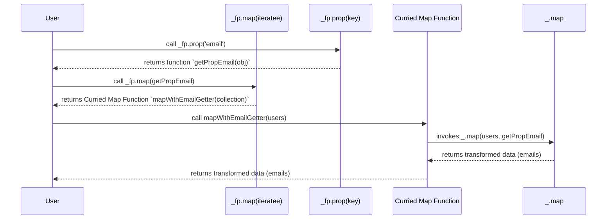

# Chapter 6: Functional Programming (FP) Variant

In the previous chapter, [Chaining Operations](chapter_05.md), we explored how to create fluent and readable data processing pipelines by combining multiple Lodash functions sequentially. Chaining enhanced code clarity and often enabled lazy evaluation, optimizing performance. While chaining offers a powerful approach, the functional programming (FP) variant of Lodash, found in `lodash/fp`, takes the concepts of immutability, predictability, and function composition to an even higher level, aligning perfectly with modern functional programming paradigms.

---

### Problem & Motivation

Traditional JavaScript, and even standard Lodash functions, can sometimes present challenges when aiming for pure functional programming. Many native array methods, and even some standard Lodash functions, have inconsistent argument orders (e.g., `map(array, iteratee)` vs `filter(array, predicate)`), making direct function composition difficult without wrapper functions. Furthermore, the possibility of accidental data mutation, while often mitigated by careful use of standard Lodash, still looms, potentially leading to hard-to-track bugs and unpredictable behavior in complex applications.

The `lodash/fp` module addresses these issues by offering a set of functions specifically designed for a consistent functional programming style. It provides a more predictable, immutable-by-default environment where functions are automatically curried and always accept data as their last argument. This consistency drastically simplifies function composition, enabling developers to build robust, testable, and maintainable data transformation pipelines that are free from side effects. For instance, imagine a scenario where we need to process a list of user records: filter out inactive users, extract their email addresses, and then sort them alphabetically. Achieving this purely and composably is where `lodash/fp` shines.

---

### Core Concept Explanation

The `lodash/fp` module isn't a separate library; it's a special build of Lodash designed for functional purity. It transforms the standard Lodash functions to adhere to several key functional programming principles:

1.  **Auto-Currying**: In `lodash/fp`, all functions are automatically *curried*. This means a function that typically takes multiple arguments can be called with fewer arguments, returning a new function that expects the remaining arguments. This allows you to "pre-fill" some arguments and create specialized functions.

    *Example*: Instead of `_.map(collection, iteratee)`, in `lodash/fp`, you'd call `_fp.map(iteratee)(collection)`. The first call `_fp.map(iteratee)` returns a new function, which is then immediately invoked with `(collection)`.

2.  **Data-Last Argument Signature**: For every function in `lodash/fp`, the data (the collection or object being operated on) is always the *last* argument. This is crucial for easy function composition, as it means the output of one function (which is data) can directly feed into the input (which is the data argument) of the next function.

    *Contrast*: `_.filter(collection, predicate)` becomes `_fp.filter(predicate)(collection)`.

3.  **Immutability by Default**: `lodash/fp` functions are designed to never modify their input data. Instead, they return new data structures with the desired transformations. This principle ensures that your original data remains untouched, preventing unintended side effects and making your code more predictable.

4.  **Purity**: Combining auto-currying, data-last arguments, and immutability fosters pure functions. A pure function, given the same input, will always return the same output and produce no observable side effects. This makes functions easier to reason about, test, and parallelize.

These principles combine to provide a powerful toolkit for building highly composable and predictable data transformation logic, particularly beneficial in complex applications that rely on consistent state management and data flows.

---

### Practical Usage Examples

Let's apply `lodash/fp` to our motivating use case: filtering inactive users, extracting their email addresses, and sorting them.

First, we need to import the `lodash/fp` module. Note the `fp` suffix.

```javascript
// Import the FP variant of Lodash
import _fp from 'lodash/fp';

const users = [
  { id: 1, name: 'Alice', email: 'alice@example.com', active: true },
  { id: 2, name: 'Bob', email: 'bob@example.com', active: false },
  { id: 3, name: 'Charlie', email: 'charlie@example.com', active: true },
  { id: 4, name: 'David', email: 'david@example.com', active: false },
];
```
This sets up our user data and imports `_fp`.

Now, let's see how currying works with `_fp.filter`:

```javascript
// Example of currying: _fp.filter takes the predicate first
const getActiveUsers = _fp.filter({ active: true });

// getActiveUsers is now a function that expects a collection
const activeUsers = getActiveUsers(users);

console.log(activeUsers);
// Expected Output:
// [
//   { id: 1, name: 'Alice', email: 'alice@example.com', active: true },
//   { id: 3, name: 'Charlie', email: 'charlie@example.com', active: true }
// ]
```
Here, `_fp.filter({ active: true })` creates a specialized function `getActiveUsers` that is ready to filter any collection based on the `active: true` property, demonstrating currying.

Next, we extract email addresses using `_fp.map` and `_fp.prop` (which is a curried version of `_.get` or property accessor).

```javascript
// Example of currying and data-last with _fp.map and _fp.prop
const getEmails = _fp.map(_fp.prop('email'));

// getEmails is a function that expects a collection of objects
const activeUserEmails = getEmails(activeUsers);

console.log(activeUserEmails);
// Expected Output:
// [ 'alice@example.com', 'charlie@example.com' ]
```
`_fp.prop('email')` creates a function that extracts the 'email' property. `_fp.map` then takes this function as its first argument, creating `getEmails`, which awaits the actual data.

Finally, we sort these emails alphabetically:

```javascript
// Example of _fp.sortBy (or _fp.sort for simple arrays)
const sortedEmails = _fp.sortBy(_fp.identity)(activeUserEmails); // _fp.identity returns the value itself for sorting simple arrays

console.log(sortedEmails);
// Expected Output:
// [ 'alice@example.com', 'charlie@example.com' ]
```
For simple arrays of primitives, `_fp.sortBy(_fp.identity)` sorts the array itself.

The real power of `lodash/fp` comes from composition using `_fp.flow` (or `_fp.pipe`). `_fp.flow` creates a function that passes data through a series of functions from left-to-right.

```javascript
// Composing functions with _fp.flow
const processUsers = _fp.flow(
  _fp.filter({ active: true }),       // 1. Filter active users
  _fp.map(_fp.prop('email')),         // 2. Extract emails
  _fp.sortBy(_fp.identity)            // 3. Sort emails alphabetically
);

const finalResult = processUsers(users);

console.log(finalResult);
// Expected Output:
// [ 'alice@example.com', 'charlie@example.com' ]
```
Here, `processUsers` is a single function that encapsulates the entire transformation pipeline. When `users` data is passed to it, it flows through each step sequentially, demonstrating highly composable and readable code.

---

### Internal Implementation Walkthrough

The `lodash/fp` module isn't a completely separate codebase but rather a processed version of the standard Lodash library. Conceptually, for each standard Lodash function `fn(arg1, arg2, data)`, the `lodash/fp` equivalent `fpFn` is generated to:

1.  **Reorder Arguments**: If `data` isn't already the last argument, it's moved to the last position.
2.  **Auto-Curry**: The function is wrapped to automatically handle partial application. When `fpFn` is called with fewer arguments than it expects (excluding the data argument), it returns a new function that "remembers" the applied arguments and waits for the rest. Once the data argument (the last one) is provided, the original Lodash function is invoked with the arguments in the correct (reordered) sequence.

Let's illustrate a conceptual transformation for `_.map`:

*   **Standard Lodash:** `_.map(collection, iteratee)`
*   **`lodash/fp` Transformation Logic (Conceptual):**
    The `fp` version wraps `_.map`. When you call `_fp.map(iteratee)`, it detects that the `collection` argument is missing. It then returns a new function `(collection) => _.map(collection, iteratee)`. When this returned function is finally called with `(collection)`, `_.map` is executed.

Here's a simplified sequence diagram showing how `_fp.map` with `_fp.prop` would work internally:


This diagram visualizes how `_fp.prop('email')` first creates a specific property getter. Then, `_fp.map` receives this getter and returns a curried function. Finally, when the data (`users`) is provided, the internal standard `_.map` function is called with the arguments correctly ordered.

While the actual internal implementation of `lodash/fp` involves a sophisticated `convert` utility (you can explore it in the Lodash source, typically `lodash/fp/convert.js` and `lodash/fp/util/convert.js`), the core idea remains consistent: automatically curry and reorder arguments for a functional-first experience.

---

### System Integration

`lodash/fp` integrates seamlessly into any JavaScript project, particularly those that embrace functional programming paradigms.

1.  **Coexistence with Standard Lodash**: You can use `lodash/fp` alongside standard Lodash (`_`) in the same project. It's common to import them with different aliases (e.g., `import _ from 'lodash'; import _fp from 'lodash/fp';`). This allows you to pick the appropriate style for different parts of your application.
2.  **Redux Reducers**: `lodash/fp` is an excellent fit for Redux reducers, which must be pure functions. Its immutable nature ensures that state is never mutated directly, making state management predictable and easier to debug.
3.  **React Functional Components/Hooks**: When dealing with data transformations within functional components or custom hooks, `lodash/fp` can make your logic more concise, declarative, and testable.
4.  **Functional Composition**: As demonstrated, `_fp.flow` and `_fp.pipe` are powerful tools for composing complex data pipelines from smaller, reusable functions. This promotes modularity and maintainability. This is an extension of the concepts covered in [Utility Functions](chapter_02.md) and [Collection Operations](chapter_03.md), now with enhanced composition capabilities.
5.  **Data Flow Libraries**: `lodash/fp` works naturally with other functional data flow libraries or reactive programming frameworks, as it promotes predictable data transformations.

For example, when working with a list of items (`[Item Operations](chapter_03.md)` context) and needing to apply multiple transformations:

```javascript
import _fp from 'lodash/fp';

const inventory = [
  { name: 'Laptop', price: 1200, stock: 5 },
  { name: 'Mouse', price: 25, stock: 20 },
  { name: 'Keyboard', price: 75, stock: 0 },
  { name: 'Monitor', price: 300, stock: 10 },
];

// Find items that are in stock and more expensive than $50
const getExpensiveInStockItems = _fp.flow(
  _fp.filter(_fp.where({ stock: _fp.gt(0) })), // Filter for stock > 0
  _fp.filter(_fp.where({ price: _fp.gt(50) })), // Filter for price > 50
  _fp.map(_fp.prop('name')),                   // Get only the names
  _fp.sortBy(_fp.identity)                      // Sort names alphabetically
);

const result = getExpensiveInStockItems(inventory);
console.log(result);
// Expected Output:
// [ 'Laptop', 'Monitor' ]
```
This demonstrates how functions from `lodash/fp`, including enhanced [Property Access and Manipulation](chapter_04.md) like `_fp.prop` and `_fp.where`, are combined effectively to create powerful data transformations.

---

### Best Practices & Tips

1.  **Choose Your Style Consistently**: Decide whether to use standard Lodash (`_`) or `lodash/fp` (`_fp`) consistently within a given module or component. Mixing them heavily within a single small scope can lead to confusion.
2.  **Embrace `_fp.flow` and `_fp.pipe`**: These functions are central to `lodash/fp`. They allow you to define clear, declarative data transformation pipelines. `_fp.flow` composes functions from left-to-right, while `_fp.pipe` does the same (they are aliases in `lodash/fp`).
3.  **Leverage Currying**: Understand that `_fp` functions are curried. This means you can create highly specialized, reusable functions by partially applying arguments.
    ```javascript
    // Create a function to add 5 to any number
    const add5 = _fp.add(5);
    console.log(add5(10)); // Output: 15

    // Create a function to get a specific property from an object
    const getUserId = _fp.prop('id');
    console.log(getUserId({ id: 123, name: 'Test' })); // Output: 123
    ```
4.  **Prioritize Immutability**: Always remember that `lodash/fp` functions return new data structures. Avoid reassigning the output back to the original variable if you intend to maintain the original data.
5.  **Debugging `_fp.flow` Pipelines**: When debugging complex `_fp.flow` pipelines, consider breaking them down into smaller, testable functions or inserting `_fp.tap` calls (a debugging utility that allows you to perform an action, like `console.log`, on the data without affecting the flow) at intermediate steps.
    ```javascript
    const debuggablePipeline = _fp.flow(
      _fp.filter({ active: true }),
      _fp.tap(x => console.log("After filter:", x)), // Debug step
      _fp.map(_fp.prop('email')),
      _fp.tap(x => console.log("After map:", x)),   // Debug step
      _fp.sortBy(_fp.identity)
    );
    ```
6.  **Performance Considerations**: While `lodash/fp` offers significant benefits in code clarity and maintainability, the overhead of currying and creating new functions can sometimes have a minor performance impact compared to directly calling standard Lodash functions or native JavaScript methods. For most applications, this overhead is negligible, but it's worth noting in extremely performance-sensitive scenarios.

---

### Chapter Conclusion

This chapter has provided a deep dive into `lodash/fp`, Lodash's powerful functional programming variant. We've explored how its core principles – auto-currying, data-last arguments, and immutability – enable a more consistent, predictable, and composable approach to data manipulation. From understanding the problem it solves to seeing practical examples and internal mechanics, you should now have a solid grasp of why and how to integrate `lodash/fp` into your projects.

By embracing `lodash/fp`, you can write cleaner, more maintainable code that aligns with modern functional programming paradigms, making your data transformations more robust and easier to reason about. This concludes our comprehensive tutorial on Lodash. We've journeyed from the fundamental `lodash` object and its utility functions, through collection operations and property management, to advanced techniques like chaining and functional programming. You now possess a comprehensive understanding of Lodash's capabilities, empowering you to write efficient, elegant, and reliable JavaScript.