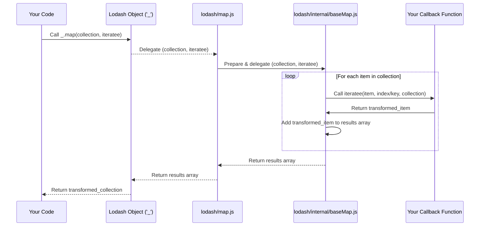

# Chapter 2: Utility Functions

Having explored [The Lodash Object ('_')](chapter_01.md) as the central entry point to the Lodash library, we now delve into the heart of what makes Lodash so incredibly powerful: its collection of **Utility Functions**. These functions are the core tools that Lodash provides, each meticulously crafted to perform a specific, common operation efficiently and consistently. They are accessed directly through the `_` object, forming the backbone of practical data manipulation within the library.

---

### Problem & Motivation

In JavaScript development, we frequently encounter tasks that, while seemingly simple, often lead to repetitive, verbose, or error-prone code. Consider iterating over collections (arrays, objects), transforming data structures, performing type checks, or managing functions. Without a robust set of helpers, developers often end up reimplementing these common patterns, leading to inconsistent code, potential bugs due to subtle differences in implementation, and a slower development process. This is particularly evident when working with complex data sets or when needing to ensure cross-environment compatibility and optimal performance.

This is precisely the problem that Lodash's utility functions solve. They offer a standardized, highly optimized, and predictable way to perform these common programming tasks. By providing a rich API of well-tested functions, Lodash abstracts away the complexities of low-level data manipulation, allowing developers to write cleaner, more concise, and more maintainable code. The importance of these functions in the "lodash" project is paramount; they *are* the project, fulfilling its mission to provide performant and consistent helper functions across environments.

Imagine you have a list of user objects, and you need to find all active users whose roles are 'admin', and then extract only their names and email addresses. Manually looping, checking conditions, and building new objects can quickly become cumbersome and less readable, especially if error handling and performance are also concerns. This common scenario highlights the need for robust utility functions that can streamline such data transformations.

---

### Core Concept Explanation

At its essence, a **Utility Function** in Lodash is a small, focused JavaScript function designed to perform a specific operation on data or functions. These functions are typically *pure*, meaning they produce the same output for the same input and have no side effects, making them highly predictable and easy to reason about. They are the individual "tools" in Lodash's comprehensive "toolbox," each designed for a distinct purpose, yet all working together seamlessly.

Lodash groups these utility functions into logical categories to make them easier to find and understand. Common categories include:
*   **Array**: For array manipulation (e.g., `_.compact`, `_.flatten`).
*   **Collection**: For iterating, filtering, and transforming arrays and objects (e.g., `_.map`, `_.filter`, `_.each`).
*   **Object**: For object manipulation (e.g., `_.assign`, `_.merge`, `_.keys`).
*   **Function**: For working with functions (e.g., `_.debounce`, `_.throttle`).
*   **Lang**: For type checking and basic language utilities (e.g., `_.isString`, `_.isEmpty`).
*   **Math**: Basic mathematical operations (e.g., `_.add`, `_.max`).
*   **String**: For string manipulation (e.g., `_.camelCase`, `_.trim`).

The beauty of these functions lies in their consistency and performance. Lodash internally optimizes these functions to run efficiently across various JavaScript environments, often outperforming naive hand-written loops. They encourage a more functional programming style, where data is transformed through a series of function calls rather than mutable state changes, leading to more robust and less error-prone applications.

---

### Practical Usage Examples

Let's revisit our motivating use case: finding active admin users and extracting their names and emails. We'll use Lodash's utility functions to achieve this concisely.

First, consider our sample data:

```javascript
const users = [
  { 'id': 1, 'name': 'Alice', 'email': 'alice@example.com', 'active': true, 'role': 'admin' },
  { 'id': 2, 'name': 'Bob', 'email': 'bob@example.com', 'active': false, 'role': 'user' },
  { 'id': 3, 'name': 'Charlie', 'email': 'charlie@example.com', 'active': true, 'role': 'admin' },
  { 'id': 4, 'name': 'David', 'email': 'david@example.com', 'active': true, 'role': 'user' }
];
```
This `users` array contains several user objects, each with various properties.

Now, let's use `_.filter` to select only the active users who are administrators:

```javascript
const activeAdmins = _.filter(users, user => user.active && user.role === 'admin');

console.log(activeAdmins);
// Expected output:
// [
//   { 'id': 1, 'name': 'Alice', 'email': 'alice@example.com', 'active': true, 'role': 'admin' },
//   { 'id': 3, 'name': 'Charlie', 'email': 'charlie@example.com', 'active': true, 'role': 'admin' }
// ]
```
The `_.filter` function iterates over the `users` array and returns a *new* array containing only the elements for which the provided callback function returns `true`. Here, we're checking if a user is both `active` and has the `role` of 'admin'.

Next, we'll use `_.map` to transform these filtered users into a new array containing only their name and email:

```javascript
const adminContacts = _.map(activeAdmins, user => ({
  name: user.name,
  email: user.email
}));

console.log(adminContacts);
// Expected output:
// [
//   { 'name': 'Alice', 'email': 'alice@example.com' },
//   { 'name': 'Charlie', 'email': 'charlie@example.com' }
// ]
```
The `_.map` function also iterates over a collection, but instead of filtering, it applies a callback function to each element and returns a *new* array containing the results of those calls. In this case, we're transforming each user object into a simpler object containing only `name` and `email`.

For a more compact solution, Lodash allows chaining, which we'll cover more deeply in later chapters, but here's a sneak peek:

```javascript
const finalResult = _(users)
  .filter(user => user.active && user.role === 'admin')
  .map(user => ({ name: user.name, email: user.email }))
  .value(); // .value() unwraps the result from the Lodash wrapper

console.log(finalResult);
// Expected output: Same as adminContacts above, but in one fluent operation.
```
This example showcases how utility functions can be chained together for a highly readable and declarative approach to data manipulation. The `_()` wrapper creates a Lodash instance that enables method chaining, and `.value()` retrieves the final result.

---

### Internal Implementation Walkthrough

Understanding the internal workings of Lodash's utility functions, even at a high level, helps appreciate their design and performance. Let's consider a simplified conceptual model for a function like `_.map`. While Lodash's actual implementation is highly optimized with various internal helpers, environment checks, and specific iterator types, the core idea remains accessible.

Imagine you have a file structure like:
- `lodash/src/map.js`
- `lodash/src/internal/baseMap.js`
- `lodash/src/internal/baseEach.js`
- `lodash/src/internal/getTag.js` (for type checking)

When you call `_.map(collection, iteratee)`, the `map.js` function acts as the public interface. It performs initial checks (e.g., if the `collection` is null or undefined) and then delegates the actual iteration and transformation logic to an internal helper function, often something like `baseMap` or `baseEach`.

Here’s a simplified conceptual flow:

1.  **Public `_.map` function call**:
    -   `lodash/src/map.js`
    -   Receives `collection` and `iteratee` (the callback function).
    -   Checks if `collection` is array-like or an object.
    -   Delegates to `baseMap` or a similar internal function, passing `collection`, `iteratee`, and perhaps a `callback` that handles the result.

2.  **Internal `baseMap` (or `baseEach` with transformation)**:
    -   `lodash/src/internal/baseMap.js`
    -   This function is optimized for different types of collections.
    -   If the `collection` is an array: It might use a simple `for` loop or `Array.prototype.map` if available and performant for the current environment.
    -   If the `collection` is an object: It iterates over the object's keys, calling the `iteratee` for each value.
    -   It accumulates the results of the `iteratee` calls into a new array.

3.  **Applying the `iteratee`**:
    -   For each element in the `collection`, the `iteratee` function provided by the user is called with `(value, index|key, collection)`.
    -   The return value of the `iteratee` is then added to the new result array.

4.  **Return Value**:
    -   `baseMap` returns the newly created array.
    -   `_.map` then returns this array to the user.

Here's a simplified sequence diagram for a `_.map` call:



Lodash uses highly optimized internal loops (`baseEach`, `baseForOwn`, etc.) and avoids creating unnecessary intermediate arrays where possible, ensuring high performance. It also includes robust type checking and normalization of arguments to provide a consistent API regardless of input variations.

---

### System Integration

Lodash's utility functions are designed to integrate seamlessly into any JavaScript project, whether it's a small script or a large-scale application. Their primary integration point is, of course, with [The Lodash Object ('_')](chapter_01.md), which serves as their namespace.

1.  **Global Access**: When Lodash is included as a script tag, all utility functions are available globally via `_`.
    ```html
    <script src="lodash.min.js"></script>
    <script>
      const data = [1, 2, 3];
      const squared = _.map(data, n => n * n);
    </script>
    ```

2.  **Module Imports**: In modern JavaScript environments (Node.js, Webpack, Rollup, etc.), Lodash functions can be imported as modules. This allows for selective imports, which can significantly reduce the final bundle size by only including the functions you actually use.
    ```javascript
    // Importing the entire lodash library
    import _ from 'lodash';
    console.log(_.isEmpty({})); // true

    // Importing specific functions for smaller bundle size
    import map from 'lodash/map';
    import filter from 'lodash/filter';

    const numbers = [1, 2, 3, 4];
    const evens = filter(numbers, n => n % 2 === 0); // [2, 4]
    const doubles = map(numbers, n => n * 2); // [2, 4, 6, 8]
    ```

3.  **Functional Composition**: Utility functions are often designed to be composable. This means their outputs can easily become the inputs for other utility functions, facilitating a functional programming style. This is especially powerful when combined with chaining or dedicated composition functions (like `_.flow` or `_.pipe`, which we'll explore later).

    ```javascript
    // Example of simple composition
    const processData = (data) => {
      return _.map(_.filter(data, 'isActive'), 'id');
    };

    const users = [{id: 1, isActive: true}, {id: 2, isActive: false}, {id: 3, isActive: true}];
    console.log(processData(users)); // Expected output: [1, 3]
    ```
    This demonstrates data flowing through `_.filter` and then `_.map` to achieve the desired transformation.

---

### Best Practices & Tips

To get the most out of Lodash's utility functions, consider these best practices:

*   **Import Specific Functions**: For client-side applications, importing individual functions (e.g., `import map from 'lodash/map';`) rather than the entire `lodash` library (`import _ from 'lodash';`) is crucial for tree-shaking and reducing your application's bundle size.
*   **Embrace Immutability**: Most Lodash functions return new collections or objects rather than modifying the originals in place. Leverage this to maintain predictable state and simplify debugging. Avoid functions that mutate objects directly unless explicitly desired and understood (e.g., `_.assignIn` vs. `_.assign`).
*   **Prefer Declarative Code**: Use Lodash functions to express *what* you want to do, rather than *how* to do it. This leads to more readable and maintainable code. For example, `_.filter(users, { active: true })` is more declarative than a manual `for` loop with an `if` condition.
*   **Leverage Property Shorthands**: Many Lodash functions accept property shorthands as iteratee arguments, simplifying common operations.
    ```javascript
    const users = [{ 'user': 'barney', 'age': 36 }, { 'user': 'fred', 'age': 40 }];
    _.filter(users, 'age'); // Returns [{ 'user': 'barney', 'age': 36 }, { 'user': 'fred', 'age': 40 }] (truthy 'age')
    _.map(users, 'user');   // Returns ['barney', 'fred']
    _.filter(users, { 'age': 36 }); // Returns [{ 'user': 'barney', 'age': 36 }]
    ```
*   **Understand Performance**: While Lodash is highly optimized, be mindful of using complex operations on extremely large datasets, which can still impact performance. Profile your application if you suspect bottlenecks.
*   **Avoid Unnecessary Wrapping**: If you're not planning to chain multiple operations, calling `_` directly (`_.map(array, fn)`) is often more efficient than wrapping (`_([...]).map(fn).value()`) as it avoids the overhead of creating a Lodash wrapper object.
*   **Common Pitfalls**:
    *   **Confusing `_.forEach` with `_.map`**: `_.forEach` is for side effects (like logging), it returns the original collection. `_.map` is for transformations and returns a new collection of transformed items.
    *   **Not calling `.value()` in chains**: If you start a chain with `_()` or `_.chain()`, you *must* call `.value()` at the end to unwrap the result from the Lodash wrapper.
    *   **Modifying objects within `_.map`**: If your `_.map` callback mutates its input argument, it can lead to unexpected side effects on your original data, even though `_.map` itself returns a new array. Always return new objects/values from `_.map` to ensure immutability.

---

### Chapter Conclusion

This chapter has provided a comprehensive overview of Lodash's **Utility Functions**, which are the fundamental building blocks of the library. We've seen how they address common programming challenges by offering consistent, performant, and easy-to-use solutions for data manipulation, iteration, and type checking. From understanding their core purpose and categories to witnessing their practical application and grasping their internal logic, it's clear that these functions empower developers to write cleaner, more efficient, and more readable JavaScript code.

By adopting the best practices outlined, you can leverage the full power of Lodash's utilities to streamline your development workflow. As you continue your journey with Lodash, you'll discover specific utility functions tailored for array, object, string, and function manipulation, enabling you to tackle virtually any data transformation task with confidence.

In the next chapters, we will dive deeper into specific categories of these utility functions, exploring their nuances, advanced usage patterns, and how they combine to form even more powerful abstractions.