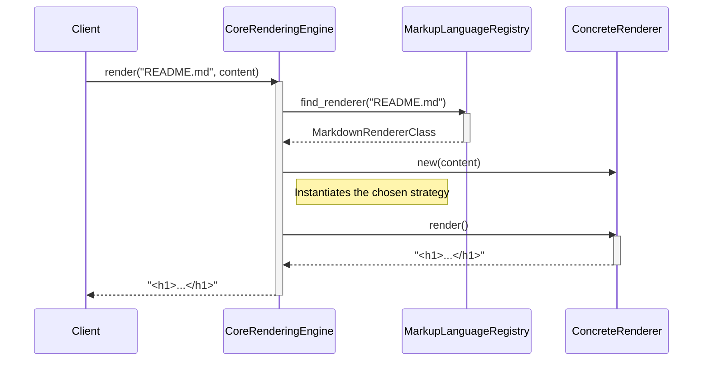

# Chapter 1: Core Rendering Engine

- Initialization point.

### Architectural Intent & Motivation

The Core Rendering Engine serves as the primary public-facing API for the `markup` system. Its principal responsibility is to provide a single, unified interface for rendering various markup formats into HTML. This abstraction satisfies the architectural requirement of decoupling client applications from the specifics of individual rendering libraries. By acting as a central gateway, it conceals the complexity of a multi-strategy rendering subsystem, allowing consumers to request a render operation without needing to know which specific parsing library (e.g., for Markdown, Textile, or AsciiDoc) will be used.

### Contextual Use Case

Consider a system that must display user-provided documentation files, such as `README.md`, `HISTORY.textile`, or `MANUAL.rdoc`. Instead of implementing conditional logic to select and invoke the correct rendering library for each file type, the client application makes a single, polymorphic call to the Core Rendering Engine.

The engine uses the file's extension to determine the correct rendering strategy, executes it, and returns the resulting HTML. This approach centralizes format-handling logic and makes the system easily extensible to new markup formats without modifying client code.

### Concept Decomposition

The Core Rendering Engine is logically composed of two primary functions exposed through the `GitHub::Markup` module.

*   **Public Facade:** The module `GitHub::Markup` itself, which acts as the stable entry point for all interactions. It exposes the engine's capabilities as class-level methods.
*   **Rendering Orchestration:** The internal logic that coordinates the rendering process. This involves looking up the appropriate renderer, instantiating it, and delegating the final rendering task.
*   **Public Methods:**
    *   `render(filename, content)`: The primary method. It accepts a filename (used to identify the markup language) and the raw string content. It returns the rendered HTML as a string.
    *   `can_render?(filename)`: A predicate method that returns a boolean indicating whether a supported renderer is available for the given filename's extension. This allows clients to safely check for support before attempting to render.

### Reference Implementation

The following demonstrates the canonical usage pattern for checking renderer availability and executing the render operation.

```ruby
require 'github/markup'

# Content sourced from a project's README.md file
markdown_content = "# Project Title\n\nThis is the introduction."
filename = "README.md"

# First, verify that a renderer exists for the file type
if GitHub::Markup.can_render?(filename)
  # Orchestrate rendering through the unified API
  html_output = GitHub::Markup.render(filename, markdown_content)

  puts html_output
  #=> "<h1>Project Title</h1>\n<p>This is the introduction.</p>"
end
```

### Architectural Mechanics (White-Box Analysis)

#### Design Pattern Identification

*   **Facade:** The `Core Rendering Engine` is a classic implementation of the Facade pattern. It provides a simplified, high-level interface (`render`, `can_render?`) that masks the more complex underlying subsystems, including the `Markup Language Registry` and the collection of individual renderer classes. This simplifies consumption and reduces coupling.
*   **Strategy:** The engine is the *context* component within a broader Strategy pattern. It does not implement any rendering logic itself. Instead, it consults the `Markup Language Registry` at runtime to select a concrete *strategy* (a specific renderer object) and delegates the execution of the rendering algorithm to that object.

#### Control Flow/State

The Core Rendering Engine is stateless. Each call to `render` is an independent, self-contained operation. The execution path is linear and deterministic:

1.  The `render` method receives a `filename` and `content` string.
2.  It queries the `Markup Language Registry`, passing the `filename` to identify the appropriate renderer class based on the file extension.
3.  If a renderer class is found, the engine instantiates it.
4.  The engine invokes the `render` method on the instantiated renderer object, passing the `content`.
5.  The HTML string returned by the concrete renderer is then returned to the original caller. If no renderer is found, the behavior is to return the original content unprocessed.

### Architectural Visualization (Mermaid)

The interaction between the client, the Core Rendering Engine, the Registry, and a concrete renderer is best represented by a sequence diagram, illustrating the orchestration of a `render` call.



### System Topology & Integration

#### Dependency Graph

*   **Upstream (Dependents):** The primary consumer of this engine is the `Command-Line Interface` (Chapter 2), which exposes its functionality to end-users. Any third-party application integrating the `markup` library also depends directly on this facade.
*   **Downstream (Dependencies):** The engine has a direct, critical dependency on the `Markup Language Registry` (Chapter 4) for resolving which renderer to use. It has an implicit dependency on the `Renderer Implementation Contract` (Chapter 6), as it expects any object returned by the registry to respond to a `render` method.

#### Data Propagation

*   **Ingress:** The engine's boundary receives two `String` objects: `filename` and `content`. The `filename` is used for control flow (strategy selection), while the `content` is treated as a payload to be passed through.
*   **Egress:** The engine's boundary returns a single `String` object containing the rendered HTML. The engine does not perform any data transformation itself; it is a pure pass-through orchestrator.

### Engineering Standards

#### Performance Implications

The performance of the Core Rendering Engine itself is negligible. The primary performance cost is dominated by the execution of the selected concrete renderer.

*   **Lookup Complexity:** The lookup operation via the `Markup Language Registry` is expected to be O(1), as it should be implemented with a hash map keyed by file extension.
*   **Rendering Complexity:** The algorithmic complexity of the `render` call is entirely dependent on the chosen rendering strategy and the size and complexity of the input `content`.

#### Anti-Patterns

*   **Facade Bypass:** A client directly instantiating and invoking a specific renderer (e.g., `GitHub::Markup::Markdown.new(content).render`). This subverts the purpose of the abstraction, creating a tight coupling between the client and a specific implementation and forfeiting the benefits of centralized format management.
*   **Content/Type Mismatch:** Invoking `render('doc.md', 'h1. A Textile Header')`. The engine relies exclusively on the filename for renderer selection. Providing content in a format that does not match the filename's extension will result in incorrect or failed rendering.

### Conclusion

The Core Rendering Engine is the architectural cornerstone of the `markup` system. By implementing the Facade and Strategy patterns, it provides a stable, simple, and extensible public API that successfully decouples client concerns from the complex, evolving subsystem of markup-to-HTML translation. It is the designated entry point for all rendering operations.

- Forward Link: [Command-Line Interface](chapter_02.md)