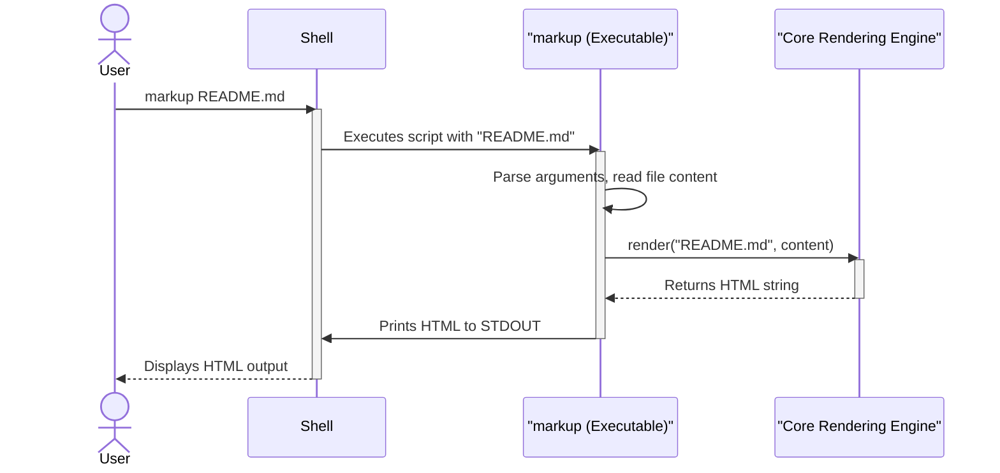

# Chapter 2: Command-Line Interface

- Reference: [Core Rendering Engine](chapter_01.md)

### Architectural Intent & Motivation

The Command-Line Interface (CLI) serves as the primary, user-facing entry point for the `markup` system. Its specific responsibility is to bridge the gap between a shell environment and the internal `Core Rendering Engine`. It translates command-line arguments, which typically specify an input file, into a programmatic call to the rendering library.

This component satisfies the critical business requirement for headless, scriptable access to the system's functionality. It allows developers, system administrators, and automated build scripts to perform markup-to-HTML conversions without writing any code against the library's API, thereby maximizing the utility's reach and integration potential in toolchains.

### Contextual Use Case

A technical writer needs to quickly validate the HTML output of a new `API_GUIDE.asciidoc` file they have written. Instead of integrating the rendering library into a larger application, they can directly invoke the CLI from their terminal to generate an HTML preview.

Executing the command `markup API_GUIDE.asciidoc > preview.html` immediately renders the document using the appropriate AsciiDoc renderer (selected by the Core Engine) and saves the output, providing an instantaneous feedback loop.

### Concept Decomposition

The CLI is composed of three primary logical units that execute sequentially:

1.  **Argument Parser:** The initial stage that processes the array of command-line arguments. Its sole responsibility is to identify the target input file path. It performs basic validation, such as ensuring a file path was provided.
2.  **File Content Reader:** Once a valid file path is obtained, this unit reads the entire contents of the specified file into memory as a string. It abstracts the file system interaction from the core rendering logic.
3.  **Engine Invocation & Output:** The final stage where the CLI acts as a client to the `Core Rendering Engine`. It passes the filename and its content to the engine's `render` method and directs the resulting HTML string to standard output (`STDOUT`).

### Reference Implementation

The following conceptual snippet demonstrates the canonical execution flow within the CLI script. It extracts the filename, reads its content, and invokes the `Core Rendering Engine` facade.

```ruby
# CLI entry point logic
# (Assumes 'github/markup' has been loaded)

# 1. Argument Parser
filename = ARGV.first
abort("Usage: markup <file>") unless filename

# 2. File Content Reader
file_content = File.read(filename)

# 3. Engine Invocation & Output
html_result = GitHub::Markup.render(filename, file_content)
puts html_result
```
*Note: This implementation demonstrates the direct procedural path from argument parsing to output, relying entirely on the `GitHub::Markup` facade for the complex rendering logic.*

### Architectural Mechanics (White-Box Analysis)

#### Design Pattern Identification

While the CLI itself is a simple procedural script, it functions as an **Adapter** pattern in the context of the overall system. It adapts the user's command-line invocation (a string-based, process-level interface) to the object-oriented API of the `Core Rendering Engine` (the `GitHub::Markup.render` method call).

It directly interacts with the `Core Rendering Engine`, which implements the **Facade** pattern, ensuring the CLI remains decoupled from the complexities of the underlying `Markup Language Registry` and strategy-based renderer selection.

#### Control Flow/State

The control flow is strictly linear and stateless.
1.  The script is executed by the shell.
2.  It reads from the `ARGV` array.
3.  It performs a file I/O read operation.
4.  It executes a single method call on the `Core Rendering Engine`.
5.  It performs a single I/O write operation to `STDOUT`.
6.  The process terminates.

No state is maintained by the CLI between invocations. Each execution is an independent, idempotent operation determined entirely by its input arguments.

### Architectural Visualization (Mermaid)

The following sequence diagram illustrates the interaction between the user, the CLI script, and the Core Engine for a typical rendering task.



### System Topology & Integration

#### Dependency Graph

-   **Upstream (Dependents):** The CLI is invoked by end-users via a shell, automated CI/CD pipelines, or other external scripts that require markup rendering as a step in a larger workflow.
-   **Downstream (Dependencies):** The CLI has a single, critical dependency: the `Core Rendering Engine` (`GitHub::Markup` module). It also implicitly depends on the host operating system's standard input/output streams and file system APIs.

#### Data Propagation

-   **Ingress:** Data enters the CLI boundary as an array of strings (command-line arguments). The primary data, the file content, is pulled from the file system as a string.
-   **Egress:** Data exits the component as a single string of HTML written to `STDOUT`. The exit code of the process serves as a secondary, low-fidelity signal for success or failure.

### Engineering Standards

#### Performance Implications

The performance overhead of the CLI wrapper itself is negligible, consisting of basic argument parsing and file I/O. The overall performance and computational complexity are dictated entirely by the downstream `Core Rendering Engine` and the specific renderer chosen for the input file type. The file-read operation introduces a baseline complexity of O(N), where N is the size of the input file.

#### Anti-Patterns

-   **Programmatic Abuse:** Using the CLI for in-process application logic by repeatedly spawning the `markup` process. This is highly inefficient due to process creation overhead. The `Core Rendering Engine` library should be used directly for such integrations.
-   **Ignoring Exit Codes:** In automated scripts, failing to check the CLI's exit code can lead to silent failures where rendering errors are missed, and subsequent steps in a pipeline operate on empty or invalid HTML output.

### Conclusion

The Command-Line Interface is a thin, robust, and essential layer that exposes the system's core rendering capabilities to a wide range of users and automated environments. By acting as a simple adapter to the powerful `Core Rendering Engine`, it provides maximum utility and scriptability with minimal complexity, adhering to the Unix philosophy of creating focused tools that work well together.

- Forward Link: [Specific Markup Renderers](chapter_03.md)