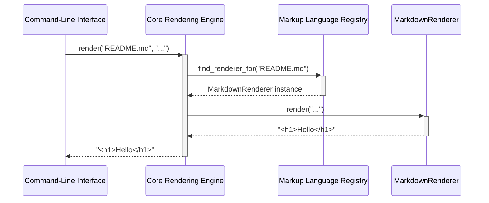

# Chapter 3: Specific Markup Renderers

- Reference: [Command-Line Interface](chapter_02.md)

### Architectural Intent & Motivation

Specific Markup Renderers are the concrete worker components responsible for the final stage of content transformation. The primary responsibility of each renderer is to encapsulate the logic required to convert a single, specific markup format (e.g., Markdown, RDoc, Textile) into HTML.

This abstraction directly satisfies the core business requirement of supporting a diverse and extensible set of markup languages. By isolating the rendering logic for each format into a distinct class, the system avoids a monolithic, unmaintainable renderer. This design promotes separation of concerns and allows new markup formats to be integrated without altering the `Core Rendering Engine`, embodying the Open/Closed Principle.

### Contextual Use Case

Consider a user invoking the system to render a documentation file named `API.rdoc`.

1.  The `Core Rendering Engine` receives the file path.
2.  It consults the `Markup Language Registry` to determine the appropriate renderer for the `.rdoc` extension.
3.  The registry identifies and provides an instance of the `RDocRenderer`.
4.  The engine invokes the `render` method on this specific instance, passing the raw RDoc content.
5.  The `RDocRenderer` executes its internal logic—which involves loading the `rdoc` gem and using its libraries—to perform the transformation.
6.  The resulting HTML is returned up the call stack.

In this scenario, the `RDocRenderer` is mandatory as it is the only component that contains the domain-specific knowledge required to process RDoc syntax.

### Concept Decomposition

*   **Concrete Renderer:** An individual class that implements the renderer contract for a single language. For example, a `MarkdownRenderer` or a `TextileRenderer`.
*   **Rendering Strategy:** The specific mechanism a Concrete Renderer uses to generate HTML. This is typically one of two approaches defined by the `Renderer Implementation Strategy` it inherits from:
    *   **Command-Based:** Shelling out to an external command-line tool (e.g., `pandoc`, `kramdown`).
    *   **Library-Based:** Loading a specific gem and calling its methods directly (e.g., `require 'redcarpet'`).
*   **Language-Specific Configuration:** The unique data each renderer provides, such as the name of the executable to call, the gem to `require`, or the specific class to instantiate from a third-party library.

### Reference Implementation

The following snippet demonstrates a canonical implementation for a command-based renderer. It inherits from a base strategy and provides the specific command needed to render AsciiDoc.

```ruby
# frozen_string_literal: true

module GitHub
  module Markup
    # AsciiDoc renderer.
    class AsciiDoc < Implementation
      def initialize
        super(/asciidoc/, "AsciiDoc")
      end

      # Returns the command to use for rendering.
      def command
        "asciidoctor -o - -"
      end
    end
  end
end
```

*Annotation:* This `AsciiDoc` renderer class provides the concrete implementation details. It registers itself for files matching the `/asciidoc/` pattern and specifies that the `asciidoctor -o - -` command must be executed to perform the rendering.

### Architectural Mechanics (White-Box Analysis)

**Design Pattern Identification**

The collection of Specific Markup Renderers represents a classic implementation of the **Strategy Pattern**.

*   **Context:** The `Core Rendering Engine` acts as the context that needs to perform a rendering operation.
*   **Strategy (Abstract):** The `Renderer Implementation Strategy` (detailed in Chapter 5) defines the common interface that all concrete renderers must adhere to.
*   **Concrete Strategy (This Chapter):** Each `Specific Markup Renderer` (e.g., `MarkdownRenderer`, `RDocRenderer`) is a concrete strategy that provides a distinct rendering algorithm.

The `Core Rendering Engine` is decoupled from the specific rendering implementations, allowing the rendering algorithm (the "strategy") to be selected and substituted at runtime by the `Markup Language Registry`.

**Control Flow/State**

Specific Renderers are designed to be **stateless**. They do not retain information between invocations. Their control flow is linear and transactional:

1.  The renderer is instantiated by the `Markup Language Registry`.
2.  The `Core Rendering Engine` invokes its primary `render` method, passing the raw markup string.
3.  The renderer performs its transformation using its configured strategy (command or library).
4.  It returns the transformed HTML string.

The instance is typically short-lived and tied to a single rendering operation.

### Architectural Visualization (Mermaid)

The interaction between the core engine, the registry, and a specific renderer is a clear delegation sequence, best represented by a Sequence Diagram.



### System Topology & Integration

**Dependency Graph**

*   **Upstream (Dependents):**
    *   `Markup Language Registry`: Directly depends on, instantiates, and manages the lifecycle of all available Specific Markup Renderers.
    *   `Core Rendering Engine`: Indirectly depends on these components by invoking the instance provided by the registry.
*   **Downstream (Dependencies):**
    *   `Renderer Implementation Strategy`: Each renderer inherits from and depends on a base strategy class to fulfill its contract.
    *   **External Tools/Libraries:** Each renderer has a hard dependency on an external entity, such as a command-line executable (e.g., `kramdown`) or a Ruby gem (e.g., `rdoc`), which must be present in the execution environment.

**Data Propagation**

The data contract is simple and uniform:

*   **Input:** Each renderer's primary execution method accepts a single `String` argument containing the raw markup content.
*   **Output:** The method returns a single `String` containing the rendered HTML. The component is not responsible for I/O operations like reading files or writing output; it only performs the in-memory transformation.

### Engineering Standards

**Performance Implications**

The performance profile of the system is largely determined by the chosen strategy of each renderer.

*   **Command-Based Renderers:** Incur significant overhead due to process forking and inter-process communication (shelling out). This approach is generally slower but isolates rendering in a separate process, which can enhance security and prevent dependency conflicts.
*   **Library-Based Renderers:** Offer superior performance as the rendering occurs in-process via a direct library call. However, this introduces a direct dependency on the third-party gem into the application's runtime.

Complexity is typically linear, `O(n)`, relative to the size of the input content (`n`), but the constant factor varies dramatically between implementations.

**Anti-Patterns**

*   **Stateful Implementation:** A renderer must not store state between `render` calls. Doing so would violate thread safety and lead to unpredictable output if the same instance is reused.
*   **Logic Bleeding:** A renderer for one format must never contain conditional logic to handle another format. The responsibility is strictly singular. For example, a `MarkdownRenderer` should fail if given RDoc, not attempt to process it.
*   **Violating the Contract:** A renderer that does not correctly inherit from the base `Renderer Implementation Strategy` or fails to provide the required configuration (like a command) will break the `Core Rendering Engine`'s ability to use it polymorphically.

### Conclusion

Specific Markup Renderers are the modular, extensible heart of the `markup` project. As concrete implementations of the Strategy pattern, they successfully decouple the core rendering logic from the details of any single markup format. This architecture ensures the system is easy to maintain and extend, allowing developers to add support for new markup languages by simply creating a new, self-contained renderer class.

- Forward Link: [Markup Language Registry](chapter_04.md)