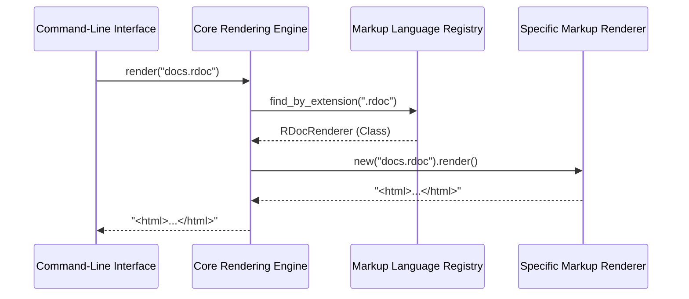

# Chapter 4: Markup Language Registry

- Reference: [Specific Markup Renderers](chapter_03.md)

## Architectural Intent & Motivation

The Markup Language Registry is the definitive source-of-truth for all supported formats within the `markup` system. Its primary responsibility is to create and maintain a runtime map between language identifiers (such as file extensions or symbolic names) and the specific `Renderer` classes capable of processing them.

This abstraction satisfies a critical architectural requirement: **decoupling the Core Rendering Engine from concrete rendering implementations**. By centralizing this mapping, the system can be extended with new markup languages without modifying the core engine's orchestration logic. This adheres to the Open/Closed Principle, allowing for the addition of new functionality (new renderers) without changing existing, stable code.

### Contextual Use Case

Consider the `Core Rendering Engine` being invoked with a file named `README.md`. The engine does not contain hard-coded logic to handle Markdown. Instead, it performs the following interaction:

1.  The engine extracts the file extension, `.md`.
2.  It queries the `Markup Language Registry`, asking, "Which renderer is associated with the `.md` identifier?"
3.  The Registry consults its internal map and finds an entry associating `.md` with the `MarkdownRenderer` class.
4.  It returns the `MarkdownRenderer` class object to the engine.
5.  The engine can now instantiate this class and delegate the rendering task.

Without the registry, the engine would require a brittle, monolithic conditional block (`case/when` or `if/elsif`) that would need to be modified for every new language, creating a maintenance bottleneck.

## Concept Decomposition

The registry is composed of three primary logical units:

1.  **Registration Interface**: A set of methods allowing new markup languages to be defined and associated with a renderer class. This is the mechanism for extending the system's capabilities.
2.  **Internal Lookup Table**: A private data structure, typically a hash map, that stores the definitive mappings. The keys are the language identifiers, and the values are the corresponding renderer classes.
3.  **Query Interface**: A set of methods used by consumers (primarily the `Core Rendering Engine`) to look up a renderer class based on a given identifier.

### Domain Terminology

*   **Language Identifier**: A string or symbol used as a key to identify a markup format. These are most commonly file extensions (e.g., `.md`, `.textile`) but can also be symbolic names (e.g., `:markdown`).
*   **Renderer Class**: A reference to the specific class (e.g., `TextileRenderer`) that implements the rendering logic for a format, as detailed in Chapter 3. The registry stores the class itself, not an instance of it.

### Reference Implementation

The following snippet demonstrates how a new, hypothetical `AsciidocRenderer` would be added to the system's configuration. This registration typically occurs during application initialization.

```ruby
# Assume AsciidocRenderer is a valid renderer class

# Registering by file extension
GitHub::Markup::LanguageRegistry.register(
  extension: '.adoc', 
  renderer: AsciidocRenderer
)

# Registering by a symbolic language name
GitHub::Markup::LanguageRegistry.register(
  language: :asciidoc,
  renderer: AsciidocRenderer
)
```
This configuration makes the `AsciidocRenderer` discoverable by the `Core Rendering Engine` when it encounters `.adoc` files or is explicitly asked to render `:asciidoc` content.

## Architectural Mechanics (White-Box Analysis)

### Design Pattern Identification

*   **Registry**: The component is a direct implementation of the Registry pattern. It provides a well-known, globally accessible object for locating and retrieving service objects (in this case, renderer classes) by a key.
*   **Singleton**: The registry is typically implemented as a Singleton. This ensures that there is only one, consistent map of language-to-renderer associations throughout the application's lifecycle, preventing configuration drift.
*   **Strategy (Enabler)**: While not the Strategy pattern itself, the registry is a crucial enabling component. It allows the `Core Rendering Engine` (the "Context") to dynamically select a concrete `Renderer` (the "Strategy") at runtime.

### Control Flow and State

The internal state of the registry is a lookup table (a hash map) that maps identifiers to class objects. This state is mutable during the initial configuration phase of the application via its registration methods.

During a rendering operation, the flow is strictly read-only:
1.  The `Core Rendering Engine` invokes a query method like `find_by_extension(ext)`.
2.  The registry performs a direct key lookup in its internal hash map.
3.  If a key match is found, the corresponding renderer class is returned.
4.  If no match is found, `nil` is returned, indicating an unsupported format.

This simple, direct lookup ensures high performance and predictable behavior during core application logic.

### Architectural Visualization (Mermaid)

The following sequence diagram illustrates the registry's role as an intermediary during the renderer selection process.



## System Topology & Integration

### Dependency Graph

*   **Upstream Dependents**: The `Core Rendering Engine` is the sole direct consumer of the registry. It depends on the registry to resolve file types into concrete renderer classes.
*   **Downstream Dependencies**: The registry holds references to the various `Specific Markup Renderer` classes. This is a "soft" dependency; it needs to know about the class names for the mapping but does not depend on their internal implementation details or instantiate them directly.

### Data Propagation

*   **Input**: The registry's query interface accepts string-based language identifiers (e.g., `".md"`, `".rst"`) from the `Core Rendering Engine`.
*   **Output**: It returns a Class object (e.g., `MarkdownRenderer`) or `nil` if no mapping is found. It does not handle file content or return rendered HTML.

## Engineering Standards

### Performance Implications

The primary operation (lookup) has a time complexity of **O(1)** on average, as it is a direct hash map lookup. This design choice ensures that renderer selection is not a performance bottleneck, even with a large number of supported languages. Registration is also an O(1) operation.

### Anti-Patterns

*   **Runtime Modification**: Modifying the registry after the application has been initialized and is actively serving requests is a significant anti-pattern. This can lead to race conditions and non-deterministic behavior where the same file type is handled by different renderers across different requests. All registration should occur at boot time.
*   **Identifier Ambiguity**: Registering the same file extension or language name to two different renderer classes. A robust implementation of the registry must raise an exception or explicitly overwrite the previous entry with a warning to prevent ambiguous configurations.
*   **Bypassing the Registry**: Application code that circumvents the `Core Rendering Engine` and directly instantiates a `Specific Markup Renderer`. This violates the system's architecture, re-introducing the tight coupling that the registry was designed to eliminate.

## Conclusion

The Markup Language Registry is the architectural lynchpin that enables the `markup` system's extensibility. By providing a single, centralized, and efficient mechanism for mapping identifiers to implementations, it decouples the "what" (the markup format) from the "how" (the rendering logic). This separation is fundamental to maintaining a clean, scalable, and maintainable codebase.

- Forward Link: [Renderer Implementation Strategies](chapter_05.md)