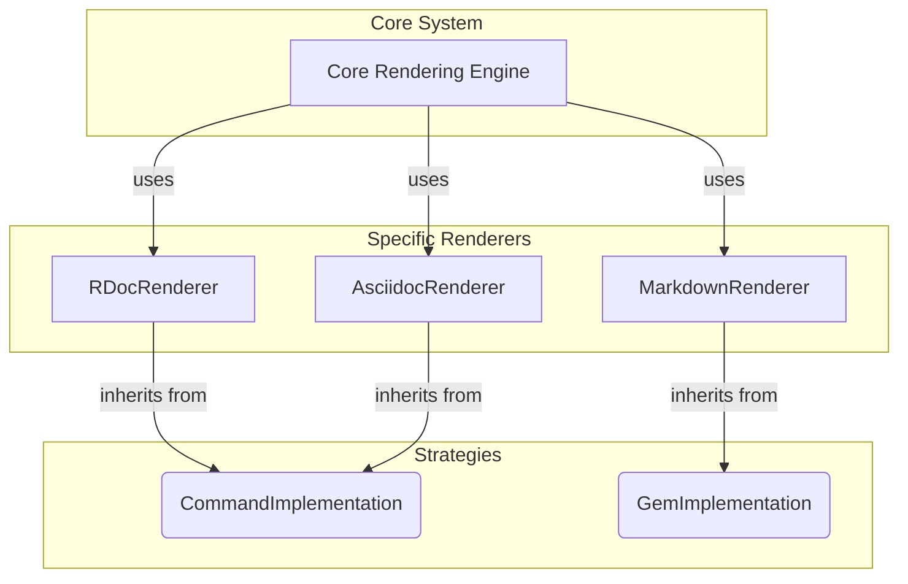

# Chapter 5: Renderer Implementation Strategies

- Reference: [Markup Language Registry](chapter_04.md)

## Architectural Intent & Motivation

The `markup` system is designed to support a wide array of markup languages, each with its own ecosystem of rendering tools. These tools fall into two primary categories: external command-line executables and native Ruby libraries (gems). The Renderer Implementation Strategies abstraction exists to formalize these two integration approaches into reusable base classes.

Its precise responsibility is to encapsulate the low-level mechanics of either shelling out to a system command or invoking a Ruby gem. This satisfies the architectural requirement of keeping the `Core Rendering Engine` and specific renderer classes free from boilerplate code related to process management or library loading. By providing these foundational strategies, the system ensures that adding a new markup renderer is a declarative process focused on configuration rather than imperative logic.

## Contextual Use Case

Consider a scenario where a developer needs to add support for AsciiDoc, which is commonly rendered using the `asciidoctor` command-line tool. Instead of writing custom code to execute this command, manage its standard input/output, and handle potential errors, the developer can create a new renderer class that inherits from the `CommandImplementation` strategy.

The new `AsciidocRenderer` class would only need to specify the name of the command (`"asciidoctor"`). The `CommandImplementation` base class would then transparently handle all the underlying logic of invoking the process and capturing its output, dramatically simplifying the integration effort.

## Concept Decomposition

This abstraction is composed of two primary concrete base classes, which represent the two supported rendering strategies.

*   **`CommandImplementation`**: This class provides the complete logic for rendering markup by executing an external command-line tool. Subclasses are only required to declare which command to execute. The base class manages process creation, pipes the markup content to the command's `stdin`, captures its `stdout`, and handles execution errors.

*   **`GemImplementation`**: This class provides the logic for rendering markup using a Ruby gem. It handles the `require` statement for the necessary library and invokes the rendering logic, keeping the entire operation within the Ruby process. Subclasses are responsible for specifying which gem to load and how to call its rendering method.

## Reference Implementation

A specific renderer must inherit from one of the two strategies. The choice depends entirely on the nature of the third-party tool that performs the rendering.

### `GemImplementation` Example

For a markup format like Markdown, where high-performance Ruby gems like `Redcarpet` are available, the renderer inherits from `GemImplementation`.

```ruby
# A specific renderer for Markdown using a gem.
# The subclass provides the integration details.
class MarkdownRenderer < GemImplementation
  def initialize
    # Ensures the necessary library is available.
    require 'redcarpet'
  end

  def render(content)
    # Delegates to the gem's rendering method.
    Redcarpet::Markdown.new(Redcarpet::Render::HTML).render(content)
  end
end
```

### `CommandImplementation` Example

For a format like RDoc, which has a standard command-line tool, the renderer inherits from `CommandImplementation`.

```ruby
# A specific renderer for RDoc using a command-line tool.
# The subclass simply declares the command name.
class RDocRenderer < CommandImplementation
  # The base class uses this method to know which command to run.
  def command_name
    "rdoc --pipe"
  end
end
```
*Note: The `render` logic for `RDocRenderer` is defined entirely within the `CommandImplementation` parent class.*

## Architectural Mechanics (White-Box Analysis)

### Design Pattern Identification

The primary pattern employed here is the **Strategy Pattern**.

*   **Context**: The `Core Rendering Engine` acts as the context, which needs to perform a rendering operation.
*   **Strategy (Interface)**: A common interface (detailed in Chapter 6) is implicitly defined by the `render` method signature.
*   **Concrete Strategies**: `CommandImplementation` and `GemImplementation` are abstract base classes that implement the strategy. The final concrete strategies are the specific renderer classes (`MarkdownRenderer`, `RDocRenderer`, etc.) that inherit from them.

This pattern allows the rendering algorithm (the "strategy") to be selected at runtime by the `Markup Language Registry` and used interchangeably by the `Core Rendering Engine`.

### Control Flow/State

These strategy objects are designed to be **stateless**. Their lifecycle is typically confined to a single `render` call.

1.  The `Core Rendering Engine` receives a request to render a file.
2.  It uses the `Markup Language Registry` to identify the appropriate renderer class (e.g., `RDocRenderer`).
3.  An instance of `RDocRenderer` is created.
4.  The engine calls the `render` method on the instance, passing the file content.
5.  Because `RDocRenderer` inherits from `CommandImplementation` and does not override `render`, the call is forwarded to the base class's implementation.
6.  `CommandImplementation#render` executes the `rdoc --pipe` command, writes the content to the process's `stdin`, reads the resulting HTML from `stdout`, and returns it.
7.  The instance is then discarded.

## Architectural Visualization (Mermaid)

The relationship between the strategies and the concrete renderers is best represented as a component topology, emphasizing the inheritance structure.



## System Topology & Integration

### Dependency Graph

*   **Upstream (Dependents)**: The `Core Rendering Engine` is the primary consumer. It depends on the common interface provided by these strategies to execute rendering. The `Markup Language Registry` is also a dependent, as its purpose is to map file types to classes that are built upon these strategies.
*   **Downstream (Dependencies)**:
    *   `CommandImplementation` has a critical dependency on the host system's environment. It requires a functioning shell and that the specified executable is present in the system's `PATH`.
    *   `GemImplementation` depends on the application's Gemfile and bundle state. It requires that the specified rendering gem has been installed and is loadable.

### Data Propagation

*   **Input**: Both strategies receive a single `String` argument containing the raw markup content to be rendered.
*   **Output**: They are contractually obligated to return a single `String` of rendered HTML. In the event of a failure (e.g., command not found, gem fails to load), they are expected to raise an exception that the `Core Rendering Engine` can handle.

## Engineering Standards

### Performance Implications

*   **`CommandImplementation`**: This strategy has significant performance overhead. Each `render` call incurs the cost of process forking, shell environment setup, and inter-process communication via `stdin`/`stdout`. This makes it less suitable for applications that need to render a large number of small documents in rapid succession.
*   **`GemImplementation`**: This strategy is inherently more performant. All rendering occurs within the existing Ruby process, avoiding system-level overhead. This is the preferred strategy when a native gem-based renderer is available and of high quality.

### Anti-Patterns

*   **Inappropriate Strategy Selection**: Choosing `CommandImplementation` when a mature and performant gem is available. This introduces unnecessary external dependencies and performance penalties.
*   **Logic in Subclasses**: Adding complex pre- or post-processing logic to a concrete renderer subclass. These classes should be lightweight connectors; any significant logic belongs in a dedicated processing layer or in the core engine itself.
*   **Brittle Command Dependencies**: Hardcoding absolute paths to executables within a `CommandImplementation` subclass. This makes the application non-portable and difficult to configure in different environments.

## Conclusion

The `CommandImplementation` and `GemImplementation` strategies provide a robust and decoupled foundation for integrating third-party rendering tools. By abstracting the two fundamental methods of execution—external commands and internal gems—they establish a clear and simple pattern for extending the system. This architectural choice is key to the project's maintainability and its ability to easily adapt to new markup formats in the future.

- Forward Link: [Renderer Implementation Contract](chapter_06.md)