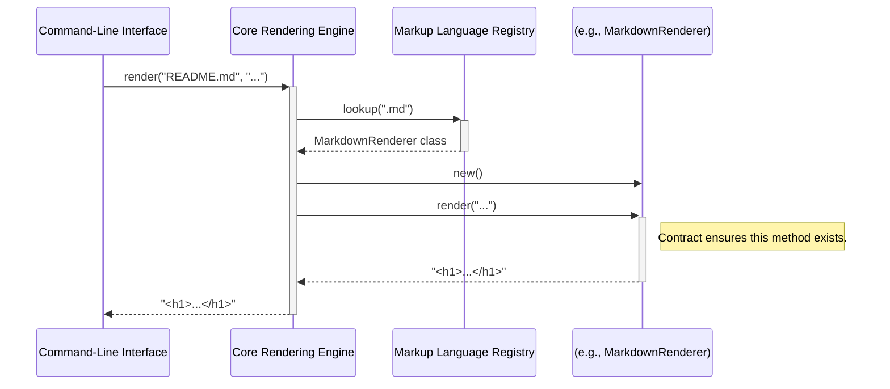

# Chapter 6: Renderer Implementation Contract

- Reference: [Renderer Implementation Strategies](chapter_05.md)

### Architectural Intent & Motivation

The Renderer Implementation Contract defines the essential, non-negotiable interface that every specific markup renderer must satisfy to integrate with the system. Its primary responsibility is to establish a uniform API, ensuring that the Core Rendering Engine can interact with any renderer—regardless of its underlying technology (e.g., an external command-line tool or a native Ruby gem)—in a polymorphic manner.

This abstraction directly satisfies the architectural requirement for extensibility and decoupling. By enforcing a consistent `render` method signature, the Core Rendering Engine is completely insulated from the implementation details of any given markup format. This allows new formats to be added to the system without necessitating any modifications to the core orchestration logic, adhering to the Open/Closed Principle.

### Contextual Use Case

Consider a scenario where a developer needs to add support for a new format, such as AsciiDoc. To integrate it into the `markup` system, they would create a new class, `AsciiDocRenderer`. This class must adhere to the Renderer Implementation Contract.

By implementing the required `render` method, the `AsciiDocRenderer` can be registered in the Markup Language Registry. Subsequently, when the Core Rendering Engine receives an `.asciidoc` file, it can retrieve the new renderer from the registry and invoke its `render` method with confidence, knowing the method signature and return type are predictable. The contract guarantees interoperability.

### Concept Decomposition

*   **Abstract Contract:** The conceptual agreement, defined by an abstract base class or through convention, that specifies the methods a concrete renderer must implement. It is the formal specification for all rendering components.
*   **The `render` Method:** The sole, mandatory method defined by the contract. It accepts a single argument—the raw markup text as a string—and is expected to return the processed HTML, also as a string.
*   **Polymorphic Interchangeability:** The central benefit derived from the contract. It allows the Core Rendering Engine to substitute one renderer for another at runtime, treating all of them as equivalent objects that respond to the same API call.

### Reference Implementation

The contract is not a class to be instantiated directly but rather an interface to be fulfilled. Concrete renderers achieve this by inheriting from a `Renderer Implementation Strategy` (e.g., `CommandImplementation`), which enforces the contract.

The following snippet demonstrates a hypothetical `MarkdownRenderer` fulfilling the contract.

```ruby
# The MarkdownRenderer inherits from a strategy that fulfills the contract.
class MarkdownRenderer < CommandImplementation
  # The 'render' method is the core of the contract.
  # The base strategy class may provide a default implementation
  # that shells out to the command specified below.
  def render(content)
    # The actual rendering logic is delegated to the `run` method
    # provided by the CommandImplementation strategy.
    run(command("redcarpet"), content)
  end
end
```

### Architectural Mechanics (White-Box Analysis)

*   **Design Pattern Identification:** The contract is the `Strategy` interface within a **Strategy Pattern**.
    *   **Context:** The `Core Rendering Engine` acts as the context, which is configured with a specific strategy.
    *   **Strategy:** This Renderer Implementation Contract defines the common interface for all algorithms.
    *   **ConcreteStrategy:** Each `Specific Markup Renderer` (e.g., `MarkdownRenderer`, `RDocRenderer`) is a concrete strategy that implements the algorithm for a specific format.

*   **Control Flow/State:** Renderers conforming to this contract are designed to be **stateless**. The `render` method's execution is a pure transformation; it receives content as input and produces HTML as output without modifying any internal state between calls. All necessary context is passed directly into the method. The control flow is unidirectional: `Core Rendering Engine` calls `render`, and the renderer returns a value.

### Architectural Visualization (Mermaid)

A sequence diagram best illustrates the runtime interaction between the Core Engine and a renderer that conforms to the contract. It highlights the polymorphic nature of the `render` call.



### System Topology & Integration

*   **Upstream (Dependents):**
    *   **Core Rendering Engine:** The primary consumer. It depends on this contract to invoke rendering operations without coupling to specific implementations.
    *   **Markup Language Registry:** Relies on the contract to ensure that the classes it stores and returns are valid, interchangeable renderers.

*   **Downstream (Dependencies):**
    *   The contract itself is an abstraction and has no runtime dependencies.
    *   **Specific Markup Renderers:** These concrete classes are dependents in an inheritance/implementation sense. They are constrained by the contract's definition.
    *   **Renderer Implementation Strategies:** These base classes are the first level of concrete implementation that provides the scaffolding to fulfill the contract.

*   **Data Propagation:**
    *   **Ingress:** The `render` method accepts a single `String` argument containing the raw markup text.
    *   **Egress:** The `render` method is contractually obligated to return a single `String` of HTML.

### Engineering Standards

*   **Performance Implications:** The contract itself imposes zero performance overhead. The performance of a render operation is entirely dependent on the chosen concrete implementation (the `ConcreteStrategy`). For example, a renderer based on `CommandImplementation` will incur I/O and process-spawning overhead, whereas a `GemImplementation` will be bound by the performance of the underlying native library.
*   **Anti-Patterns:**
    *   **Stateful Renderers:** A concrete renderer should not store state between `render` calls. Doing so would break idempotency and introduce potential race conditions or unpredictable behavior.
    *   **Contract Violation:** Modifying the `render` method signature in a subclass (e.g., adding required parameters) would violate the Liskov Substitution Principle and break the integration with the Core Rendering Engine.
    *   **Side Effects:** A renderer's `render` method must not produce side effects like writing to files or making network calls. Its sole responsibility is to transform a string of markup into a string of HTML.

### Conclusion

The Renderer Implementation Contract is the architectural lynchpin that enables the `markup` system's modularity and extensibility. By defining a simple, rigid API for all rendering components, it decouples the core orchestration logic from the specific rendering mechanisms. This allows the system to evolve by adding new capabilities through composition and registration rather than modification, resulting in a more maintainable and robust design.

- Forward Link: [Fixture-Based Testing Strategy](chapter_07.md)